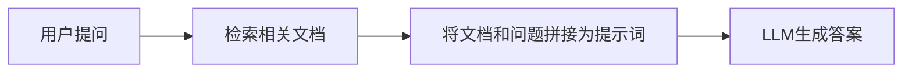

RAG（Retrieval-Augmented Generation，检索增强生成）是一种结合信息检索（IR）和文本生成（LLM）的技术，旨在通过动态引入外部知识来提升语言模型的生成质量。其核心思想是：**先检索相关数据，再基于检索结果生成更准确、可靠的回答**，从而解决传统 LLM 的幻觉（编造事实）、知识过时或缺乏领域特异性等问题。

## 核心原理

1. **检索（Retrieval）**
    - 用户提问时，系统先从外部知识库（如文档、数据库、网页）中检索与问题最相关的片段。
    - 常用技术：向量相似度搜索（如使用嵌入模型将文本转为向量，通过FAISS、Chroma等向量数据库快速匹配）。
2. **增强（Augmentation）**
    - 将检索到的相关文本作为上下文，与用户问题一起输入生成模型。
    - 模型基于“问题+检索结果”生成答案，而非仅依赖内部训练数据。
3. **生成（Generation）**
    - 最终输出结合了检索内容的可信信息和LLM的语言表达能力。

## 工作流程



Prompt 示例：
```
"请根据以下信息回答问题：
[检索到的文档内容]
问题：{用户输入}"
```


## 优势

- **减少幻觉**：答案基于实际检索内容，而非纯概率生成。
- **动态更新知识**：无需重新训练模型，更新知识库即可获取最新信息。
- **领域适配性强**：通过定制知识库（如医疗、法律文档）快速适配专业场景。
- **可解释性**：可追溯答案来源（如引用具体文档片段）。


## 典型应用

1. **知识库问答**：如客服系统、企业文档助手（基于内部手册回答）。
2. **学术研究**：从论文库中检索并生成综述。
3. **事实核查**：结合权威数据源验证答案真实性。
4. **个性化推荐**：根据用户历史交互生成定制化内容。


## 挑战

- **检索质量依赖数据质量**：知识库需覆盖全面且准确。
- **延迟问题**：检索+生成可能比纯生成慢。
- **上下文长度限制**：检索内容需适配模型的上下文窗口（如GPT-4的128k tokens）。


## 示例代码

```python
from langchain.document_loaders import WebBaseLoader
from langchain.text_splitter import RecursiveCharacterTextSplitter
from langchain.embeddings import OpenAIEmbeddings
from langchain.vectorstores import FAISS
from langchain.chat_models import ChatOpenAI
from langchain.chains import RetrievalQA

# 1. 加载文档并分块
loader = WebBaseLoader("https://example.com/docs")
documents = loader.load()
text_splitter = RecursiveCharacterTextSplitter(chunk_size=1000, chunk_overlap=200)
texts = text_splitter.split_documents(documents)

# 2. 构建向量数据库
embeddings = OpenAIEmbeddings()
db = FAISS.from_documents(texts, embeddings)

# 3. 创建RAG链
retriever = db.as_retriever()
llm = ChatOpenAI(model="gpt-3.5-turbo")
qa_chain = RetrievalQA.from_chain_type(llm, retriever=retriever)

# 4. 提问
result = qa_chain.run("什么是RAG？")
print(result)
```


