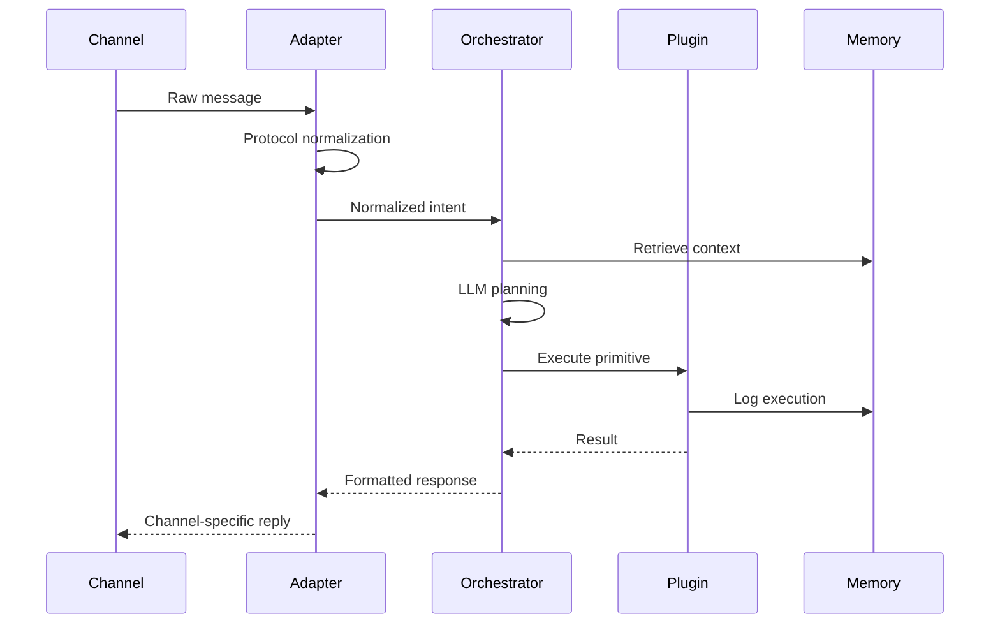

OpenClaw 是一个开源的、可本地部署的AI智能体（AI Agent）平台，其核心价值在于，不只是一个能对话的聊天机器人，更是一个能真正理解指令并执行复杂任务的数字员工。

## 数据流转

## [Pi Agent](Pi%20Agent.md)

OpenClaw 的核心 Agent 框架是 [pi-mono](https://github.com/badlogic/pi-mono) ，其是一个极简、优雅的 AI Agent 框架，提供了 Agent 运行所必须的所有功能，OpenClaw 在 Pi 的基础上进行了扩展，加入了网关、多端支持、记忆等功能。

### 会话管理

1. **Session 隔离**
	- 不同聊天渠道（单聊/群聊）的 Session 隔离
	- 自动切分策略：空闲超时切分、每日凌晨4点后切分
	- Session 存储路径：`~/.openclaw/agents/<agentId>/sessions/<SessionId>.jsonl`

2. **Workspace 文件**：Pi 的工作区包含多个影响行为的 Markdown 文件：

| 文件             | 作用                                                                     |
| -------------- | ---------------------------------------------------------------------- |
| `BOOTSTRAP.md` | 首次启动引导                                                                 |
| `SOUL.md`      | 指引行动方式                                                                 |
| `IDENTITY.md`  | 聊天风格定义                                                                 |
| `USER.md`      | 用户画像                                                                   |
| `MEMORY.md`    | 长期记忆存储（由agent自主写入） |

3. **上下文压缩策略**：Pi Agent 内置上下文压缩机制：
	- 溢出时自动压缩并重试
	- 压缩使用专用提示词生成摘要，保留最近消息

## 记忆系统

OpenClaw 选择 Markdown 文件作为记忆的“唯一真实来源”，所有记忆都清晰可见。同时，为了高效检索，它会利用向量数据库（如 Milvus）为这些文件建立索引。这种设计意味着你可以像编辑文档一样，直接打开、修改、甚至用 Git 管理 AI 的记忆，既透明又强大。

