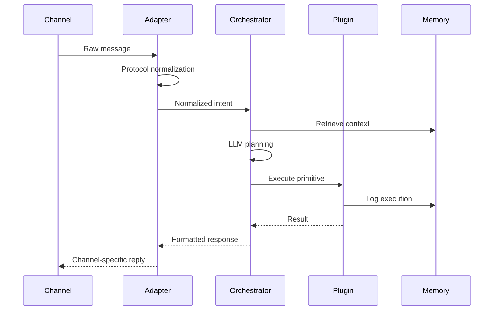

OpenClaw 是一个开源的、可本地部署的AI智能体（AI Agent）平台，其核心价值在于，不只是一个能对话的聊天机器人，更是一个能真正理解指令并执行复杂任务的数字员工。

## Pi Agent

OpenClaw 的核心 Agent 框架是 [pi-mono](https://github.com/badlogic/pi-mono) ，其是一个极简，优雅的 AI Agent 框架，提供了 Agent 运行所必须的所有功能，OpenClaw 在 Pi 的基础上进行了扩展，加入了网关、多端支持、记忆等功能。

### 设计哲学

Pi Agent（`@mariozechner/pi-coding-agent`）遵循极简主义（Minimalist）设计理念，这是其区别于其他 Agent 框架的核心特征：
1. **原子工具集**：Pi Agent 只提供 4 个原子工具
	- `read`：读取文件内容
	- write覆盖/创建文件
edit	基于字符串匹配的精确修改（手术刀式编辑）
bash	执行任意Shell命令