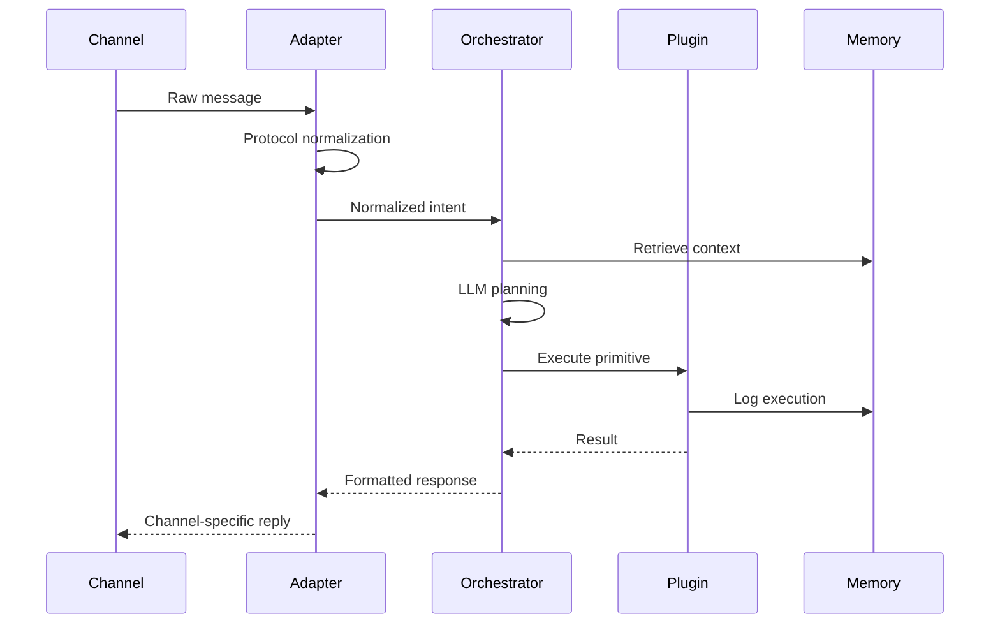

OpenClaw 是一个开源的、可本地部署的AI智能体（AI Agent）平台，其核心价值在于，不只是一个能对话的聊天机器人，更是一个能真正理解指令并执行复杂任务的数字员工。

## 数据流转

## Pi Agent

OpenClaw 的核心 Agent 框架是 [pi-mono](https://github.com/badlogic/pi-mono) ，其是一个极简、优雅的 AI Agent 框架，提供了 Agent 运行所必须的所有功能，OpenClaw 在 Pi 的基础上进行了扩展，加入了网关、多端支持、记忆等功能。

### 设计哲学

Pi Agent（`@mariozechner/pi-coding-agent`）遵循极简主义（Minimalist）设计理念，这是其区别于其他 Agent 框架的核心特征：
1. **原子工具集**：只提供 4 个原子工具
	- `read`：读取文件内容
	- `write`：覆盖/创建文件
	- `edit`：基于字符串匹配的精确修改（手术刀式编辑）
	- `bash`：执行任意 Shell 命令
2. **System Prompt**：<1000 Token
3. **安全哲学**：**放弃无效的安全剧场（Security Theater）**，直接采用完全信任模式（Full Trust / YOLO模式）：
	- 没有权限拦截
	- 没有命令预检查
	- 完整的网络和文件系统访问权限
> [!tip] 理由
> 一旦允许 Agent 写代码并运行代码，它完全可以写 Python 脚本绕过任何文件系统沙箱。与其做无用防御，不如让开发者在隔离环境（容器/虚拟机）中运行 Pi

4. **进程管理**：Pi 不尝试在后台管理长时进程，而是直接使用 `tmux` ：
	- Agent 如需运行开发服务器或调试器，会在 `tmux` 会话中启动
	- 用户可随时 `attach` 到会话查看日志、接管调试
	- 这是最高级的可观测性

### 沙箱机制

Pi 最核心的安全特性是其沙箱机制（Cell Isolation）机制，设计目标是安全地执行不可信代码：
1. **隔离执行**：每个任务在独立的临时进程中运行，进程级别隔离
2. **权限最小化**：通过 Linux 命名空间（Namespace）和 Capabilities 机制限制资源访问
3. **环境快照与恢复**：执行前快照环境，执行后清理残留
4. **超时与资源限制**：可配置 `TOOL_EXEC_TIMEOUT_MS`、`TOOL_MAX_STDOUT_KB` 等参数
5. **网络访问控制**：默认阻断网络，仅允许显式白名单的主机

对于 Python 脚本执行，Pi 会在独立的虚拟环境中运行，避免污染主环境。

### 会话管理

1. **Session 隔离**
	- 不同聊天渠道（单聊/群聊）的 Session 隔离
	- 自动切分策略：空闲超时切分、每日凌晨4点后切分
	- Session 存储路径：`~/.openclaw/agents/<agentId>/sessions/<SessionId>.jsonl`

2. **Workspace 文件**：Pi 的工作区包含多个影响行为的 Markdown 文件：

| 文件             | 作用                                                                     |
| -------------- | ---------------------------------------------------------------------- |
| `BOOTSTRAP.md` | 首次启动引导                                                                 |
| `SOUL.md`      | 指引行动方式                                                                 |
| `IDENTITY.md`  | 聊天风格定义                                                                 |
| `USER.md`      | 用户画像                                                                   |
| `MEMORY.md`    | 长期记忆存储（由agent自主写入） |

3. **上下文压缩策略**：Pi Agent 内置上下文压缩机制：
	- 溢出时自动压缩并重试
	- 压缩使用专用提示词生成摘要，保留最近消息

## 记忆系统

OpenClaw 选择 Markdown 文件作为记忆的“唯一真实来源”，所有记忆都清晰可见。同时，为了高效检索，它会利用向量数据库（如 Milvus）为这些文件建立索引。这种设计意味着你可以像编辑文档一样，直接打开、修改、甚至用 Git 管理 AI 的记忆，既透明又强大。

