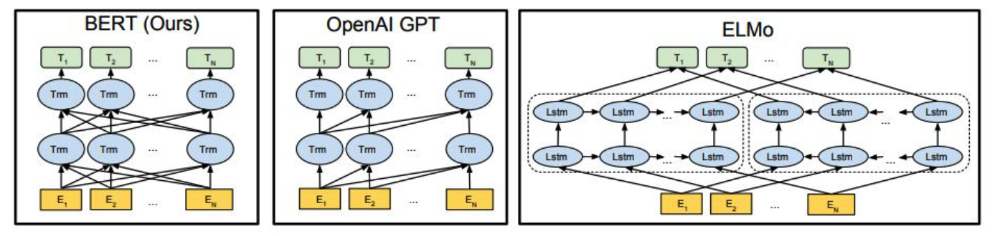
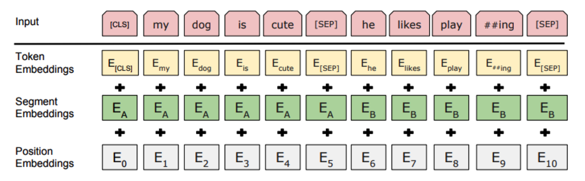

# BERT

BERT的全称是Bidirectional Encoder Representation from Transformers，即双向Transformer的Encoder，因为decoder是不能获要预测的信息的。模型的主要创新点都在pre-train方法上，即用了Masked LM和Next Sentence Prediction两种方法分别捕捉词语和句子级别的representation。

BERT模型的结构：

对比OpenAI GPT(Generative pre-trained transformer)，BERT是双向的Transformer block连接；就像单向RNN和双向RNN的区别，直觉上来讲效果会好一些。

对比ELMo，虽然都是“双向”，但目标函数其实是不同的。ELMo是分别以$p(w_i|w_1,...,w_{i-1})$和 $P(w_i|w_{i+1},...,w_n)$​作为目标函数，独立训练处两个representation然后拼接，而BERT则是以 $p(w_i|w_1,...,w_{i-1},w_{i+1},...,w_n)$​ 作为目标函数训练LM。

BERT的的Embedding由三种Embedding求和而成：

其中：

- Token Embeddings是词向量，第一个单词是CLS标志，可以用于之后的分类任务
- Segment Embeddings用来区别两种句子，因为预训练不光做LM还要做以两个句子为输入的分类任务
- Position Embeddings和之前文章中的Transformer不一样，不是三角函数而是学习出来的