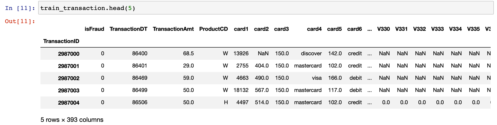
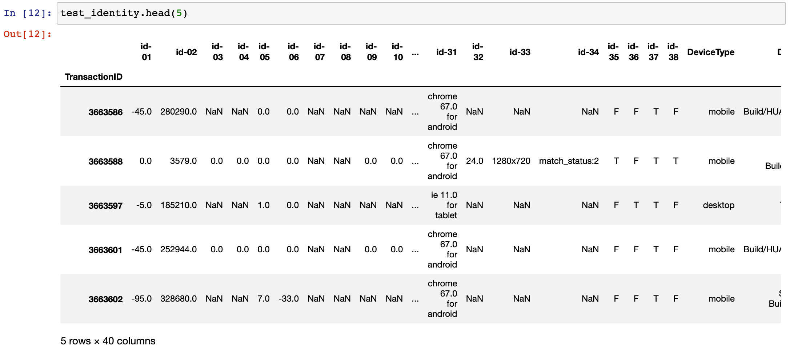

# IEEE-CIS Fraud Detection

这个比赛是学长推荐的比赛，与360所做的业务相近，是属于数据挖掘中比较经典的Kaggle赛题。这个比赛的主要目标是从客户的交易中预测出欺诈行为，是属于一个分类的问题。

## 数据

首先观察一下数据，总共有5个文件：train_transaction.csv，train_identity.csv，test_transaction.csv，test_identity.csv，以及一个sample_submission.csv。所以核心就是transaction交易表，和identity身份表。

### transaction交易表

交易表是一个二维的特征表，行的标号是TransactionID，也就是交易号，有若干行。有393列，对应392种特征，以及一个isFraud，是label。各个特征的意义：

* TransactionDT：来自给定参考日期时间的timedelta（不是实际时间戳）
* TransactionAMT：以美元计算的交易付款金额
* ProductCD：产品代码，每笔交易的产品类型
* card1 - card6：支付卡信息，如卡类型，卡类别，发行银行，国家/地区等。
* addr：地址
* dist：距离
* P emaildomain R emaildomain：购买者和收件人电子邮件域
* C1-C14：计数，例如发现与支付卡相关联的地址数等，实际含义被掩盖。
* D1-D15：timedelta，例如上次交易之间的天数等
* M1-M9：匹配，例如卡片上的姓名和地址等。
* Vxxx：Vesta设计了丰富的特征，包括排名，计数和其他实体关系。

其中类别特征有：ProductCD，card1 - card6，addr1，addr2，P emaildomain R emaildomain，M1 - M9。

### identity身份表

该表中的变量是与交易相关的身份信息 - 网络连接信息（IP，ISP，代理等）和数字签名（UA /浏览器/操作系统/版本等）。它们由Vesta的欺诈保护系统和数字安全合作伙伴收集。字段名称被屏蔽，并且不会提供成对字典用于隐私保护和合同协议。

主要类别特征有：DeviceType，DeviceInfo，id 12 到 id 38。

## 特征工程

了解了数据的分布就可以对数据进行特征工程了。特征工程的步骤如下：

### 可视化

首先应该分析一下各个特征的特点，分布。最好就应该是可视化，

## Baseline

