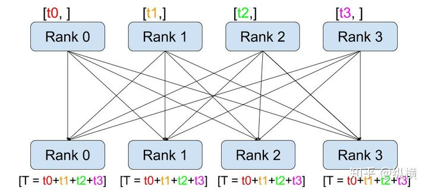

# PyTorch分布式训练

> 参考：[知乎](https://zhuanlan.zhihu.com/p/98535650)

测试结果发现 **Apex 的加速效果最好，但与 Horovod/Distributed 差别不大**，平时可以直接使用内置的 Distributed。**Dataparallel 较慢，不推荐使用**。

## nn.DataParallel

> DataParallel 可以帮助我们（使用单进程控制）将模型和数据加载到多个 GPU 中，控制数据在 GPU 之间的流动，协同不同 GPU 上的模型进行并行训练（细粒度的方法有 scatter，gather 等等）。

DataParallel 使用起来非常方便，我们只需要用 DataParallel 包装模型，再设置一些参数即可。需要定义的参数包括：参与训练的 GPU 有哪些，device_ids=gpus；用于汇总梯度的 GPU 是哪个，output_device=gpus[0] 。DataParallel 会自动帮我们将数据切分 load 到相应 GPU，将模型复制到相应 GPU，进行正向传播计算梯度并汇总：

```text
model = nn.DataParallel(model.cuda(), device_ids=gpus, output_device=gpus[0])
```

值得注意的是，模型和数据都需要先 load 进 GPU 中，DataParallel 的 module 才能对其进行处理，否则会报错：

```python
# 这里要 model.cuda()
model = nn.DataParallel(model.cuda(), device_ids=gpus, output_device=gpus[0])

for epoch in range(100):
   for batch_idx, (data, target) in enumerate(train_loader):
      # 这里要 images/target.cuda()
      images = images.cuda(non_blocking=True)
      target = target.cuda(non_blocking=True)
      ...
      output = model(images)
      loss = criterion(output, target)
      ...
      optimizer.zero_grad()
      loss.backward()
      
      optimizer.step()
```

汇总一下，DataParallel 并行训练部分主要与如下代码段有关：

```python
# main.py
import torch
import torch.distributed as dist

gpus = [0, 1, 2, 3]
torch.cuda.set_device('cuda:{}'.format(gpus[0]))

train_dataset = ...

train_loader = torch.utils.data.DataLoader(train_dataset, batch_size=...)

model = ...
model = nn.DataParallel(model.to(device), device_ids=gpus, output_device=gpus[0])

optimizer = optim.SGD(model.parameters())

for epoch in range(100):
   for batch_idx, (data, target) in enumerate(train_loader):
      images = images.cuda(non_blocking=True)
      target = target.cuda(non_blocking=True)
      ...
      output = model(images)
      loss = criterion(output, target)
      ...
      optimizer.zero_grad()
      loss.backward()
      optimizer.step()
```

在使用时，使用 python 执行即可：

```bash
python main.py
```

在 ImageNet 上的完整训练代码，请点击 [Github](https://link.zhihu.com/?target=https%3A//github.com/tczhangzhi/pytorch-distributed/blob/master/dataparallel.py)。

## torch.distributed

> 在 pytorch 1.0 之后，官方终于对分布式的常用方法进行了封装，支持 all-reduce，broadcast，send 和 receive 等等。通过 MPI 实现 CPU 通信，通过 NCCL 实现 GPU 通信。官方也曾经提到用 DistributedDataParallel 解决 DataParallel 速度慢，GPU 负载不均衡的问题，目前已经很成熟了～

与 DataParallel 的单进程控制多 GPU 不同，在 distributed 的帮助下，我们只需要编写一份代码，torch 就会自动将其分配给个进程，分别在个 GPU 上运行。

在 API 层面，pytorch 为我们提供了 torch.distributed.launch 启动器，用于在命令行分布式地执行 python 文件。在执行过程中，启动器会将当前进程的（其实就是 GPU的）index 通过参数传递给 python，我们可以这样获得当前进程的 index：

```python
parser = argparse.ArgumentParser()
parser.add_argument('--local_rank', default=-1, type=int,
                    help='node rank for distributed training')
args = parser.parse_args()
print(args.local_rank)
```

接着，使用 init_process_group 设置GPU 之间通信使用的后端和端口：

```python
dist.init_process_group(backend='nccl')
```

之后，使用 DistributedSampler 对数据集进行划分。如此前我们介绍的那样，它能帮助我们将每个 batch 划分成几个 partition，在当前进程中只需要获取和 rank 对应的那个 partition 进行训练：

```python
train_sampler = torch.utils.data.distributed.DistributedSampler(train_dataset)

train_loader = torch.utils.data.DataLoader(train_dataset, batch_size=..., sampler=train_sampler)
```

然后，使用 DistributedDataParallel 包装模型，它能帮助我们为不同 GPU 上求得的梯度进行 all reduce（即汇总不同 GPU 计算所得的梯度，并同步计算结果）。all reduce 后不同 GPU 中模型的梯度均为 all reduce 之前各 GPU 梯度的均值：

```python
model = torch.nn.parallel.DistributedDataParallel(model, device_ids=[args.local_rank])
```

最后，把数据和模型加载到当前进程使用的 GPU 中，正常进行正反向传播：

```python
torch.cuda.set_device(args.local_rank)

model.cuda()

for epoch in range(100):
   for batch_idx, (data, target) in enumerate(train_loader):
      images = images.cuda(non_blocking=True)
      target = target.cuda(non_blocking=True)
      ...
      output = model(images)
      loss = criterion(output, target)
      ...
      optimizer.zero_grad()
      loss.backward()
      optimizer.step()
```

汇总一下，torch.distributed 并行训练部分主要与如下代码段有关：

```python
# main.py
import torch
import argparse
import torch.distributed as dist

parser = argparse.ArgumentParser()
parser.add_argument('--local_rank', default=-1, type=int,
                    help='node rank for distributed training')
args = parser.parse_args()

dist.init_process_group(backend='nccl')
torch.cuda.set_device(args.local_rank)

train_dataset = ...
train_sampler = torch.utils.data.distributed.DistributedSampler(train_dataset)

train_loader = torch.utils.data.DataLoader(train_dataset, batch_size=..., sampler=train_sampler)

model = ...
model = torch.nn.parallel.DistributedDataParallel(model, device_ids=[args.local_rank])

optimizer = optim.SGD(model.parameters())

for epoch in range(100):
   for batch_idx, (data, target) in enumerate(train_loader):
      images = images.cuda(non_blocking=True)
      target = target.cuda(non_blocking=True)
      ...
      output = model(images)
      loss = criterion(output, target)
      ...
      optimizer.zero_grad()
      loss.backward()
      optimizer.step()
```

在使用时，调用 torch.distributed.launch 启动器启动：

```bash
CUDA_VISIBLE_DEVICES=0,1,2,3 python -m torch.distributed.launch --nproc_per_node=4 main.py
```

在 ImageNet 上的完整训练代码，请点击 [Github](https://link.zhihu.com/?target=https%3A//github.com/tczhangzhi/pytorch-distributed/blob/master/distributed.py)。

## torch.multiprocessing

> 有的同学可能比较熟悉 torch.multiprocessing，也可以手动使用 torch.multiprocessing 进行多进程控制。绕开 torch.distributed.launch 自动控制开启和退出进程的一些小毛病～

使用时，只需要调用 torch.multiprocessing.spawn，torch.multiprocessing 就会帮助我们自动创建进程。如下面的代码所示，spawn 开启了 nprocs=4 个进程，每个进程执行 main_worker 并向其中传入 local_rank（当前进程 index）和 args（即 4 和 myargs）作为参数：

```python
import torch.multiprocessing as mp

mp.spawn(main_worker, nprocs=4, args=(4, myargs))
```

这里，我们直接将原本需要 torch.distributed.launch 管理的执行内容，封装进 main_worker 函数中，其中 proc 对应 local_rank（当前进程 index），进程数 nprocs 对应 4， args 对应 myargs：

```python
def main_worker(proc, nprocs, args):

   dist.init_process_group(backend='nccl', init_method='tcp://127.0.0.1:23456', world_size=4, rank=gpu)
   torch.cuda.set_device(args.local_rank)

   train_dataset = ...
   train_sampler = torch.utils.data.distributed.DistributedSampler(train_dataset)

   train_loader = torch.utils.data.DataLoader(train_dataset, batch_size=..., sampler=train_sampler)

   model = ...
   model = torch.nn.parallel.DistributedDataParallel(model, device_ids=[args.local_rank])

   optimizer = optim.SGD(model.parameters())

   for epoch in range(100):
      for batch_idx, (data, target) in enumerate(train_loader):
          images = images.cuda(non_blocking=True)
          target = target.cuda(non_blocking=True)
          ...
          output = model(images)
          loss = criterion(output, target)
          ...
          optimizer.zero_grad()
          loss.backward()
          optimizer.step()
```

在上面的代码中值得注意的是，由于没有 torch.distributed.launch 读取的默认环境变量作为配置，我们需要手动为 init_process_group 指定参数：

```python
dist.init_process_group(backend='nccl', init_method='tcp://127.0.0.1:23456', world_size=4, rank=gpu)
```

汇总一下，添加 multiprocessing 后并行训练部分主要与如下代码段有关：

```python
# main.py
import torch
import torch.distributed as dist
import torch.multiprocessing as mp

mp.spawn(main_worker, nprocs=4, args=(4, myargs))

def main_worker(proc, nprocs, args):

   dist.init_process_group(backend='nccl', init_method='tcp://127.0.0.1:23456', world_size=4, rank=gpu)
   torch.cuda.set_device(args.local_rank)

   train_dataset = ...
   train_sampler = torch.utils.data.distributed.DistributedSampler(train_dataset)

   train_loader = torch.utils.data.DataLoader(train_dataset, batch_size=..., sampler=train_sampler)

   model = ...
   model = torch.nn.parallel.DistributedDataParallel(model, device_ids=[args.local_rank])

   optimizer = optim.SGD(model.parameters())

   for epoch in range(100):
      for batch_idx, (data, target) in enumerate(train_loader):
          images = images.cuda(non_blocking=True)
          target = target.cuda(non_blocking=True)
          ...
          output = model(images)
          loss = criterion(output, target)
          ...
          optimizer.zero_grad()
          loss.backward()
          optimizer.step()
```

在使用时，直接使用 python 运行就可以了：

```bash
python main.py
```

在 ImageNet 上的完整训练代码，请点击 [Github](https://link.zhihu.com/?target=https%3A//github.com/tczhangzhi/pytorch-distributed/blob/master/multiprocessing_distributed.py)。

## Apex

> Apex 是 NVIDIA 开源的用于混合精度训练和分布式训练库。Apex 对混合精度训练的过程进行了封装，改两三行配置就可以进行混合精度的训练，从而大幅度降低显存占用，节约运算时间。此外，Apex 也提供了对分布式训练的封装，针对 NVIDIA 的 NCCL 通信库进行了优化。

在混合精度训练上，Apex 的封装十分优雅。直接使用 amp.initialize 包装模型和优化器，apex 就会自动帮助我们管理模型参数和优化器的精度了，根据精度需求不同可以传入其他配置参数。

```python
from apex import amp

model, optimizer = amp.initialize(model, optimizer)
```

在分布式训练的封装上，Apex 在胶水层的改动并不大，主要是优化了 NCCL 的通信。因此，大部分代码仍与 torch.distributed 保持一致。使用的时候只需要将 torch.nn.parallel.DistributedDataParallel 替换为 apex.parallel.DistributedDataParallel 用于包装模型。在 API 层面，相对于 torch.distributed ，它可以自动管理一些参数（可以少传一点）：

```python
from apex.parallel import DistributedDataParallel

model = DistributedDataParallel(model)
# # torch.distributed
# model = torch.nn.parallel.DistributedDataParallel(model, device_ids=[args.local_rank])
# model = torch.nn.parallel.DistributedDataParallel(model, device_ids=[args.local_rank], output_device=args.local_rank)
```

在正向传播计算 loss 时，Apex 需要使用 amp.scale_loss 包装，用于根据 loss 值自动对精度进行缩放：

```python
with amp.scale_loss(loss, optimizer) as scaled_loss:
   scaled_loss.backward()
```

汇总一下，Apex 的并行训练部分主要与如下代码段有关：

```python
# main.py
import torch
import argparse
import torch.distributed as dist

from apex.parallel import DistributedDataParallel

parser = argparse.ArgumentParser()
parser.add_argument('--local_rank', default=-1, type=int,
                    help='node rank for distributed training')
args = parser.parse_args()

dist.init_process_group(backend='nccl')
torch.cuda.set_device(args.local_rank)

train_dataset = ...
train_sampler = torch.utils.data.distributed.DistributedSampler(train_dataset)

train_loader = torch.utils.data.DataLoader(train_dataset, batch_size=..., sampler=train_sampler)

model = ...
model, optimizer = amp.initialize(model, optimizer)
model = DistributedDataParallel(model, device_ids=[args.local_rank])

optimizer = optim.SGD(model.parameters())

for epoch in range(100):
   for batch_idx, (data, target) in enumerate(train_loader):
      images = images.cuda(non_blocking=True)
      target = target.cuda(non_blocking=True)
      ...
      output = model(images)
      loss = criterion(output, target)
      optimizer.zero_grad()
      with amp.scale_loss(loss, optimizer) as scaled_loss:
         scaled_loss.backward()
      optimizer.step()
```

在使用时，调用 torch.distributed.launch 启动器启动：

```bash
UDA_VISIBLE_DEVICES=0,1,2,3 python -m torch.distributed.launch --nproc_per_node=4 main.py
```

在 ImageNet 上的完整训练代码，请点击 [Github](https://link.zhihu.com/?target=https%3A//github.com/tczhangzhi/pytorch-distributed/blob/master/apex_distributed.py)。

## Horovod

> Horovod 是 Uber 开源的深度学习工具，它的发展吸取了 Facebook "Training ImageNet In 1 Hour" 与百度 "Ring Allreduce" 的优点，可以无痛与 PyTorch/Tensorflow 等深度学习框架结合，实现并行训练。

在 API 层面，Horovod 和 torch.distributed 十分相似。在 mpirun 的基础上，Horovod 提供了自己封装的 horovodrun 作为启动器。

与 torch.distributed.launch 相似，我们只需要编写一份代码，horovodrun 启动器就会自动将其分配。在执行过程中，启动器会将当前进程的（其实就是 GPU的）index 注入 hvd，我们可以这样获得当前进程的 index：

```python
import horovod.torch as hvd

hvd.local_rank()
```

与 init_process_group 相似，Horovod 使用 init 设置GPU 之间通信使用的后端和端口:

```python
hvd.init()
```

接着，使用 DistributedSampler 对数据集进行划分。如此前我们介绍的那样，它能帮助我们将每个 batch 划分成几个 partition，在当前进程中只需要获取和 rank 对应的那个 partition 进行训练：

```python
train_sampler = torch.utils.data.distributed.DistributedSampler(train_dataset)

train_loader = torch.utils.data.DataLoader(train_dataset, batch_size=..., sampler=train_sampler)
```

之后，使用 broadcast_parameters 包装模型参数，将模型参数从编号为 root_rank 的 GPU 复制到所有其他 GPU 中：

```python
hvd.broadcast_parameters(model.state_dict(), root_rank=0)
```

然后，使用 DistributedOptimizer 包装优化器。它能帮助我们为不同 GPU 上求得的梯度进行 all reduce（即汇总不同 GPU 计算所得的梯度，并同步计算结果）。all reduce 后不同 GPU 中模型的梯度均为 all reduce 之前各 GPU 梯度的均值：

```python
hvd.DistributedOptimizer(optimizer, named_parameters=model.named_parameters(), compression=hvd.Compression.fp16)
```

最后，把数据加载到当前 GPU 中。在编写代码时，我们只需要关注正常进行正向传播和反向传播：

```python
torch.cuda.set_device(args.local_rank)

for epoch in range(100):
   for batch_idx, (data, target) in enumerate(train_loader):
      images = images.cuda(non_blocking=True)
      target = target.cuda(non_blocking=True)
      ...
      output = model(images)
      loss = criterion(output, target)
      ...
      optimizer.zero_grad()
      loss.backward()
      optimizer.step()
```

汇总一下，Horovod 的并行训练部分主要与如下代码段有关：

```python
# main.py
import torch
import horovod.torch as hvd

hvd.init()
torch.cuda.set_device(hvd.local_rank())

train_dataset = ...
train_sampler = torch.utils.data.distributed.DistributedSampler(
    train_dataset, num_replicas=hvd.size(), rank=hvd.rank())

train_loader = torch.utils.data.DataLoader(train_dataset, batch_size=..., sampler=train_sampler)

model = ...
model.cuda()

optimizer = optim.SGD(model.parameters())

optimizer = hvd.DistributedOptimizer(optimizer, named_parameters=model.named_parameters())
hvd.broadcast_parameters(model.state_dict(), root_rank=0)

for epoch in range(100):
   for batch_idx, (data, target) in enumerate(train_loader):
       images = images.cuda(non_blocking=True)
       target = target.cuda(non_blocking=True)
       ...
       output = model(images)
       loss = criterion(output, target)
       ...
       optimizer.zero_grad()
       loss.backward()
       optimizer.step()
```

在使用时，调用 horovodrun 启动器启动：

```bash
CUDA_VISIBLE_DEVICES=0,1,2,3 horovodrun -np 4 -H localhost:4 --verbose python main.py
```

在 ImageNet 上的完整训练代码，请点击[Github](https://link.zhihu.com/?target=https%3A//github.com/tczhangzhi/pytorch-distributed/blob/master/horovod_distributed.py)。

## 分布式 evaluation

> all_reduce, barrier 等 API 是 distributed 中更为基础和底层的 API。这些 API 可以帮助我们控制进程之间的交互，控制 GPU 数据的传输。在自定义 GPU 协作逻辑，汇总 GPU 间少量的统计信息时，大有用处。熟练掌握这些 API 也可以帮助我们自己设计、优化分布式训练、测试流程。

有这样一些问题：

1. 训练样本被切分成了若干个部分，被若干个进程分别控制运行在若干个 GPU 上，如何在进程间进行通信汇总这些（GPU 上的）信息？
2. 使用一张卡进行推理、测试太慢了，如何使用 Distributed 进行分布式地推理和测试，并将结果汇总在一起？
3. ......

要解决这些问题，我们需要一个更为基础的 API，**汇总记录不同 GPU 上生成的准确率、损失函数等指标信息**。这个 API 就是 `torch.distributed.all_reduce`。



图2：all_reduce 示意图

如上图所示，它的工作过程包含以下三步：

1. 在调用 `all_reduce(tensor, op=...)`后，当前进程会向其他进程发送 `tensor`（例如 rank 0 会发送 rank 0 的 tensor 到 rank 1、2、3）
2. 同时，当前进程接受其他进程发来的 `tensor`（例如 rank 0 会接收 rank 1 的 tensor、rank 2 的 tensor、rank 3 的 tensor）。
3. 在全部接收完成后，当前进程（例如rank 0）会对当前进程的和接收到的 `tensor` （例如 rank 0 的 tensor、rank 1 的 tensor、rank 2 的 tensor、rank 3 的 tensor）进行 `op` （例如求和）操作。

使用 `torch.distributed.all_reduce(loss, op=torch.distributed.reduce_op.SUM)`，我们就能够对不同数据切片（不同 GPU 上的训练数据）的损失函数进行求和了。接着，我们只要再将其除以进程（GPU）数量 `world_size`就可以得到损失函数的平均值。正确率也能够通过同样方法进行计算：

```python
# 原始代码
output = model(images)
loss = criterion(output, target)
        
acc1, acc5 = accuracy(output, target, topk=(1, 5))
losses.update(loss.item(), images.size(0))
top1.update(acc1.item(), images.size(0))
top5.update(acc5.item(), images.size(0))

# 修改后，同步各 GPU 中数据切片的统计信息，用于分布式的 evaluation
def reduce_tensor(tensor):
    rt = tensor.clone()
    dist.all_reduce(rt, op=dist.reduce_op.SUM)
    rt /= args.world_size
    return rt

output = model(images)
loss = criterion(output, target)
acc1, acc5 = accuracy(output, target, topk=(1, 5))

torch.distributed.barrier()

reduced_loss = reduce_tensor(loss.data)
reduced_acc1 = reduce_tensor(acc1)
reduced_acc5 = reduce_tensor(acc5)

losses.update(loss.item(), images.size(0))
top1.update(acc1.item(), images.size(0))
top5.update(acc5.item(), images.size(0))
```

值得注意的是，为了同步各进程的计算进度，我们在 reduce 之前插入了一个同步 API `torch.distributed.barrier()`。在所有进程运行到这一步之前，先完成此前代码的进程会等待其他进程。这使得我们能够得到准确、有序的输出。在 Horovod 中，我们无法使用 `torch.distributed.barrier()`，取而代之的是，我们可以在 allreduce 过程中指明：

```python
def reduce_mean(tensor, world_size):
    rt = tensor.clone()
    hvd.allreduce(rt, name='barrier')
    rt /= world_size
    return rt
    
output = model(images)
loss = criterion(output, target)
acc1, acc5 = accuracy(output, target, topk=(1, 5))

reduced_loss = reduce_tensor(loss.data)
reduced_acc1 = reduce_tensor(acc1)
reduced_acc5 = reduce_tensor(acc5)

losses.update(loss.item(), images.size(0))
top1.update(acc1.item(), images.size(0))
top5.update(acc5.item(), images.size(0))
```

在 ImageNet 上的完整训练代码，请点击[Github](https://link.zhihu.com/?target=https%3A//github.com/tczhangzhi/pytorch-distributed/blob/master/distributed.py)。