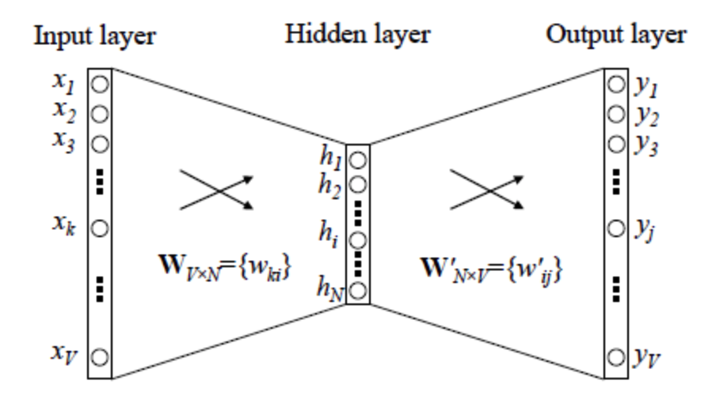
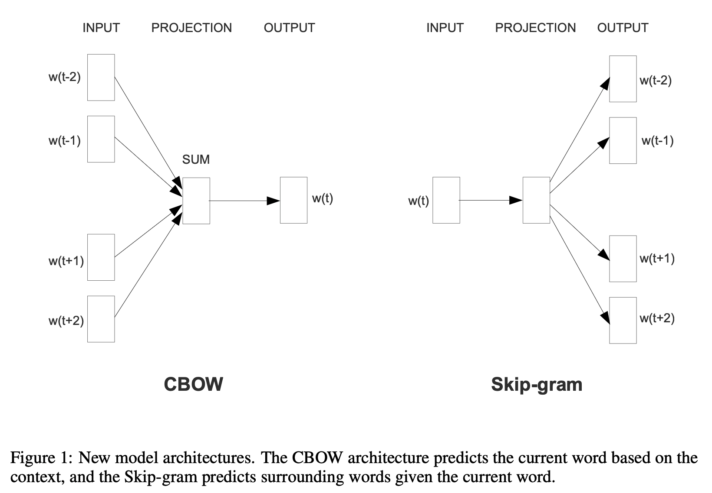
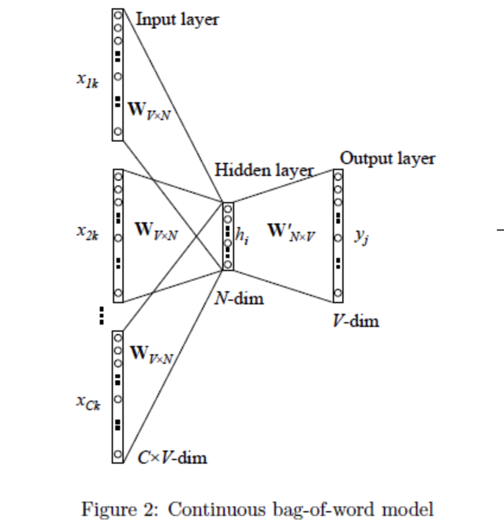
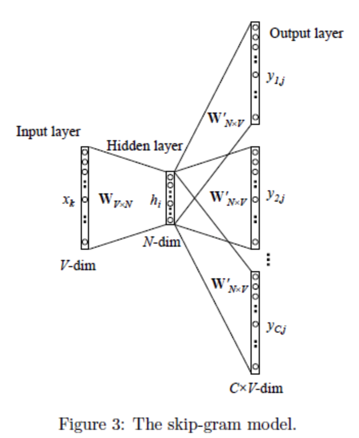

# Word2Vec

Word2Vec是google在2013年推出的一个NLP工具，它的特点是能够将单词转化为向量来表示，这样词与词之间就可以定量的去度量他们之间的关系，挖掘词之间的联系。

最早的词向量采用One-Hot编码，又称为一位有效编码，每个词向量维度大小为整个词汇表的大小，但缺点也是显而易见的，一方面我们实际使用的词汇表很大，经常是百万级以上，这么高维的数据处理起来会消耗大量的计算资源与时间。另一方面，One-Hot编码中所有词向量之间彼此正交，没有体现词与词之间的相似关系。

Distributed representation可以解决One-Hot编码存在的问题，它的思路是通过训练，将原来One-Hot编码的每个词都映射到一个较短的词向量上来，而这个较短的词向量的维度可以由我们自己在训练时根据任务需要来自己指定。

## Word2Vec原理

Word2Vec 的训练模型本质上是只具有一个隐含层的神经元网络：

它的输入是采用One-Hot编码的词汇表向量，它的输出也是One-Hot编码的词汇表向量。使用所有的样本，训练这个神经元网络，等到收敛之后，**从输入层到隐含层的那些权重**，便是每一个词的采用Distributed Representation的词向量。

输入层的维度是V，输出层的维度是N，N是远小于V的。

Google的Mikolov在关于Word2Vec的论文中提出了CBOW和Skip-gram两种模型，CBOW适合于数据集较小的情况，而Skip-Gram在大型语料中表现更好。

假如我们有一个句子“There is an apple on the table”作为训练数据，CBOW的输入为（is,an,on,the），输出为apple。而Skip-gram的输入为apple，输出为（is,an,on,the）。

## CBoW

1. 输入层：上下文单词的One-Hot编码词向量，V为词汇表单词个数，C为上下文单词个数。以上文那句话为例，这里C=4，所以模型的输入是（is,an,on,the）4个单词的One-Hot编码词向量。
2. 初始化**一个**权重矩阵$W_{V \times N}$，然后用所有输入的One-Hot编码词向量左乘该矩阵,得到维数为N的向量 $\omega_1 \omega_2,...,\omega_c$ ，这里的N由自己根据任务需要设置。
3. 将所得的向量 $\omega_1 \omega_2,...,\omega_c$ 相加求平均作为隐藏层向量h。
4. 初始化另一个权重矩阵 $W'_{N \times V}$ ,用隐藏层向量h左乘 $W'_{N \times V}$，再经激活函数处理得到V维的向量y，y的每一个元素代表相对应的每个单词的概率分布。
5. y中概率最大的元素所指示的单词为预测出的中间词（target word）与true label的One-Hot编码词向量做比较，误差越小越好（根据误差更新两个权重矩阵)

在训练前需要定义好**损失函数**（一般为交叉熵代价函数），采用梯度下降算法更新W和W'。训练完毕后，**输入层的每个单词与矩阵W相乘得到的向量的就是我们想要的Distributed Representation表示的词向量**，也叫做**word embedding**。因为One-Hot编码词向量中只有一个元素为1，其他都为0，所以第i个词向量乘以矩阵W得到的就是矩阵的第i行，所以这个矩阵也叫做look up table，有了look up table就可以免去训练过程，直接查表得到单词的词向量了。

## Skip-Gram

Skip-Gram是给定input word来预测上下文，其模型结构如上图所示。它的做法是：

1. 首先我们选句子中间的一个词作为我们的输入词，例如我们选取“apple”作为input word；
2. 有了input word以后，我们再定义一个叫做skip_window的参数，它代表着我们从当前input word的一侧（左边或右边）选取词的数量。如果我们设置skip_window=2，那么我们最终获得窗口中的词（包括input word在内）就是[‘is’,’an’,’apple’,’on’,’the’ ]。skip_window=2代表着选取左input word左侧2个词和右侧2个词进入我们的窗口，所以整个窗口大小span=2x2=4。另一个参数叫num_skips，它代表着我们从整个窗口中选取多少个不同的词作为我们的output word，当skip_window=2，num_skips=2时，我们将会得到两组 (input word, output word) 形式的训练数据，即 ('apple', 'an')，('apple', 'one')。
3. 神经网络基于这些训练数据中每对单词出现的次数习得统计结果，并输出一个概率分布，这个概率分布代表着到我们词典中每个词有多大可能性跟input word同时出现。我们将通过给神经网络输入文本中成对的单词来训练它完成上面所说的概率计算。
4. 通过梯度下降和反向传播更新矩阵W。
5. W中的行向量即为每个单词的Word embedding表示。

## Hierarchical Softmax

Hierarchical Softmax对原模型的改进主要有两点，第一点是从输入层到隐藏层的映射，没有采用原先的与矩阵W相乘然后相加求平均的方法，而是直接对所有输入的词向量求和。假设输入的词向量为（0,1,0,0）和（0,0,0,1），那么隐藏层的向量为（0,1,0,1）。

Hierarchical Softmax的第二点改进是采用哈夫曼树来替换了原先的从隐藏层到输出层的矩阵W’。哈夫曼树的叶节点个数为词汇表的单词个数V，一个叶节点代表一个单词，而从根节点到该叶节点的路径确定了这个单词最终输出的词向量。

具体来说，这棵哈夫曼树除了根结点以外的所有非叶节点中都含有一个由参数θ确定的sigmoid函数，不同节点中的θ不一样。训练时隐藏层的向量与这个sigmoid函数进行运算，根据结果进行分类，若分类为负类则沿左子树向下传递，编码为0；若分类为正类则沿右子树向下传递，编码为1。

## Negative Sampling

负采样是另一种用来提高Word2Vec效率的方法，它是基于这样的观察：训练一个神经网络意味着使用一个训练样本就要稍微调整一下神经网络中所有的权重，这样才能够确保预测训练样本更加精确，如果能设计一种方法每次只更新一部分权重，那么计算复杂度将大大降低。

