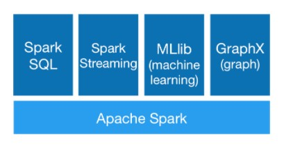
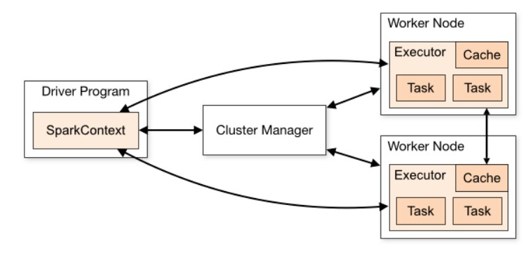

> 参考：[官方文档](http://spark.apache.org/docs/latest/)

## 简介

MapReduce 编程模型已经成为主流的分布式编程模型，它极大地方便了编程人员在**不会分布式并行编程**的情况下，将自己的程序运行在分布式系统上。但是 MapReduce 也存在一些缺陷，如高延迟、不支持 DAG 模型、Map 与 Reduce 的中间数据落地等。因此在近两年，社区出现了优化改进 MapReduce 的项目，如交互查询引擎 Impala 、支持 DAG 的 TEZ 、支持内存计算 Spark 等。Spark 是 UC Berkeley AMP lab 开源的通用并行计算框架，以其先进的设计理念，已经成为社区的热门项目。

Spark 特点如下：

- Spark 基于内存，尽可能的减少了中间结果写入磁盘和不必要的 sort、shuffle
- Spark 对于反复用到的数据进行了缓存
- Spark 对于 DAG 进行了高度的优化，具体在于 Spark 划分了不同的 stage 和使用了延迟计算技术


## Spark 模块

Spark力图整合机器学习（MLib）、图算法（GraphX）、流式计算（Spark Streaming）和数据仓库（Spark SQL）等领域，通过计算引擎Spark，弹性分布式数据集（RDD），架构出一个新的大数据应用平台。



Spark生态圈以HDFS、S3、Techyon为底层存储引擎，以Yarn、Mesos和Standlone作为资源调度引擎；使用Spark，可以实现MapReduce应用；基于Spark，Spark SQL可以实现即席查询，Spark Streaming可以处理实时应用，MLib可以实现机器学习算法，GraphX可以实现图计算，Spark R可以实现复杂数学计算。

基本模块如下：

### Spark Core

Spark的核心功能实现，包含RDD、任务调度、内存管理、错误恢复、与存储系统交互等模块。

### Spark SQL

> 参考：[Spark SQL Guide](https://spark.apache.org/docs/latest/sql-programming-guide.html)

提供SQL处理能力，便于熟悉关系型数据库操作的工程师进行交互查询。此外，还为熟悉 Hive 开发的用户提供了对 Hive SQL 的支持。

Spark SQL 为了简化 RDD 的开发，提高开发效率，提供了 2 个编程抽象，类似 Spark Core 中的 RDD:

1. DataFrame：DataFrame 是一种以 RDD 为基础的分布式数据集，类似于传统数据库中的二维表格。DataFrame 与 RDD 的主要区别在于，前者带有 schema 元信息，即 DataFrame 所表示的二维表数据集的每一列都带有名称和类型。DataFrame 是为数据提供了 Schema 的视图。可以把它当做数据库中的一张表来对待。
2. DataSet：DataSet 是分布式数据集合。DataSet 是 DataFrame 的一个扩展。它提供了 RDD 的优势（强类型，使用强大的 lambda 函数的能力）以及 Spark SQL 优化执行引擎的优点。DataSet 也可以使用功能性的转换（操作 map，flatMap，filter 等等）。

### Spark Streaming

提供流式计算处理能力，目前支持 Apache Kafka、Apache Flume、Amazon Kinesis 和简单的 TCP 套接字等多种数据源。此外，Spark Streaming 还提供窗口操作用于对一定周期内的流数据进行处理。

### GraphX

提供图计算处理能力，支持分布式，Pregel 提供的 API 可以解决图计算中的常见问题。

### MLlib

Spark 提供的机器学习库。MLlib 提供了机器学习相关的统计、分类、回归等领域的多种算法实现。其一致的 API 接口大大降低了用户的学习成本。


## 基本概念

Spark封装一些基本抽象，其中最重要的就是弹性分布式数据集（Resiliennt Distributed Datasets，RDD）。这是Spark唯一的数据结构，Spark的核心是建立在这个统一的抽象上的。

### RDD

RDD，Resilient Distributed Datasets（弹性分布式数据集），是spark提供的最重要的抽象概念。可以将 RDD 理解为一个**分布式对象集合**，本质上是一个只读的分区记录集合。每个 RDD 可以分成多个分区，每个分区就是一个数据集片段。一个 RDD 的不同分区可以保存到集群中的不同结点上，从而可以在集群中的不同结点上进行并行计算。

RDD 具有容错机制，并且只读不能修改，可以执行确定的转换操作创建新的 RDD。具体来讲，RDD 具有以下几个属性。

* 只读：不能修改，只能通过转换操作生成新的 RDD。
* 分布式：可以分布在多台机器上进行并行处理。
* 弹性：计算过程中内存不够时它会和磁盘进行数据交换。
* 基于内存：可以全部或部分缓存在内存中，在多次计算间重用。

> **RDD、DataFrame 和 Dataset的区别**
>
> RDD是Spark的基本数据结构，Dataframe是Spark更高级的数据结构抽象，Dataset是DataFrame API的扩展。[参考](https://www.cnblogs.com/lestatzhang/p/10611320.html)

### SparkContext

SparkContext是spark功能的主要入口，它代表与spark集群的连接，能够用来在集群上创建RDD、累加器、广播变量。每个JVM里只能存在一个处于激活状态的SparkContext，在创建新的SparkContext之前必须调用stop()来关闭之前的SparkContext。

SparkContext在spark应用中起到了master的作用，掌控了所有Spark的生命活动，统筹全局，除了具体的任务在executor中执行，其他的任务调度、提交、监控、RDD管理等关键活动均由SparkContext主体来完成。



### SparkSession

SparkSession 是 Spark-2.0 引入的新概念。SparkSession 为用户提供了统一的切入点，来让用户学习 Spark 的各项功能。

在 Spark 的早期版本中，SparkContext 是 Spark 的主要切入点，由于 RDD 是主要的 API，我们通过 sparkContext 来创建和操作 RDD。对于每个其他的 API，我们需要使用不同的 context。例如：

1. 对于 Spark Streaming，我们需要使用 StreamingContext
2. 对于 Spark SQL，使用 SQLContext
3. 对于 Hive，使用 HiveContext

但是随着 DataSet 和 DataFrame 的 API 逐渐成为标准的 API，就需要为他们建立接入点。所以在 Spark2.0 中，引入SparkSession 作为 DataSet 和 DataFrame API 的切入点，SparkSession封装了 SparkConf、SparkContext 和 SQLContext。为了向后兼容，SQLContext 和 HiveContext也被保存下来。所以我们现在实际写程序时，只需要定义一个SparkSession对象就可以了。


## 操作模式

1. 交互式shell：
   1. `spark-shell`：Spark Shell是Spark预置的REPL，默认的语言是Scala。
   2. `pyspark`：Python 交互式Shell
   3. `spark-sql`：sql 交互式Shell
2. 编程接口：Spark提供Scala，Java，Python等接口库。


## 作业提交

> 参考：[Submitting Applications](http://spark.apache.org/docs/latest/submitting-applications.html)

Spark 应用程序作为集群上的独立进程集运行，由主程序（称为driver program）中的 SparkContext 对象协调。

具体来说，为了在集群上运行，SparkContext 可以连接到多种类型的集群管理器（cluster managers ，如Spark 自己的独立集群管理器、Mesos 或 YARN），它们在应用程序之间分配资源。 连接后，Spark 会在集群中的节点上获取执行程序，这些进程为您的应用程序运行计算和存储数据。 接下来，它将您的应用程序代码（由传递给 SparkContext 的 JAR 或 Python 文件定义）发送到执行程序（executors）。 最后，SparkContext 将任务发送给执行器运行。

### 作业流程

无论运行在哪种模式下，Spark作业的执行流程都是相似的，主要有如下八步：

1. 客户端提交作业
2. Driver启动流程
3. Driver申请资源并启动其余Executor(即Container)
4. Executor启动流程
5. 作业调度，生成stages与tasks。
6. Task调度到Executor上，Executor启动线程执行Task逻辑
7. Driver管理Task状态
8. Task完成，Stage完成，作业完成

### 提交方法

1. spark-submit

   ```bash
   ./bin/spark-submit \
     --class <main-class> \
     --master <master-url> \
     --deploy-mode <deploy-mode> \
     --conf <key>=<value> \
     ... # other options
     <application-jar> \
     [application-arguments]
   ```

   参数说明：

   * `--class`：应用程序的主类，仅针对 java 或 scala 应用
   * `--master`： master 的地址，提交任务到哪里执行，例如 spark://host:port,  yarn,  local
   * `--deploy-mode`： 在本地 (client) 启动 driver 或在 cluster 上启动，默认是 client
   * `--conf`：指定 spark 配置属性的值
   * `application-jar`：
   * `application-arguments`：传递给你的主函数的参数

   如：

   ```bash
   # Run a Python application on a Spark standalone cluster
   ./bin/spark-submit \
     --master spark://207.184.161.138:7077 \
     examples/src/main/python/pi.py \
     1000
   ```

   

2. spark-sql

   ```
   spark-sql
   ```

   参数说明：

   * `--master`：
   * `--deploy-mode`：
   * `--executor-memory`：
   * `--driver-memory`：

   可以通过使用命令`spark-sql --help`查看命令的使用。
