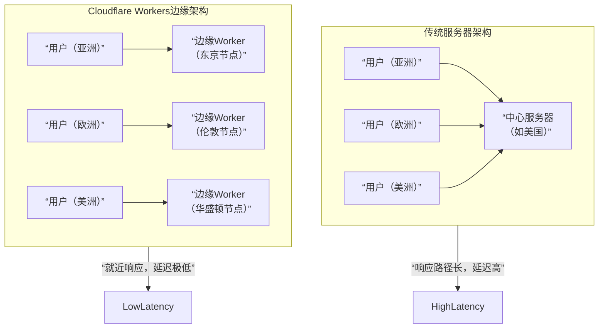

Cloudflare 是一个全球性的互联网云服务平台，提供 [CDN](../分布式中间件/CDN.md)、网络安全和性能优化服务，主要功能包括加速网站、防御 DDos 攻击、提供 SSL 加密和 DNS 解析等。

除了上述基础功能，Cloudflare 已经发展成为一个综合性的开发平台，主要服务于企业和开发者：
1. **零信任与网络服务**：提供无需依赖传统VPN的安全远程访问方案（Zero Trust），保护企业内网和员工设备。
2. **开发者平台**：其核心产品 Cloudflare Workers 是一个无服务器计算平台，允许开发者在全球边缘网络部署代码，实现极低延迟的应用体验。
3. **一站式整合平台**：不同于功能单一的提供商，Cloudflare 将网络、安全、性能和开发服务整合在一个统一的平台和全球网络中，通过单一控制面板进行管理。

## Cloudflare Workers

Cloudflare Workers 是 Cloudflare 提供的一项全球边缘网络上的无服务器计算平台，它允许你在 Cloudflare 遍布全球 300 多个城市的数据中心（称为边缘节点）上运行 JavaScript、Rust、C 或 C++ 代码。

### 核心架构

1. **极低的延迟**：用户请求到达最近的 Cloudflare 边缘节点后，代码立即执行并返回响应，无需跨越大半个地球。
2. **无需管理服务器**：完全无服务器（Serverless），你只需编写代码并部署，无需关心服务器配置、扩缩容或维护。
3. **基于 V8 隔离环境**：每个 Worker 都运行在 Google Chrome 浏览器相同的 V8 JavaScript 引擎中，但处于轻量、安全的隔离环境中，启动速度极快（毫秒级冷启动）。
4. **与 Cloudflare 生态深度集成**：可以无缝调用 Cloudflare 的其他服务，如 KV（键值存储）、D1（SQL数据库）、R2（对象存储）、DDoS 防护等。

Cloudflare Workers 将计算能力从云端下沉到了网络边缘，从根本上改变了应用构建和部署的模式，是开发现代化、高性能网络应用的重要工具。