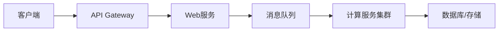

拆解和架构一个复杂的后端系统需要遵循**模块化、解耦、可扩展性**三大原则，同时结合业务需求和技术特性。

### 演进路线建议

1. **先拆关键路径**：优先拆分性能瓶颈（如计算任务）。
2. **逐步微服务化**：从低耦合模块开始（用户服务、支付服务）。
3. **数据拆分最后做**：数据库拆分风险最高，前期可通过读写分离缓解压力。
4. **自动化先行**：在拆分前搭建CI/CD和监控，降低运维风险。

> [!tip] 重要原则
>**不要过度设计**！根据业务实际负载（如QPS、数据量）选择合适的架构。小型系统初期可用单体+模块化，随业务增长逐步拆分。

### 分层解耦（垂直拆分）

将系统划分为独立层，每层职责单一：
- **接入层（API Gateway）**：处理请求路由、认证、限流（如Kong, Apigee）。
- **业务服务层（微服务）**：
    - **Web服务**：轻量级无状态服务，处理基础业务逻辑（如Spring Boot, Gin）。
    - **计算服务**：隔离CPU/内存密集型任务（如视频转码、数据分析）。
- **数据层**：
    - **数据库**：按业务拆分（用户库、订单库等），读写分离。
    - **缓存**：高频读操作用Redis/Memcached加速。
    - **异步存储**：日志/大文件用对象存储（S3, MinIO）。
- **基础设施层**：容器编排（K8s）、服务网格（Istio）、监控（Prometheus）。

### 任务异步化（水平拆分）

针对CPU/内存密集型任务：

- **消息队列解耦**：
    - Web服务接收请求后，将任务投递到消息队列（Kafka/RabbitMQ）。
    - 计算服务从队列消费任务，完成后回调或写入数据库。
- **资源隔离**：
    - 单独部署计算节点，配置高CPU/内存规格。
    - 使用GPU/TPU等硬件加速（如AI推理任务）。
- **弹性伸缩**：
    - 基于队列积压长度自动扩缩容（K8s HPA + Prometheus）。

### 数据层优化

- **数据库拆分**：
    - **垂直拆分**：按业务分库（用户服务→用户库，订单服务→订单库）。
    - **水平拆分**：数据量大的表做分片（如UserID分片）。
- **读写分离**：
    - 写主库，读从库（利用MySQL Replication或Redis Cluster）。
- **缓存策略**：
    - 热点数据缓存（Redis）+ 缓存击穿/雪崩防护。
- **数据异构**：
    - 复杂查询用Elasticsearch单独构建索引。

### 服务通信与治理

- **同步调用**：REST/gRPC（适合实时性要求高的场景）。
- **异步通信**：消息队列（削峰填谷，解耦）。
- **服务发现**：Consul/Zookeeper，或K8s内置DNS。
- **熔断限流**：Hystrix/Sentinel防止雪崩。

### 运维与监控

- **容器化**：Docker + Kubernetes（自动部署、扩缩容）。
- **CI/CD**：GitLab CI/Jenkins实现自动化流水线。
- **可观测性**：
    - 日志：ELK或Loki
    - 指标：Prometheus + Grafana
    - 链路追踪：Jaeger/Zipkin

### 安全与合规

- **API安全**：OAuth2/JWT鉴权 + API Gateway统一管控。
- **数据加密**：传输层TLS，存储加密（如AWS KMS）。
- **合规性**：敏感数据脱敏，审计日志留存。

