*Visibility determination* for ***rasterization*** can be described with double for-loops：
```C++
for (T in triangles)
	for (P in pixels)
		determine if P is inside T
```


连续的操作如下：
- Before Rasterization：顶点处理阶段（vertex processing），将坐标转化为屏幕坐标
- Rasterization：光栅化，主要分成两个任务：（1）枚举图元覆盖的像素点（2）根据图元的属性进行插值。
- After Rasterization：
	- 片元处理阶段（fragment processing）
	- 混合
- Antialiasing：反锯齿
- Culling Primitives：片元剔除


# Before Rasterization


## Camera Transformation

>  通常世界坐标系是一个三维笛卡儿坐标系，一般为右手坐标系。

*From world space to camera space*，在进行坐标变换之前，首先要定义一些必要参数，以确立观测坐标系：
- the eye position  $\mathbf{e}$ ：观测点的位置
- the gaze direction（Look-at） $\mathbf{g}$ ：观测者注视的方向
- the view-up vector  $\mathbf{t}$ ：这个up方向并不需要与look-at方向垂直，实际上这个方向只是为了划分左右半边

依据以上信息，建立的 $uvw$ 坐标系，可以分成左手系和右手系，


对于**右手系**的单位正交基，可以表示为，
$$
\begin{array}{ccc}
	\mathbf{w} & = & - \frac{\mathbf{g}}{||\mathbf{g}||} \\
	\mathbf{u} & = & \frac{\mathbf{t} \times \mathbf{w}}{||\mathbf{t} \times \mathbf{w}||} \\
	\mathbf{v} &=& \mathbf{w} \times \mathbf{u}
\end{array}
$$
> 两个三维中的向量叉乘跟在哪个坐标系是无关的，因为向量方向的判断在右手坐标系中用右手，左手坐标系中使用左手。


坐标变换的过程，就是 camera transformation 推导过程，生成相机变换矩阵 $M_{cam}$ ，即

$$
M_{cam} = R_{view}T_{view}
$$

**Step 1**：平移变换，将观测点位置 $\mathbf{e}$ （或者说摄像机位置）从世界空间中的坐标的 $(x_e, y_e, z_e)$ 移动到原点 $o$ $(0,0,0)$ ，
$$
T_{view} = \left[ \begin{array}{cccc}
	1 & 0 & 0 & -x_e\\
	0 & 1 & 0 & -y_e\\
	0 & 0 & 1 & -z_e\\
	0 & 0 & 0 & 1
	\end{array} \right]
$$
**Step 2**：旋转，将观测坐标系 $uvw$ 依次通过旋转对应到世界坐标系 $xyz$ 。对于右手系，look-at方向（即 $w$ ）和 $z$ 轴对应，垂直与look-at的方向（即 $v$ ）和 $y$ 轴对应。
$$
R_{view} = \left[ \begin{array}{cccc}
	x_u & y_u & z_u & 0\\
	x_v & y_v & z_v & 0\\
	x_w & y_w & z_w & 0\\
	0 & 0 & 0 & 1
	\end{array} \right]
$$

所以最终的矩阵为，
$$
M_{cam} = R_{view}T_{view} = 
	\left[ \begin{array}{cccc}
		x_u & y_u & z_u & -(x_ux_e + y_uy_e+z_uz_e)\\
		x_v & y_v & z_v & -(x_vx_e + y_vy_e+z_vz_e)\\
		x_w & y_w & z_w & -(x_wx_e + y_wy_e+z_wz_e)\\
		0 & 0 & 0 & 1
	\end{array} \right]
$$
> 使用行向量时，向量和矩阵相乘时，向量在左，矩阵在右；使用列向量时，向量和矩阵相乘时矩阵在左，向量在右。

### 实现

#### C++代码

```C
/// <summary>
/// 计算camera transformation矩阵，或者通用的说法是lookat
/// </summary>
/// <param name="m"></param>
/// <param name="eye">观测点</param>
/// <param name="at"> 注视点</param>
/// <param name="up"> view up 方向</param>
void matrix_set_lookat(matrix_t* m, const vector_t* eye, 
					   const vector_t* at, const vector_t* up)
{
    vector_t uaxis, vaxis, waxis;
	
    vector_sub(&waxis, at, eye);
    vector_normalize(&waxis);
	
	#ifdef RH
    vector_crossproduct(&uaxis, waxis, up);
    #else
	vector_crossproduct(&uaxis, up, waxis);     // 由于叉乘操作是定义好的，所以左手系和右手系谁转向谁不同
    #endif 
    vector_normalize(&uaxis);
	
	#ifdef RH
    vector_crossproduct(&vaxis, uaxis, waxis);
    #else
    vector_crossproduct(&vaxis, waxis, uaxis);
    #endif
	
    m->m[0][0] = uaxis.x;
    m->m[1][0] = uaxis.y;
    m->m[2][0] = uaxis.z;
	
    m->m[0][1] = vaxis.x;
    m->m[1][1] = vaxis.y;
    m->m[2][1] = vaxis.z;
	
	#ifdef RH
    m->m[0][2] = -waxis.x;
    m->m[1][2] = -waxis.y;
    m->m[2][2] = -waxis.z;
    #else
    m->m[0][2] = waxis.x;
    m->m[1][2] = waxis.y;
    m->m[2][2] = waxis.z;
    #endif 
    
    m->m[3][0] = -vector_dotproduct(&uaxis, eye);
    m->m[3][1] = -vector_dotproduct(&vaxis, eye);
    m->m[3][2] = -vector_dotproduct(&waxis, eye);

    m->m[0][3] = m->m[1][3] = m->m[2][3] = 0.0f;
    m->m[3][3] = 1.0f;
}
```

#### GLM源码

调用方式，
```C++
glm::mat4 view = glm::lookAt(camera position, target, camera up);  // to careate a view matrix
```

源码，
```C++
template<typename T, qualifier Q>
GLM_FUNC_QUALIFIER mat<4, 4, T, Q> lookAtRH(vec<3, T, Q> const& eye, vec<3, T, Q> const& center, vec<3, T, Q> const& up)
{
	vec<3, T, Q> const f(normalize(center - eye));
	vec<3, T, Q> const s(normalize(cross(f, up)));  //不同点一
	vec<3, T, Q> const u(cross(s, f));              //不同点二

	mat<4, 4, T, Q> Result(1);
	Result[0][0] = s.x;
	Result[1][0] = s.y;
	Result[2][0] = s.z;
	Result[0][1] = u.x;
	Result[1][1] = u.y;
	Result[2][1] = u.z;
	Result[0][2] =-f.x;                             //不同点三
	Result[1][2] =-f.y;
	Result[2][2] =-f.z;
	Result[3][0] =-dot(s, eye);
	Result[3][1] =-dot(u, eye);
	Result[3][2] = dot(f, eye);
	return Result;
}

template<typename T, qualifier Q>
GLM_FUNC_QUALIFIER mat<4, 4, T, Q> lookAtLH(vec<3, T, Q> const& eye, vec<3, T, Q> const& center, vec<3, T, Q> const& up)
{
	vec<3, T, Q> const f(normalize(center - eye));
	vec<3, T, Q> const s(normalize(cross(up, f)));  //不同点一
	vec<3, T, Q> const u(cross(f, s));              //不同点二

	mat<4, 4, T, Q> Result(1);
	Result[0][0] = s.x;
	Result[1][0] = s.y;
	Result[2][0] = s.z;
	Result[0][1] = u.x;
	Result[1][1] = u.y;
	Result[2][1] = u.z;
	Result[0][2] = f.x;                             //不同点三
	Result[1][2] = f.y;
	Result[2][2] = f.z;
	Result[3][0] = -dot(s, eye);
	Result[3][1] = -dot(u, eye);
	Result[3][2] = -dot(f, eye);
	return Result;
}

template<typename T, qualifier Q>
GLM_FUNC_QUALIFIER mat<4, 4, T, Q> lookAt(vec<3, T, Q> const& eye, vec<3, T, Q> const& center, vec<3, T, Q> const& up)
{
	GLM_IF_CONSTEXPR(GLM_CONFIG_CLIP_CONTROL & GLM_CLIP_CONTROL_LH_BIT)
		return lookAtLH(eye, center, up);
	else
		return lookAtRH(eye, center, up);
}
```

通过源码可以看到，左手系和右手系，只有lookat方向是相反的，其他都是相同的。


## Projection Transformation

投影变换，有两种，一种是正交投影（orthographic projection），另一个是透视投影（perspective projection）。![[imgs/overview-3.png]]

**正交投影**，就是假设相机离得无限远，可以理解成平行投影，可以将物体等大小投影到屏幕上。实际操作通常是将摄像机所照射的**长方体**映射到规范立方体上面，实际操作可简化为两个步骤：
- 将长方体中心移动到原点
- 将长方体拉伸为规范立方体 $[-1, 1]^3$。
  $$
	M_{ortho} = 
		\left[ \begin{array}{cccc} 
			\frac{2}{r-l} & 0 & 0 & 0\\
			0 & \frac{2}{t-b} & 0 & 0\\
			0 & 0 & \frac{2}{n-f} & 0\\
			0 & 0 & 0 & 1
		\end{array} \right]
		\left[ \begin{array}{cccc} 
			1 & 0 & 0 & -\frac{r + l}{2}\\
			0 & 1 & 0 & -\frac{t + b}{2}\\
			0 & 0 & 1 & -\frac{n + f}{2}\\
			0 & 0 & 0 & 1
		\end{array} \right]
		=
		\left[ \begin{array}{cccc} 
			\frac{2}{r-l} & 0 & 0 & -\frac{r+l}{r-l}\\
			0 & \frac{2}{t-b} & 0 & -\frac{t+b}{t-b}\\
			0 & 0 & \frac{2}{n-f} & -\frac{n+f}{n-f}\\
			0 & 0 & 0 & 1
		\end{array} \right]
 $$


**透视投影**，投射投影符合现实人眼的投影方式，典型特征就是近大远小，大部分3D游戏使用的都是透视投影方式。透视投影的实际操作也只有两个步骤：
- 将截锥体压缩成长方体：近平面永远不变，远平面中心还是中心，远近面z值不变（就是深度不变）
- 进行正交投影
  $$
	M_{persp \rightarrow ortho} = 
		\left[ \begin{array}{cccc} 
			n & 0 & 0 & 0\\
			0 & n & 0 & 0\\
			0 & 0 & n+f & -fn\\
			0 & 0 & 1 & 0
		\end{array} \right]
 $$
 （推导可以注意一下），最终可得：
   $$
	M_{persp} = M_{ortho}M_{persp \rightarrow ortho} = 
		\left[ \begin{array}{cccc} 
			\frac{2n}{r-l} & 0 & -\frac{l+r}{l-r} & 0\\
			0 & \frac{2n}{t-b} & -\frac{b+t}{b-t} & 0\\
			0 & 0 & \frac{n + f}{n-f} & \frac{2nf}{f-n}\\
			0 & 0 & 1 & 0
		\end{array} \right]
 $$


注：**视场角（Field-of-View，fov）**，在透视投影的实现中常常会用到。


### 正交投影实现

#### C++代码

```C++
/// <summary>
/// 右手系
/// </summary>
void matrix_set_ortho(matrix_t* m, float left, float right, float bottom, float top, float zn, float zf) {
    float fax = 1.0f / (float)tan(fovy * 0.5f);
    matrix_set_zero(m);
    m->m[0][0] = (float)(2.0f / (right - left));
    m->m[1][1] = (float)(2.0f / (top - bottom));
    m->m[2][2] = (float)(2.0f / (zf - zn));
    m->m[3][0] = - (right + left) / (right - left);
	m->m[3][1] = - (top + bottom) / (top - bottom);
	m->m[3][2] = - (zFar + zNear) / (zFar - zNear);
}
```

#### GLM源码

调用方式，
```C++
glm::mat4 ort = glm::ortho(left, right, bottom, top, znear, zfar);
```
前两个参数指定了平截头体的左右位置，第三和第四参数指定了平截头体的底部和顶部。通过这四个参数我们定义了近平面和远平面的大小，然后第五和第六个参数则定义了近平面和远平面的距离。

源码，
```C++
template<typename T>
GLM_FUNC_QUALIFIER mat<4, 4, T, defaultp> ortho(T left, T right, T bottom, T top, T zNear, T zFar)
{
#		if GLM_CONFIG_CLIP_CONTROL == GLM_CLIP_CONTROL_LH_ZO
		return orthoLH_ZO(left, right, bottom, top, zNear, zFar);
#		elif GLM_CONFIG_CLIP_CONTROL == GLM_CLIP_CONTROL_LH_NO
		return orthoLH_NO(left, right, bottom, top, zNear, zFar);
#		elif GLM_CONFIG_CLIP_CONTROL == GLM_CLIP_CONTROL_RH_ZO
		return orthoRH_ZO(left, right, bottom, top, zNear, zFar);
#		elif GLM_CONFIG_CLIP_CONTROL == GLM_CLIP_CONTROL_RH_NO
		return orthoRH_NO(left, right, bottom, top, zNear, zFar);
#		endif
}

template<typename T>
GLM_FUNC_QUALIFIER mat<4, 4, T, defaultp> orthoLH_ZO(T left, T right, T bottom, T top, T zNear, T zFar)
{
	mat<4, 4, T, defaultp> Result(1);
	Result[0][0] = static_cast<T>(2) / (right - left);
	Result[1][1] = static_cast<T>(2) / (top - bottom);
	Result[2][2] = static_cast<T>(1) / (zFar - zNear);
	Result[3][0] = - (right + left) / (right - left);
	Result[3][1] = - (top + bottom) / (top - bottom);
	Result[3][2] = - zNear / (zFar - zNear);
	return Result;
}

template<typename T>
GLM_FUNC_QUALIFIER mat<4, 4, T, defaultp> orthoLH_NO(T left, T right, T bottom, T top, T zNear, T zFar)
{
	mat<4, 4, T, defaultp> Result(1);
	Result[0][0] = static_cast<T>(2) / (right - left);
	Result[1][1] = static_cast<T>(2) / (top - bottom);
	Result[2][2] = static_cast<T>(2) / (zFar - zNear);
	Result[3][0] = - (right + left) / (right - left);
	Result[3][1] = - (top + bottom) / (top - bottom);
	Result[3][2] = - (zFar + zNear) / (zFar - zNear);
	return Result;
}

template<typename T>
GLM_FUNC_QUALIFIER mat<4, 4, T, defaultp> orthoRH_ZO(T left, T right, T bottom, T top, T zNear, T zFar)
{
	mat<4, 4, T, defaultp> Result(1);
	Result[0][0] = static_cast<T>(2) / (right - left);
	Result[1][1] = static_cast<T>(2) / (top - bottom);
	Result[2][2] = - static_cast<T>(1) / (zFar - zNear);
	Result[3][0] = - (right + left) / (right - left);
	Result[3][1] = - (top + bottom) / (top - bottom);
	Result[3][2] = - zNear / (zFar - zNear);
	return Result;
}

template<typename T>
GLM_FUNC_QUALIFIER mat<4, 4, T, defaultp> orthoRH_NO(T left, T right, T bottom, T top, T zNear, T zFar)
{
	mat<4, 4, T, defaultp> Result(1);
	Result[0][0] = static_cast<T>(2) / (right - left);
	Result[1][1] = static_cast<T>(2) / (top - bottom);
	Result[2][2] = - static_cast<T>(2) / (zFar - zNear);
	Result[3][0] = - (right + left) / (right - left);
	Result[3][1] = - (top + bottom) / (top - bottom);
	Result[3][2] = - (zFar + zNear) / (zFar - zNear);
	return Result;
}
```


### 透视投影实现

#### C++代码

```C++
/// <summary>
/// 根据视野构建一个左手透视投影矩阵。
/// </summary>
/// <param name="m">指向操作结果的矩阵结构的指针。</param>
/// <param name="fovy">  视场角，以弧度为单位。</param>
/// <param name="aspect">纵横比，定义为视图空间宽度除以高度。</param>
/// <param name="zn">    近视图平面的 Z 值。</param>
/// <param name="zf">    远视图平面的 Z 值。</param>
void matrix_set_perspective(matrix_t* m, float fovy, float aspect, float zn, float zf) {
    float fax = 1.0f / (float)tan(fovy * 0.5f);
    matrix_set_zero(m);
    m->m[0][0] = (float)(fax / aspect);
    m->m[1][1] = (float)(fax);
    m->m[2][2] = zf / (zf - zn);
    m->m[3][2] = -zn * zf / (zf - zn);
    m->m[2][3] = 1;
}
```


#### GLM源码

调用方式，
```C++
glm::mat4 proj = glm::perspective(glm::radians(45.0f), (float)width/(float)height, znear, zfar);
```

源码，
```C++
template<typename T>
GLM_FUNC_QUALIFIER mat<4, 4, T, defaultp> perspective(T fovy, T aspect, T zNear, T zFar)
{
#		if GLM_CONFIG_CLIP_CONTROL == GLM_CLIP_CONTROL_LH_ZO
		return perspectiveLH_ZO(fovy, aspect, zNear, zFar);
#		elif GLM_CONFIG_CLIP_CONTROL == GLM_CLIP_CONTROL_LH_NO
		return perspectiveLH_NO(fovy, aspect, zNear, zFar);
#		elif GLM_CONFIG_CLIP_CONTROL == GLM_CLIP_CONTROL_RH_ZO
		return perspectiveRH_ZO(fovy, aspect, zNear, zFar);
#		elif GLM_CONFIG_CLIP_CONTROL == GLM_CLIP_CONTROL_RH_NO
		return perspectiveRH_NO(fovy, aspect, zNear, zFar);
#		endif
}

template<typename T>
GLM_FUNC_QUALIFIER mat<4, 4, T, defaultp> perspectiveRH_ZO(T fovy, T aspect, T zNear, T zFar)
{
	assert(abs(aspect - std::numeric_limits<T>::epsilon()) > static_cast<T>(0));

	T const tanHalfFovy = tan(fovy / static_cast<T>(2));

	mat<4, 4, T, defaultp> Result(static_cast<T>(0));
	Result[0][0] = static_cast<T>(1) / (aspect * tanHalfFovy);
	Result[1][1] = static_cast<T>(1) / (tanHalfFovy);
	Result[2][2] = zFar / (zNear - zFar);
	Result[2][3] = - static_cast<T>(1);
	Result[3][2] = -(zFar * zNear) / (zFar - zNear);
	return Result;
}

template<typename T>
GLM_FUNC_QUALIFIER mat<4, 4, T, defaultp> perspectiveRH_NO(T fovy, T aspect, T zNear, T zFar)
{
	assert(abs(aspect - std::numeric_limits<T>::epsilon()) > static_cast<T>(0));

	T const tanHalfFovy = tan(fovy / static_cast<T>(2));

	mat<4, 4, T, defaultp> Result(static_cast<T>(0));
	Result[0][0] = static_cast<T>(1) / (aspect * tanHalfFovy);
	Result[1][1] = static_cast<T>(1) / (tanHalfFovy);
	Result[2][2] = - (zFar + zNear) / (zFar - zNear);
	Result[2][3] = - static_cast<T>(1);
	Result[3][2] = - (static_cast<T>(2) * zFar * zNear) / (zFar - zNear);
	return Result;
}

template<typename T>
GLM_FUNC_QUALIFIER mat<4, 4, T, defaultp> perspectiveLH_ZO(T fovy, T aspect, T zNear, T zFar)
{
	assert(abs(aspect - std::numeric_limits<T>::epsilon()) > static_cast<T>(0));

	T const tanHalfFovy = tan(fovy / static_cast<T>(2));

	mat<4, 4, T, defaultp> Result(static_cast<T>(0));
	Result[0][0] = static_cast<T>(1) / (aspect * tanHalfFovy);
	Result[1][1] = static_cast<T>(1) / (tanHalfFovy);
	Result[2][2] = zFar / (zFar - zNear);
	Result[2][3] = static_cast<T>(1);
	Result[3][2] = -(zFar * zNear) / (zFar - zNear);
	return Result;
}

template<typename T>
GLM_FUNC_QUALIFIER mat<4, 4, T, defaultp> perspectiveLH_NO(T fovy, T aspect, T zNear, T zFar)
{
	assert(abs(aspect - std::numeric_limits<T>::epsilon()) > static_cast<T>(0));

	T const tanHalfFovy = tan(fovy / static_cast<T>(2));

	mat<4, 4, T, defaultp> Result(static_cast<T>(0));
	Result[0][0] = static_cast<T>(1) / (aspect * tanHalfFovy);
	Result[1][1] = static_cast<T>(1) / (tanHalfFovy);
	Result[2][2] = (zFar + zNear) / (zFar - zNear);
	Result[2][3] = static_cast<T>(1);
	Result[3][2] = - (static_cast<T>(2) * zFar * zNear) / (zFar - zNear);
	return Result;
}
```

## Viewport Transformation

*From camera space to screen space* ，屏幕就是一个二维的数组，每个值是它的像素。

视口变换负责把裁剪空间上的坐标（ $x$ 范围 $[-1,1]$ ，$y$ 范围 $[-1,1]$ ）映射到屏幕坐标（范围 $[-0.5,width - 0.5]$ ，范围 $[-0.5, height- 0.5]$ ），这就需要先定义屏幕分辨率的大小（例如：width=1200，height=1080）。

$$
	M_{viewport} = 
		\left[ \begin{array}{cccc} 
			\frac{width}{2} & 0 & 0 & \frac{width - 1}{2}\\
			0 & \frac{height}{2} & 0 & \frac{height - 1}{2}\\
			0 & 0 & 1 & 0\\
			0 & 0 & 0 & 1
		\end{array} \right]
 $$
### 实现

#### C++代码

```C++
/// <summary>
/// 归一化，得到屏幕坐标
/// </summary>
void transform_homogenize(const transform_t* ts, vector_t* y, const vector_t* x) {
    float rhw = 1.0f / x->w;
    y->x = (x->x * rhw + 1.0f) * ts->w * 0.5f;
    y->y = (1.0f - x->y * rhw) * ts->h * 0.5f;
    y->z = x->z * rhw;
    y->w = 1.0f;
}
```


最终可得，

$$
M = M_{viewport}M_{perp}M_{cam}
$$


# Rasterization

输入光栅器（rasterizer）的是已经转换为屏幕坐标（screen space）的图元顶点坐标，光栅化就是将这些图元绘制出来。

光栅化，主要分成两个任务：（1）枚举图元覆盖的像素点（2）根据图元的属性进行插值。

> 进行光栅化本质就是采样（Sampling），采样就是给你一个连续函数，从不同地方去看它的值是多少，即函数离散化的过程。

## Line Drawing

不同的算法有：数值微分算法（DDA）、Bresenham algorithm和中点算法（midpoint algorithm）。同时为了提高性能，采用增量算法（incremental method）。

本质上，对于直线的参数化表示，
$$
\begin{alignedat}{5}
	x&&\;=\;&&x_0&&\;+\;&&(x_1 - x_0)\lambda &\\
	y&&\;=\;&&y_0&&\;+\;&&(y_1 - y_0)\lambda 
\end{alignedat}
$$
斜率，
$$
m = \frac{y_1 - y_0}{x_1 - x_0}
$$
可以转化为隐式表示，即
$$
f(x, y) \equiv (y_0 - y_1)x + (x_1 - x_0)y + x_0y_1 - x_1y_0 = 0
$$
因此可以通过输入两个点画一条线段。

### DDA Algorithm

DDA数值微分算法，一种基于直线的微分方程来生成直线的方法，由于有浮点数运算与取整，该算法不利于硬件实现。

**算法步骤**：
1. 输入线段的两个端点 $a = (x_0, y_0)$ ，$b = (x_1, y_1)$。
2. 计算端点的 $x$ 坐标和 $y$ 坐标之间的差值，分别为 $dx$ 和 $dy$。
3. 计算直线的斜率为 $m = dy/dx$。
4. 将线的初始点设置为 $a = (x_0, y_0)$ 。
5. 遍历线段的 $x$ 坐标，每次递增 1，然后使用等式 $y = y_0 + m(x – x_0)$ 计算相应的 $y$ 坐标。
6. 在计算的 $(x, y)$ 坐标处绘制像素。
7. 重复步骤 5 和 6，直到到达终结点 $b = (x_1, y_1)$。

有个问题，就是绘制斜率大于 1 的直线时，绘制出的直线会**断掉**，因此在绘制这种比较「陡峭」的直线时（斜率绝对值大于 1），以 y 的变化为基准，而不是以 x，这样就可以避免上面直线不连续情况。

**伪代码**：
```
step = abs(x1 - x0)
if abs(x1 - x0) < abs(y1 - y0)
	step = abs(y1 - y0)
dx = (x2 - x1) / step
dy = (y2 - y1) / step
x = x0
y = y0 
for i = 0 to step do
	draw(x, y)
	x = x + dx
	y = y + dy
	
```

**优点**： 
- 简单易用
- 避免了使用时间复杂度高的多重运算。
- 比直接使用直线方程更快，因为它不使用任何浮点乘法，而是计算直线上的点。
**缺点**： 
- 需要处理四舍五入操作和浮点运算，因此时间复杂度较高。
- 与方向有关，因此端点精度较差。
- 由于浮点表示法的精度有限，会产生累积误差。

### Bresenham’s Algorithm

每次在最大位移方向上走一步，而另一个方向是走步还是不走步取决于误差项的判别，假设已经绘制了一个点 $(x, y)$ ，那么在像素屏幕上，下个新点的位置，只可能是 $(x + 1, y)$，或 $(x + 1, y + 1)$ 。

**算法步骤**：
- 先把 $x_{new} = x + 1$ 这个值带入直线方程里，算出来 $y_{new}$ 的值
- 然后比较 $y_{new}$ 和  $y + 0.5$ 的大小
	-  $y_{new} \leq y + 0.5$ ，选点 $(x + 1, y)$
	-  $y_{new} > y + 0.5$ ，选点 $(x + 1, y + 1)$

**伪代码**：
```
y = y0
d = f(x0 + 1, y0 + 0.5)
for x = x0 to x1 do
	draw(x, y)
	if d < 0 then
		y = y + 1
		d = d + (x1 - x0) + (y0 - y1)
	else
		d = d + (y0 - y1)
```


### Mid-Point Algorithm


## 三角形光栅化

- 三角形：三角形一般是使用三个点进行表示，然后利用顶点的属性和重心坐标对三角形内部的像素点进行插值$$c = \alpha c_0 + \beta c_1 + \gamma c_2 $$
	- 要注意处理三角形边缘
	- 对重心坐标进行**透视校正**
	- 裁剪：将这个图元裁剪到符合投影的形式。


三角形的光栅化，主要是判断某个像素点是否被包含在三角形内，如果被包含在内则被渲染，未被包含则未被渲染。可以采用向量叉乘的方法判断某个点是否在三角形内部。


# After Rasterization


## Aliasing

走样（aliasing），其类型有一下几种：
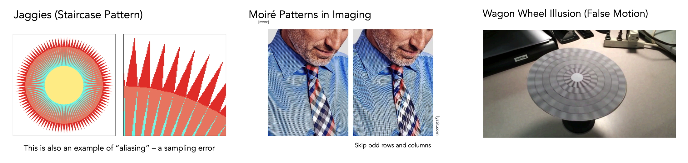
产生的原因就是信号变化的太快，但是采样的频率却很低。


在具体深入之前，首先应该介绍一下**傅立叶变换（Fourier Transform）**。

#### Fourier Transform

首先是**傅立叶级数展开**：任何一个周期函数都可以写成一系列正弦和余弦函数的线性组合和一个常数项。
那么，**任何函数**都可以分解为频率从低到高的形式，如：

$$
	f(x) = \frac{A}{2} + \frac{2A\cos(tw)}{\pi} \\
		- \frac{2A\cos(3tw)}{3\pi}  + \frac{2A\cos(5tw)}{5\pi}\\
		- \frac{2A\cos(7tw)}{7\pi} + \cdots
$$
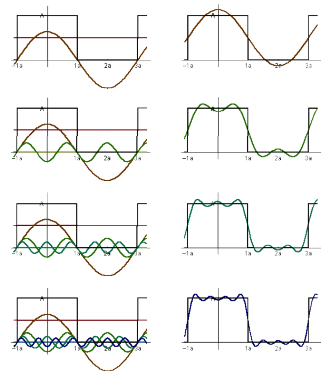


然后是**傅立叶变换**，一种线性积分变换，用于函数（应用上称作“信号”）在时域和频域之间的变换，通过傅立叶变换可以将函数分解成不同的频率的函数。
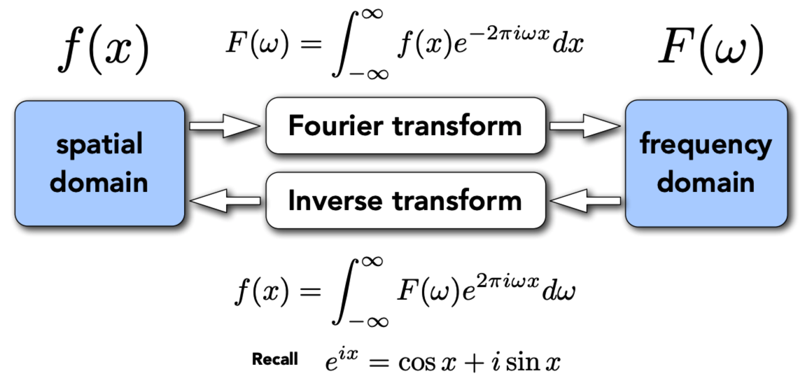


最后回归到了采样（sampling）问题，设置同一种采样频率，那么对于不同频率的函数，采样出来的点是不一样的。
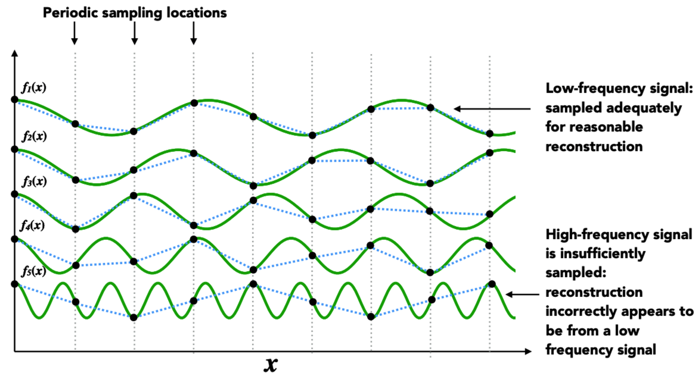

某些频率函数采样出来的点不能很好的还原最初的函数，采用同样的间隔进行采样，发现频率越高采样越不准确，所以**更高频率的函数需要更密集的采样点**。

可以通过频率的定义走样：

当用同样的方法去采样蓝色和黑色两个不同频率的函数，得到的结果是一样的，我们无法区分，这就叫走样。
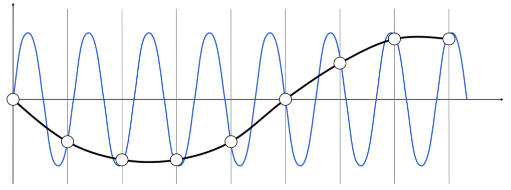
简单来说，就是像变成了另一个东西。


#### Filtering

滤波，去掉一部分频率的内容，从频域的角度来说，就是把某一段特殊的频率去掉，对应的信号如何发生变化。

图像通过傅里叶变换从图像空间变到频域空间，通过亮度来表示在不同频率上的信息。图像的频率信息（高频，低频）可以理解为图像相邻像素间色彩的**变化程度**。
- 低频信息：变化比较少的信息
- 高频信息：体现在物体边缘（边缘两侧色彩区别大，变化），高频表示细节。

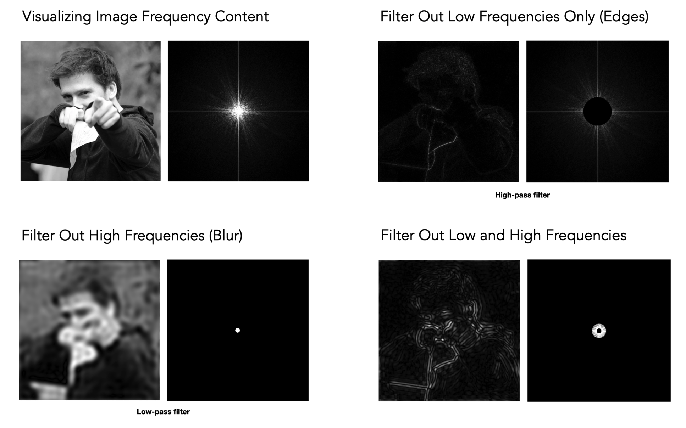

常见的滤波有：
- 高通滤波：只有高频信号可以通过，低频信号去掉了。高频信息可以表示图像内容的边界。
- 低通滤波：将高频信息去掉，只剩低频信息。使用低通滤波后，图片就模糊了，边界看不太到了。
- 带通滤波：只通过固定频段的信息。


**Filtering = Convolution（= Averaging）**


**卷积定理（Convolution Theorem）**：对时域上两个信号的卷积，等于两个信号在频域上的乘积；反之，时域上的乘积等于频域上的卷积。

所以对图像的卷积有两个做法：
1. 可以直接对这个图像做卷积；
2. 先把这幅图傅里叶变换到频域，把卷积的滤波器变换到频域上，两者相乘，得到频域的结果，再通过逆傅里叶变换变到时域。


**卷积核（滤波器）**：图像处理时，给定输入图像，输入图像中一个小区域中像素加权平均后成为输出图像中的每个对应像素，其中权值由一个函数定义，这个函数称为卷积核。

简单的 $1 \times 1$ 的 Box Function（Box Filter）就是一个卷积核（低通滤波器）。

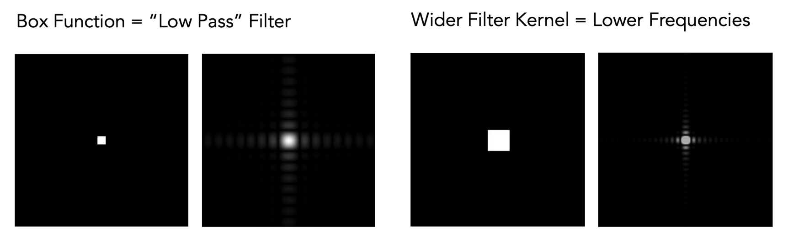
如果将这个box变大，频域上会变小，因为之前我们用 $3 \times 3$ 的卷积核对图像进行滤波，从而模糊图像，那如果不用 $3 \times 3$ 的，用 $21 \times 21$ 的，或者更大的，对于周围任何像素，都取它周围那么大区域平均起来，只能留下更低的频率。
所以用越大的box，得到的图像肯定会越来越模糊，或者反过来说，用一个超级小的box，就相当于没有做滤波，将所有的频率都留了下来。


#### Sampling

采样，就是重复频域上的内容。
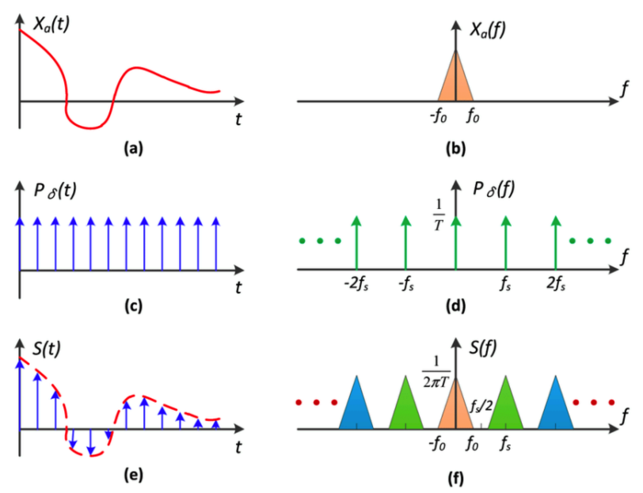
如下图（左边时域，右边频域），假设我们想要对a函数进行采样，也就是将其变成很多离散的点，相当于a函数乘上c函数（冲击函数：只在固定位置上有值，而在其他地方没有值，或者值为0）。

因为左边时域上的乘积等于右边频域上的卷积，所以b卷积d等于f，我们会发现频域上的操作实际上是把原始的函数的频谱复制粘贴了很多个，所以采样就是在重复原始信号的频谱。

时域采样，频域周期延拓，反之亦然。


**注意**：过大的采样间隔会导致输出频谱周期间隔较小，信号频谱出现重叠，导致信号被破坏。（在信号处理上面，为避免冲突要求采样频率超过信号频谱最大频率的2倍）
**理解**：要回到频率的定义上面，$f = \frac{1}{T}$ ，采样间隔过大，就会导致周期 $T$ 变大，那么对应的频率 $f$ 的值就变小，在频域上面表现的就离的更近了。
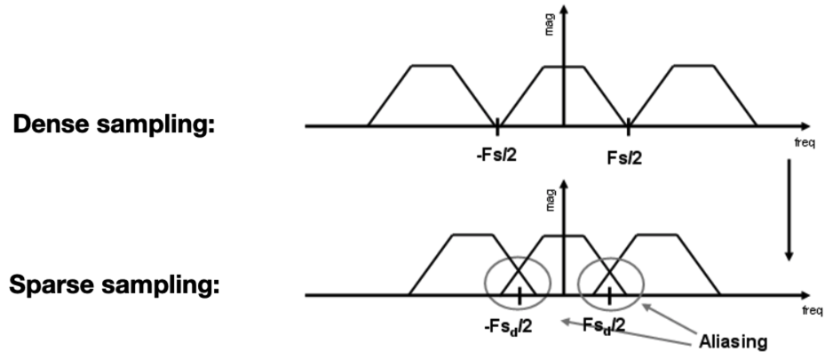

所以走样在频率的角度上来说，就是频率的频谱在经过采样后发生混叠。


## Antialiasing

增加显示屏的分辨率，像素和像素之间的间隔小，意味着采样频率高（所以这种方法也叫**增加采样率**），也就是在频谱上间隔大，不容易出现混叠。但是这不是反走样所要完成的任务，反走样在同一块屏幕上，怎么样把显示的效果做的更好。

说白了，就是先对图像进行处理，处理后再采样的话，就会让显示的更好。

反走样，要**先滤波，再采样**。既然锯齿化等发生在边缘，也就是高频的部分，那么就把高频的部分过滤掉，就可以把图像更好的展现出来了。所以这种方法也叫低通滤波，或者叫模糊（Blur）。
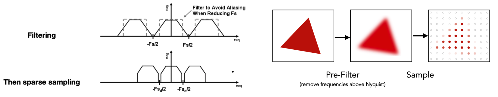
不能先采样后滤波，这样造成的显示效果不好（混叠还是会混叠）。

反采样的实际应用方法：

**方法一**：平均法，对于每个像素，三角形的覆盖情况如下图所示，对于任何一个像素，都对三角形覆盖（黑色表示覆盖面积）的面积求个平均，也就是将像素内部的值平均起来了。
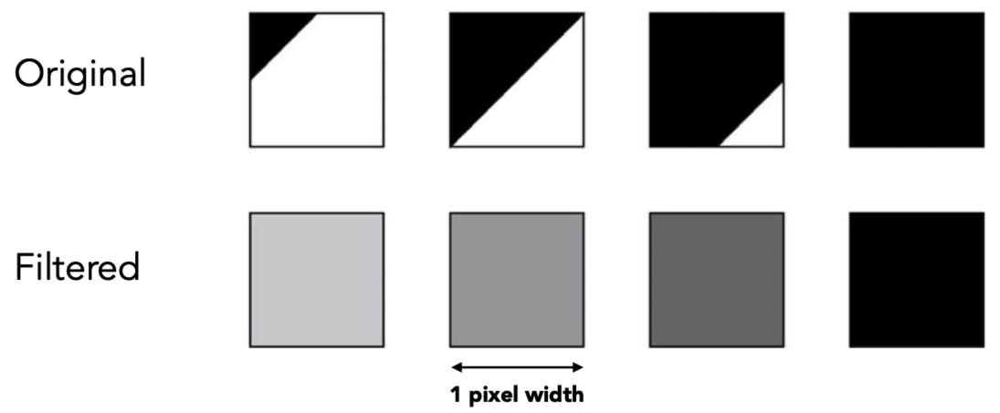
**方法二**：近似方法（MultiSampling Anti-Aliasing，MSAA），计算出每个像素的覆盖率，用更多的采样点进行反走样，它是对反走样的近似，并不能严格意义上解决反走样的问题。
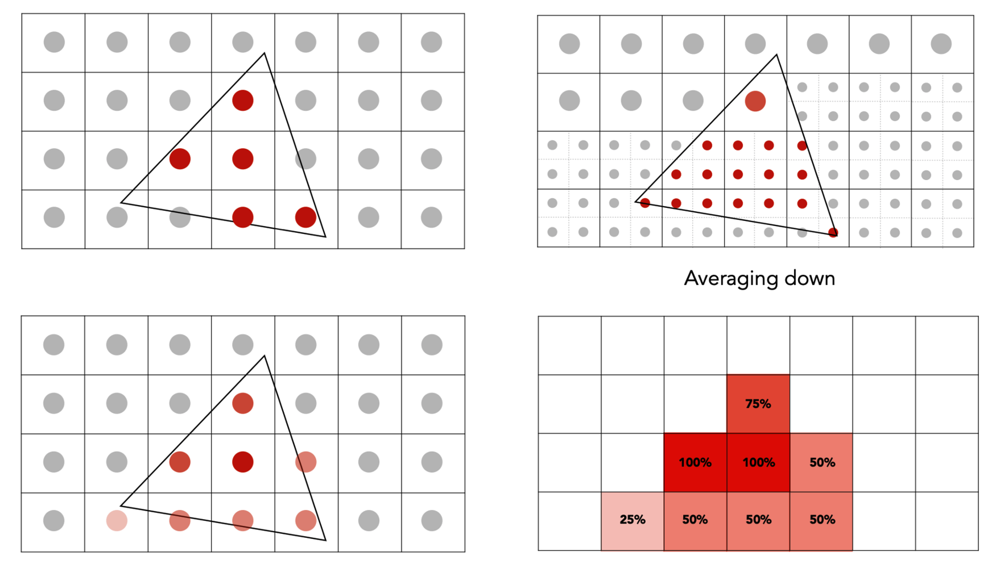
MSAA的开销是增加了计算量，从工业的角度，人们并不是把一个像素规则的划分为4X4个点，而是会用更加有效的图案去分布这些点，邻近的点还会被相邻的像素所复用（复用会减少计算量）。

缺点：
- MSAA对延迟渲染的支持不是很好，这个技术需要用到场景中的几何信息，但是延迟渲染因为需要节省光照计算的原因，事先把所有信息都放在了GBuffer上，所以着色计算的时候已经丢失了几何信息；

**方法三**：FXAA (Fast Approximate AA) ，是一个图像的后期处理，就是先把带锯齿的图像做出来，通过图像匹配（亮度对比）的方法找到边界，再将这些边界换成没有锯齿的边界（沿着某个方向将一定范围的像素取出来加权平均）。

**方法四**：TAA (Temporal AA) ，复用上一帧的结果，相当于将MSAA对应的样本给分布再在时间上，然后在当前这帧没有引入任何的其他的操作。

缺点：
- 容易出现鬼影和抖动的现象

#### Super Resolution / Super Sampling

从低分辨率拉到高分辨率，将一个小图拉大，就会有锯齿，那如果想让拉大的图看不到锯齿，其实就是高分辨率的图采样不够。

DLSS（Deep Learning Super Sampling），因为拉大了，肯定会有细节缺失，缺失的部分通过深度学习猜出来，利用足够多的经验告诉它，出现在任何一个局部应该如何把细节补上去。


## Visibility / Occlusion

可见性，遮挡。场景中有很多物体，如果要把这些物体放到屏幕上，就涉及到顺序问题。

**画家算法（Painter’s Algorithm）**：先把最远的物体画在屏幕上，再画近的物体，让其覆盖远处的物体。
- 需要对n个三角形进行排序，需要 $O(n\log n)$的时间。
- 无法解决互相遮挡的问题。


**Z-Buffering**：对空间中的三角形无法根据深度进行排序，那就对每个像素进行分析，把每个像素看成一个三角形的某些部分，那就可以在像素内去记录表示的这个几何最浅的深度。
- 需要额外的buffer来存储，首先是 frame buffer 存储颜色值，然后是 depth buffer 存储深度值。
- 在变换中提到相机始终是朝向-z方向的，所以看到的所有的z都是负的，说明了数字小离我们远，数字大离我们近。但是为了简化计算，在此将z换一个概念，我们将摄像机看的深度理解为点到摄像机的距离，这个距离永远是正的，而且越小的距离表示越近，越大的距离表示越远。
- 与三角形的顺序无关，时间复杂度是 $O(n)$。

**透明物体无法处理**。


## 延迟渲染

**延迟渲染**：
- 首先将物体的几何信息(位置、法线、颜色、镜面值）存到几何缓冲区中（即Geometric Buffer，G-Buffer）中；
- 然后在光照处理阶段，使用G-Buffer中的纹理数据，对每个片段进行光照计算；

这种渲染方法一个很大的好处就是能保证在G-Buffer中的片段和在屏幕上呈现的像素所包含的片段信息是一样的，因为深度测试已经最终将这里的片段信息作为最顶层的片段。这样保证了对于在光照处理阶段中处理的每一个像素都只处理一次。也就是说延迟渲染基本思想是，先执行深度测试，再进行着色计算，将本来在物体空间（三维空间）进行光照计算放到了屏幕空间（二维空间）进行处理。

**正向渲染与延迟渲染的区别**：

- 正向渲染，先执行着色计算，再执行深度测试；
- 正向渲染，渲染n个物体在m个光源下的着色，复杂度为$O(n \times m)$，光源数量对计算复杂度影响大；
- 正向渲染，我们通常会对一个像素运行多次片段着色器；
- 延迟渲染，先进行深度测试，再执行着色计算；
- 延迟渲染，每一个像素只会执行一次片段着色器。

**延迟渲染的优点**：
- 将光源的数目和场景中物体的数目在复杂度层次上完全分开。渲染n个物体在m个光源下的着色，复杂度为O（n+m），只渲染可见的像素，节省计算量；

**延迟渲染的缺点**：
- 内存开销大,读写G-buffers的内存带宽用量是性能瓶颈；
- 对透明的物体的渲染存在问题（不支持混色）；
- 对多重采样抗锯齿(MSAA)处理的支持不友好。