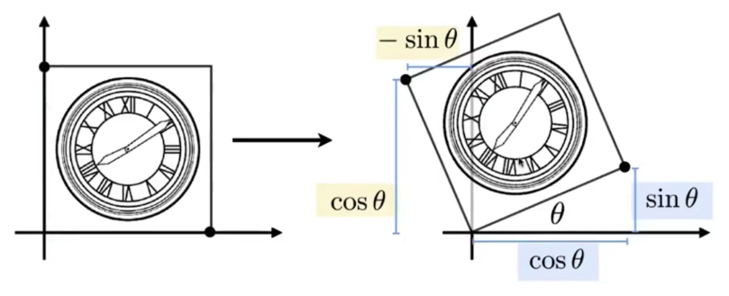

## Linear Algebra

图形学的数学基础，与图形的表示，变换变形，旋转有关。

#### 向量（Vectors）

1. 向量求和：算出 $\vec{a}+ \vec{b}$ 的值，利用平行四边形法则或者三角形法则
	1. 向量分解
2. 向量点乘：$$\vec{a} \cdot \vec{b} = \| \vec{a}\| \|\vec{b}\| \cos \theta = x_ax_b + y_ay_b$$
	2. 寻找两个向量的夹角：判断向量大致在同方向或者反方向，衡量两个向量的方向有多接近。
	3. 寻找一个向量在另一个向量上的投影
4. 向量叉乘：结果是一个向量，方向由右手螺旋定则判断。$$\|\vec{a} \times \vec{b}\| = \| \vec{a}\| \|\vec{b}\| \sin \theta$$$$
	\vec{a} \times \vec{b} = \left( \begin{array}{c} 
										y_az_b - y_bz_a \\
										z_ax_b - x_az_b \\
										x_ay_b - y_ax_b \\
							\end{array} \right)
						   = \left( \begin{array}{ccc}
								   0 & -z_a & y_a \\
								   z_a & 0 & -x_a \\
								   -y_a & x_a & 0
							\end{array} \right) 
							\left( \begin{array}{c}
							x_b \\
							y_b \\
							z_b
							\end{array} \right) 
	$$
	1. 建立直角坐标系时比较有用
	2. 判断点在图形内还是图形外
5. 直角坐标系

#### 矩阵（Matrices）

在图形学领域，主要作用是表示变换（Transformations），比如旋转、切片、缩放。

1. 矩阵乘积（Matrix-Matrix Multiplication）
	1. 无交换律
2. 矩阵向量乘法（Matrix-Vector Multiplication）
	1. 向量视为列向量
	2. 点变换的关键
3. 矩阵转置

## Transformation

变换有两种，一个是模型变换，一个是视图变换。
* 模型变换（Modeling）：tranlation，平移；rotation，旋转，逆运动学、正运动学；scaling，缩放
* 视图变换（Viewing）：3D对2D的投影

#### 二维变换

1. 缩放：对大小进行变换
	$$
	\left[ \begin{array}{c} 
		x'\\
		y'
	\end{array} \right]
	= 
	\left[ \begin{array}{cc} 
		s_x & 0\\
		0 & s_y
	\end{array} \right]
	\left[ \begin{array}{c} 
		x\\
		y
	\end{array} \right]
  $$
2. 镜像
	$$
	\left[ \begin{array}{c} 
		x'\\
		y'
	\end{array} \right]
	= 
	\left[ \begin{array}{cc} 
		-1 & 0\\
		0 & 1
	\end{array} \right]
	\left[ \begin{array}{c} 
		x\\
		y
	\end{array} \right]
  $$
3. 切片（Shear）：将一条边进行移动
	$$
	\left[ \begin{array}{c} 
		x'\\
		y'
	\end{array} \right]
	= 
	\left[ \begin{array}{cc} 
		-1 & a\\
		0 & 1
	\end{array} \right]
	\left[ \begin{array}{c} 
		x\\
		y
	\end{array} \right]
  $$
4. 旋转（Rotation）
	$$
	\left[ \begin{array}{c} 
		x'\\
		y'
	\end{array} \right]
	= 
	\left[ \begin{array}{cc} 
		\cos \theta & -\sin \theta\\
		\sin \theta & \cos \theta
	\end{array} \right]
	\left[ \begin{array}{c} 
		x\\
		y
	\end{array} \right]
  $$
  

#### 齐次坐标

在三维数据中，通常用(x, y, z)来表示一个点的位置。然而，在一些情况下，会使用四维坐标来表示点，即(x, y, z, w)。

齐次坐标就是用 N+1 维来代表 N 维坐标，齐次坐标与标准空间坐标相互转换的方式为：

$$
\left( \begin{array}{c} x \\ y \\ w \end{array} \right) \Longleftrightarrow \left( \begin{array}{c} x/w \\ y/w \\ 1 \end{array} \right) 
$$

引入齐次坐标（homogeneous coordinate）的目的是为了解决**平移**变换，这样的话就可以表示所有的变换。主要原因包括：
- 齐次坐标表示无穷远点：在三维空间中，我们无法准确地表示一个点是否位于无穷远处。齐次坐标允许我们通过将w设为0来表示一个点位于无穷远处。
- 矩阵变换：齐次坐标可以使矩阵变换更容易进行，因为它们与矩阵相乘的规则更加简单和统一。
- 方便的缩放和平移：齐次坐标可以使缩放和平移等变换更容易进行，因为它们对于矩阵的乘法运算更加方便。
- 射影变换：计算机图形学中常常涉及到投影操作，例如透视投影。使用齐次坐标可以使这些变换变得更加简洁和统一。

5. 平移（Translation）：平移变换不是线性变换
	$$
	\left[ \begin{array}{c} 
		x'\\
		y'
	\end{array} \right]
	= 
	\left[ \begin{array}{cc} 
		a & b\\
		c & d
	\end{array} \right]
	\left[ \begin{array}{c} 
		x\\
		y
	\end{array} \right]
	+
	\left[ \begin{array}{c} 
		t_x\\
		t_y
	\end{array} \right]
  $$

引入一个新的形式，将原来的点增加了一个维度，如：
- 2D point = $(x, y, 1)^T$
- 2D vector = $(x, y, 0)^T$：加0的目的是，保证向量经过平移变换后不变

那么平移的矩阵表示为：
$$
\left[ \begin{array}{c} 
		x'\\
		y'\\
		w'
	\end{array} \right]
	= 
	\left[ \begin{array}{ccc} 
		1 & 0 & t_x\\
		0 & 1 & t_y\\
		0 & 0 & 1
	\end{array} \right]
	\left[ \begin{array}{c} 
		x\\
		y\\
		1
	\end{array} \right]
	=
	\left[ \begin{array}{c} 
		x + t_x\\
		y + t_y\\
		1
	\end{array} \right]
$$

2维点后面为什么可以添加1？是因为在齐次坐标坐标系中，$\left( \begin{array}{c} x \\ y \\ w \end{array} \right)$ 就是2维坐标 $\left( \begin{array}{c} x/w \\ y/w \\ 1 \end{array} \right)$，$w \neq 1$。

这样的话，
- vector + vector = vector
- point - point = vector
- point + vector = point
- point + point = 表示为两个点的中点

##### 仿射变换（Affine）

所有的仿射变换，都可以表示为线性变换 + 平移，即：
$$
	\left( \begin{array}{c} 
		x'\\
		y'
	\end{array} \right)
	= 
	\left( \begin{array}{cc} 
		a & b\\
		c & d
	\end{array} \right)
	\left( \begin{array}{c} 
		x\\
		y
	\end{array} \right)
	+
	\left( \begin{array}{c} 
		t_x\\
		t_y
	\end{array} \right)
$$
用齐次坐标系表示即为：
$$
\left( \begin{array}{c} 
		x'\\
		y'\\
		1
	\end{array} \right)
	= 
	\left( \begin{array}{ccc} 
		a & b & t_x\\
		c & d & t_y\\
		0 & 0 & 1
	\end{array} \right)
	\left( \begin{array}{c} 
		x\\
		y\\
		1
	\end{array} \right)
$$
这种形式统一了所有的变换。
- Scale
  $$
  S(s_x, s_y) = \left( \begin{array}{ccc} 
		s_x & 0 & 0\\
		0 & s_y & 0\\
		0 & 0 & 1
	\end{array} \right)
 $$
- Rotation
  $$
  R(\alpha) = \left( \begin{array}{ccc} 
		\cos \alpha & -\sin \alpha & 0\\
		\sin \alpha & \cos \alpha & 0\\
		0 & 0 & 1
	\end{array} \right)
 $$
- Translation
  $$
  T(t_x, t_y) = \left( \begin{array}{ccc} 
		1 & 0 & t_x\\
		1 & 0 & t_y\\
		0 & 0 & 1
	\end{array} \right)
 $$

复杂的变换可以通过简单的变换组合而成，要注意变换的顺序。

#### 三维变换

三维空间中的仿射变换，即：
$$
\left( \begin{array}{c} 
		x'\\
		y'\\
		z'\\
		1
	\end{array} \right)
	= 
	\left( \begin{array}{cccc} 
		a & b & c & t_x\\
		d & e & f & t_y\\
		g & h & i & t_z\\
		0 & 0 & 0 & 1
	\end{array} \right)
	\left( \begin{array}{c} 
		x\\
		y\\
		z\\
		1
	\end{array} \right)
$$
先表示线性变换，还是先表示平移？先应用线性变换。

##### 旋转变换（欧拉角 Euler Angles）

旋转矩阵（绕固定轴旋转），
$$
R_x(\alpha) = \left( \begin{array}{cccc} 
	1 & 0 & 0 & 0\\
	0 & \cos \alpha & -\sin \alpha & 0\\
	0 & \sin \alpha & \cos \alpha & 0\\
	0 & 0 & 0 & 1
\end{array} \right)
$$

$$
R_y(\beta) = \left( \begin{array}{cccc} 
	\cos \beta & 0 & \sin \beta & 0\\
	0 & 1 & 0 & 0\\
	-\sin \beta & 0 &  \cos \beta & 0\\
	0 & 0 & 0 & 1
\end{array} \right)
$$

$$
R_z(\gamma) = \left( \begin{array}{cccc}
	\cos \gamma & -\sin \gamma & 0 & 0\\
	\sin \gamma & \cos \gamma & 0 & 0\\
	0 & 0 & 1 & 0\\
	0 & 0 & 0 & 1
\end{array} \right)
$$
上式中，似乎 $R_y$ 和其他两个不一样，是因为从 $z$ 叉乘到 $x$ 才是得到 $y$ ，所以是反的，有一个循环对称的性质。
用简单的旋转描述复杂的旋转：
$$
R_{xyz}(\alpha, \beta, \gamma) = R_x(\alpha)R_y(\beta)R_z(\gamma)
$$
任意一个3D旋转都可以写成上面的形式，$\alpha$ 、$\beta$ 、$\gamma$ 这三个角被称为**欧拉角（Euler Angles）**，其中，绕 $x$ 轴旋转为俯仰角（**Pitch**），描述如何往上或往下看的角；绕 $y$ 轴旋转为偏航角（**Yaw**），表示往左和往右看的角；绕 $z$ 轴进行旋转的为滚转角（**Roll**），代表如何翻滚摄像机，通常在太空飞船的摄像机中使用。

**罗德里格斯旋转公式（Rodrigues' rotation formula）**

绕轴 $\mathbf{n}$ 旋转 $\alpha$ 度：
$$
R(\mathbf{n}, \alpha) = \cos(\alpha)\mathbf{I} 
	+ (1 + \cos(\alpha))\mathbf{n}\mathbf{n}^T + \sin(\alpha)
	\underbrace{\left( \begin{array}{ccc} 
					0 & -n_z & n_y\\
					n_z & 0 & -n_x\\
					-n_y & n_x & 0
					\end{array} \right)}_N
$$
这里定义了一个旋转角度和旋转轴，实际上这里**默认此旋转轴过原点**但如果**想要绕一个点旋转（也就是说上面的旋转轴不过原点的话）**，就和二维空间类似：先将旋转点**平移到原点上，再旋转，再平移回来** 。
N是由旋转向量n生成的反对称矩阵，实际上是把**向量叉乘写成矩阵的形式**。通过该反对称矩阵的定义可以将叉积表示为矩阵与向量的乘法。

##### 旋转变换（四元数 Quaterions）

欧拉角有两种：
- 静态：即绕世界坐标系三个轴的旋转，由于物体旋转过程中坐标轴保持静止，所以称为静态。
- 动态：即绕物体坐标系三个轴的旋转，由于物体旋转过程中坐标轴随着物体做相同的转动，所以称为动态。
使用动态欧拉角会出现万向节死锁现象，静态欧拉角不存在万向锁的问题。

> [!info] 万向节锁
> 如果在旋转中不幸让某些坐标轴重合了就会发生万向节锁，这时就会丢失一个方向上的旋转能力，也就是说在这种状态下我们无论怎么旋转（当然还是要原先的顺序）都不可能得到某些想要的旋转效果，除非我们打破原先的旋转顺序或者同时旋转3个坐标轴。

四元数能避免欧拉角万向锁的问题，并能保证旋转和旋转之间的平滑插值。

