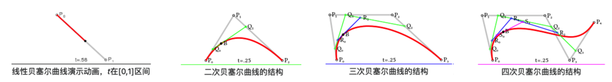

几何的表达分为显式几何和隐式几何。隐式几何是指不告诉你点在哪，而描述点满足的关系；显式几何是指直接给出所有的点来表示。

# Geometry

目前来说，点、线、面、体是所需要在计算机中表达的几何物体。在表达中所需要的工具就是坐标系统，二维或者三维的坐标，或者更深入的用齐次坐标表达三维物体。

## Lines and Curves

### Implicit

> [!info] 隐式表达
> 隐式表达（或称为隐式方程）是指某些数学对象或曲线的方程形式，其中不明确地表示出变量与它们的关系，而是通过等式来描述它们的性质。

直线的隐式表达，

$$y = mx + b$$
对于任意的 $x$ ，都能通过方程找到与之对应的 $y$ 。

二维的隐式曲线方程可以使用一个函数映射描述，
$$
f(x,y)=0
$$

三维二次曲线，

$$
Ax^2 + Bxy + Cy^2 + Dx + Ey + F = 0
$$

### Parametric

若直线穿过一点 $a=(x_0, y_0)$ 点，且方向向量为 $u=(u_x, u_y)$ ，则有，
$$
\begin{alignedat}{5}
	x&&\;=\;&&x_{0}&&\;+\;&&u_{x}\lambda &\\
	y&&\;=\;&&y_{0}&&\;+\;&&u_{y}\lambda 
\end{alignedat}
$$
或者说，一条直线穿过两个点 $a = (x_a, y_a)$ ， $b = (x_b, y_b)$ ，则有，
$$
\begin{alignedat}{5}
	x&&\;=\;&&x_{a}&&\;+\;&&(x_b - x_a)\lambda &\\
	y&&\;=\;&&y_{a}&&\;+\;&&(y_b - y_a)\lambda 
\end{alignedat}
$$

其中，参数为 $\lambda$ 。当改变 $\lambda$ 的值时，会得到直线上不同的点。上述参数化表示可以扩展到3维空间，即：
$$
\begin{alignedat}{5}
	x&&\;=\;&&x_{0}&&\;+\;&&u_{x}\lambda &\\
	y&&\;=\;&&y_{0}&&\;+\;&&u_{y}\lambda &\\
	z&&\;=\;&&z_{0}&&\;+\;&&u_{z}\lambda 
\end{alignedat}
$$

所以参数方程所需要的直线的全部信息可以是：
- 两个点
- 或一个点，一个方向向量

向量化的表达方式即为，
$$
{\displaystyle \mathbf {r} =\mathbf {a} +\lambda \mathbf {u} }
$$
其中，$\lambda$ 为任意实数。

> 在几何学中，参数化（parametrization）是找到由参数方程定义的曲线、曲面或更一般地流形或蔟簇的参数方程的过程。逆过程称为隐式化，“参数化”本身意味着“用参数来表达”。
> 
> 参数化是一个数学过程，包括将系统、过程或模型的状态表示为一些称为参数的独立量的函数。 系统的状态通常由一组有限的坐标确定，因此参数化由每个坐标的几个实变量的一个函数组成。 参数的数量是系统的自由度的数量。

### Bezier Curves

贝塞尔曲线（Bezier Curves）完全由其控制点决定其形状,　$n$ 个控制点对应着 $n-1$ 阶的贝塞尔曲线，并且可以通过递归的方式来绘制。

一般的，数学化表达是：

$$
\mathbf{B}(t) = \sum^n_{i = 0} \left(\begin{array}{c} n \\ i \end{array} \right) \mathbf{P}_i(1 - t)^{n - i}t^i \qquad t \in [0,1].
$$
可使用 **de Casteljau Algorithm** 计算出贝塞尔曲线：整体思想就是递归。

## Planes and Surfaces

### Implicit

$$
f(x,y,z)=0
$$

Planes 平面方程，
$$
(\mathbf {p} - \mathbf {a}) \cdot \mathbf {n} = 0
$$

### Parametric

### Bezier Surfaces

首先我们有一个 n 阶的贝塞尔曲线，然后我们给它复制 m+1 份，那么在每个贝塞尔曲线的 t1 位置，我们可以得到 m+1 个曲线上的点。我们再把这些点作为控制点，可以得到一个 m 阶的贝塞尔曲线，而这个贝塞尔曲线就是最终**贝塞尔曲面**（Bezier Surfaces）上的一条线，因此该曲线 t2 位置上的点就是贝塞尔曲面上的点。其中 t1 和 t2 通常会使用 u 和 v 来代替，它们的取值范围自然都是0到1，那么对应贝塞尔曲面上的任意一点，我们就可以用 P(u,v) 来表示。

$$
P(u,v) = \sum^m_{i = 0}\sum^n_{j = 0}P_{ij}B^n_j(u)B^m_i(v)
$$

# Mesh Operations

网格处理，根据实际情况的需要不同，可以分为如下几个部分：网格细分（Mesh Subdivision）、网格简化（Mesh Simplification）、网格正则化（Mesh Regularization）。

- **网格细分（Mesh Subdivision）**：属于一种过采样方式（upsampling），通过增加三角形的数量，使要表示的曲面更加光滑。问题的关键点在于找到划分点，调整位置。
  常用的算法有：
	- Loop Subdivision
	- Catmull-Clark Subdivision
- **网格简化（Mesh Simplification）**：属于降采样方式（downsampling），有一个物体的网格非常复杂，但它其实离得很远，我们不需要这么复杂的网格，就用少一点的网格数量，去掉一些边和三角形，但仍然要维持它们之间的相互关系。问题的关键点在于**边坍缩（edge collapsing）**，要量化每次坍缩后的误差。
- **网格正则化（Mesh Regularization）**：如果三角形有大有小有细长，会对渲染造成不便，通常对于这种情况，会对模型做正则化，就是让这些面变得更像正三角形。

