*Visibility determination* for ***ray tracing*** can be described with double for-loops：
```C++
for (P in pixels)
	for (T in triangles)
		determine if ray through P hits T
```

[Ray Tracing](../Ray%20Tracing/Ray%20Tracing.md) 和光栅化是两种不同的成像方式。光栅化最大的问题是不能很好的解决全局效果，对于 Soft Shadows（软阴影）、Glossy Reflection （光泽反射）还有 Indirect illumination（间接光照）也没有很好的解决。
光栅化是一种快速近似，但是质量比较低的算法。光栅化可以做到实时，光线追踪只能离线计算。

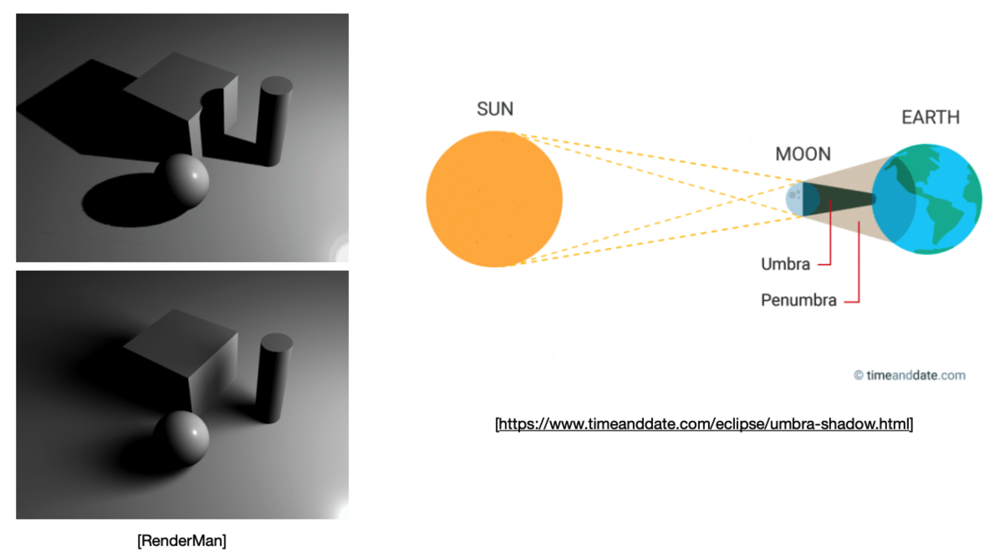

**光线追踪基本思路**：因为光路是可逆的，那么就让光线从眼睛出发，沿屏幕每个像素投射出去，判断与场景物体的交点，然后计算该交点的受光照情况。形成一个屏幕图像就需要投射出屏幕分辨率个光线出去，这种计算量无疑是巨大的，但是图像质量极高。

光线追踪，在介绍之前，首先将针对光栅化过程中遇到的一些问题，比如涉及到全局光线传输，包括阴影都是光栅化不太好做的事情，讲一下光栅化中如何生成阴影。

## Shadows Mapping

阴影，图像场景算法，不需要知道场景的几何信息。主要思想：如果点不在阴影里，你又能看到点，说明你可以从摄像机看到这个点，并且光源也可以看到这个点。

分两步：
- 从光源看场景，记录深度
- 从相机出发，渲染场景，渲染出的不同的点都重新投影回光源，就知道在之前深度图的哪个像素去寻找这个点，再比较之前记录的深度和当前看到的这个点是否一致。

shadow mapping的缺点：
- 只能做硬阴影，边缘比较锐利。
- shadow mapping 分辨率太低会走样

**硬阴影**：阴影的边缘非常锐利，因为对于点光源来说，物体上任何一个点，要么可见，要么不可见。
**软阴影**：阴影会从有阴影慢慢过渡无阴影，不再是非0即1。越靠近物体根部越硬，离物体根部越远越虚。阴影程度取决于你可以看到多少（大）的光源，同时说明点光源是无法产生软阴影的，因为软阴影的产生是因为光源有一定的大小。


## Whitted-Style Ray Tracing


**光线性质**：
- 光线是沿着直线传播的
- 光线和光线不会发生碰撞
- 光路的可逆性

经典光线追踪方法、递归式光线追踪（Recursive Ray Tracing）方法，或 Whitted-style 光线追踪方法：
- 从视点向成像平面上的每一个像素都进行一次光线投射。
- 光线的每次投射都需要判断与物体的交点，而且投射到交点后还可能产生反射、折射，那么就往相应的方向继续进行新的投射，直到投射在漫反射表面（diffuse surface）上。
- 最后，将每个交点的受光照情况（使用Blinn Phong算法）以一定权重综合起来，得到的颜色即是该像素的颜色。
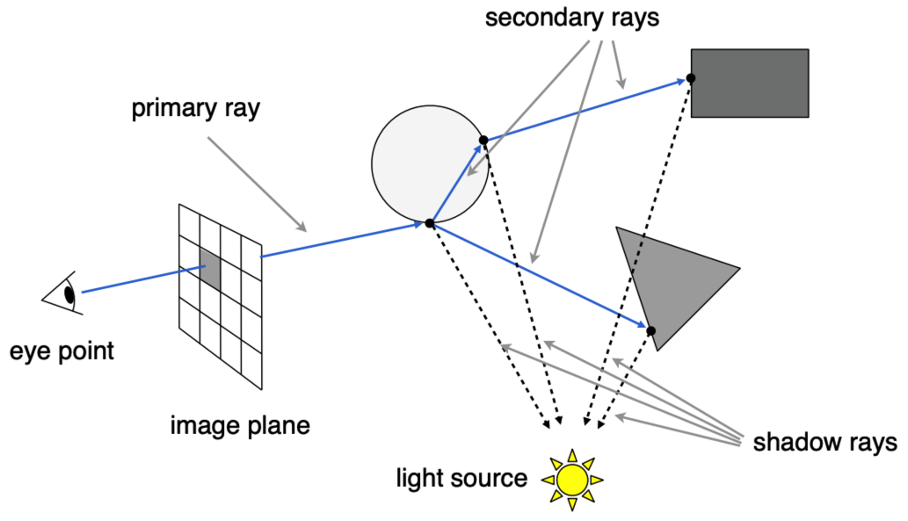
**注意**：
- 为了减少递归次数，可以额外给予一定的递归终止条件（如允许的最大反射或折射次数为10）。
- 光线在每次反射和折射之后都有能量损耗的（由系数决定），因此经过多次投射后的光线贡献的能量就越小。
- 如果投射光线没有碰撞到物体，一般直接返回一个背景色。
- 漫反射表面（diffuse surface）是粗糙的表面，可以认为它会向各个方向等强度地反射光，因此光线投射到该表面时，本应该会有无数条光线反射出去，但是为了减少计算量，Whitted-Style 则直接对该交点进行 Blinn Phong 着色后就终止递归。

Whitted-Style Ray Tracing涉及到了很多的技术问题，比如：如何求光线和物体表面的交点，以及怎么样加速求交的运算。

#### Ray-Surface Intersections

光线与物体求交点是光线追踪第一步，一般性的，用三角形网格描述物体，问题转化成和光线和三角形求交。

首先应该定义**光线方程**（Ray Equation）：

$$
\mathbf{r}(t) = \mathbf{o} + t\mathbf{d} \qquad 0 \leq t < \inf
$$
其中，$\mathbf{o}$ 表示光源所在位置，$\mathbf{d}$ 是光源的方向，$t$ 表示时间。

那么光源与物体表面的相交就可以通过与表面方程联立求的：
- 球体，类球体等可以用数学方程表达的表面；
- 用三角形网格表达的表面。

判断一个点是否在三角形内，快速的做法是**Möller Trumbore Algorithm**：光线上的一个点，这个点要在三角形内，那就可以用**重心坐标**来描述，可以看到右边，只要P0、P1、P2线性组合的系数之和等于1，那这个点就在这个三角形所在的平面上：
$$
\vec{O} + t\vec{D} = (1 - b_1 - b_2)\vec{P_0} + b_1\vec{P_1} + b_2\vec{P_2}
$$
然后求解线性方程组。


#### Accelerating Ray-Surface Intersection

使用光线和Bounding Volumes求交来加速求交过程，为方便计算，使用光线和Axis-Aligned Bounding Box（AABB）求交。我们一般认为计算光线与AABB相交非常快，但是计算光线与物体相交非常慢。


##### Uniform Grids

Uniform Grids (均匀划分)，把空间均匀划分成若干相等大小的格子，记录每个格子内是否存在物体表面，然后光线穿过场景，判断沿途的格子是否存在物体表面：若存在，判断是否与物体表面相交；若不存在，则继续穿过场景。

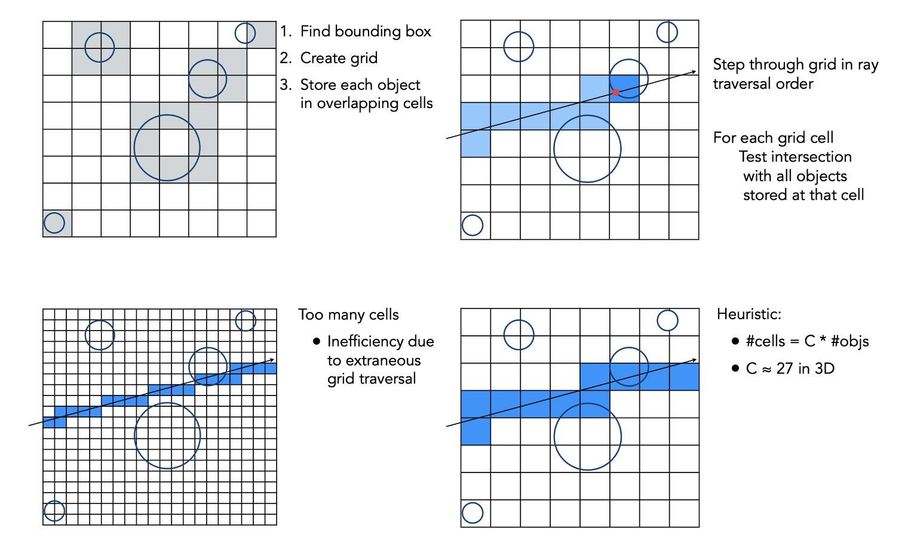

**存在问题**：
- 按照什么粒度划分，太大太小都不行。
- 如何处理物体分布不均匀的场景。

##### Spatial Partitions

空间划分，使用KD-Tree。在做光线追踪之前，需要把加速结构建立：
- 分割平面沿轴分割
- 二叉树形状
- 所有的物体，存储在叶子节点上

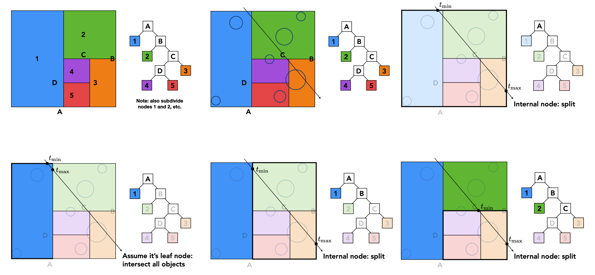

光线穿过空间，依次和每一层节点求交，若和某个节点不相交，那么光线就不会和以这个节点为根节点的子树上的所有节点相交；如果和某个节点相交，那么就需要继续判断是否和其左右子节点相交，直到遍历到叶子节点和光线相交，进而判断叶子节点里的物体和光线是否相交即可。

##### Object Partitions

Bounding Volume Hierarchy （BVH），在图形学中得到了非常广泛的应用，不管是实时的光线追踪，还是离线的结构。

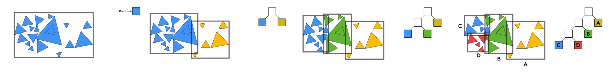

BVH是按照物体进行分割的，尽可能是一个物体不被多个AABB包围，方法如下：
- 找到一个包围核
- 按照某种方法，把包围核内的物体分成两个部分
- 两个部分重新计算包围核
- 然后按照kd-tree的思想，按照不同维度循环二分递归，直到满足中止条件（物体数量足够小）
- 把物体存在每个叶子节点上，其他的节点均用来加速判断


## Basic Radiometry

辐射度量学，是为了更好的描述光线的各种属性。

辐射度量学是一个精准的给我们一系列物理量的方法。将光精确的定义出来，包括物体表面如何与光进行作用精确的描述出来，并且涉及到光源、材质、光线传播方法精确的做出来，才能得到最正确的结果。

- 辐射能(Radiant Energy)，符号Q，表示光穿过一个平面的光能。
- 辐射通量(Radiant Flux(Power))，符号Φ，表示单位时间内光穿过一个截面的光能。
- 辐射强度(Radiant Intensity)，又叫光强度，符号I，表示单位立体角上的辐射通量。
- 辐射率(Radiance)，又叫光亮度，符号L，表示单位立体角、单位投影面积上的辐射通量。
- 辐照度(Irradiance )，符号E，表示单位面积上的辐射通量。

## Light Transport

光线传播，某一点的亮度是物体表面外半球的入射、反射总和。

**BRDF**

BRDF(Bidirectional Reflectance Distribution Function)，译作双向反射分布函数，是一个用来描述物体表面如何反射光线的方程，表示了当给定一条入射光的时候，某一条特定的出射光线的性质是怎么样的。它的精确定义是出射光辐射率(Radiance)的微分和入射光辐照度(Irradiance)的微分之比。


**The Reflection Equation**：
$$
L_r(p, w_r) = \int_{\Omega^+}f_r(w_i \rightarrow w_r)L_i(p, w_i)\cos \theta_i \mathrm{d}w_i
$$
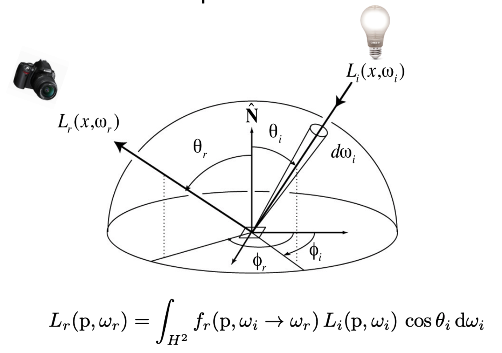

**The Rendering Equation**：
$$
L_o(p, w_o) = L_e(p, w_o) + \int_{\Omega^+}L_i(p, w_i)f_r(p, w_i, w_o)(n \cdot w_i)\mathrm{d}w_i
$$
渲染方程是一个描述光能在场景中流转的方程，它基于能量守恒定律，在理论上给出了一个完美的光能求解结果。

其含义是：在某个视点看向特定的位置 $x$，看到的出射光亮度（辐射率) $L_o$ 等于 $x$ 点的自发光亮度$L_e$（辐射率）以及该点的反射光亮度之和。


#### Physically Based Rendering

基于物理的渲染（Physically Based Rendering，PBR）是指使用基于物理的原理和微平面理论建模的着色/光照模型，以及使用从现实中测量的表面参数来准确表示真实世界材质的渲染理念，是实时渲染中一个非常重要的概念。

## Global illumination

全局光照就是直接光照+间接光照。光线弹射1次得到的叫直接光照，光线弹射2次及以上就叫间接光照。


## Path Tracing

由于光追没有考虑漫反射物体的随机反射，而是直接计算着色，停止反射了。但实际上漫反射物体也会向各个方向反射光线，所以引出了路径追踪。


Whitted-style光线追踪存在两个问题：
- 当一条光线打到specular的物体上（也就是像玻璃这些光滑的物体），它会沿着镜面方向反射，或者沿着折射方向折射
- 当这条光线打到diffuse（漫反射）的物体上，这条光线就停了

上面两个总结不一定是对的，如下面这两个模型，应用Whitted-style光线追踪模型，就是不对的：
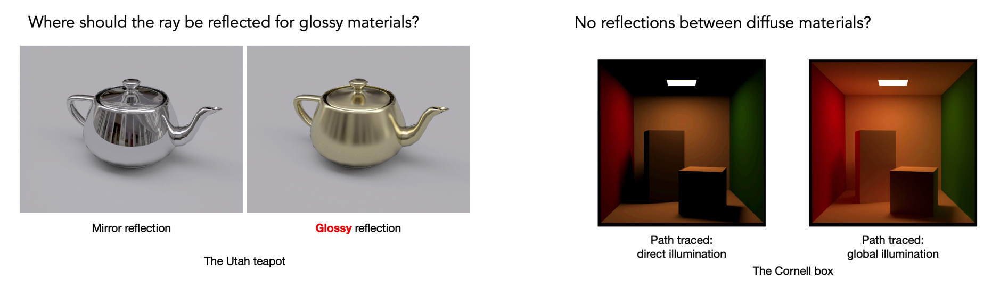


路径追踪（Path Tracing），是目前最主流的光线追踪算法；相较于 Whitted-Style Ray Tracing 算法，Path Tracing 认为光的传播是以能量的形式向各个方向进行辐射（符合基于物理的渲染），这和渲染方程（Rendering Equation）是一致的：

$$
L_o(p, w_o) = L_e(p, w_o) + \int_{\Omega^+}L_i(p, w_i)f_r(p, w_i, w_o)(n \cdot w_i)\mathrm{d}w_i
$$

虽然渲染方程简单优雅，但解方程的过程过于复杂，这里引入三个概念将简化这个方程的计算：
蒙特卡洛方法（Monte Carlo Solution）,  俄罗斯轮盘赌（Russian Roulette，RR）, 光源采样（Sampling the Light）。


**蒙特卡洛积分（Monte Carlo Intergration）**：用一个随机的采样的方法。随意取一个点，对应f(x)为高，a→b为宽，（假设为长方形）来近似线下的面积，重复多次采样，最后平均起来长方形的面积。


#### Monte Carlo Solution

蒙特卡洛方法可以通过随机采样的方式求解数学问题，对于求解定积分问题，可以通过蒙特卡洛方法估计出一个近似数值解。

$$
L_o(p, w_o) \approx \frac{1}{N} \sum^N_{i = 1} \frac{L_i(p, w_i)f_r(p,w_i,w_o)(n \cdot w_i)}{pdf(w_i)}
$$

我们把积分变量看成连续型随机变量，每次采样，就用采样所得变量映射得到的函数值，代表所有积分区间内所有变量对应的函数值，多次采样逐渐逼近真实函数的在积分域内所得积分值。

**路径追踪**的算法描述，就是：

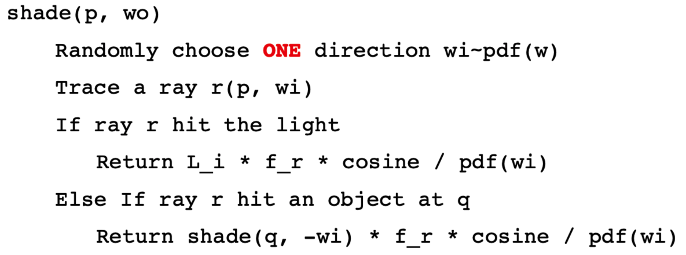

**存在问题**：
- 原本的计算方式会造成指数爆炸，这种方式是简化近似的；
- 递归形式，永远不会停止。

**光线生成**的算法描述：

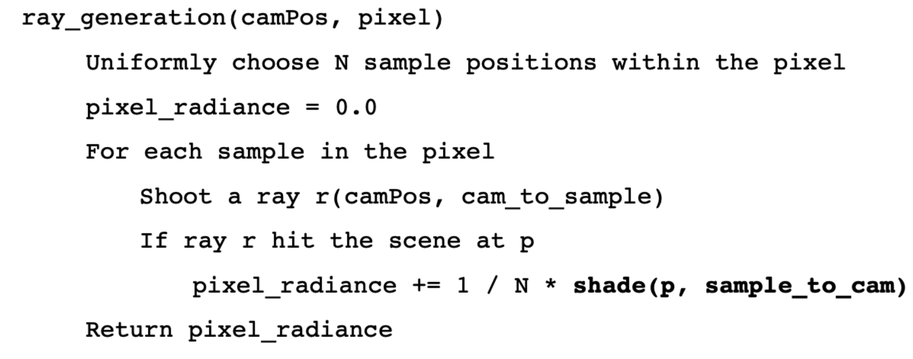


#### Russian Roulette

间接光源的能量判定仍然需要通过不断递归才能确定，但是蒙特卡洛积分没有终止条件。

俄罗斯轮盘赌，假如一个 shading 函数理应输出为 $L_r$，现在给 shading 函数设置一定概率 $P$ 输出能量 $L_r/P$ ，概率 $1−P$ 输出能量 0，这种情况下：函数的输出期望值 $E$ 与理应输出 $L_r$ 相等，也就是说那么只要样本数足够多，这种 shading 将会是能量守恒（无丢失能量）：
$$
E = P \cdot (\frac{L_r}{P}) + (1 - P) \cdot 0 = L_r
$$
对应的算法描述，可以实现为：

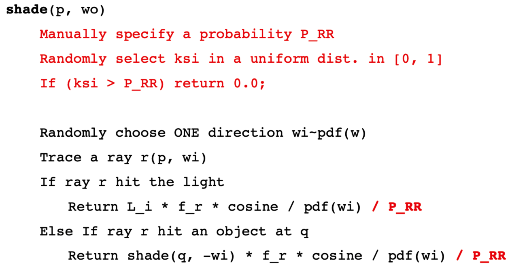


#### Sampling the Light

Path Tracing 里直接光照部分有一个效率问题：ray 打在光源上的概率往往极低（因为光源面积一般都很小），很容易造成大量的递归运算最终都浪费掉（还没见到光源就因为俄罗斯赌盘的思想被提前终止了）。

于是转换了采样思路，从对半球上的采样转变成对光源面上的采样。

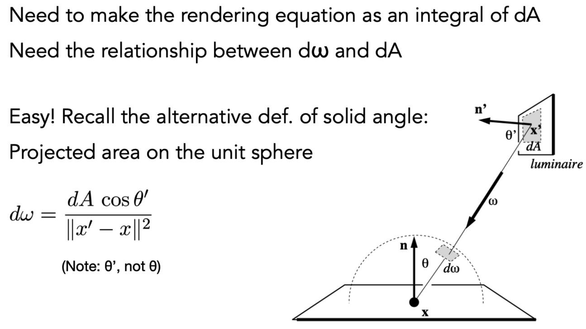

用数学化表达就是：

$$\begin{aligned}
L_o(p, w_o) &= \int_{\Omega^+}L_i(p, w_i)f_r(p, w_i, w_o)\cos \theta \mathrm{d}w_i\\
&= \int_{A}L_i(p, w_i)f_r(p, w_i, w_o) \frac{\cos \theta \cos \theta'}{\|x' - x\|^2}  \mathrm{d}A
\end{aligned}$$
此时的 $pdf = 1/A$ ，伪代码描述就是：

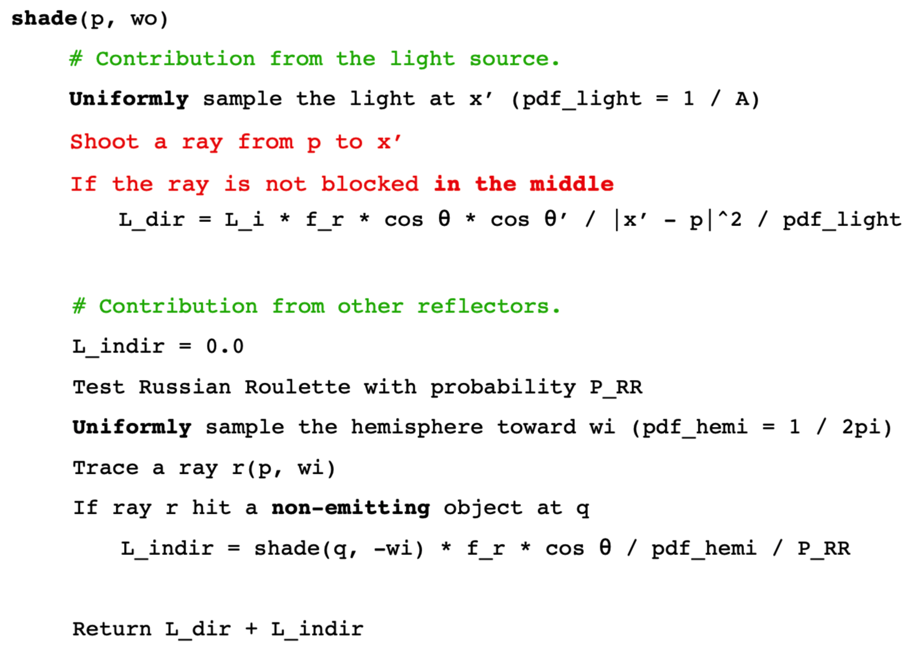

点光源很不好处理，所以真的需要点光源的场景可以做成一个很小的面光源。


## Conclusion

1. 以前的光线追踪，基本都是指Whitted-style 的光线追踪，但它不一定对；
2. 现在的光线追踪，就是各种前沿方法的集合（light transport，（unidirectional & bidirectional）path tracing，photon mapping，metropolis light transport，VCM / UPBP）；
3. 路径追踪代码写对，不容易；但是**路径追踪是几乎100%正确的算法**！