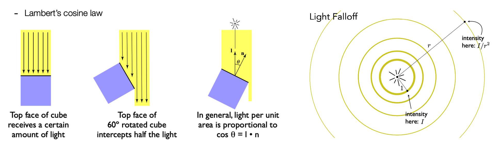
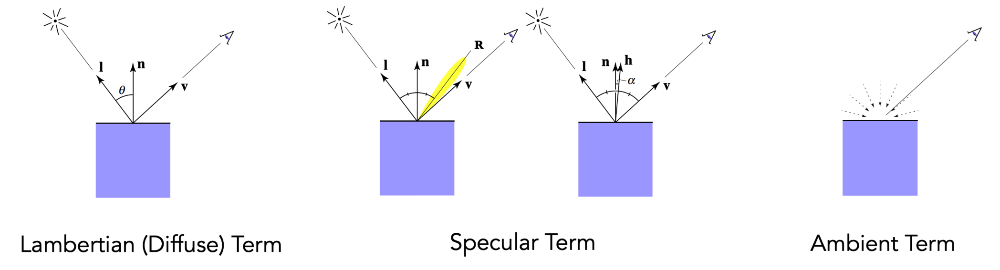
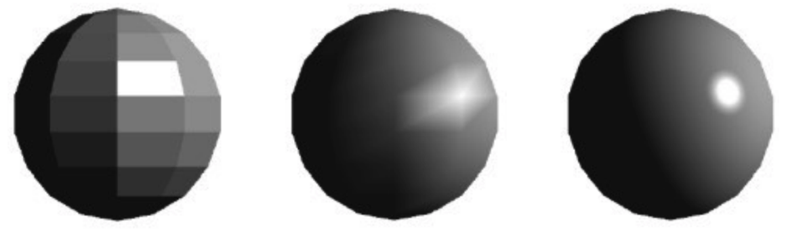
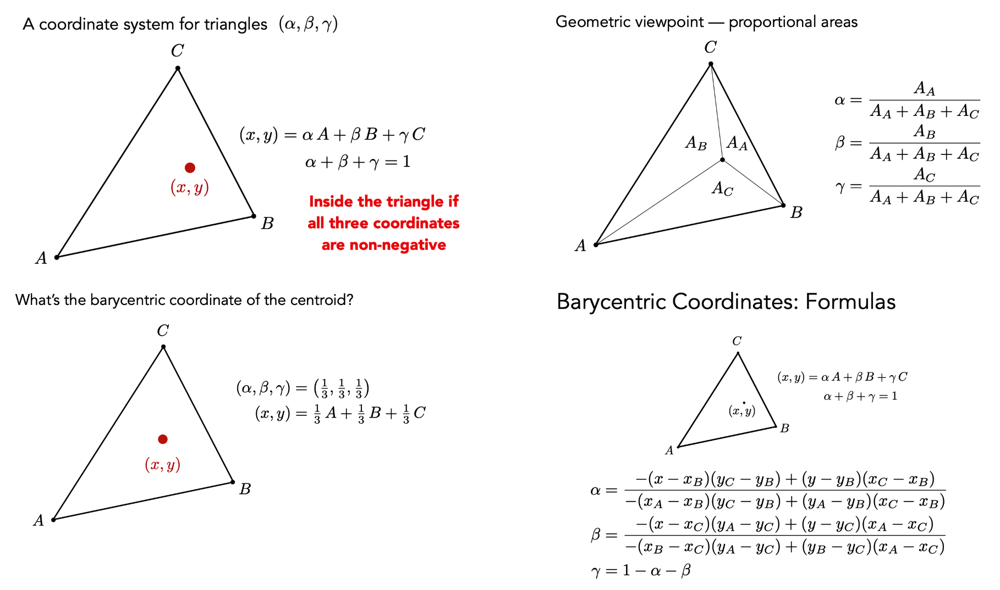
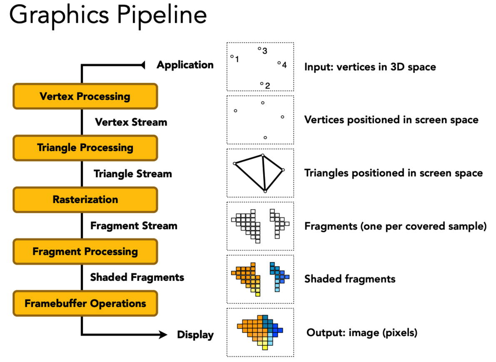
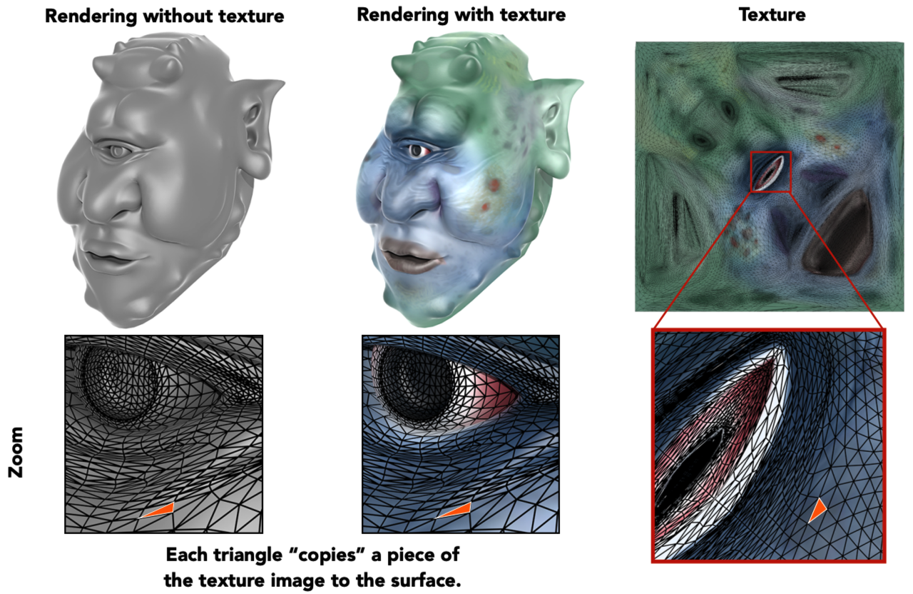
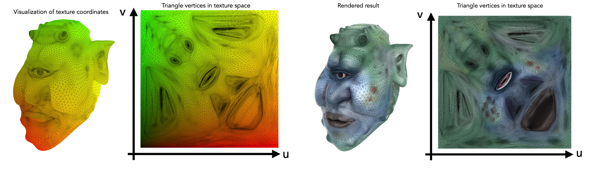

在图形学中，着色（shading）是对不同的物体应用不同的材质的过程。Shading的字面理解就是阴影，遮挡的意思，可能直接翻译成这个会更好理解一些，但是考虑到实际物体是有颜色之类的，翻译成着色也不无道理。

一个光源，分成 Specular highlights（高光）、Diffuse reflection（漫反射）、Ambient lighting（环境光）这三个部分。

# Basic Model

**最基础的着色模型——（Blinn-Phong Reflectance Model）**：

考虑任何光照是考虑在一个点上，我们把这个点叫shading point，虽然这个点可能在任何的物体表面上（可能是曲面），但我们认为在一个局部比较小的范围它永远是一个平面，在这个平面我们可以：
- 定义平面的法线 $\vec{n}$ ；
- 规定观测方向 $\vec{v}$；
- 规定光照方向 $\vec{l}$ ；（注意这些都是单位向量）
- shading point 和物体表面相关的属性（color, shininess, …）

Phong 氏光照模型其实是经验模型，参数信息是通过经验得到的。Phong 模型将物体光照分为三个部分进行计算，分别是：漫反射分量、镜面高光和环境光。Phong 模型在处理高光时会出现光照不连续的情况，当光源和视点位于同一个方向时，反射光线跟观察方向可能大于90度，反射光线的分量就被消除了，所以出现高光不连续的现象。

Blinn-Phong 光照模型是对 Phong 氏光照模型的改进，Blinn-Phong 模型在处理镜面反射时不使用观察方向和反射光线的夹角来计算，而是引入了一个新的向量：半角向量（Halfway vector）。Blinn-Phong 求高光亮度的时候使用半角向量和法向量的点积来决定高光亮度，Phong 是用反射光线和视线向量的点积来求高光亮度。

一个着色模型，所考虑的光线可分为三个部分：高光（Specular Highlights）、漫反射（Diffuse Reflection）、环境光照（Ambient Lighting）。

所以最终光照的表示应该分为三个部分的总和，**Blinn-Phong Reflection Model（Blinn-Phong反射模型）公式**：

$$
L = L_a + L_d + L_s 
$$

有两个理论非常重要：


## Diffuse Term

考虑到**漫反射系数** $k_d$，即：对于这个点本身来说，它为什么会有颜色，因为这个点会吸收一部分的颜色（能量），再反射出去它不吸收的能量，那不同的点有不同的吸收率，那得到的结果就会产生不同的颜色，特别是对不同波长产生的颜色，我们用 $k_d$ 这个系数来表示（这个系数为1，表示这个点完全不吸收能量，为0，就表示所有能量都被吸收了）。

可得漫反射项：
$$
L_d = k_d(I/r^2)\max(0, \vec{n} \cdot \vec{l})
$$
漫反射和观察方向 $\vec{v}$ 无关，打在一个点上的漫反射光会均匀的分布在各个方向上，就意味着我不管从那个方向观测这个点，看到的结果都是一样的。

### 实现

#### Fragment Shader

计算漫反射光照，
```c
vec3 norm = normalize(Normal);
vec3 lightDir = normalize(lightPos - FragPos);

float diff = max(dot(norm, lightDir), 0.0);
vec3 diffuse = diff * lightColor;
```


## Specular Term

镜面反射，即高光，发生在物体的平面比较光滑的情况，比较光滑的物体它的反射都有一个特性，它反射的方向都非常接近镜面反射的方向 $\mathbf{R}$ ，也就是说沿着反射方向 $\mathbf{R}$ 有一个分布。

当观察方向 $\vec{v}$ 和镜面反射方向 $\mathbf{R}$ 接近的时候，实际上意味着法线方向 $\vec{n}$ 和半程向量 $\vec{h}$ 很接近（高光系数 $k_s$ 表示高光的亮度一般认为是白色的）。

可得高光项：

$$
\vec{h} = \mathrm{bisector}(\vec{v}, \vec{l}) = \frac{\vec{v} + \vec{l}}{\|\vec{v} + \vec{l} \|}
$$
$$
L_s = k_s(I/r^2)\max(0, \vec{n} \cdot \vec{h})^p
$$

**指数** $p$ ：向量之间的夹角确实可以体现两个方向之间是不是足够接近，但是它的容忍度太高了。如果直接用夹角余弦去生成高光的话会看到一个超级大的高光，就不太合理，所以我们想让这两个方向只要离得远一点就不算它在高光里了，所以在夹角余弦上加上若干个指数。$p$ 越大，高光部分越小。

在 Blinn-Phong 中指数的范围一般会用到100到200。


### 实现


#### Fragment Shader

计算 Phong 氏镜面光照，
```c
vec3 norm = normalize(Normal);
vec3 lightDir = normalize(lightPos - FragPos);
vec3 viewDir = normalize(viewPos - FragPos);
vec3 reflectDir = reflect(-lightDir, norm);

float spec = pow(max(dot(viewDir, reflectDir), 0.0), 32);

float specularStrength = 0.5;
vec3 specular = specularStrength * spec * lightColor;
```

计算 Blinn-Phong 氏镜面光照，
```c
vec3 norm = normalize(Normal);
vec3 lightDir = normalize(lightPos - FragPos);
vec3 viewDir = normalize(viewPos - FragPos);

vec3 halfwayDir = normalize(lightDir + viewDir); 
float spec = pow(max(dot(normal, halfwayDir), 0.0), 32.0);

float specularStrength = 0.5;
vec3 specular = specularStrength * spec * lightColor;
```


## Ambient Term

有些地方不可能直接被光源照亮，但却不是完全黑暗的，因为有很多光线可以弹射很多次，从四面八方打到任何一个其他的点上，所以位于光线背面的点也可以接收到来自环境的光。

环境光和 $\vec{l}$、$\vec{n}$、$\vec{v}$ 都没有关系，所以它实际上是一个常数，保证了没有地方完全是黑的，把所有其他的项都加起来提升一个亮度。

简化了模型，可得环境光项：
$$
L_a = k_aI_a
$$





综上所述，**Blinn-Phong Reflection Model（Blinn-Phong反射模型）公式**：

$$
L = L_a + L_d + L_s 
	= k_aI_a + k_d(I/r^2)\max(0, \vec{n} \cdot \vec{l}) + k_s(I/r^2)\max(0, \vec{n} \cdot \vec{h})^p
$$

对所有的点做一遍着色操作，整个场景就能看得见了。

### 实现


#### Fragment Shader

计算环境光照，
```c
float ambientStrength = 0.1;
vec3 ambient = ambientStrength * lightColor;
```


# Shading Frequencies

着色频率，这三个球有完全相同的几何形状，为什么着色后的结果各不相同呢？这就涉及到着色频率，就是着色应用在哪些点上。


有三种着色的方式：
- Flat Shading：应用在表面，逐面着色；
- Gouraud Shading：逐顶点，在每一个顶点进行光照计算，然后会在渲染图元内部进行**线性插值**，最后输出成像素着色；
- Phong Shading：逐像素，逐像素的渲染方式是对**顶点法线**进行插值。

当粒度比较大时，三种着色频率看起来差别比较大。但是随着粒度逐渐变小，这三种方式的差别就逐渐缩小，到最后的显式效果基本一致了。

**难点**：面、点和像素，在进行着色计算时，首先需要得到法线。
- 对于表面法线，比较好得到；
- 对于顶点法线，任何一个顶点都会和很多个不同的三角形有所关联，那就可以认为这个顶点的法线是相邻面的法线的均值（根据相邻三角形面积的不同进行加权平均，效果会更好）；
- 对于像素，可以用**重心坐标**进行计算。

## Barycentric Coordinates

重心坐标（Barycentric Coordinates）是为了在三角形内做**插值**。

**什么是插值？为什么要做插值？**

插值是一种通过已知的、离散的数据点，在范围内推求新数据点的过程或方法。在图形学中，有很多操作是在三角形的顶点上完成或计算的，我们希望在三角形内部得到一个平滑的过渡，所以当知道顶点的属性的时候，我希望在三角形内部的任何一个点得到一个值，并且是一个顶点到一个顶点平滑的过渡，我就需要插值。

利用重心坐标，就可以数学化表达插值：

首先，在三角形所在平面的任意一个点 $(x, y)$ 都可以用三顶点 $(\alpha, \beta, \gamma)$ 的线性组合来表示，如果在三角形内部，那么系数非负。重心坐标就是三个系数相等，均为 $\frac{1}{3}$ 时的坐标$(x', y')$。

重心坐标不能保证投影后不变，所以三维的要在三维中找到重心坐标后再做插值，而不能投影后做插值。

**应用**：可以将此方法应用在位置（Positions），纹理坐标（Texture Coordinates），颜色（Colors），法线（Normal Vectors），深度（Depth）等等


# Graphics Pipeline

渲染管线，指的是一系列操作的流程，这个流程具体来说就是将一堆具有三维几何信息的数据点最终转换到二维屏幕空间的像素。


分为如下几个步骤：

- 顶点处理（Vertex Processing）：将世界坐标系下未超出观察空间的顶点进行MVP变化，最终得到投影到二维平面的坐标信息（同时为了Zbuffer保留深度z值）。
- 三角形处理（Triangle Processing）：将复杂的几何图形划分为一个个三角形，更便于后续的处理。
- 光栅化（Rasterization）：光栅化此时做的工作只是确定哪些在三角形内的点可以被显示。
- 片元处理（Fragment Processing）：片元处理是真正给像素点上色的环节，考虑的因素也较多：深度值、着色频率、抗锯齿方法、纹理映射（纹理可代替用光照模型所得到的颜色信息）等等。
- 帧缓存（Framebuffer Operation）：Framebuffer的处理，就是将所有的像素颜色信息整合在一起，输送给显示设备加以显示。

这也就完成了整个图形渲染管线了。其中Vertex Processing以及Fragment Processing属于可编程管线，**只是指代我们选择在哪个着色器阶段计算光照模型**而已。


简单来说就是，顶点、光栅化、着色三步。


# Texture Mapping

**任何3D物体的表面都是2D的，所以纹理就是一张图**。纹理映射：把这张图蒙在一个3D物体上。



纹理映射，我们看到球上面不同的位置有不同的颜色，这些不同颜色地方，共用同一个着色模型，只是它们本身的漫反射系数kd发生了改变，也就是我们希望有一种方法能够定义，对于一个物体它上面的任何一个点它们的属性。

纹理映射的根本作用：**定义任何一个点的不同属性**。 

## Texture Coordinates

为了数学化表示纹理映射，首先应该建立纹理坐标（Texture Coordinates）。纹理坐标，或者说uv坐标，是一个二维坐标，其中 $u$、$v$ 的范围都是 $(0, 1)$ 。

红色表示在 $u$ 方向很大，绿色表示在 $v$ 方向上很大，整个这张图就形成了不同的颜色，那不同的颜色就表示不同的 $uv$，也就是纹理上的不同坐标。

有些纹理可以不断的重复，如何使纹理**无缝衔接**也是一门学问。


## Applying Textures

对于地板来说也是如此，它在任何一个地方有自己的漫反射系数，这个漫反射系数就反映在木头的纹路上，也就是说我们希望在物体的不同位置定义不同的属性，这就是引入纹理映射的一个基本的思路，倒不是说我们完全要使用纹理映射来定义漫反射系数，它可以定义任何各种各样的东西。

- 纹理太小：
	- 双线性插值
	- 双向三次插值
- 纹理太大
	- 超采样（MSAA）
	- 不采样（Mipmap）

