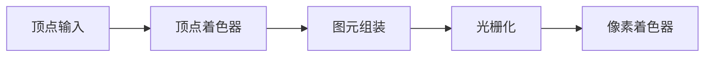

绝大部分游戏都是需要绘制的，理论上是**需要做到实时绘制**（Realtime - 30 FPS）。

## Challenges

1. **挑战一**：**游戏的画面是十分复杂的**，一帧画面可能会出现成千上万个游戏对象。
2. **挑战二**：**需要深度适配当代的硬件（不同的电脑配置）**
3. **挑战三**：**追求稳定的帧率，面对大场景和小场景，高分辨率低分辨率，都能有同样的帧率**，因此绘制算法要在一个固定的时间里面。同样，也**追求尽可能高的帧率**，给的时间越来越小，要求越来越高。
4. **挑战四**：**CPU 带宽限制，一般只能吃掉 $10\%$ ~ $20\%$，剩下的都是给到 Gameplay 系统**。
## Outline of Rendering


游戏引擎并不只是渲染引擎，但是渲染是游戏中的一个重要环节。游戏引擎中的渲染和计算机图形学的渲染侧重点是不同的：
1. **计算机图形学中的渲染**：
	- 为了明确的**解决某单一问题**，比如透明物体或者是水面等明确的需求
	- **关注算法或数学上的正确性**，并不关注硬件如何实现。
		- 比如辐射度算法是一个通过模拟光学理论得到的模型，计算机需要计算几天才能得到一帧漂亮结果。
	- **没有性能的要求**，图形学中 30 帧即为 Real-Time，10 帧为 interactive。
2. **游戏引擎中的渲染**：
	- **游戏场景复杂**，需要对庞大数目的物体进行渲染，物体种类繁多，且融合了大量渲染效果，复杂度很高，比如游戏中我们需要渲染水体，角色，植被，云彩等等，我们需要运用不同的图形学算法对其物体进行渲染，以及光照运算和各种后处理，游戏引擎的渲染模块中需要包含这么多东西，是一个 all in one 的组合。
	- 游戏需要面对硬件处理问题，因此**需要深度去适配当代硬件**
	- 游戏在不同场景和不同质量的显示器硬件上运行需要有稳定的帧率，即场景切换时仍**要求保证稳定帧率**，即使显示器等硬件质量的不断提升，也需要在其上拥有稳定的帧率
	- **实时性要求高**，游戏 CPU 端仅有 10%-20% 分配给了渲染，剩下的分配给 GamePlay 系统。


### Basics of Game Rendering

#### 绘制流程

现代游戏渲染是通过 CPU + GPU 合作处理模式，CPU 准备好数据渲染数据后将其提交到 GPU，GPU 设置好渲染状态后开始处理 CPU 所提交的数据。


#### 渲染中的计算


1. **投影和光栅化**：主要是关于矩阵的计算
	- 透视投影
	- 正交投影
	- 屏幕空间的三角形离散成一系列像素

2. **着色计算**
	- 常量访问，比如需要知道屏幕的长宽，像素个数，需要访问常数
	- 数学计算（加减乘除），比如 Blinn-Phong 模型需要知道法线，光线，眼睛，并计算光有衰减百分比
	- 纹理采样

3. **纹理采样**：
	- 纹理采样其实是渲染过程中非常复杂/昂贵的一个环节，假设我们现在在 3D 空间内有一个砖墙，当我们离砖墙十分近时，可以看到其上面的一个个像素；但当我们离墙十分远时，我们在屏幕空间上的一个像素，可能包含了砖墙上的很多像素。


#### 计算硬件

硬件底层为了加速运算，集成了指令并行的机制：


1. **SIMD**：单指令多数据，比如处理一个 vector4 的加法，在计算时，将 $x$，$y$，$z$，$w$ 同时进行加法运算，即一个指令完成四个加法运算，即 $x$，$y$，$z$，$w$ 的加法运算。
2. **SIMT**：单指令多线程，其核心是将 core 做的足够小，从而能够内置很多个core，这样在执行 $c=a+b$ 这条指令时，各个 core 上都执行这条指令，但是我们每个 core 上的 $a$ 和 $b$ 的数据是不同的。

##### CPU

在 CPU 中，广泛使用 SIMD，


##### GPU

以 Fermi 架构举例（第一个完整的 GPU 计算架构），


GPU 中放置了很多个内核，但又将其分成了一组一组的形式，一组内核称为 GPC（Graphics Progressing Cluster，图形处理集群）。在 GPC 中可以看到很多的 SM（Streaming Multiprocessor），SM 中存在很多小的内核，这些内核是指令的直接执行者，如果是 N 卡这些核叫做 CUDA（Compute Unified Device Architecture，统一计算设备架构），给 SM 一条指令，CUDA 核们就开始工作。

##### From CPU To GPU

> [!tip] 
> Always minimize data transfer between CPU and GPU when possible.

现代 CPU 的架构是冯诺依曼架构（数据与计算分离），这种架构的问题就是计算需要准备好数据，因为找数据是特别慢的，数据在不同 Units 之间搬来搬去也是特别慢的。


CPU 和 GPU 可以看做是独立的机器，两个机器之间的数据传递成本很高。如果进行一个计算，先让 CPU 将数据传到 GPU 中进行计算，等 GPU 计算完后 CPU 再将结果读取回来，再基于这个结果进行判断，之后再告诉 CPU 如何绘制，这个过程叫数据的 back-force。

##### Cache


#### Renderable

游戏世界中有很多类型的 GameObject，比如 FPS 游戏的车，船，飞机，士兵等，他们可以移动，拥有 HP 值，开火，死亡等，但这些都是逻辑上的描述，是无法绘制出来的，逻辑上表达的游戏对象和真正绘制的东西是两个东西。

在游戏引擎里，可绘制的数据一般包括：
1. **Mesh**：网格数据，是由一个个顶点数据组成的三角面的集合
	- **顶点**：
		- 位置
		- 法向量
		- 纹理坐标
		- 颜色
		- ...
	- **三角面片**：每三个顶点可以形成一个三角面片
		- Triangle List：不对顶点数据进行处理，因此 $n$ 个三角形需要 $n \times 3$ 个顶点数据。
		- Triangle Strip：顶点列表中，连续三个顶点表示一个三角面，这样就省去了索引数据，并且对缓存友好。
		- Triangle Fan
> [!tip] 要在顶点上存储法向量方向
> 因为如果通过临近三角形的法向量来求三角形上顶点法向量方向的话，当你在渲染像正方形这样的物体时，会发现折线部分上的顶点法向量方向是错误的。

2. **Material**：在渲染里面定义的材质只是视觉材质（也就是看起来像塑料、金属等）而不是物理材质（弹性、摩擦等）。

3. **Texture**：表达材质时，texture 起到了很重要的作用，因为大多数时候我们判断一个物体的材质，第一时间是通过其 texture 来判断的，而不是根据材质的参数。

4. **Shader**：有了 mesh，material，texture 等，需要通过 shader 才能将这些真正给绘制出来。
	- shader 是 source code，但是在引擎中又会被当做数据进行处理。


#### Render Objects in the Engine

1. **Coordinate System and Transformation**：模型是基于自己的坐标系，需要讲这些转换到屏幕空间坐标。
2. **Object with Many Materials**：一个物体可能不同部分会有不同的材质，GPU 作为一个状态机，只会保留最后材质所提交的状态进行渲染。
	- **Submesh**：对于存在多个材质的对象，会根据材质对 mesh 进行切分为不同的 submesh，每个 submesh 有对应的 Material、Texture、Shader，并且把 Vertex 和 Triangle 放在一个大的 buffer 里进行管理，至此一个完整的复杂对象渲染就处理完成了。
	- **缺点**：如果我们需要绘制大量这样的复杂 GameObject，如果每个单位都独立存储一份完整的渲染数据，这样的开销太过巨大。
3. **Resource Pool**：这些 GameObject 的 Mesh、Material、Texture 都有重复部分，因此较好的数据组织方式是对渲染资源数据创建资源池，相同的 Mesh、Material、Texture 等保证不会重复存储。
4. **Instance**：每个 GameObject 使用 Resource Pool 中的 Handle 来索引实际的 Mesh、Material、Texture、Shader 等数据。此概念也可以进一步引申为游戏引擎中的**实例化**概念，将实际 GameObject 的定义和实例分离。

5. **Sort by Material**：将场景中的物体按照材质进行排序，将相同材质物体一起计算更新，从而只需要设置一次材质，大大减少了 GPU 设置渲染状态的耗时从而提升了速度。

> [!tip] GPU Batch Rendering
> 游戏场景中，很多物体都是重复的，在一次绘制中设置 VB、IB 也是很浪费的。在使用 Compute Shader 时可以一次 Draw Call 把成千上百个 GameObject 一次绘制出来，这就是 GPU Batch Rendering 思想。

> [!tip]
> 现代的游戏引擎架构中，会尽可能的把绘制运算交给 GPU 而不是 CPU 。


#### Visibility Culling

对于一个拥有很多 GameObject 的游戏场景，不能将每个角色都绘制出来，这样硬件的负荷大，因此需要 visibility culling，它是引擎的渲染模块中的一个基础底层系统。

1. **根据视锥体进行剔除**：给每个物体定义一个包围盒或者包围球，这样问题就简化为如何判断包围盒或者包围球和视锥体的内外关系。
2. **根据场景划分进行剔除**：通过对场景中的 GameObject 进行划分管理，比如经典的四叉树、BVH 划分等，预先剔除摄像机覆盖范围外的对象。
	- **PVS（Potential Visibility Set）**：将一个大的游戏场景划分为一系列的子场景，如图，相邻的子场景之间设置 Portal（对应真实世界中的门或窗），当你站在一个子场景时，通过 Portal 只能看见有限的子场景。

3. **在 GPU 中剔除**：通过 GPU 进行 Culling 操作，比如 early-Z。
	- 利用了 GPU 高效的并行化能力，用比较低的成本形成一群遮挡物的深度图，然后通过比较从而节省掉不必要的计算过程，对于大型场景很有用。
	- **Early-Z（z-buffer）**：在绘制对象时，靠前的物体会挡住靠后的物体，在进行真正绘制之前，Camera 会对空间对象生成一张深度图（z-buffer）。在之后绘制对象时，就可以判断像素的深度是否符合要求，以此来判断是否进行绘制。

#### Texture Compression

纹理压缩，可以节省数据传输的带宽。
- 日常使用的图片压缩格式（如 PNG、JPEG 等），有很好的压缩或显示效果，但在游戏引擎中无法直接使用这些压缩算法，因为无法快速随机访问像素。
- **Block Compression**：在游戏引擎中，一般将纹理划分为多个小块然后进行压缩。
	- 以 DXTC 举例，对于每个划分的小块，取得其中最亮和最暗的像素点，那么我们就可以通过插值处理从而求得二者中间一系列的颜色。
	- **常见算法**：
		- PC：BC7、DXTC
		- Mobile：ASTC

#### Authoring Tools of Modeling

1. Polymodeling
2. Sculpting
3. Scanning
4. Procedural Modeling

#### Rendering Pipeline

> [!info] 新概念的渲染管线
> 随着建模工具的不断进步，我们得到的模型也变得更加细节具体，数据量也不断增大，游戏和影视有很大的重合部分，但由于游戏的实时渲染以及硬件存储要求，通常一个模型的面片数不会超过 1 万，而影视级的模型通常是千万级的。

有个重要的发展方向是 **Cluster-Based Mesh Pipeline**，将模型分成多个 Cluster（每个 Cluster有 32\64个 triangle），根据这些 Cluster 与摄像机的远近来展示不同的细节。

> [!info] Meshlet
> Meshlet 是现代图形学中用于高效渲染复杂 3D 模型的一种核心技术，它通过将大型 Mesh 分割成更小、更易于管理的块（即 Meshlet），并结合新一代硬件特性（如 Mesh Shader），极大地提升了渲染性能。

现代 GPU 已经可以基于数据动态地生成几何细节（曲面细分 Tessellation），而不是像原先的管线将 mesh 数据上传，因此当将每个 Cluster 大小确定好后，由于它的计算都是高效一致的，以相同的 Cluster 结构让 GPU 来并行处理时，提高了效率。

1. **传统管线流程**：

2. **Mesh Shader 管线流程**：


> [!info] [Unreal Engine 5 的 Nanite](../Unreal%20Engine/UE5%20Nanite.md)
> 
> 1. 无缝边界的层次化 LOD Clusters
> 2. 无需硬件特殊支持，而是通过 GPU 上的持久线程（计算着色器）在预计算的 BVH 树上实现分层集群剔除，替代任务着色器方案。


### Lighting，Materials and Shaders

我们是通过光来看到这个世界的，光线赋予了斑斓的世界，同样的在虚拟世界中也需要绘制出光照效果。

#### Rendering Equation

$$
L_o(p, w_o) = L_e(p, w_o) + \int_{\Omega^+}L_i(p, w_i)f_r(p, w_i, w_o)(n \cdot w_i)\mathrm{d}w_i
$$
**核心思想**：出射光亮度 $L_o$ = 物体自发光亮度 $L_e$ + 反射光亮度 $L_r$

其中，
- $\int_{\Omega^+} ... d\omega_i$ 代表了来自点 $p$ 上方整个半球（$\Omega^+$）所有可能方向的光线对最终出射光亮度的总贡献。
- $L_i(p, \omega_i)$ 为入射光亮度，表示从 $\omega_i$ 方向到达点 $p$ 的光的能量；
- $f_r(p, \omega_i, \omega_o)$ 为**双向反射分布函数**（Bidirectional Reflectance Distribution Function，**BRDF**），BRDF 的具体形式决定了材质的质感（例如，漫反射、镜面反射、金属感等），用于计算对于从 $\omega_i$ 方向射入的光，有多少能量会被反射到 $\omega_o$ 方向；
- $(n \cdot \omega_i)$ 为余弦项（Lambert’s Cosine Law），这个点积项描述了入射光亮度的接收效率，其中 $n$ 是表面法线。


#### Complexity of Real Rendering

渲染方程在理论上是完美的，但直接求解它来渲染一个真实的游戏场景，在计算上是不可行的，因为真实世界的光路传播极其复杂。

> [!question] **挑战一**：**如何获取任意给定入射方向的入射辐射量（光亮度）**

渲染方程中的入射光 $L_i$ 隐含了一个能见度项，即光是否能照到这个点 $p$，因此判断入射光 $L_i$ 是否为零（即是否被遮挡）是计算光照的第一步，称为**可见性**（Visibility）问题。

可见性问题在游戏中最直观、最普遍的表现就是**阴影**（Shadowing）。为了确定一个点是否在阴影中，引擎必须知道光源与该点之间是否有遮挡，其计算量巨大，也容易产生锯齿（Aliasing）、不精确（Peter Panning）、自遮挡错误（Shadow Acne）等各种视觉瑕疵，而且不存在一种能完美解决所有场景、所有光照情况的阴影技术，开发者需要根据具体需求，在多种充满妥协（Hacks）的技术中进行选择和组合。

> [!tip] 术语
> 为了精确描述光，图形学中有两个基础且核心的“黑话”：
> - **Radiance**（辐射度）：指的是从一个表面发出或反射出去的光的能量和分布
> - **Irradiance**（辐照度）：指的是一个表面接收到的所有入射光能量的总和，是对半球空间上所有方向的 Incoming Radiance 进行积分的结果。

此外，**真实世界的光源形态各异**，远比简单的数学模型复杂。简单光源如方向光（Directional Light）、点光源（Point Light）和聚光灯（Spotlight），这些在实时渲染中相对容易处理。

但是复杂光源如面光源（Area Light）的引入会使问题复杂度急剧升高，因为光源自身的旋转和形态都会极大地影响着色结果，产生柔和的阴影（软阴影），这对于简单的可见性测试来说非常困难。


> [!question] **挑战二**：**对光照和散射函数在半球面上的积分计算量大**

渲染方程的核心是一个对半球面积分的计算：
$$
L_r = \int_{\Omega^+}L_i(p, w_i)f_r(p, w_i, w_o)(n \cdot w_i)\mathrm{d}w_i
$$
这个积分在计算上是极其昂贵的。对于离线渲染，可以使用蒙特卡洛积分通过发射数千条射线并取平均值来逼近结果。但是对于实时渲染，逐点、逐像素地进行暴力数值积分是完全不可行的。因此，如何快速、近似地求解这个积分，是实时渲染中被称为**着色**（Shading）的核心难题。

> [!tip] 蒙特卡洛积分（Monte Carlo Integration）
> 


> [!question] **挑战三**：**渲染方程是递归的**

在真实世界中，光线会在物体表面之间多次反弹（Bouncing），意味着场景中的每一个物体，一旦被照亮，其自身就变成了一个新的光源，所以一个点的光照不仅来自主光源（直接光照），还大量来自于周围环境反射过来的光（间接光照 / 全局光照 Global Illumination）。

因此在渲染方程中，入射光 $L_i$ 不仅来自直接光源，还来自其他物体的反射光 $L_o$ ，这意味着方程是递归的：**为了算 A 点的亮度，你必须先知道 B 点的亮度；而要计算 B 点的光照，你又可能需要知道 A 点反射出去的光，无限递归。**

早期的光线追踪（Ray Tracing）算法试图通过递归追踪光线来模拟这一过程，但这会导致光线数量爆炸性增长，即使在离线渲染中也难以承受。


> [!quote] 补充：复杂材质的数学拟合（BRDF Complexity）
> 渲染方程中的 $f_r$（BRDF）决定了物体看起来像金属、塑料还是皮肤，真实的 BRDF 模型（如 Microfacet 理论）非常复杂，包含 $D$（法线分布）、$G$（几何遮挡）、$F$（菲涅尔项）三项。
> 
> 游戏引擎在处理粗糙度极高的物体或多层材质时，计算量会激增。

#### Rendering in the Engine

求解渲染方程如此困难，因此在游戏引擎中，一般不直接求解复杂的积分和递归，而是将问题分解成几个可以被硬件快速处理的、简化的部分。

##### Simplify Light

在渲染方程中，$L_i$ 是来自半球上方所有方向的入射光。游戏引擎通过以下方式将其离散化和预计算：
1. **分析光源（Analytic Lights）**：将复杂的光源简化为数学点（点光源、方向光、聚光灯）。这使得积分运算变成了简单的加法计算。
2. **环境光（Environment Lighting）**：模拟来自天空或远景的光。
    - **环境光（Ambient Light）**：最简单的方式就是一个恒定的颜色值/强度，假设所有间接光都是均匀的。
    - **球谐函数（Spherical Harmonics）**：用极少量的系数来近似低频的环境光（通常用于漫反射）。
    - **预过滤环境贴图（Prefiltered Env Maps）**：提前计算好不同粗糙度下的光照结果，运行时通过查表直接获取。

##### Simplify Material

在渲染方程中，材质项 $f_r$（BRDF）描述了光线如何与表面交互。游戏引擎的发展过程中，出现过这些技术：
###### Empirical Models

早期游戏引擎（如 DirectX 9 时代）的主流方案有 Lambert（漫反射）、Phong / Blinn-Phong（高光）。Blinn-Phong 模型是一种经验模型，并不完全符合物理规律，但计算极其简单。其基于如下假设：（**光可叠加原理**，Principle of Superposition）来自不同光源的光在某一点产生的效果，等于每个光源单独作用时效果的线性总和。

Blinn-Phong 模型将材质的视觉表现分解，

$$
\begin{aligned}
L &= L_a + L_d + L_s \\
  &= k_aI_a + k_d\left(\frac{I}{r^2}\right)\max(0, \vec{n} \cdot \vec{l}) + k_s\left(\frac{I}{r^2}\right)\max(0, \vec{n} \cdot \vec{h})^p
\end{aligned}
$$

**局限性**：

1. **能量不守恒（Not Energy Conserving）**：更准确的说法是**能量不保守**（Not Energy Conservative），物理正确的光照模型应该是**能量保守**的，即出射能量必须**小于等于**入射能量（因为部分能量会被表面吸收），而不是严格相等（守恒）。
	- **问题**：在某些参数组合下（如过高的 $k_d$ 和 $k_s$），模型计算出的出射光能量可能会超过入射光能量。
	- **表现**：在单次渲染中问题不明显，但在需要多次光线反弹的算法中（如光线追踪），这种能量的微小增长会逐次累积放大，导致渲染结果出现严重错误（如，一个封闭黑盒内部因为能量凭空增加而变得异常明亮）。

2. **缺乏物理真实感（Lacks Physical Realism）**：  
	- **问题**：Blinn-Phong 的参数（$k_d$，$k_s$）与真实的物理材质属性没有直接对应关系，美术师只能依靠经验和试错来调节，难以稳定地创作出各种不同质感的材质。由于其模型的局限性，无论如何调节参数，用 Blinn-Phong 渲染出的物体（无论是木头、石头还是金属）往往都带有一种挥之不去的塑料感。
	- **对比**：现代的 PBR 材质模型通过引入粗糙度（Roughness）、金属度（Metallic）等与物理属性直接挂钩的参数，能够更精准、更真实地表现大千世界的各种材质。

###### Physically Based Models

基于物理的渲染（PBR）是一套渲染准则，要求材质必须遵循物理世界的三个基本原则：

1. **能量守恒**：反射的光不能多于入射光。
2. **微表面理论**：认为所有物体表面都是由无数微小的平面镜组成的。
3. **菲涅尔效应**：视线越平齐（掠射角），物体的反射率越高。

PBR 将繁杂的材质参数统一为 BaseColor（基础色）、Roughness（粗糙度）、Metallic（金属度） 等标准化输入。对于引擎来说，这意味着无论在什么光照下，材质都能表现出一致的真实感。

在实现 PBR 时，主流 BRDF 模型是 Cook-Torrance 模型，其通过一个复杂的公式描述了光线在微表面上的高光反射：

1. **$D$**：法线分布函数（Normal Distribution Function），描述微表面法线的集中程度（决定高光点的大小和亮感）。
2. **$G$**：几何遮挡函数（Geometry Function），描述微表面之间互相遮挡的情况。
3. **$F$**：菲涅尔方程（Fresnel Equation），描述不同观察角度下的反射比，常用 Schlick 逼近法（将复杂的指数运算简化为简单的 5 次方乘法）。

Cook-Torrance 模型将真实物理世界中杂乱无章的表面散射，浓缩成了三个可计算的数学项，使得 GPU 能够并行处理。

###### Pre-computation & Approximation

在计算环境光（IBL）时，根据 Cook-Torrance 公式，每个像素都需要对整个半球环境贴图进行积分采样，这在实时渲染中计算量太大，因此 Epic Games 的 Brian Karis 在普及 PBR 时提出了最重要的工程简化：**拆分求和近似**（Split Sum Approximation），将渲染方程中的材质项与光照项拆开，通过预计算一张 2D Look-up Table（LUT），让复杂的积分在运行时变成一次纹理采样。

在运行时，GPU 只需要**采样两次纹理**并进行简单的乘加运算，就能得到原本需要几千次采样才能算出的环境反射积分结果。

针对 Diffuse（漫反射）部分，使用 Spherical Harmonics 将环境光压成几个系数，彻底消灭积分。


###### Special-purpose Simplification

1. **次表面散射简化（SSS）**：
    - **方案**：Pre-integrated Skin Shading（预积分皮肤着色）。
    - **逻辑**：不去模拟光线在皮肤内部的散射，而是根据物体的厚度或曲率，提前计算好光照衰减图。
2. **多层材质简化（Clear Coat）**：
    - **方案：** 双层 BRDF 叠加。
    - **逻辑：** 将车漆、碳纤维等结构简化为底层（Base）和顶层（Coating）两次高光计算。
3. **布料材质（Cloth）**：
    - **方案**：Silk/Velvet 模型（使用不同的 $D$ 项，如 Charlie 或 Ashikhmin）。

##### Simplify Visibility to Light 

在渲染方程中，计算光照时最昂贵的操作之一是**判断光线是否被遮挡**，其外在表现就是阴影，阴影是提升场景真实感和空间感的关键元素。

在图形学早期，涌现了大量阴影算法，如 Shadow Volume（阴影锥）、Perspective Shadow Maps 等。但在过去十几二十年的游戏行业发展中，Shadow Map（阴影贴图）凭借其相对简单的实现、稳定的效果和对硬件的友好性，成为了事实上的行业标准，并在此基础上衍生出无数的改进技术。
###### Shadow Map

Shadow Map 放弃了物理上精确的光线追踪，而是从光源视角渲染一张深度图，然后在运行时对比深度值来判断是否在阴影中。

**算法流程**：
1. **生成阶段（Light Pass）**：
	- 将摄像机放置在光源位置，朝向场景进行渲染。
	- 此过程不关心颜色、材质等信息，只将离光源最近的物体的深度值写入一张纹理中。
2. **渲染阶段（Camera Pass）**：
	- 正常从玩家的摄像机视角渲染场景。
	- 对于场景中的每一个需要计算光照的片元（Fragment），将其坐标反向投影（Reproject）到光源的裁剪空间中。
	- 计算出该片元到光源的距离 $d_{current}$。
	- 查询 Shadow Map 中对应位置存储的深度值 $d_{shadowmap}$（即该方向上离光源最近的遮挡物的距离）。
	- **深度比较**：
		- 如果 $d_{current} > d_{shadowmap}$，意味着当前片元在遮挡物之后，处于阴影中。
		- 如果 $d_{current} \leq d_{shadowmap}$，意味着当前片元就是那个最近的物体（或在它之前），处于光照中。

**主要问题**：
1. **走样（Aliasing）**：Shadow Map 分辨率有限，导致阴影边缘呈现锯齿状。
2. **自遮挡（Self-Shadowing）**/ **阴影粉刺（Shadow Acne）**：由于浮点数精度限制，一个表面上的点在进行深度比较时，可能会被误判为在自己产生的阴影之下，导致表面出现不正确的条纹状阴影。
3. **透视走样（Perspective Aliasing）**：当一个很大的多边形以很小的角度朝向光源时，它在 Shadow Map 中只占很小的区域，导致阴影精度严重不足。


**解决方案**：
1. **阴影偏移（Shadow Bias）**：在进行深度比较时，给从 Shadow Map 中采样到的深度值 $d_{shadowmap}$ 增加一个微小的偏移量（Bias），人为地将表面推离阴影，以避免自遮挡。
	- **副作用**：Bias 会导致一个新问题 Peter Panning，即物体与其阴影分离，看起来像是“浮”在空中，最常见的就是角色脚底的阴影与脚分离。


##### Simplify Computing（Option）

即使渲染方程被简化了，如果场景中有成千上万个物体和光源，计算量依然爆炸。

1. **渲染管线进化**：
    - **Forward Rendering（前向渲染）**：简单但光源多了会非常慢。
    - **Deferred Rendering（延迟渲染）**：将几何信息（G-Buffer）与光照计算解耦。先画物体，再统一算光照，避免了被遮挡像素的无效计算。
    - **Clustered Shading（集群渲染）**：将空间切成小块（Clusters），每个像素只计算影响它的那一小撮灯光。
2. **LOD（Level of Detail）**：远处的物体用更简单的模型和更简单的 Shader 计算。


#### Pre-computed Global Illumination

为了在游戏中实现逼真的光照效果，我们需要模拟光线的多次反弹。


实时计算全局光照太过困难，因此可以预先计算全局光照的结果，以空间换时间。对于场景中，其实大部分物体都是静止不动的，比如假设场景中 $90 \%$ 的物体是静止不动的，而且设置好了场景中的光源角度，其实就可以通过预计算来提前算出来全局光照。

假设预计算出了全局光照，此时对于间接光需要面临两个挑战：
1. **数据量**：对于场景中的任意一点，其接收到的间接光来自四面八方（一个球面空间的采样），相当于将球面像地图一样展开，但是如果我们存这样的数据的话，数据量会十分的大，因为场景中每个像素点都要存一个。
2. **计算量**：即使存下了整个场景的光照，在运行时，要计算某个像素的最终颜色，需要将该点接收到的球面光照函数与其材质的BRDF进行复杂的积分运算，**计算量大**。

虽然可以用蒙特卡洛积分去进行采样，但在绘制时，如果每一个 fragment 上都进行这么一个球状的光照函数采样再累加的这么一个卷积运算，那么计算量太大了。

因此我们需要想出一种能让积分快速进行的方法，接下来就需要傅里叶变换和一些其他的数学知识了。

##### Spherical Harmonics

> [!tip] 傅里叶变换（Fourier Transform）
> 傅里叶变换（Fourier Transform）可以将一个信号（如图像、声音）从其原始域（如空间域、时域）转换到频域（Frequency Domain），将复杂的信号分解为一系列不同频率的正弦/余弦波的叠加。
> $$
> f(x) = \frac{A}{2} + \frac{2A \cos(t\omega)}{\pi} - \frac{2A \cos(3t\omega)}{3\pi} + \frac{2A \cos(5t\omega)}{5\pi} - \frac{2A \cos(7t\omega)}{7\pi} + \cdots
> $$
> 
> 
> **频域思想**带来的两大优势：
> 1. **高效的数据压缩**（Efficient Data Compression）：大部分自然信号（包括光照）的能量都集中在低频部分，通过在频域中仅保留少数低频部分的系数，我们就可以得到原始信号的一个很好的近似。
> 	- 如：一张 200x200 的图像可能需要数万个像素数据来存储，但我们可能只需要几十个频域系数就能大致还原出图像的轮廓。这是一种非常高效的压缩方式。
> 2. **简化的卷积运算**（Simplified Convolution）：两个函数在空间域中的卷积，等价于它们在频域中的逐元素相乘（点积）。这意味着，原本极其耗时的积分运算，在转换到频域后，可以变成一个非常简单的乘法运算，计算复杂度大大降低。

Spherical Harmonics（球极谐波）将分布在球面上的函数（如来自四面八方的光照）拆解为一系列基础形状（基函数）的组合。基函数中的每个函数都是二维函数，并且每个二维函数都是定义在球面上的，相互正交。

在图形学中，球面函数 $f(\omega)$（如环境光）通常被近似表示为一系列基函数的加权之和：

$$f(\omega) \approx \sum_{l=0}^{n} \sum_{m=-l}^{l} c_{l}^{m} y_{l}^{m}(\omega)$$

其中，**$c_{l}^{m}$** 为存储在顶点或探针中的 SH 系数（通常是 RGB 三元组）；$y_{l}^{m}(\omega)$ 为实值基函数。为了消除复数，我们根据 $m$ 的正负定义不同的基函数：

$$y_{l}^{m}(\theta, \phi) = \begin{cases} \sqrt{2} N_{l}^{m} P_{l}^{m}(\cos \theta) \cos(m\phi) & \text{if } m > 0 \\ N_{l}^{0} P_{l}^{0}(\cos \theta) & \text{if } m = 0 \\ \sqrt{2} N_{l}^{|m|} P_{l}^{|m|}(\cos \theta) \sin(|m|\phi) & \text{if } m < 0 \end{cases}$$

其中， $P_l^m(x) = \frac{(-1)^m}{2^l l!} (1-x^2)^{m/2} \frac{d^{l+m}}{dx^{l+m}} (x^2-1)^l$ 是**伴随勒让德多项式**（Associated Legendre Polynomials），公式的核心部分；$N_l^m = \sqrt{\frac{(2l+1)}{4\pi} \frac{(l-m)!}{(l+m)!}}$ 是归一化常数，确保基函数在球面上是正交归一的。


**公式参数**：
- $l$：阶数（Degree），决定了波动的复杂程度（类似傅里叶级数中的频率）
	- 取值范围：$l \ge 0$ 且为整数。
- $m$：次数（Order），决定了绕 $z$ 轴的旋转对称性。
	- 取值范围： $-l \le m \le l$。
- $\theta$：球坐标中的极角（Colatitude）
- $\phi$：球坐标中的方位角（Azimuth）。


在 Shader 代码中，为了性能，我们通常不使用 $\theta, \phi$（角度计算慢），而是直接使用单位方向向量 $(x, y, z)$，图形学中最常用的前两阶（Order 2，9个系数）的展开形式：

| **阶数 (l,m)** | **索引 i** | **基函数 $y_i​(x,y,z)$ 的简写形式**  | **物理意义**      |
| ------------ | -------- | ---------------------------- | ------------- |
| $l=0, m=0$   | 0        | $0.282095$                   | **DC (平均亮度)** |
| $l=1, m=-1$  | 1        | $0.488603 \cdot y$           | 纵向梯度          |
| $l=1, m=0$   | 2        | $0.488603 \cdot z$           | 深度梯度          |
| $l=1, m=1$   | 3        | $0.488603 \cdot x$           | 横向梯度          |
| $l=2, m=-2$  | 4        | $1.092548 \cdot xy$          | 象限对称          |
| $l=2, m=-1$  | 5        | $1.092548 \cdot yz$          | -             |
| $l=2, m=0$   | 6        | $0.315392 \cdot (3z^2 - 1)$  | 轴向挤压          |
| $l=2, m=1$   | 7        | $1.092548 \cdot xz$          | -             |
| $l=2, m=2$   | 8        | $0.546274 \cdot (x^2 - y^2)$ | 蝶形对称          |

###### In the Engine

游戏中的环境光，尤其是移除了太阳等主光源后的间接光照，其主要特征是低频的：光照变化缓慢、柔和，没有硬朗的阴影。球谐函数正是为此而生，可以用极少的几个系数就准确地捕捉到这种低频光照的整体感觉。

**实践**：
1. 在现代很多引擎中，为了极致的性能和存储效率，通常只使用到一阶 SH（即 $l = 0$ 和 $l = 1$，共 4 个基函数）来编码环境光。
	- **效果**：即便只用一阶 SH，重建出的环境光贴图虽然模糊，但它准确地保留了**光线的主要方向和强度**，对于计算漫反射效果已经完全足够。
2. **存储压缩**：SH 只存几个数字（系数）就可以知道每个点四周的光是从哪儿来的，**为了计算 RGB 三色光照，每一阶都需要为 R、G、B 通道各存储一组系数**。
	- $l = 0$（零阶）：基础环境光，代表这个点的平均亮度。
		- **系数数量**：1个（$m=0$）。
		- **RGB 存储**：$1 \times 3 = 3$ 个数值。
		- **数学意义**：$Y_0^0 = 0.282095$（一个常数）。
		- **物理意义**：平均亮度（DC Component），它代表了球面所有方向光照的平均值。如果只用零阶，物体看起来会像被均匀的漫反射光包围，没有任何明暗变化。
		- **存储特性**：这是光照能量最集中的部分，通常是 HDR（高动态范围）格式。
	- $l = 1$（一阶）：方向性梯度，代表光波动的主要方向（左边亮还是右边亮）。
		- **系数数量**：3个（$m = -1, 0, 1$）。
		- **RGB 存储**：$3 \times 3 = 9$ 个数值。
		- **数学意义**：分别对应 $y, z, x$ 轴方向的正弦/余弦变化。
		- **物理意义**：光照的主要方向（Directional Bias），描述了光是从哪个“半球”过来的。
		    - 比如：如果 $x$ 轴系数很大，说明左边比右边亮。
		- **存储特性**：通常表示相对变化，范围较小，常作为 LDR（低动态范围）压缩存储。
	- $l = 2$（二阶）：光照细节（曲率）
		- **系数数量**：5 个 ($m = -2, -1, 0, 1, 2$)。
		- **RGB 存储**：$5 \times 3 = 15$ 个数值。
		- **数学意义**：二阶多项式，如 $xy, yz, 3z^2-1$ 等。
		- **物理意义**：光照的“形状”（Highlight Shaping），能表现出光照在球面上更复杂的分布，比如“相对的两侧亮，中间暗”或者更尖锐的光照过渡。
		- **实际现状**：很多移动端游戏为了省内存只存到一阶，高端 PC / 主机游戏会用到二阶。
3. **计算简化**：
	- **真实的物理过程（卷积）**：想要计算一个物体表面的颜色，需要计算：“来自四面八方的光” $\times$ “表面对每个方向光的反射率”，然后全部加起来（积分），这在实时游戏中是根本算不出来的，计算量太恐怖。
	- **SH 的数学魔法（点积）**：如果你把“光照”和“材质反射”都转换成 SH 系数，那么上面的复杂计算就变成了：系数 A · 系数 B = 最终颜色，也就是简单的向量点积（对应位相乘再相加）。

Spherical Harmonics 在引擎中主要负责漫反射（Diffuse）的间接光，而镜面反射通常交给反射探针（Reflection Probes）或光线追踪。


##### Lightmap

Lightmap 是将场景中静态物体接收到的光照效果（包括直接光、阴影、间接反弹光）提前计算好，并存储在纹理贴图中。在游戏运行时，显卡只需要简单地采样这张图，就能显示出极其真实的全局光照效果。

> [!tip] Lightmap 的演进
> 1. **早期（Quake时代）**：由 John Carmack 提出，最初的 Lightmap 主要用于预计算静态阴影，存储的是一个标量光照值。
> 2. **现代（GI时代）**：Peter-Pike Sloan 提出将 SH 应用于光照，Lightmap 的每个纹素（texel）不再存储一个简单的颜色值，而是存储一组 SH 系数，这使得 Lightmap 能够记录下每个点的方向性光照信息，从而可以正确地计算出法线对光照的影响，得到高质量的漫反射甚至部分高光效果。

**工作流程**：
1. **离线计算**：在开发阶段，引擎（如 Unity 或 Unreal）会使用高精度的光线追踪算法（如光能传递 Radiosity）计算光线在场景中的反复弹射。
2. **生成贴图**：计算结果被保存为一张或多张纹理图片。
3. **采样叠加**：在游戏运行时，物体的基础颜色（Albedo）会与 Lightmap 的颜色相乘，合成最终画面。

**关键技术点**：UV2 通道
1. **纹理 UV（UV0）**：用于平铺基础材质（如砖墙、木纹），为了节省空间，通常会有大量重叠（Overlapping）。
2. **光照 UV（UV2）**：专门为 Lightmap 设计，必须满足两个严苛条件：
    - **不可重叠**：场景中每个点的光影都是唯一的，所以 UV 必须平展开。 
    - **必须在 $[0, 1]$ 空间内**：不能像普通纹理那样平铺。


**优点**:  
1. **极高的运行时性能**：运行时，渲染一个 Lightmap 的成本约等于多采样一张纹理，**开销极低**。
2. **极高的视觉质量**：离线计算没有时间限制，可以运行非常复杂和精确的光线追踪算法，从而产生极其细致、微妙（subtle）的光影效果，深受美术喜爱。
  
**缺点**:  
1. **超长的预计算时间**：烘焙过程耗时极长，是开发流程中的一个巨大瓶颈。
2. **完全静态**：Lightmap 只能处理静态物体（Static Objects）和静态光源（Static Lights）。一旦场景中的物体或光源发生移动，之前烘焙的所有光照信息都会失效，必须重新烘焙。
3. **对动态物体的融合难题**：动态物体无法拥有预烘焙的 Lightmap。传统的 Hack 方法（如在物体脚下采样 Lightmap 颜色）效果很差，经常出现“角色走进烘焙好的阴影里突然变黑”的穿帮问题。
4. **巨大的存储开销**：Lightmap 本质是纹理，会占用大量的显存和磁盘空间（通常为几十到几百MB），这正是其空间换时间策略的代价。


##### Light Probes

> [!tip] 为什么需要它？（弥补 Lightmap 的缺陷）
> Lightmap 只能用于静态物体（如墙壁、地面）。
> - **问题**： 如果你的主角（动态物体）走进了一个只有 Lightmap 的小黑屋，而屋子里由于烘焙有一束很亮的间接光，主角身上通常还是黑的，因为他没法使用墙上的贴图。
> - **解决方案**： 在空间中放置很多点（探针），提前记录下这些位置的光照。当主角移动到这些点附近时，就从这些点“借”一点光。

Light Probes 是游戏引擎中用于解决“动态物体如何接收静态全局光照”的技术，每个 Light Probe 实际上存储的就是一组 SH 系数（通常是一阶或二阶）。

**核心机制**：插值（Interpolation），玩家在场景中是连续移动的，但探针是离散的点。为了保证光照平滑过渡，引擎会进行插值：
1. **寻找邻居**：引擎会找到离动态物体最近的 4 到 8 个探针（通常通过四面体插值 Tetrahedral Interpolation）。
2. **混合系数**：根据物体与这些探针的距离，加权计算出一组全新的“混合 SH 系数”。
3. **实时渲染**：将这组混合后的系数传给物体的 Shader，在顶点或像素阶段计算出最终的漫反射光照。


#### Physically Based Rendering

基于物理的渲染（Physically Based Rendering，PBR）是现代游戏引擎（如 UE5，Unity，Frostbite）渲染管线的基石，其理论基础是**微平面理论**（Microfacet Theory）。

##### Microfacet Theory 

微平面理论（Microfacet Theory）是现代物理建模渲染的基石，其核心思想是：在宏观上看起来粗糙的物体表面，在微观尺度下其实是由无数个微小的、完美的镜面组成的。

> [!tip] 反射定律
> 只有当平面的法线 $m$ 正好位于入射光方向 $l$ 和观察方向 $v$ 的正中间时，观察者才能看到反射光。

半程向量（Half-way Vector） $h$ 是理解微平面理论最重要的数学技巧，定义

$$
h = \frac{l + v}{||l + v||}
$$
在计算某个像素的亮度时，实际上是在问：“在这一块宏观表面内，有多少比例的微平面法线 $m$ 正好等于 $h$？”


##### Cook-Torrance BRDF

Cook-Torrance BRDF（双向反射分布函数）是描述物体表面**高光反射**最核心的数学模型，在渲染方程中，BRDF 项 $f_r$ 通常被拆分为**漫反射**（Diffuse）和**高光**（Specular）两个部分：

$$
f_r = k_{d}f_{lambert} + k_{s}f_{specular}
$$

其中， $k_d$​ 是漫反射比例（通常由 Fresnel 项决定），$k_s$​ 是反射比例，且满足能量守恒 $k_d​+k_s​=1$ 。漫反射项（Lambertian） $f_{lambert}$ 通常采用最简单的 Lambert 模型，假设光线向四周均匀散射：

$$
f_{lambert} = \frac{c}{\pi}
$$

其中，$c$ 是物体的反射率（Albedo/Base Color）。高光项（Cook-Torrance Specular）$f_{specular}$ 公式如下：

$$
f_{specular}​= \frac{D⋅G⋅F​}{4(n⋅l)(n⋅v)}
$$

其中，$n$ 是宏观表面法线；$v$ 是观察方向向量；$l$ 是入射光线方向向量；为了在实时引擎中计算这个公式，需要定义三个关键函数：$D$、$G$、$F$ ：

1. $D$：法线分布函数（Normal Distribution Function，NDF），描述了微表面法线 $h$ 与宏观表面法线 $n$ 的一致程度，**决定了高光的形状和集中度**。其主流实现是 **GGX**（Trowbridge-Reitz）：

$$
D(h)=\frac{\alpha^2}{π((n⋅h)^2(α^2−1)+1)^2}
$$
其中，$\alpha \in [0, 1]$ 是粗糙度 $r$（Roughness）的平方（ $\alpha = r^2$ ）， $\alpha$ 越小，法线越集中（表面越光滑），$\alpha$ 越大，法线越分散（表面越粗糙）。

> [!tip] GGX 核心思想
> GGX 比作一个高品质的音响系统：
> 1. **高音要清脆**（High-frequency Peak）：GGX 的高光核心部分非常尖锐和明亮，能够表现出金属或光滑表面上那种“清脆”的亮点。
> 2. **低音要浑厚**（Low-frequency Tail）：GGX 的高光衰减非常平缓和宽广，形成一个长长的“拖尾”。这使得高光向周围环境的过渡非常柔和，避免了传统模型中常见的“贴膏药”式的生硬边缘。
> 
> 这种中心尖锐，边缘柔和的特性，使得 GGX 能够更真实地模拟现实世界中各种材质的高光反射。

2. $G$：几何函数（Geometry Function），描述了微表面之间产生的相互遮挡（Shadowing）和掩蔽（Masking）现象，**决定了高光的亮度衰减**。其主流实现是 Smith 结合 Schlick-GGX：

$$
\begin{aligned}
G(v,l,n) &= G_1(v)G_1​(l) \\
\\
G_1​(v) &= \frac{n⋅v}{(n⋅v)(1−k)+k}​
\end{aligned}
$$
其中，对于实时渲染的光源，通常取 $k = \frac{(r + 1)^2}{8}$。

> [!tip] Smith 模型的简化理解
> 可以这样通俗地理解其工作原理（以各项同性材质为例）：
> 1. 假设有 100% 的光能射入材质，根据粗糙度 $r$ 和入射角度 $l$，$G$ 函数计算出有 $30\%$ 的光被遮挡（Shadowing），剩下 $70\%$ 的有效光能参与反射。
> 2. 这 70% 的光能向视线方向反射，由于材质是各项同性的，微观结构是随机均匀分布的，因此视线方向同样会发生遮挡。$G$ 函数再次计算，这 $70\%$ 的能量中又有 $30\%$ 被遮蔽（Masking）。
> 3. 最终，到达视线的光能是 $70\% * 70\% = 49\%$。
> 
> 这个过程确保了能量守恒，粗糙的表面不会反射出比入射光更多的能量。

3. $F$：菲涅尔方程（Fresnel Equation），描述了在不同入射角度下，表面反射光线与折射光线的比例，**决定了高光的强度**。其主流实现是 Schlick 逼近法（Schlick's Approximation）：

$$
F(h,v)=F_0​+(1−F_0​)(1−(h⋅v))^5
$$

其中，$h$ 是半程向量，即 $v + l$ 的归一化向量；$F_0​$ 是基础反射率（垂直观察时的反射率），非金属的 $F_0$​ 通常很低（如 0.04），而金属的 $F_0$​ 很高且带有颜色。这个 $5$ 次方是一个经过大量实验和拟合得出的经验值，它能很好地模拟真实世界中反射率随角度变化的曲线。

> [!tip] 菲涅尔效应
> 菲涅尔方程描述了一个众所周知的物理现象：当你的视线以掠射角度（接近平行于表面）观察一个物体时，其反射率会急剧增加。

4. 分母 $4(n⋅l)(n⋅v)$ ：是一个数学上的修正因子，源于从微观几何面积向宏观立体角转换时的坐标系变换 Jacobian 决定式。在实际代码编写中，为了防止除以零，通常会给分母加上一个极小的偏移量（如 0.0001）。

通过将 $D$、$G$、$F$ 三个组件相乘，Cook-Torrance BRDF 模型就构建完成了。

其**成功在于**：
1. **物理 plausible**：基于微表面理论，比传统经验模型（如 Blinn-Phong）更符合物理规律和能量守恒。
2. **参数直观**：艺术家不再需要调整晦涩的 Power 值，而是通过 Roughness（粗糙度）、Metallic (金属度) 和 Albedo（基础色）等直观参数来定义材质。
3. **表现力强**：仅用少数几个参数，就能生动地表达出从粗糙的混凝土到光滑的金属等各种截然不同的材质。

> [!tip] 从理论到实践：测量 BRDF 数据
> 为了让艺术家能够准确地设置 PBR 参数，图形学界付出了巨大的努力来测量真实世界材质的 BRDF 数据。
> 
> 像 MERL（Mitsubishi Electric Research Laboratories）这样的机构，使用精密设备（测角反射计）扫描了上百种真实材质，并将其 BRDF 数据公开，形成了著名的 MERL 数据库。
> 
> 这些测量数据为引擎开发者和艺术家提供了宝贵的参考。我们可以知道，真实的木头、塑料、黄金等材质，其 $Roughness$ 和 $F_0$ 值大概在什么范围，从而创建出更可信的数字资产。这为 PBR 工作流的标准化和普及奠定了坚实的基础。
> 
> 

##### Disney Principled BRDF

Disney Principled BRDF 是由迪士尼动画工作室的 Brent Burley 在 2012 年 SIGGRAPH 会议上提出的材质模型，其目标是**将复杂的物理方程转化为艺术家直观可调的“参数化”系统**。这一模型后来直接演变成了现代游戏引擎中 Metallic/Roughness 工作流的行业标准。

在它出现之前，图形学界虽然有了物理正确的 Cook-Torrance 模型，但参数极其复杂（如折射率 $n$，$k$ 等），艺术家很难上手。

**设计准则**：
1. **直观而非物理**：参数应该是艺术家容易理解的（如粗糙度），而不是物理公式里的系数（如 $F_0$​）。
2. **参数尽量少**：能够用最少的滑块覆盖绝大多数材质。
3. **参数范围标准化**：所有参数都应该在 $[0,1]$ 之间。
4. **鲁棒性**：无论参数如何组合，结果都应该是物理上合理的（即不会出现不符合能量守恒的发光情况）。

**核心参数**：迪士尼最初提出了 11 个参数，虽然游戏引擎为了性能简化了其中一部分，但最核心的几项已经成为所有 PBR 系统标配：
1. **Base Color（基础色）**：表面的反射率，对于金属来说是镜面反射颜色，对于电介质来说是漫反射颜色。
2. **Subsurface（次表面）**：控制光线在表面下的散射（模拟皮肤、玉石）。
3. **Metallic（金属度）**：0 为电介质（木头、塑料），1 为纯金属。它会改变 F0​ 的计算逻辑。
4. **Specular（高光度）**：调节非金属表面的入射反射量。
5. **Roughness（粗糙度）**：控制微平面的散射程度（即高光的模糊度）。
6. **Anisotropic（各向异性）**：模拟拉丝金属或光盘等具有方向性纹理的材质。
7. **Sheen（光泽度）**：模拟布料边缘的微小绒毛感。
8. **Clearcoat（清漆层）**：在材质表面额外增加一层半透明的透明涂层（如车漆）。


##### Specular/Glossiness

> [!tip] 两种主流的材质工作流
> PBR 的理论模型虽然统一，但在实践中，为了方便美术师创作并保证物理正确性，业界演化出了两种主流的材质工作流（Workflow）：一套是目前成为主流的 Metallic/Roughness（MR）模型，另一套就是你提到的 Specular/Glossiness（SG）模型。
> 
> 虽然现在很多游戏引擎默认使用 MR 模型，但 SG 模型在离线渲染（如 V-Ray）和一些高性能 3A 资产制作中依然占有一席之地。

Specular/Glossiness（SG）模型是一种通过直接定义材质的基础反射率（$F_0$）和平滑度来表现物体特征的方法。SG 模型最大的特点是将材质的各个核心物理属性完全通过贴图来控制，赋予了艺术家像素级别的精确控制能力，几乎不需要手动设置零散的数值参数。

**核心贴图**（Core Maps）：在 SG 工作流中，材质的属性由以下三张关键贴图决定：
1. **Diffuse**（漫反射贴图）
	- **作用**：RGB 三通道，存储物体的固有色（不含光影信息的纯色），常被称为 Albedo。
	- **特殊规则**：在物理上，金属会吸收几乎所有的折射光。因此，在 SG 模型中，纯金属的 Diffuse 颜色必须是全黑的。
2. **Specular**（高光/反射贴图）
	- **作用**：RGB 三通道，直接定义材质的 $F_0$  (垂直入射时的反射率)。
	- **特点**：它是一张 RGB 彩色贴图。
		- **非金属**：使用灰度值（通常在 $2\%∼5\%$ 左右的反射率）。
		- **金属**：使用彩色（因为金属会吸收特定波长的光，导致反射光带有颜色，如金、铜）。
3. **Glossiness**（光泽度贴图）
	- **作用**：单通道灰度图，描述表面的平滑程度。
	- **数学关系**：它与 MR 模型中的 Roughness（粗糙度）是相反的，$Glossiness=1−Roughness$。
	- **表现**：白色（1.0）代表极度光滑，产生尖锐的高光；黑色（0.0）代表极度粗糙，高光完全弥散。

**优点**：
1. **功能强大且完整**：能够精确地表达各种材质，无论是金属还是非金属。
2. **符合物理直觉**：遵循迪士尼原则，艺术家创作出的材质效果稳定且可预测。
3. **像素级控制**：给予艺术家极高的创作自由度。

**缺点**：
1. **过于灵活**：特别是 `Specular` 贴图，艺术家需要同时理解并绘制 $F_0$ 的颜色和强度，对于区分导体（金属）和绝缘体（非金属）的物理规则需要有一定认知，否则容易出错。

**Shader 中的实现**：
1. **材质参数准备**（Material Inputs）：
```hlsl
// 1. 采样贴图
float3 albedo = pow(tex2D(BaseColorMap, uv).rgb, 2.2); // 转回线性空间
float roughness = tex2D(RoughnessMap, uv).r;
float metallic = tex2D(MetallicMap, uv).r;

// 2. 计算 F0 (基础反射率)
// 电介质 (非金属) 的 F0 默认为 0.04，金属则使用 albedo
float3 F0 = float3(0.04, 0.04, 0.04); 
F0 = lerp(F0, albedo, metallic);

// 3. 计算中间变量
float3 N = normalize(worldNormal);
float3 V = normalize(viewPos - worldPos);
float alpha = roughness * roughness; // 采用迪士尼的平方映射
```

2. **实现 Cook-Torrance 三项**：
```hlsl
float DistributionGGX(float3 N, float3 H, float alpha) {
    float a2 = alpha * alpha;
    float NdotH = max(dot(N, H), 0.0);
    float denom = (NdotH * NdotH * (a2 - 1.0) + 1.0);
    return a2 / (PI * denom * denom);
}

float3 FresnelSchlick(float cosTheta, float3 F0) {
    return F0 + (1.0 - F0) * pow(1.0 - cosTheta, 5.0);
}

float GeometrySchlickGGX(float NdotV, float k) {
    return NdotV / (NdotV * (1.0 - k) + k);
}

float GeometrySmith(float3 N, float3 V, float3 L, float k) {
    float NdotV = max(dot(N, V), 0.0);
    float NdotL = max(dot(N, L), 0.0);
    return GeometrySchlickGGX(NdotV, k) * GeometrySchlickGGX(NdotL, k);
}
```

3. **合成渲染方程**（Assembly）：
```hlsl
// 计算单光源贡献
float3 H = normalize(V + L);
float NdotL = max(dot(N, L), 0.0);
float NdotV = max(dot(N, V), 0.0);

// 计算 D, G, F
float  D = DistributionGGX(N, H, alpha);
float3 F = FresnelSchlick(max(dot(H, V), 0.0), F0);
float  G = GeometrySmith(N, V, L, k);

// 计算 Specular 项
float3 numerator = D * G * F;
float denominator = 4.0 * NdotV * NdotL + 0.0001; // 防止除以零
float3 specular = numerator / denominator;

// 计算 Diffuse 项 (基于能量守恒)
float3 kS = F;            // 反射的比例
float3 kD = 1.0 - kS;     // 折射的比例
kD *= 1.0 - metallic;     // 金属几乎不产生漫反射

float3 diffuse = kD * albedo / PI;

// 最终颜色输出
float3 Lo = (diffuse + specular) * radiance * NdotL;
```


##### Metallic/Roughness

Metallic/Roughness（MR）模型源自 Disney Principled BRDF 的设计理念，通过将复杂的物理属性压缩为几个直观的参数，极大地降低了美术创作的门槛，同时保证了渲染的物理正确性，是目前现代游戏引擎和工业标准（如 glTF 格式）中最主流的 PBR 工作流。

**核心贴图**（Core Maps）：在 MR 工作流中，物体的材质表现主要由以下三张贴图定义：
1. **Base Color**（基础色）：
	- **非金属**（电介质）：代表物体的漫反射颜色（Albedo）。
	- **金属**：代表物体的反射颜色（Specular Color）。因为金属没有漫反射，光线进入表面后会被立即吸收。
	- **关键规则**：贴图中不能包含任何光影信息（如 AO 或阴影），必须是纯粹的颜色。
2. **Metallic**（金属度）：
	- **取值**：通常是二值化的（0 或 1）。
		- 0（黑色）：绝缘体/电介质（木头、塑料、布料）。
		- 1（白色）：纯金属（金、银、铝）。
	- **作用**：它是控制渲染引擎如何处理 $F_0$（基础反射率）和 $k_d$（漫反射比例）的开关。
3. **Roughness**（粗糙度）：
	- **取值**：0（极光滑）到 1（极粗糙）。
	- **作用**：对应微平面理论中的法线分布（$D$ 项），粗糙度越高，高光越模糊；粗糙度越低，高光越尖锐。
	- **映射**：在渲染管线内部，通常采用 $\alpha = Roughness^2$ 来获得更自然的视觉过渡。

**内部逻辑**：
1. **自动确定 $F_0$​**（基础反射率）：在 SG 模型中，你需要手动画 $F_0$​。但在 MR 模型中：
	- $Metallic = 0$：引擎自动将 $F_0$​ 设为固定的 $0.04$（绝大多数非金属的平均反射率）。 
	- $Metallic = 1$：引擎将 Base Color 作为 $F_0$ ​
	- 公式：`F0 = lerp(0.04, BaseColor, Metallic)`
2. **自动执行能量守恒**：引擎会自动根据金属度来剔除漫反射成分：
	- **纯金属**：所有的 $k_d​$（漫反射）被设为 $0$。
	- **公式**：`kD = (1.0 - Specular) * (1.0 - Metallic)`

**局限性**：虽然它很强大，但也有力所不及的地方：
1. **非金属的 $F_0​$ 调整**：有些特殊的电介质反射率不是 0.04（如宝石或水）。为此，UE4/5 引入了一个额外的 Specular 参数（默认 0.5 对应 0.04 反射率）来微调这部分。
2. **白边走样**（White Edges）：在金属和非金属的交界处（由于贴图插值），可能会出现一圈白色的像素点，这是 MR 模型天然的走样问题。

**Shader 中的实现**：
1. **材质参数准备**（Material Inputs）：
```hlsl
// 1. 颜色空间转换 (sRGB -> Linear)
// BaseColor 必须在线性空间计算
float3 albedo = pow(texBaseColor.Sample(uv).rgb, 2.2); 

// 2. 采样 MR 贴图
float metallic  = texMetallic.Sample(uv).r;
float roughness = texRoughness.Sample(uv).r;

// 3. 计算 Alpha (迪士尼平方映射)
// 让粗糙度的视觉变化更线性
float alpha = roughness * roughness;

// 4. 【核心步骤】计算 F0 (基础反射率)
// 非金属默认使用 0.04 (4% 反射率)，金属则直接使用 Albedo 的颜色作为反射率
float3 F0 = float3(0.04, 0.04, 0.04);
F0 = lerp(F0, albedo, metallic);
```

2. **实现 Cook-Torrance 三项**：
```hlsl
float DistributionGGX(float3 N, float3 H, float a) {
    float a2 = a * a;
    float NdotH = max(dot(N, H), 0.0);
    float denom = (NdotH * NdotH * (a2 - 1.0) + 1.0);
    return a2 / (PI * denom * denom);
}

float3 FresnelSchlick(float cosTheta, float3 F0) {
    return F0 + (1.0 - F0) * pow(1.0 - cosTheta, 5.0);
}

float3 FresnelSchlick(float cosTheta, float3 F0) {
    return F0 + (1.0 - F0) * pow(1.0 - cosTheta, 5.0);
}
```

3. **光照整合**（按单光源计算）：
```hlsl
// 1. 基础向量计算
float3 L = normalize(lightPos - worldPos);
float3 H = normalize(V + L);
float NdotL = max(dot(N, L), 0.0);
float NdotV = max(dot(N, V), 0.0);

// 2. 运行 Cook-Torrance 三项
float  D = DistributionGGX(N, H, alpha);
float  G = GeometrySmith(NdotV, NdotL, roughness);
float3 F = FresnelSchlick(max(dot(H, V), 0.0), F0);

// 3. 计算高光项 (Specular)
float3 numerator = D * G * F;
float denominator = 4.0 * NdotV * NdotL + 0.0001; // 防止除以0
float3 specular = numerator / denominator;

// 4. 【核心步骤】计算能量守恒下的漫反射
// kS 是反射的比例，即菲涅尔项 F
float3 kS = F;
// kD 是折射（漫反射）的比例
float3 kD = float3(1.0, 1.0, 1.0) - kS;
// 关键：如果是纯金属，则完全没有漫反射
kD *= (1.0 - metallic);

// 5. 最终输出
float3 diffuse = kD * albedo / PI;
float3 directLight = (diffuse + specular) * lightColor * NdotL;
```

4. **关键逻辑点**（总结）：
	- **$F_0$ 的线性插值**：`F0 = lerp(0.04, albedo, metallic)`，这行代码是整个 MR 的灵魂。它解决了电介质和金属在物理特性上的巨大差异。
	- **$k_D$ 的修正**：`kD *= (1.0 - metallic)`，保证了当你把金属度拉满时，漫反射部分会自动消失，符合金属吸收折射光的物理事实。
	- **通道打包**（Channel Packing）：在实际工程中，`metallic` 和 `roughness` 通常会被存在一张贴图的不同通道里（例如 R 通道存金属度，G 通道存粗糙度），减少显存压力。

5. **后处理**（Post-Processing）：由于 Shader 计算是在 HDR（高动态范围）下进行的，还需要在输出前进行 Tone Mapping（色调映射）和 Gamma 校正，否则画面会看起来太黑或者颜色失真。
```hlsl
// 伪代码：输出前的最后处理
color = ToneMapping(directLight + ambient); // 映射到 0-1
color = pow(color, 1.0 / 2.2);              // Gamma 2.2 校正
```


#### Image-Based Lighting

基于图像的光照（Image-Based Lighting，IBL）是一种将 360 度全景图像视为一个巨大光源的渲染技术，IBL 要解决的问题是如何让物体融入到真实的环境光照中。

在传统的渲染中，我们通过手动放置点光源、方向光来照亮场景。而在 IBL 中，全景图（通常是 HDR 格式）的每一个像素都被当作一个发射光线的发光点。这使得物体能够完美地融入其周围的环境，获得极其真实的间接光照和反射效果。

**核心逻辑**：**环境即光源**，渲染方程中的入射光 $L_i$​ 不再由简单的数学公式（如点光源）提供，而是通过对环境贴图（Environment Map）进行采样获得：

$$
L_o​(x, \omega_o) = \int_{\Omega} ​f_r(x,\omega_o, \omega_i)​ L_i​(x, \omega_i​)cos \theta_i d\omega_i 
$$

为了在实时引擎中高效运行，IBL 通常被拆分为漫反射（Diffuse）和高光（Specular）两个部分进行处理：

$$
\begin{aligned}
L_o​(x, \omega_o) &= \int_{\Omega} ​f_r(x,\omega_o, \omega_i)​ L_i​(x, \omega_i​)cos \theta_i d\omega_i \\
&= \int_{\Omega} ​(k_df_{Lambert} + f_{CookTorrance}) L_i(x, \omega_i​)cos \theta_i d\omega_i \\
&= \int_{\Omega} ​k_df_{Lambert} L_i(x, \omega_i​)cos \theta_i d\omega_i + \int_{\Omega} ​f_{CookTorrance} L_i(x, \omega_i​)cos \theta_i d\omega_i \\
&= L_d(x, \omega_o) + L_s(x, \omega_o) \\
\end{aligned}
$$

1. **漫反射 IBL**（Diffuse IBL）：辐照度贴图（Irradiance Map）
	- **目标**：模拟来自环境的低频间接光（也就是环境光）。
	- **挑战**：漫反射需要对半球上的所有像素进行积分。
	- **解决方案**：
	    - **预计算辐照度图（Irradiance Map）**：提前将环境贴图进行极致的模糊处理，存储每个方向受到的总光照。
	    - **球谐函数（Spherical Harmonics）**：如我们之前讨论的，将这张模糊的图压缩为 9 个系数，计算速度极快。
$$
\begin{aligned}
L_d(x, \omega_o) &= \int_\Omega k_d f_{Lambert} L_i(x, \omega_i) cos \theta_i d\omega_i \\
&\approx k_d^*c \frac{1}{\pi} \int_\Omega L_i(x, \omega_i) cos \theta_i d\omega_i
\end{aligned}
$$

> [!quote] 推导
> 在严谨的物理模型中，$k_d$​（即 $1−F$）其实是与入射角 $\theta_i$​ 相关的（Fresnel 效应），但在实时渲染中，为了优化性能通常会做出以下假设：
> - **预计算辐照度**（Irradiance Map）：积分部分 $\frac{1}{\pi} \int_{\Omega} L_i(x, \omega_i) cos \theta_i d\omega_i$ 被称为 Irradiance（辐照度）。在游戏引擎中，这部分通常通过预计算的环境贴图（Cube Map）或球谐函数（Spherical Harmonics）来快速获取。
> - **$k_d$​ 的近似**：将 $k_d$​ 视为一个常数并移出积分号（即 $k_d^*$ ），虽然这在物理上不完全精确（因为 Fresnel 应该在积分内计算），但在漫反射占主导的情况下，这种近似带来的视觉误差很小，且极大提升了计算效率。


2. **高光 IBL**（Specular IBL）：辐射度贴图（Radiance Map），预滤波环境贴图（Pre-filtered Environment Map）
	- **目标**：模拟物体表面的环境反射（镜面反射）。
	- **关键点**：反射的效果取决于物体的**粗糙度**。
	- **解决方案**：使用 Split Sum Approximation（拆分求和近似）。
	    -  **预过滤环境贴图（Pre-filtered Env Map）**：提前生成一系列不同模糊程度的贴图（Mipmaps）。最清晰的层级对应 0 粗糙度（镜子），最模糊的层级对应 1 粗糙度。
	    - **BRDF 查找表（LUT）**：处理材质随角度变化的反射率。

$$
\begin{aligned}
L_s(x, \omega_o) &= \int_{\Omega} ​f_{CookTorrance} L_i(x, \omega_i​)cos \theta_i d\omega_i\\
&\approx \underbrace{ \left( \frac{\int_\Omega f_{CookTorrances} L_i(x, \omega_i) cos \theta_i d\omega_i}{\int_\Omega f_{CookTorrances} cos \theta_i d\omega_i} \right)}_{Lighting\ Term} \cdot \underbrace{ \left( \int_\Omega f_{CookTorrances} cos \theta_i d\omega_i \right)}_{BRDF\ Term} \\
\\
Lighting\ Term  &\approx \frac{\sum_k^N L(\omega_i^k) G(\omega_i^k)}{\sum_k^NG(\omega_i^k)} \\
&\approx \frac{\sum_k^N L(\omega_i^k) \alpha}{\sum_k^NG(\omega_i^k)} \\
\\
BRDF\ Term  &= \int_{\Omega} f cos \theta d\omega_i \\
&\approx \int_{\Omega} (F_0 + (1 - F_0)(1-cos \theta)^5) cos \theta d\omega_i \\
&\approx F_0 \cdot A + B \\
&\approx F_0 \cdot LUT.r + LUT.g
\end{aligned}
$$

> [!quote] 推导
> 原始的镜面反射积分式将环境光 $L_i​$ 与复杂的 BRDF 项耦合在一起，目的是为了将原本无法在实时环境下完成的半球积分，转化为可以预计算的纹理查询。
> 1. **第一步**：使用 Split Sum Approximation（拆分求和近似）将积分“强行”拆分为两个独立积分的乘积，虽然它不完全等价，但在材质粗糙度较低（高光集中）或环境光颜色变化较均匀时，其结果非常接近物理真实情况。
> 2. **第二步**：对于 Lighting Term，将其离散化为蒙特卡洛采样（Monte Carlo Sampling）的求和形式，其中，
> 	- $L(\omega_i^k)$ 代表在特定采样方向 $\omega_i^k$ 上的**环境光辐射度**（Radiance），即环境贴图中对应像素的颜色；
> 	- $G(\omega_i^k)$ 代表重要性采样的权重，在推导中，它通常对应于 Cook-Torrance 模型中的 $D$（法线分布项） 和 $cos \theta$ 的乘积。为了让这一项只取决于粗糙度 $\alpha$，在预计算时假设视角方向 $V=N=R$（即视线、法线和反射方向重合）。
> 	- Lighting Term 被简化为对环境贴图（Cube Map）的预卷积采样，即预过滤环境贴图 （Pre-Filtered Environment Map）。
> 3. 第三步：对于 BRDF Term，
> 	- 引入 Schlick 菲涅尔近似将 $F$ 拆分为包含 $F_0$	（基础反射率）和 $(1−cos \theta)^5$ 的形式。
> 	- 提取变量：通过数学变换，将 $F_0$ 从积分号内提取出来
> 	- 剩下的积分部分只剩下两个变量粗糙度（$\alpha$）和入射角的余弦值（$cos \theta$）。
> 	- 引擎预计算一张 2D 查找表（Look-up Table，LUT），Shader 运行时只需采样这张图，即可得到 A（存储在 R 通道）和 B（存储在 G 通道）的值。
> 
> 
> 
> 结合以上两点，IBL Specular 方案虽然是基于大量假设的**近似解**，但它带来了革命性的视觉提升：
> 1. **真实的高光**：首次让游戏场景中的物体能够从环境中反射出柔和、模糊且带有环境色彩的高光，而不仅仅是点光源产生的生硬光斑。
> 2. **丰富的层次感**：加入 IBL 后，场景的材质质感和空间层次感都得到了极大的增强，整体视觉效果更舒适、更真实。
> 3. **行业标准**：正是由于其出色的效果和高效的性能，IBL 与 PBR 相辅相成，迅速成为过去十几年所有 3A 游戏引擎的标配技术。


#### Classic Shadow Solution

##### Shadow Mapping

Shadow Mapping 是目前工业界最主流、应用最广泛的方案，由 Lance Williams 在 1978 年提出。

**核心原理**：这是一个两趟（Two-pass）算法。
1. **第一趟**：从光源视角渲染场景，只记录深度信息到一张纹理中，称为 Shadow Map（深度图）。
2. **第二趟**：从相机视角渲染场景，将每个像素的坐标转换到光源空间，并与其对应的 Shadow Map 深度值进行比较。如果当前点比 Shadow Map 记录的点更深，则说明该点在阴影中。

**挑战**：走样（Aliasing）分辨率不足导致的锯齿。
1. **自遮挡**（Self-shadowing）：由于数值精度问题，物体表面会产生错误的黑斑（Shadow Acne）。
	- **解决方法**：引入 Bias（偏移量）来消除黑斑。

##### Cascaded Shadow Maps

传统的阴影贴图（Shadow Map）技术，是将整个场景从光源视角渲染到一张深度图上。但在大场景中，这会遇到一个不可调和的矛盾：

1. **高分辨率 Shadow Map**：可以保证近处阴影清晰，但覆盖范围有限，且性能和显存开销巨大。
2. **低分辨率 Shadow Map**：可以覆盖广阔的远景，但会导致近处物体的阴影出现严重的锯齿和失真（像素块）。

无法用一张固定精度的 Shadow Map 同时满足近处枪械的精细阴影和远处山脉的轮廓阴影。

为了解决大场景（如开放世界）中 Shadow Map 分辨率严重不足的问题，级联阴影贴图（Cascaded Shadow Maps，CSM）成为了现代引擎处理日光阴影的标准。

**核心原理**：
1. **视锥体分割**：根据与相机的距离，将视锥体（Frustum）划分为多个层级（Cascades）
2. **独立 Shadow Map**：近处使用覆盖范围小但精度高的 Shadow Map，远处使用覆盖范围大但精度低的 Shadow Map。
3. **分辨率的重新分配**：
	- **近处 Cascade**：用一张高分辨率的 Shadow Map 覆盖一小片区域，保证了近景阴影的极高质量。
	- **远处 Cascade**：用同样分辨率的 Shadow Map 覆盖一大片区域，虽然单位面积的精度下降了，但由于透视效应（近大远小），远处的阴影在屏幕上本身就占据较少像素，这种精度已经足够。
4. **渲染时采样**：在为屏幕上的某个像素着色时，首先判断该像素所代表的物体点位于哪个 Cascade 区域，然后采样对应的 Shadow Map 来计算阴影。


**挑战**：
1. **层级间的混合（Blending）**：如果不进行处理，不同 Cascade 的交界处会因为分辨率的突变而产生一条非常明显的硬边界。实际项目中需要使用各种滤波和混合技术（通常是一些非常巧妙的 dirty hacks）来平滑过渡，消除这条接缝。
2. **性能开销（Performance Cost）**：CSM 是一个非常昂贵的渲染过程。 
	- **绘制调用（Draw Calls）**：场景需要从光源视角被重复绘制多次（每个 Cascade 绘制一次）。
	- **显存占用**：需要存储多张 Shadow Map，增加了显存压力。
	- **CPU 开销**：需要为每个 Cascade 单独进行视锥体裁剪和可见性计算。
	- 在复杂的 3A 游戏中，阴影渲染的耗时通常在 2ms 到 5ms 之间，是渲染管线中最耗时的模块之一。

##### Shadow Volumes

阴影卷轴（Shadow Volumes）是一种基于几何的方案，曾在 Doom 3 中被发挥到极致。

**核心原理**：
1. 根据光源和物体的轮廓，向外延伸挤出一个封闭的几何体（Volume）。
2. 利用模板测试（Stencil Buffer）来统计，如果一个像素在阴影体内部，则该像素处于阴影中。

**优点**：阴影边缘极其锐利，且没有阴影贴图那样的分辨率问题（像素级精确）。

**缺点**：对几何体处理开销极大，且非常消耗显存带宽（Fill-rate），难以处理带透明贴图（如叶子）的物体。


##### Percentage Closer Filtering

百分比靠近过滤（Percentage Closer Filtering，PCF）是一种为了产生软阴影（Soft Shadows）而对 Shadow Mapping 进行的改进技术。

**核心原理**：
1. 在进行深度比较时，不再只采样一个点，而是采样目标像素周围的一个邻域，并计算采样点中处于非阴影状态的比例，从而得到一个平滑的阴影边缘。


###### Percentage Closer Soft Shadows

百分比靠近软阴影（Percentage Closer Soft Shadows，PCSS）是一个高级变种，它能模拟出更真实的半影（Penumbra）效果，即阴影会随着遮挡物与接收物距离的增加而变得更加模糊。PCSS 通过动态计算 PCF 的滤波范围来实现这一点，是目前许多引擎中标配的高质量软阴影方案。

**核心原理**：让阴影的柔和程度与遮挡物和接收物之间的距离相关联。
1. 首先，通过一次采样（Sample 0）来估算遮挡物（Blocker）的平均深度。
2. 然后，根据这个平均深度以及光源的大小，计算出合适的滤波范围（Penumbra Size）。
3. 最后，在这个动态计算出的范围内进行 PCF 滤波。

PCSS 是一种非常成熟且效果出色的技术，在许多现代游戏引擎中都是软阴影的标配方案，能有效缓解阴影的锯齿（Aliasing）问题。


##### Variance Shadow Maps

变体阴影贴图（Variance Shadow Maps，VSM）是一种基于统计学思想的软阴影技术，它通过存储深度的均值和方差来快速估算阴影的遮蔽百分比，从而实现非常高效的模糊效果。

**核心原理**：
1. 在 Shadow Map 中不仅存储深度 $d$，还存储深度的平方 $d^2$。
2. 利用切比雪夫不等式（Chebyshev's Inequality）通过均值和方差直接推算出阴影比例。

尽管 VSM 的数学推导在某些情况下并不完全精确（被称为 hacks），但它在实践中效果极佳且性能很高，因此也成为了许多引擎中的常用选项。


#### Moving Wave of High Quality

近些年，渲染技术正经历一场剧烈的变革，其根本驱动力源于硬件和图形 API 的飞速发展。

##### Real-Time Ray Tracing


实时光线追踪（Real-Time Ray Tracing，RTRT）被视为现代引擎渲染的“圣杯”，随着 NVIDIA RTX 硬件和 DXR (DirectX Raytracing) / Vulkan RT 接口的普及，渲染管线正在从传统的纯光栅化向混合渲染（Hybrid Rendering）和全光追（Path Tracing）演进。

**核心加速架构**：BVH 与硬件加速，实时光追的核心挑战在于如何快速在数百万个三角形中找到光线的交点。
1. **加速结构（Acceleration Structures）**：现代引擎使用两级结构：
    - **BLAS（Bottom-Level AS）**：存储具体的模型几何数据。
    - **TLAS（Top-Level AS）**：存储场景中物体的实例及其变换信息。
2. **硬件求交（RT Cores）**：硬件厂商（NVIDIA/AMD）将求交运算（Ray-Box，Ray-Triangle）固化到芯片中，性能比软件模拟提升了数十倍。

**当前主流应用**：**实时反射（Real-time Reflections）**，这是光追技术最直观、效果最显著的应用之一，已成为许多现代游戏的标配特性。

###### ReSTIR

ReSTIR（Reservoir-based Spatiotemporal Importance Resampling，时空重采样）是近五年 GI 领域最重要的学术突破，彻底解决了“多光源、多反弹”下采样效率低下的问题。

**核心原理**：传统的 GI 每一帧都在“瞎猜”光线该往哪射。ReSTIR GI 会记录周围像素和上一帧像素找到的“优质光路”（即光照贡献大的路径），并在当前像素进行**时空重采样**。

**优势**：能够以极低的每像素采样数（如 $1spp$）实现非常纯净、多反弹的间接光照，且支持海量动态光源。

###### Denoising & Reconstruction

由于实时渲染中每个像素的采样数（spp）极低，原始输出布满了噪点。降噪技术是 RTRT 能否落地的关键。

1. **时空滤波（Spatiotemporal Filtering）**：如 ASVGF，利用运动矢量（Motion Vectors）在时间维度累积光照能量。
2. **AI 降噪与重建**：
    - **NVIDIA DLSS 3.5（Ray Reconstruction）**：使用训练好的神经网络直接替代传统的人工降噪器，能够在补帧的同时，修复光追反射中的细节缺失。


##### Real-Time Global Illumination


在游戏引擎渲染中，实时全局光照（Real-Time Global Illumination，RTGI）被认为是挑战渲染方程的最后堡垒。它的目标是在 $16.6ms$ 内模拟光线在场景中多次反弹后的效果（Indirect Lighting），包括漫反射反弹（Color Bleeding）和环境遮蔽（AO）。

###### Unreal Engine 5 Lumen

Lumen 是目前工业界影响力最大的 RTGI 方案，其核心在于多层次混合追踪（Multi-level Hybrid Tracing）。

**技术路径**：
1. **近处/精细**：使用硬件光线追踪（Hardware RT）。
2. **中距离**：使用 Mesh Distance Fields（网格距离场）进行软件追踪，绕过了复杂的 BVH 遍历。
3. **远景**：使用高度场（Heightfields）或预缩放纹理。

**表面缓存**（Surface Cache）：为了避免每帧重复计算复杂的着色，Lumen 将场景物体的光照信息缓存到特定的 Atlas 空间中，显著降低了光追开销。

###### Dynamic Diffuse GI

动态探针方案 DDGI（Dynamic Diffuse GI）是由 NVIDIA 推动的、基于 RTX 硬件加速的探针方案，是传统静态光照探针的进化版。

**工作流**：
1. 在场景中布置一个 3D 探针网格（Grid of Probes）。
2. 每个探针每帧利用光线追踪向四周发射少量射线，更新周围环境的亮度（Irradiance）和深度（Distance）。

**优势**：通过对探针数据的统计学过滤（防止漏光），实现了完全动态的间接光照，性能开销非常可预测，非常适合 3A 游戏的动态昼夜系统。

###### Neural Radiance Caching

神经辐射缓存（Neural Radiance Caching，NRC）是 AI 与图形学结合的前沿领域，目前 NVIDIA 等厂商正在积极探索。

**原理**：使用一个极其轻量级的神经网络在运行时实时训练。

**逻辑**：渲染器不需要追踪完整的光路，只需追踪一小段，然后“询问”神经网络：在这个位置、这个方向上的剩余光照是多少？神经网络通过实时学习场景的光照分布来回答。

**前景**：它可以大幅减少路径追踪的递归深度，是解决“无限反弹”GI 的终极思路。


#### Shader Management

现代游戏引擎面临的一个巨大工程挑战是**管理数量庞大的着色器**，随着渲染功能和材质复杂度的提升，着色器的组合数量会呈指数级增长，形成所谓的“着色器爆炸”（Shader Explosion），必须采用系统化的方法进行管理。

##### Uber Shader and Variants

编写一个功能全面、包含所有可能性的“超级着色器”模板，在这个模板内部，使用宏定义（Preprocessor Macros）（如 `#ifdef`，`#if`）来包裹不同的功能代码块。

编译器会根据不同的宏定义组合，从这个 Ubershader 模板中编译生成出成千上万个具体、优化后的着色器版本。这些版本被称为着色器变体（Shader Variants）或排列组合（Permutations）。

##### Cross Platform Shader Compile


不同图形 API 和平台使用不同的着色器语言，现代解决方案 SPIR-V（Standard Portable Intermediate Representation）是使用一个标准的、可移植的中间语言（Intermediate Representation，IR）作为桥梁，实现“一次编写，到处运行”的着色器管线。


### Special Rendering

本节探讨如何在虚拟世界中，重现我们所处的美丽、复杂的自然世界。
#### Terrain

地形（Terrain）在图形学和游戏引擎中，特指地表、山脉、峡谷等自然地貌的几何表示，是构成虚拟世界的基础骨架，其表现力直接决定了世界的真实感和沉浸感。

地形渲染（Terrain Rendering）被视为一个典型的“海量数据处理”问题，地形渲染的核心挑战在于其巨大的空间尺度与极高的细节要求之间的矛盾，即如何在有限的硬件资源下，呈现一个无限广阔、细节丰富且真实可信的虚拟世界。

现代游戏引擎主要从**数据组织**、**几何简化**、**细节呈现**和**效果集成**四个层面入手，形成了一套成熟的解决方案。

| 核心问题            | 问题描述                                | 主流解决方案                                                                                       |
| --------------- | ----------------------------------- | -------------------------------------------------------------------------------------------- |
| **数据组织与调度**     | 海量地形数据无法一次性载入内存和显存，加载和渲染效率低下。       | **分块（Tiling/Chunking）** + **四叉树（Quadtree）** 层级结构，实现数据的分页与流式加载。                               |
| **几何简化与性能**     | 距离远或平坦的地形使用了过多三角形，造成GPU资源浪费。        | **细节层级（LOD）技术**：根据距离、坡度、屏幕空间误差动态调整网格精度。                                                      |
| **裂缝与 popping** | 相邻不同精度网格之间产生“T型裂缝”，LOD切换时模型“跳跃”。    | 使用 **“裙边”（Skirts）** 遮挡裂缝或 **几何变形（Geomorphing）** 平滑过渡。                                        |
| **材质真实感**       | 大面积地形纹理重复导致视觉单调，多层材质混合消耗大量显存带宽。     | **纹理数组（Texture Array）** 、 **权重混合** 与 **ID Map技术**，并结合 **三平面映射（Triplanar Mapping）** 避免陡坡纹理拉伸。 |
| **光照与阴影**       | 地形自阴影和投射阴影计算开销巨大，尤其在动态光照下。          | 结合 **预烘焙光照贴图（Lightmap）** 与 **动态光照**，使用 **级联阴影映射（CSM）** 优化远处阴影精度。                             |
| **交互与动态效果**     | 实现车辙、爆炸坑等动态地形修改会带来巨大的CPU-GPU数据传输压力。 | **GPU Compute Shader** 直接修改地形数据；临时痕迹采用 **视差贴图（Parallax Mapping）** 模拟。                        |


##### Heightmap-based

高度场（Height Field）是实现地形渲染最经典、最基础，且至今仍在广泛使用的方法。简单来说，它是一种用 2D 数据来表示 3D 表面的数学模型，其本质上是一张灰度图，其中每个像素的亮度值（或颜色通道值）直接对应于地形上某个 $(x, y)$ 坐标点的高 $z$ 坐标（注意：世界坐标和图形学的坐标体系的 $x$，$y$，$z$ 不一样），

$$
z = f(x, y)
$$

在数据存储上，表现为：
1. **2D 数组**：每一个元素存储一个浮点数高度值。
2. **高程图（Height Map）**：一张灰度图，像素的亮度（0~255 或更高精度的 16-bit）直接映射为地形的物理高度。

**渲染流程**：将一张高程图（Height Map）转换为 3D 模型的过程非常直观：
1. **创建基础网格（Grid）**：在 $xy$ 平面上创建一个均匀分布的、由大量顶点组成的平面网格，网格的精细度决定了地形的细节程度。
2. **顶点位移（Vertex Displacement）**：遍历网格上的每一个顶点，将其 $(x, y)$ 坐标映射到高程图的对应像素位置。
3. **采样高度**：读取该像素的亮度值，并将其作为该顶点的 $z$ 坐标。
4. **应用材质与光照**：在生成的地形模型上应用纹理、材质（如草地、岩石）和光照，最终渲染出逼真的效果。

**优势**：
1. **存储极度紧凑**：相比于存储海量的三角形（每个顶点需要 $x, y, z$ 坐标和索引），高度场只需要存储一个 $z$ 值。$x$ 和 $y$ 坐标可以根据像素在网格中的位置隐式计算出来。这使得引擎可以处理数十公里的巨大地图。
2. **碰撞检测极快**：在物理引擎中，判断一个物体是否撞到了地面，只需要根据物体的 $(x, y)$ 坐标去高度场里查一下高度 $z$。这比复杂的“射线-三角形”碰撞检测快出好几个数量级。
3. **易于实现 LOD**（Level of Detail）：因为高度场是规则的网格结构，它非常适合使用四叉树或 CDLOD 算法进行空间切分，从而实现远处精简、近处细腻的渲染方案。

**致命局限**：
1. **可扩展性差**：对于一个固定大小的均匀网格，如果要表达的世界范围非常大（例如，几千平方公里的开放世界），或者要求地形精度非常高，那么所需的顶点和三角形数量将会是天文数字。
2. **单值性**：因为一个 $(x, y)$ 坐标只能对应一个高度，所以你无法用高度场做出“山洞”或者“底下能走人的桥”，更无法做出垂直甚至向内凹进的悬崖。


**性能瓶颈**：游戏场景的尺度可能达到几十甚至上百公里，如果以每厘米的精度去渲染整个地形，三角形的数量将达到数千亿个，远远超出了任何 GPU 的处理能力。


**解决方案**：观察现实世界，我们发现人眼对近处细节敏感，对远处细节不敏感。这为性能优化提供了思路，即引入 LOD（Level of Detail）机制。

地形 LOD 是游戏引擎中处理超大规模地形的核心技术，但地形 LOD 有其特殊性，不能像独立物体那样简单地切换模型，因为地形是一个连续的表面，如果不同 LOD 级别的地块之间处理不当，就会在接缝处产生裂缝或孔洞。

> [!tip] T形接缝（T-Junction）
> T-Junction（T形接缝）这是指一个高精度地块的边上有顶点，而与之相邻的低精度地块的对应边上没有这个顶点，形成一个 “T” 字形的断裂，导致视觉上的裂缝。

> [!tip] 裂缝（Cracks）
> 相邻两个块的深度（LOD 等级）可能不同，边缘的三角形无法对齐，因此产生裂缝（Cracks）。

> [!tip] 跳变（Popping）
> 当相机移动时，地形块会突然从低精度切换到高精度，玩家会看到山头突然“蹦”出来一下。


##### LOD Metric

在游戏引擎中，地形网格的细分程度（Tessellation Level）并不是固定的，而是由一套评价函数（LOD Metric）动态计算得出的。

1. **距离因数**（Distance-based Factor）：相机离地形越近，细分程度越高。
	- **逻辑**：引擎会将地形划分为多个块（Patches）。每一帧，CPU 或 GPU 会计算相机到每个块中心（或边缘）的欧几里得距离。
	- **实现**：在 CDLOD 算法中，通常会定义一系列半径范围（LOD Ranges）。如果地形块落在 $R_0$ 范围内，则使用最高细分；在 $R_1$ 范围内则减半，以此类推。
2. **屏幕空间误差**（Screen Space Error）：这是目前 3A 引擎（如《地平线》、《荒野大镖客》）最常用的标准。
	- **逻辑**：引擎会预先计算：**“如果我把这个地形块简化，它在屏幕上造成的像素位移是多少？”**
	- **计算**：如果简化导致的视觉差异（几何体边缘的跳变）在屏幕上小于 1 个像素（或者预设的阈值 $\tau$），那么引擎就认为可以降低细分程度。
	- **优点**：它考虑了相机的焦距（FOV）。当玩家开镜（Zoom in）时，虽然距离没变，但屏幕空间误差变大，地形会自动变得更精细。
3. **地形曲率/复杂度**（Curvature / Ruggedness）：并非所有的地形都需要同样密度的三角形。
	- **逻辑**：
		* **平原/沙漠**：即使离得很近，因为表面很平坦，用两个大三角形就能表现，不需要过度细分。
	    - **峭壁/乱石**：表面起伏剧烈，需要极高的细分程度才能还原高度图里的细节。
	- **实现**：引擎会根据高度图的拉普拉斯算子（计算二阶导数）或方差来判断该区域的复杂度。复杂度越高，分配的三角形越多。
4. **视锥体与遮挡**（Frustum & Occlusion）：严格来说，这决定了细分是否为“零”。
	- **视锥体剔除**：如果地形块不在相机的视野范围内，其细分程度直接降为最低或完全不渲染，从而节省开销。
	- **遮挡剔除**：如果一座大山完全挡住了后面的地形，被挡住的部分也会降低细分或停止渲染。
5. **性能预算与硬件限制**（Performance Budget）
	- **三角形预算（Triangle Budget）**：引擎通常会设置一个上限（例如：地形总面数不能超过 200 万个三角形）。如果当前场景太复杂，系统会整体调低所有块的细分级别。
	- **硬件细分因子（Tessellation Factor）**：如果使用 GPU 硬件细分（Hardware Tessellation），细分程度受限于显卡的特定寄存器值（通常最大为 64）。

##### Triangle-Based Subdivision

基于二叉树的三角形剖分（Binary Triangle Subdivision）是一个非常经典的技术方案，其代表性算法是著名的 ROAM（Real-Time Optimally Adapting Meshes）。


**核心原理**：基于对等腰直角三角形（Isosceles Right Triangle）的递归剖分。
1. **初始状态**：将地形的一个正方形区域对角切开，分为两个基础三角形。
2. **二分过程**：
	- 找到三角形最长的那条边（斜边）。
	- 从对角顶点向斜边中点画一条线。 
	- 原始三角形（父节点）就分裂成了两个完全相同的子三角形（子节点）。
3. **递归**：这个过程可以无限递归下去，形成一个深度的**二叉树结构**。

**解决裂缝**：
1. **钻石结构**：共享同一条斜边的两个三角形被称为一个钻石（Diamond）。
2. 如果你要分裂一个三角形的斜边，而与之相邻的三角形（共用这条斜边的那个三角形）还没有分裂，那么你必须先强制分裂相邻的三角形。


**缺点**：
1. **资源格式不匹配**：游戏引擎中的资源，如高度图（Height Field）、纹理贴图（Texture）等，天然就是以矩形（或正方形）网格存储的。如果使用三角形来管理，会导致近一半的存储和内存空间被浪费，并且处理逻辑也变得异常复杂。
2. **数据管理不直观**：其数据结构如同“七巧板”，由各种不规则的三角形拼凑而成。这对于地形数据的存储、流式加载和编辑都带来了巨大的复杂性。

##### QuadTree-Based Subdivision

**核心原理**：基于正方形网格对地形递归地切分为四个子块。从根节点（整个地形）开始，如果某个块距离相机足够近，就将其分裂为四个子块。这个过程一直持续到满足精度要求或达到叶子节点。

**优势**：
1. **直观性**：“切豆腐块”的方式非常符合人类对地理区域划分的直觉。
2. **数据对齐**：正方形的地块与纹理、高度图等资源格式完美对齐，数据管理和访问效率极高。
3. **资源管理**：以 Block 为单位进行资源打包和流式加载，逻辑清晰，易于实现。当摄像机进入某个 Block 的范围时，引擎便加载对应的数据包。
4. **可扩展性**：这种结构天然支持虚拟纹理（Virtual Texturing）等高级技术，因为它们都依赖于类似的基于网格的页面管理思想。

###### GeoMipmapping

GeoMipmapping 是地形 LOD 的经典方案，来源于纹理的 Mipmapping。

**核心思想**：将地形划分为多个块（Patches），每个四叉树节点预先生成并存储几组不同精度的索引缓冲（Index Buffers），渲染时，根据相机与该块的距离选择合适的精细度。

**裂缝处理**：通常使用裙边（Skirts）技术，即在每个块的四周向下延伸一圈三角形来遮挡裂缝。这样即使有缝隙，玩家也只能看到“墙”而看不到地底。


###### Continuous Distance-Dependent LOD（CDLOD）

Continuous Distance-Dependent LOD（CDLOD）是目前工业界最广泛采用的地形方案，解决了网格切换时的跳变（Popping）问题。

**核心思想**：
1. **共享网格**：引擎预先生成一个固定分辨率的方形网格（例如 $33 \times 33$ 或 $65 \times 65$ 顶点的网格）。
	- 所有的地形块在渲染时都使用这同一个网格模型。对于高 LOD（近处）的块，网格在世界空间缩放得较小；对于低 LOD（远处）的块，网格被拉伸得很大。
2. **节点选择**：每一帧在 CPU 端遍历四叉树，根据距离计算每个节点是否可见、处于哪一级 LOD。
3. **平滑过渡**（Morphing）： 为了解决“跳变”问题，CDLOD 在顶点着色器中使用一个 $f \in [0, 1]$ 的因子。当相机靠近时，顶点会从低精度位置平滑地“位移”到高精度位置。

**数学表达**：
$$
V_{final} = \text{lerp}(V_{low\_res}, V_{high\_res}, f)
$$

**优点**：内存占用极低（所有块共用一套网格），过渡极其丝滑。


##### Terrain Material Rendering

当地形几何准备就绪后，下一步是为其赋予真实可信的材质外观。为了营造一个丰富、可信的自然世界，AAA 游戏需要混合数量庞大的地表材质。以《幽灵行动》(Ghost Recon) 为例，游戏中包含了十几种生物群落（Biomes）和近 140 种自然材质。

###### Splat Map

Splat Map（混合贴图）是最基础的地形材质混合技术，它使用一张控制贴图的各个颜色通道（R, G, B, A）来存储不同材质的权重。

**工作原理**：在 Shader 中采样 Splat Map，根据得到的权重值，将对应材质的属性（如颜色、法线、粗糙度等）进行线性混合。

**局限性**：简单的权重混合（类似 Alpha Blending）会导致材质过渡区域显得模糊、不自然，像是"一层沙子浮在石头上"，缺乏物理逻辑。

###### Height-Based Blending

通过引入每种材质的高度图（Height Map），可以实现更加真实、符合物理逻辑的材质过渡效果。

**核心思想**：在混合两种材质时，不再仅仅依赖 Splat Map 的权重，而是将权重与材质自身的高度信息结合起来。高度值更高的材质会"覆盖"高度值更低的材质。

**效果**：这种方法可以模拟出沙子填满石头缝隙，而青草从岩石裂缝中生长出来的自然景象。沙子（高度较低）不会不自然地"浮"在岩石表面（高度较高）。

**算法逻辑**：
```
effective_height_A = material_A_height * weight_A
effective_height_B = material_B_height * weight_B

if (effective_height_A > effective_height_B)
    use material_A
else
    use material_B
```

**新的问题**：这种"非 A 即 B"的硬切换（0/1 切换）会导致过渡边缘非常锐利（Sharp）。在相机移动或远距离观察时，容易产生闪烁和锯齿（Shimmering & Aliasing）。

###### Bias Smoothing

为了解决硬切换带来的问题，引入一个 Bias 值，在两种材质加权高度差很小的一个区间内进行平滑插值，而不是瞬时切换。

**工作原理**：
1. 计算两种材质的加权高度差 `diff = effective_height_A - effective_height_B`
2. 定义一个 Bias（例如 0.2）
3. 如果 `diff` 在 `[-Bias, Bias]` 这个区间内，则认为处于过渡带
4. 在这个过渡带内，根据 `diff` 的具体值计算一个平滑的混合因子（0 到 1 之间），用这个因子来混合两种材质的最终颜色

**效果**：既保留了基于高度的逻辑性，又让过渡区域变得柔和稳定，显著改善了视觉效果。

###### Texture Array vs 3D Texture

当游戏中材质数量超过 4 种（Splat Map 的 RGBA 通道数）时，需要使用 Texture Array 来高效地管理和采样海量纹理。

| 特性 | Texture Array | 3D Texture |
|------|---------------|------------|
| **结构** | 一堆独立的 2D 纹理叠在一起 | 真正的三维数据体，体素之间连续 |
| **采样** | 整数索引选择切片，切片内 2D 双线性过滤，**不在切片之间插值** | 三线性过滤，在 8 个相邻体素间插值 |
| **性能** | 高效，避免无意义的层间插值 | 采样 8 个点，进行 7 次插值，开销大 |
| **用途** | 地形材质库、离散纹理资源 | 体积云、雾、烟雾、医学影像 |

**结论**：Texture Array 完美契合地形材质混合的需求——通过索引精确地选取几种材质进行混合，避免了草地和岩石之间无意义的"层间插值"。

###### Parallax Mapping

视差贴图（Parallax Mapping）是一种在片元着色器中模拟几何位移的视觉技巧，通过偏移纹理坐标（UV）来产生深度感和视差效果。

**工作方式**：
1. 假设地表下存在由高度图（Height Map）定义的微观几何结构
2. 当视线以一定角度看向地表某点时，该点实际可见的表面会因为高度差而产生偏移
3. 通过光线步进（Ray Marching）的方法，沿着视线方向在高度场内进行短距离步进，直到找到与表面的交点
4. 使用这个新交点的位置来采样纹理

**效果**：相比传统的法线贴图，能产生更强烈的立体感，尤其适合表现碎石、砖块等凹凸不平的表面。

**缺点**：
1. 计算开销比普通采样更高（需要多次迭代）
2. 它只是一种视觉欺骗，无法改变模型的实际轮廓（剪影依然是平的）

###### Displacement Mapping

位移贴图（Displacement Mapping）利用现代 GPU 的曲面细分（Tessellation）功能，根据高度图真实地移动顶点，从而改变模型的几何形状。

**工作方式**：
1. 在渲染管线的曲面细分阶段，将粗糙的低模网格动态地细分成非常精细的微观三角形
2. 在顶点着色器或域着色器中，采样高度图，并根据高度值沿顶点法线方向移动这些新生成的顶点

**效果**：产生真实的几何细节，能够正确地改变模型轮廓和产生自遮挡，效果最逼真。

**趋势**：虽然目前在大型地形中全局使用尚不普遍，但随着硬件性能提升，这被认为是未来地形渲染的一个重要方向。


###### Runtime Virtual Texturing

运行时虚拟纹理（Runtime Virtual Texturing，RVT）是将复杂的、多图层混合的材质结果，在运行时动态地绘制到一张巨大的、虚拟的缓存贴图（Atlas）中，渲染时只需进行一次简单的纹理采样。

> [!tip] Texture Splatting
> 在没有 RVT 之前，地形渲染主要依靠 Texture Splatting（纹理溅射）。
> 1. **性能瓶颈**：如果一个地形块混合了 8 种材质（草地、泥土、碎石、雪地等），GPU 在渲染该像素时必须进行 8 次以上的纹理采样（甚至更多，因为每种材质包含 Albedo，Normal，Roughness），并进行复杂的数学混合。
> 2. **采样风暴**：随着材质种类增加，Shader 指令数和带宽开销会呈线性爆炸。
> 3. **融合难题**：想要让场景中的石头、房屋与地形表面产生自然的“软接触”或“青苔覆盖”非常困难且昂贵。

**核心原理**：
1. **虚拟空间（Virtual Space）**：定义一张逻辑上极其巨大的贴图（例如 $128k \times 128k$），覆盖整个地形。
2. **物理缓存（Physical Cache）**：在显存中开辟一块实际的、有限大小的贴图空间，用来存放当前视角下可见的贴图块（Tiles/Pages）。
3. **页表（Page Table）**：记录虚拟坐标到物理缓存坐标的映射关系。
4. **按需渲染（Render on Demand）**：
    - 当相机移动到新区域时，GPU 发现某个 Tile 在缓存中不存在（Cache Miss）。
    - **关键点：** 引擎会在运行时，将这个 Tile 对应的所有复杂材质混合逻辑只计算一次，渲染进物理缓存中。
    - **最终绘制：** 渲染地形网格时，Shader 只需要根据页表查到缓存位置，进行 **1 次** 采样即可。

> [!tip] 修车师傅与学徒模型
> 虚拟纹理系统可以被比喻成一个"修车师傅与学徒"模型：
> - **巨大的工具库（硬盘/SSD）**：存储着完整的、超高分辨率的地形数据
> - **修车师傅（GPU 渲染器）**：正在进行渲染工作
> - **小学徒（内存/数据流管理器）**：负责跑腿，按需取工具
> - **手边的小工具包（显存缓存）**：显存中一块固定大小的区域，用于存放当前渲染任务必需的瓦片

**详细工作流程**：
1. **分析需求**：渲染器检查当前帧的画面，确定需要哪些区域（瓦片）的哪些细节层次（LOD）
2. **下达指令**：渲染器向数据流管理器发送一个列表，请求所需的瓦片
3. **数据调度**：管理器检查请求的瓦片：
   - 如果瓦片已在显存缓存中，则直接使用
   - 如果不在，就从硬盘中加载，并放入显存缓存
   - 如果缓存已满，则根据 LRU 策略丢弃最久未使用的瓦片
4. **渲染执行**：渲染器通过间接索引（Indirection Table）查找每个瓦片在显存缓存中的实际位置，并完成绘制

**核心优势**：
1. **极大地降低显存占用**：显存占用不再与整个世界的总数据量成正比，而是与屏幕分辨率和视口复杂性相关。无论观察多远，更远的物体会使用更低 LOD 的瓦片，每一级 LOD 的瓦片数量都是上一级的 1/4，总和是一个收敛的几何级数。
2. **性能优化（Baking）**：复杂的计算（如多层材质混合）可以在瓦片从硬盘加载到显存时一次性完成，而不是在渲染时对每个像素实时计算。在渲染循环中，着色器只需进行一次简单的纹理采样。
3. **Tile 更新成本低**：一个 Tile 的数据在生成一次后，只要该 Tile 依然存在于缓存或视野中，就无需重复更新。

**数据流瓶颈与解决方案**：

传统 PC 架构中"硬盘 → 内存 → 显存"的数据链路存在瓶颈。数据必须先由 CPU 控制从硬盘读入系统内存，再拷贝到显存，GPU 无法直接获取数据。

现代硬件解决方案：
1. **DirectStorage（NVIDIA RTX IO / AMD SmartAccess Storage）**：数据在从硬盘传输到显存的过程中，在系统内存中保持压缩状态，解压缩的工作交由 GPU 完成。大幅减少传输数据量，加快加载速度，并解放 CPU 资源。
2. **DMA（Direct Memory Access）**：允许 GPU 直接从硬盘读取数据到显存，完全绕过 CPU 和系统内存。这是目前最高效的数据路径，延迟最低。索尼 PlayStation 5 的高速 SSD 架构就是这项技术的杰出代表。

> [!info] 历史背景
> 虚拟纹理技术的一个著名早期实现是 id Software 的 MegaTexture，由传奇程序员约翰·卡马克（John Carmack）提出。

###### GPU Driven Quadtree

由 CPU 统筹全局，由 GPU 负责细节的遍历、评估和绘制决策。

**核心原理**：
1. **CPU**：仅将最顶层的四叉树结构或地形参数（如高度图、视点位置）打包成 Buffer 送往 GPU。
2. **GPU**（Compute Shader）：
	- **并行遍历**：使用 Compute Shader 并行处理四叉树的所有潜在节点。
	- **动态评估**：在 GPU 上计算每个块的 LOD、进行精细的视锥体剔除，甚至是基于 HZB (Hierarchical Z-Buffer) 的**遮挡剔除 (Occlusion Culling)**。
	- **生成指令**：将通过测试的节点数据写入一个 Append Buffer（即间接参数缓冲区）。
	- **间接绘制**（Indirect Drawing）：最终调用 `DrawIndexedIndirect`。

**挑战**：
1. **数据一致性**：确保 Compute Shader 生成的网格索引和顶点数据在逻辑上是连续的，不产生裂缝（通常结合 Skirts 或特定的 Morphing 逻辑）。
2. **复杂性**：需要非常深底层的 GPU 编程知识。例如，如何处理树的层级递归（GPU 本质上不支持真正的递归，通常用多级 Dispatch 或位运算模拟）。
3. **调试困难**：GPU 端的错误极难排查，通常需要使用 NSight 或 RenderDoc 等专业工具查看 Buffer 里的原始数值。


##### Solving T-Junctions
###### Stitching

Stitching（缝合技术）的目的就是将这些“参差不齐”的边缘强行连接在一起。

**核心原理**：不改变任何一边的网格拓扑结构，而是通过修改索引缓冲（Index Buffer）来重新定义边缘三角形的连接方式。

**算法流程**：
1. 假设 A 地块（高LOD）和 B 地块（低LOD）相邻。A 地块的共享边界上有 5 个顶点，而 B 地块只有 3 个。
2. 在生成 A 地块的索引缓冲（Index Buffer）时，将 A 地块边界上多出来的“中间点”（例如第 2 和第 4 个顶点）在顶点着色器（Vertex Shader）中“吸附”到 B 地块边界上对应的顶点位置。
3. 这样一来，原本用于连接这些中间点的三角形，其两个顶点会重合在一起，形成一个**面积为零**的三角形。


###### Skirts

Skirts（裙边技术）是指在每个地形块（Patch）的边缘，额外增加一圈垂直向下延伸的几何面片。

**核心原理**：
1. **网格扩展**：在生成地形块的网格（Grid）时，除了正常的 $N \times N$ 的水平网格，在最外圈的边缘顶点处，额外生成一圈索引，连接到一组位置稍微下移（沿负 Y 轴偏移）的顶点。
2. **高度偏移**：这些裙边顶点的水平坐标 $(x, y)$ 与边缘顶点一致，但其高度值 $z$ 会比正常的高度图采样值更低。
3. **遮挡缝隙**：当相邻块产生裂缝时，由于每个块都有这圈向下的“墙”，这堵“墙”会挡住视线，使得玩家看到的是下垂的地形表面，而不是地底的真空。

**优点**：
1. **简单粗暴**：不需要知道邻居是谁，也不需要知道邻居的 LOD 等级。每个块管好自己的裙子就行。
2. **GPU 友好**：所有的地形块可以使用完全相同的索引缓冲区，不需要因为缝合而频繁切换数据，非常适合**实例化渲染（Instancing）**。
3. **性能恒定**：额外的几何开销在现代 GPU 面前几乎可以忽略不计。

**局限性**：
1. **重复绘制（Overdraw）**：裙边会产生少量的像素浪费。
2. **低视角穿帮**：如果玩家的相机极度贴近地面且面向缝隙，理论上能看到裙边产生的几何重叠，但在实际 3A 游戏中，配合地表的植被和贴图，这种情况极难被察觉。


|**特性**|**Stitching (缝合)**|**Skirts (裙边)**|
|---|---|---|
|**做法**|修改索引，强行连接边缘顶点。|在边缘向下挤出一段“围栏”遮挡缝隙。|
|**视觉效果**|**完美吻合**，完全不存在缝隙。|仍有重叠，但在俯视角下看不出来。|
|**复杂度**|较高（需维护多种 Index Buffer 组合）。|极低（只需在网格生成时多画一圈）。|
|**性能开销**|增加 Draw Call 切换或索引切换压力。|略微增加顶点和像素着色开销。|
|**物理一致性**|几何体是连续的，适合高精度物理。|几何体不连续，可能影响极精细的射线检测。|


##### Triangulated Irregular Network

Triangulated Irregular Network (不规则三角网，简称 TIN) 是与高度场（Height Field）并列的一种核心几何表示方法，其基于向量，通过一组不规则分布的顶点（称为特征点或离散点）以及连接这些顶点的三角形来表示 3D 表面。

对于包含大面积平坦区域的地形（如沙漠、平原），可以预先使用**网格简化**（Mesh Simplification）算法生成 TIN，用极少的三角形来表达平坦地表，同时保留关键的地貌特征。

> [!tip] 网格简化（Mesh Simplification）
> **流程**：从一个超高精度的原始地形网格开始，通过算法迭代地移除那些对整体形状贡献最小的顶点（通常位于平坦区域）。
> **目标**：在尽可能减少顶点和三角面数量的同时，最大程度地保留地形的宏观特征（如山脊、沟壑的轮廓线）。简化后的顶点会巧妙地分布在这些特征线上。

**关键算法**：Delaunay Triangulation（德劳内三角化），其遵循两个核心准则：
1. **空圆特性**：任何一个三角形的外接圆内部都不包含网格中的其他任何顶点。
2. **最大化最小角**：算法倾向于产生接近等边的三角形，尽量避免出现极度细长的“针状”三角形。


##### Content-Specific Static Mesh Simplification

与其在运行时动态计算 LOD，不如在开发阶段就通过算法，为一块巨大的地形生成一个“最优”的、LOD 已经固化了的**静态网格**，其目标是在大幅减少三角形数量的同时，最大限度地保留物体的视觉特征（如轮廓、关键细节和材质表现）。


**核心算法**：二次误差度量（Quadric Error Metrics，QEM）
1. **边坍缩**（Edge Collapse）：通过不断地将一条边的两个顶点合并为一个新顶点，来减少三角形数量。
2. **误差判定**：为了决定“坍缩哪条边损失最小”，QEM 为每个顶点维护一个二次方对称矩阵 $Q$。当顶点 $v$ 到周围平面的距离平方和最小时，认为误差最小：

$$Error(v) = v^T Q v$$

引擎会优先选择 $Error$ 值最小的边进行坍缩，从而在简化时完美保留平滑表面，并锁死尖锐边缘。


##### GPU-Driven Real-Time Tessellation

现代游戏引擎普遍采用在 GPU 上实时生成和细分几何体的方式来渲染地形，这提供了前所未有的细节和灵活性。

1. **传统细分管线**（Traditional DX11 Pipeline）：包含三个核心阶段：
	- **Hull Shader**：接收控制点，计算细分因子（Tess Level）。
	- **Tessellator**：硬件单元，根据因子全自动切分三角形。
	- **Domain Shader**：计算新生成的顶点在 3D 空间的位置，通常采样 Displacement Map（位移贴图）。
2. **GPU-Driven 管线**（DirectX 12 Mesh Shader Pipeline）：
	- **GPU Culling**：在 GPU 上进行簇级（Cluster）或三角形级的视锥体/遮挡剔除。
	- **Dynamic LOD**：根据屏幕空间误差（Screen Space Error）在 GPU 上直接生成一个包含细分参数的缓冲数据。
	- **Execute Indirect**：使用间接绘制指令，让 GPU 根据自己计算出的结果来决定画多少面。

**优势**：
1. **高度统一与灵活**：一个 Shader 干了过去多个 Shader 的活，逻辑更内聚。
2. **编程模型更简洁**：摆脱了 DX11 管线令人困惑的多阶段交互。
3. **性能潜力巨大**：允许开发者实现更高效的剔除和几何生成算法。


> [!tip] 技术选型与硬件普及
> 作为引擎开发者，选择使用哪种技术不仅是技术问题，更是现实问题。
> 1. **API与硬件依赖**： 
> 	- Mesh Shader 是 DirectX 12 的核心特性
> 	- DirectX 12 需要 Windows 10 或更高版本的操作系统支持。
> 2. **开发者的困境**:  
> 	- 尽管 Mesh Shader 在技术上远比 DX11 的细分管线优秀，但如果仍有大量玩家使用不支持 DX12 的旧系统（如Windows 7），引擎就必须向下兼容，维护两套甚至多套渲染路径
> 	- 因此，引擎团队会密切关注 Steam 硬件调查（Steam Hardware Survey）等数据，以判断新技术的普及率，决定何时可以放弃对旧 API 的支持，全面拥抱下一代技术。
> 
> **结论**: 引擎开发是一个在前沿技术、硬件普及、玩家基数之间不断权衡和演进的过程。地形渲染技术的变迁，完美地体现了图形API、硬件厂商和游戏开发者三者之间紧密协作、共同推动行业进步的关系。

###### GPU-Driven Dynamic Terrain Deformation

**实时曲面细分**（Real-time Tessellation）是实现**动态地形变形**（Dynamic Terrain Deformation）的技术基石，允许我们在运行时通过 Shader 动态计算和调整顶点位置，而无需修改 CPU 端的原始网格数据，效率极高。一旦地形的顶点是在运行时由 GPU 通过 Tessellation 动态生成的，我们就拥有了在 Shader 中实时修改地形形态的能力，这为动态交互效果打开了大门。

**实现思路**：
1. **维护一张变形纹理（Deformation Texture）**：这张纹理通常以玩家为中心，跟随玩家移动。
2. **记录交互信息**：游戏中的所有交互（如脚踩、爆炸、物体拖拽）都会被“绘制”到这张纹理上，纹理的像素值可以代表地形的**高度偏移量**。
3. **在 Shader 中应用偏移**：在 Tessellation 阶段生成地形顶点后，采样这张变形纹理，并将其值作为额外的高度偏移应用到顶点位置上。
4. **配合其他效果**：为了达到最佳视觉效果，通常还会结合**粒子系统**（扬起的雪花）、**材质变化**（脚印边缘的新雪和压实后的旧雪材质不同）等。

**挑战**：物理与视觉的同步
1. **问题描述**：当炮弹在地上炸出一个大坑时，视觉上地形已经下陷，但物理碰撞网格（Collision Mesh）可能仍是平坦的。这会导致角色可以“悬空”走过弹坑，破坏了真实感。
2. **解决方案**：需要一套机制，能够根据地形的视觉变化，**实时或异步地更新**对应的物理碰撞数据。这是一个复杂的系统工程，也是衡量引擎能力的重要指标之一。


###### Beyond Height Fields

传统的高度图（Heightfield）本质上是一个 2.5D 的表达，无法表示垂直悬崖、洞穴、天然石桥等具有“上层”和“下层”的复杂结构。

1. **传统方法**：堆叠静态模型（Placing Static Meshes）
	- **核心思想**：在标准的高度图地形上，由美术师手动**放置预先制作好的静态模型**，例如悬崖、岩石、隧道入口等，来“伪造”出复杂的视觉效果。
	- **优缺点**：实现简单，美术可控性高，但不够灵活，无法实现动态生成或破坏。

2. 巧妙的挖洞技巧：利用 `NaN` 剔除三角形，利用GPU底层特性的编程技巧，可以在基于高度图的地形上“开洞”。
	- **核心思想**：在 Vertex Shader 中将特定顶点的位置输出为无效值 `NaN`（Not a Number），GPU 在后续的光栅化阶段会自动抛弃（Cull）任何包含该无效顶点的三角形。
	- **实现流程**：  
		- **标记顶点**：美术师在工具中标记出需要“删除”的区域的顶点。
		- **Shader 处理**：在 Vertex Shader 中，检查当前处理的顶点是否带有“删除”标记。
		- **输出`NaN`**：如果是，则将其输出位置设置为 `NaN`。
		- **GPU 自动剔除**：GPU 硬件会自动丢弃由这些无效顶点组成的图元。
		- **模型遮盖**：这样开出的洞口边缘是锯齿状的，通常需要美术师再放置一个精细的模型（如隧道口模型）来遮盖瑕疵，使其看起来更自然。

###### Volumetric Terrain

体素化表达（Volumetric Representation）是一种从根本上解决复杂结构表达的方法，虽然目前在游戏引擎中用于大规模地形还不算主流，但其概念和相关算法非常重要。

1. **定义**：不再使用 2D 的高度图，而是将整个三维空间划分为一个巨大的三维网格（Voxel Grid），网格中的每个单元被称为体素（Voxel）。
2. **数据存储**：每个体素存储一个或多个值，例如**密度、物质类型**等。通过这些值，可以定义出任意复杂的实体形状。
3. **优势**：原生支持洞穴、悬崖、悬空岛屿等一切复杂三维结构，可以实现真正意义上的**自由创造与破坏**。

> [!tip] 关键算法：Marching Cubes
> Marching Cubes 是一个里程碑式的算法，用于将离散的体素数据转换为可供渲染的连续三角网格。其核心作用是提取体素数据中由某个阈值（Threshold）定义的等值面（Isosurface），并将其转换为三角网格。
>
> **算法流程**：
> 1. 将 3D 空间划分为小立方体（Cube）
> 2. 每个立方体 8 个顶点采样密度值，判断是否在等值面内/外
> 3. 8 个顶点的内外状态组合成 256 种情况（2^8），预计算查找表
> 4. 根据查找表生成三角形，顶点位置通过线性插值确定
> 5. 将所有小立方体生成的三角形拼接起来，最终形成一个完整的、水密的（Watertight）模型表面
>
> **广泛应用**：
> - **医学成像**：将 CT、MRI 扫描得到的切片数据重建为三维器官模型
> - **科学可视化**：可视化流体模拟中的压力场、速度场等
> - **数字人**："Visible Human Project" 通过将人体逐层切片拍照，构建体素数据，再用 Marching Cubes 重建数字人体模型
>
> **问题**：存在歧义情况（Ambiguous Cases），需要额外处理

**地形生成中的挑战**：
1. **LOD（Level of Detail）**：直接应用 Marching Cubes 难以实现"近处精细，远处粗糙"的动态细节层次
2. **水密性（Watertightness）**：在不同 LOD 级别之间拼接网格时，非常容易出现裂缝和孔洞，破坏模型的完整性

**未来展望：全动态地形**

基于体素的全动态地形（Fully Dynamic Terrain）是一个非常值得关注的未来方向。以《我的世界》（Minecraft）为例，其核心魅力在于极高的自由度和创造性，玩家可以任意改造世界。许多 3A 游戏虽然画面精美，但场景互动性较弱（例如，无法摧毁大部分墙体、无法挖掘战壕）。实现真正的全动态地形将极大增强游戏的可玩性和沉浸感，例如在战场上挖地道进行战术突袭。这是一个需要硬件和算法共同进步才能实现的目标。


##### Procedural Content Generation

纯手动编辑地形在大规模世界中变得不切实际，因此基于规则和算法的程序化生成成为了现代游戏引擎的重要技术。其核心思想是利用算法模拟自然规律，自动生成复杂、真实且多样化的自然环境。

1. **噪声函数（Noise Functions）**
	- Perlin Noise / Simplex Noise
	- Fractal Brownian Motion (fBM)：多层叠加
	- Domain Warping：扭曲坐标产生自然感
2. **侵蚀模拟（Erosion Simulation）**
	- Hydraulic Erosion：水流冲刷，可以自动生成更加自然、逼真的山脉和河谷形态
	- Thermal Erosion：热胀冷缩碎石滑落
3. **程序化应用实例**
	- **道路系统**：算法可以根据地形的坡度（slope）和地表材质来自动规划和生成路径
	- **植被分布**：依据海拔（altitude）、湿度、坡度等环境因素智能地放置植被，模拟真实的生态过渡
4. **工业实践**
	- Houdini → Heightmap 导出
	- World Machine / Gaea 等专业工具

> [!tip] 跨学科素养
> 优秀的游戏引擎开发工作，本质上是对现实世界规律的理解、抽象和模拟。为了创造一个可信的世界，引擎开发者需要学习和理解大量自然科学知识，包括地理学（如侵蚀作用）、生物学（如生态分布）、物理学等。

##### Large Scale World Rendering

当游戏世界变得极其广阔时（例如，开放世界、太空游戏），一个核心的技术挑战浮出水面：32 位浮点数（float）的精度限制。

###### 浮点数精度问题

**问题根源**：浮点数的精度是相对的，而非绝对的。当一个浮点数的整数部分变得非常大时（例如，坐标值达到几千米外），其小数部分能够表示的精度就会急剧下降。

**具体场景**：
- 假设世界坐标原点在 $(0, 0, 0)$，一个物体在 2000 米外，其坐标可能是 $2000.05$
- 如果在这个物体表面再贴一个厚度为 1 毫米（0.001 米）的贴花，其坐标理论上是 $2000.051$
- 由于浮点数精度限制，$2000.05$ 和 $2000.051$ 这两个值在 GPU 中可能被认为是同一个值

**视觉表现**：
1. **Z-Fighting（深度冲突）**：GPU 无法稳定地判断哪个面在前，哪个在后，导致两个表面交错闪烁
2. **抖动（Jittering）**：当摄像机和物体都处于远离世界原点的位置时，顶点坐标会在几个可表示的浮点数值之间来回跳动

**为什么不用 Double**：虽然 64 位双精度浮点数可以解决这个问题，但其内存占用和计算开销是 float 的两倍，对于需要处理海量顶点数据的 GPU 来说，这在性能和带宽上是难以接受的。

###### Camera-Relative Rendering

这是业界最主流和经典的解决方案。

**核心思想**：将渲染的坐标系中心从世界原点（World Origin）动态地移动到相机所在的位置。

**工作原理**：
1. 在每一帧渲染开始前，获取相机在世界坐标系中的位置 $P_{camera}$
2. 将所有需要渲染的物体的世界坐标 $P_{object\_world}$ 减去相机的位置，得到一个相对于相机的新坐标：
   $$P_{object\_relative} = P_{object\_world} - P_{camera}$$
3. 将这个相对坐标和一个原点在 $(0, 0, 0)$ 的视图矩阵传递给 GPU

**效果**：通过这种方式，相机永远处于坐标系的原点，其附近的物体坐标值会变得非常小。这使得浮点数的精度被最大限度地利用在小数部分，从而完美解决了近处物体的 Z-Fighting 问题。

**应用**：这是 Unity、Unreal Engine 等主流引擎的标准做法。

###### Sub-Level Origin Rebasing

这是在相机相对渲染基础上的进一步扩展，尤其适用于超大规模世界的流式加载。

**核心思想**：将巨大的世界地图切分成多个子关卡（Sub-Level）或区块（Chunk）。当玩家进入一个新的区块时，引擎会将整个世界坐标系的原点重置到该区块的中心。

**代表**：Unreal Engine 5 的 World Partition 系统就采用了类似的技术。这不仅解决了渲染精度问题，也为多人游戏中的坐标同步和物理模拟提供了便利。

**应用场景**：对于像《无人深空》（No Man's Sky）这样的星际旅行游戏，玩家的坐标尺度从星球表面到星系级别，跨度极大，必须依赖此类技术才能实现。


##### Terrain Decoration

当地形基础构建完毕后，需要添加各种细节元素来让世界显得生动真实。

###### 植被渲染

树木的渲染是一个独立的复杂课题，通常采用一套激进的 LOD 策略。

**树木 LOD 链条**：
1. **近景**：使用完整的、高精度的 3D Mesh 模型
2. **中景**：逐渐过渡到由少量交叉面片组成的 Impostor（公告板的变种，也称"插片"），这些面片上渲染了树木从不同角度看的图像
3. **远景**：简化为单个面向相机的 Billboard（公告板），甚至将成片的树林合并成一个 Billboard 渲染

**关键技术/中间件**：SpeedTree 是业界最成熟、最著名的植被渲染解决方案。

###### Decorators

Decorator 是指撒在场景中用于增加环境多样性和细节的小物件，例如地上的草、小灌木、碎石等。

**技术演进**：
- **早期做法**：使用简单的交叉面片或永远朝向摄像机的 Billboard。这种做法在玩家低头靠近观察时，会看到草片跟随着视角旋转的穿帮现象
- **现代做法**：3A 游戏会采用更复杂的 Mesh 和更高级的渲染技术，使得装饰物在近处也表现得非常自然

###### 道路系统

**美术工具**：艺术家通常使用样条曲线（Splines）来方便地创建蜿蜒或笔直的道路。他们只需拖拽几个控制点，就能生成平滑的路径。

**程序挑战**：
1. **纹理生成**：需要沿着样条曲线正确地生成和贴上道路纹理，并处理好道路交叉口的混合（Blending）问题
2. **地形修改**：道路不能直接"浮"在原始起伏的地形上。程序需要根据道路路径，对高度场（Heightfield）进行修改，实现挖山、填谷的效果，使道路与地形自然地结合

###### 贴花系统 (Decals)

Decal 是一种将贴图（通常带 Alpha 通道）"投射"到场景中已有模型表面上的技术，用于增加局部细节。

**经典案例**：
- 射击游戏中，子弹打在墙上留下的弹孔
- 环境美术中，在墙上贴的污渍、海报，或在地上画的裂缝

**技术增强**：Decal 可以结合视差贴图（Parallax Mapping）等技术，来模拟凹凸感，让弹孔看起来真的像一个洞。

###### 虚拟纹理的统一作用

将道路、贴花等后期细节与虚拟纹理技术巧妙地联系起来，可以将所有复杂的表面细节预先烘焙（Baking）到虚拟纹理的对应图块（Tile）中。

**工作流程**：
1. 首先，地形材质根据混合规则被烘焙到虚拟纹理上
2. 然后，道路系统的纹理被叠加烘焙上去
3. 最后，艺术家放置的各种 Decals 也被一一烘焙到虚拟纹理上

**巨大优势**：
- **简化运行时**：渲染时，GPU 不再需要处理复杂的多层材质混合、道路纹理叠加、Decal 投射等逻辑，只需对最终生成好的虚拟纹理进行一次采样即可
- **性能高效**：烘焙是一次性的离线过程，运行时的渲染开销极低且固定


#### Sky / Atmosphere

天空和云是构建游戏世界氛围感和情绪表达的关键元素。无论是《地平线》的异星科幻感，还是《艾尔登法环》的史诗氛围，天空都扮演了至关重要的角色。

在技术实现上，需要明确区分两个核心概念：

| 概念 | 描述 | 高度范围 |
|------|------|----------|
| **天空 (Sky/Atmosphere)** | 整个大气层，可理解为覆盖地表的巨大抽象球体（上限为离地100km的卡门线）。决定天空背景颜色、日出日落色彩变幻等宏观现象 | ~100km |
| **云 (Clouds)** | 悬浮在大气层中的体积实体 (Volumetric Entity)，具有强烈的体积感和视差效应，是独立的渲染对象 | 数百米~数千米 |

##### Analytic Atmosphere Appearance Modeling

一种早期或在性能受限平台（如移动端）上使用的简化方法，核心思想类似于材质领域的 Blinn-Phong 模型——不关心底层物理原理，只求用一个简单的数学模型去拟合观察到的现象。

**核心思路**：将天空颜色视为一个仅由几个关键角度决定的函数，通过解析解或查找表快速计算结果

**关键输入参数**：
- **视角与天顶的夹角 (Angle to Zenith)**：决定是在看头顶的天空还是地平线
- **视角与太阳的夹角 (Angle to Sun)**：决定是朝向太阳看还是背向太阳看

| 优点 | 缺点 |
|------|------|
| 极其简单、快速，计算开销非常小 | 仅限于地表观察 (Ground-level only) |
| 对于静态、简单的场景效果尚可 | 参数写死 (Hardcoded parameters)，无法动态模拟不同天气 |
| | 缺乏物理真实性，无法满足现代3A游戏需求 |

##### 现代物理方法：大气散射

###### 参与介质 (Participating Media)

大气并非真空，而是充满了微小粒子的**参与介质 (Participating Media)**。光线在其中传播时会与这些粒子发生复杂的交互，从而产生了我们所见的各种光学现象（蓝天、彩霞等）。

**大气中的两种主要粒子**：

| 粒子类型 | 特性 | 主导散射 | 效果 |
|----------|------|----------|------|
| **气体分子 (Gas Molecules)** | 氮气、氧气等，尺寸**远小于**可见光波长 | 瑞利散射 (Rayleigh) | 对蓝光散射更强，天空呈现蓝色 |
| **气溶胶 (Aerosols)** | 灰尘、水滴、悬浮颗粒物等，尺寸**与可见光波长相当** | 米氏散射 (Mie) | 散射无明显波长倾向，天空呈现灰白色（雾、霾、云底） |

###### 光与介质的四种交互作用

当一束光在参与介质中传播时，其能量（辐射度）会发生变化：

| 交互类型 | 描述 | 系数/术语 | 对光线的影响 |
|----------|------|-----------|--------------|
| **吸收 (Absorption)** | 光能被介质粒子吸收转化为热能 | 吸收系数 $\sigma_a$ | 衰减 |
| **外散射 (Out-scattering)** | 光线与粒子碰撞后被散射到其他方向 | 散射系数 $\sigma_s$ | 衰减 |
| **自发光 (Emission)** | 介质本身高温或化学反应而发光（如火焰、闪电） | - | 增益（通常忽略） |
| **内散射 (In-scattering)** | 来自其他所有方向的光线被散射后进入观察视线 | - | 增益（最复杂） |

> [!important] 内散射的计算挑战
> 计算内散射需要对一个点周围整个球面 (4π steradians) 的入射光线进行积分，计算量巨大。这是我们能看到"天空本身颜色"的根本原因。

###### 辐射传输方程 (Radiative Transfer Equation, RTE)

将上述四种交互作用统一起来的物理学基础方程：

$$\frac{dL}{ds} = \underbrace{L_{in-scatter} + L_{emission}}_{\text{增益项}} - \underbrace{(\sigma_a + \sigma_s) \cdot L}_{\text{衰减项}}$$

**概念性理解**：
```
光线亮度的变化 = 内散射 + 自发光 - 吸收 - 外散射
```

> [!tip] 工程师视角
> 理解 RTE 背后各项的物理意义，远比记忆复杂的公式本身更重要。

**从观察者视角的应用**：

从摄像机(P点)看向远处某一点(M点)时，最终进入眼睛的光由两部分组成：
1. 远处物体 M 本身的光（经过**透射率 Transmittance** 衰减）
2. 从 P 到 M 路径上，由大气**内散射**产生的光

**透射率 (Transmittance)**：描述从 M 点发出的光在沿视线传播到 P 点过程中"幸存"下来的比例。透射率越低，大气越"厚"，能见度越低。

##### 散射模型详解

###### 瑞利散射 (Rayleigh Scattering)

解释"天空为什么是蓝色"的关键。

**核心特性**：当光线与尺寸**远小于**其波长的粒子（主要是气体分子）相互作用时发生。

| 特性 | 描述 |
|------|------|
| **波长依赖性** | 散射强度与波长的四次方成反比 $I \propto \frac{1}{\lambda^4}$，蓝光散射效率远高于红光 |
| **方向性** | 在前进和后退方向最强，侧面最弱，分布呈"花生"或"哑铃"形 |
| **海拔依赖** | 空气密度 $\rho(h)$ 随海拔指数级下降，高海拔瑞利散射效应减弱 |

**相位函数**：

$$P_{Rayleigh}(\theta) = \frac{3}{16\pi}(1 + \cos^2\theta)$$

其中 $\theta$ 是入射光方向与散射方向的夹角，$1 + \cos^2\theta$ 项完美描述了"花生"形状的能量分布。

**天空色彩成因**：
- **蓝天**：白天太阳光进入大气层，蓝光被空气分子向四面八方剧烈散射，红光等长波光更多沿直线传播
- **红日落**：日出日落时太阳光穿过更厚的大气层，蓝光早已被散射到其他方向，只有红光和橙光能抵达观察者

###### 米氏散射 (Mie Scattering)

主要由大气中的气溶胶（尘埃、水滴等）引起。

**核心特性**：当光线与尺寸**与其波长相当**的粒子相互作用时发生。

| 特性 | 描述 |
|------|------|
| **波长依赖性** | 基本与波长无关，所有波长均匀散射 → 云、雾、霾呈白色或灰色 |
| **方向性** | 强烈的**前向散射**特性，能量分布形如"墨鱼"或"带鱼"状 |

**Henyey-Greenstein (HG) 相位函数**（经验模型）：

$$P_{HG}(\theta, g) = \frac{1 - g^2}{4\pi(1 + g^2 - 2g\cos\theta)^{3/2}}$$

**不对称因子 (Asymmetry Parameter) $g$**：控制散射方向性，取值范围 [-1, 1]

| g 值 | 散射类型 | 描述 |
|------|----------|------|
| $g > 0$ | 前向散射 | g 越接近 1，能量越集中在前进方向（大气气溶胶典型情况） |
| $g = 0$ | 各向同性散射 | 能量在所有方向均匀分布，函数退化为常数 |
| $g < 0$ | 后向散射 | 能量更多被反射回光源方向 |

> [!tip] 实践应用
> 参数 $g$ 通常开放给美术师，用于调整雾、霾或体积光等效果的视觉表现。

**常见现象**：
- **雾 (Fog)**：空气中小水珠对所有波长无差别 Mie 散射，呈现白色
- **日晕/光晕 (Halo)**：傍晚太阳周围或雾天路灯周围的光晕，典型 Mie 前向散射现象

###### 光的吸收 (Absorption)

除了散射，大气中某些分子还会吸收特定波长的光：
- **海王星**呈现蓝色，因其大气富含甲烷 (Methane)，大量吸收红光
- **臭氧 (Ozone)** 在可见光波段主要吸收长波光（红光）

> [!note] 渲染中的简化
> 通常假设臭氧、甲烷等吸收性气体在整个大气层中**均匀分布**。虽与物理事实（如臭氧层集中在高空）不符，但极大简化了计算模型。

##### 单次散射 vs. 多次散射

###### 单次散射 (Single Scattering)

只考虑光线从太阳出发，与大气粒子碰撞**一次**后直接进入相机的过程。

**计算过程**：沿视线方向积分，累加视线上每一个点接收到的太阳光经一次散射后贡献到视点的能量总和。

**视觉效果与局限**：
- ✅ 可产生基本天空颜色、地平线暖色调过渡
- ❌ **最大问题**：无法照亮阳光直射不到的区域（如山峦背光面会是死黑）

###### 多次散射 (Multiple Scattering)

光线在进入相机前与大气粒子发生**多次**碰撞和散射。

**物理过程**：整个天空可被看作一个巨大的、连续的体积光源。不在视线路径上的空气粒子被太阳照亮后向四面八方散射，这些光线又照亮视线路径上的其他粒子，最终这些"间接光"进入眼睛。

**视觉效果与重要性**：
- 解释了山峦背光面依然有环境亮度
- 解释了天空本身是"发光的"而非仅是背景板
- 本质上是一种**体积全局光照 (Volumetric Global Illumination)**

> [!important]
> 多次散射是现代3A游戏实现照片级天空和大气效果必须解决的难题。

##### 求解方法

###### 光线步进 (Ray Marching)

一种用于求解体积渲染问题的通用数值积分方法。

**核心思想**：将连续的积分问题**离散化**。沿着光线（如视线）进行步进，在每个步进点上采样和计算，最后将所有采样点的贡献累加起来。

**算法流程**（以计算单次散射为例）：
1. 从相机位置出发，沿视线方向设置一系列采样点
2. 在每个采样点 P：
   - 计算从 P 点到太阳的光线是否被遮挡及衰减（Transmittance）
   - 计算太阳光到达 P 点的能量
   - 应用散射模型（Rayleigh + Mie），计算 P 点粒子将多少能量散射到相机方向
3. 将每个采样点的贡献（考虑其到相机之间的光线衰减后）累加
4. 最终结果是视线方向上所有单次散射光的总和

###### 预计算大气散射 (Precomputed Atmospheric Scattering)

面对多次散射的巨大计算量，采用"**空间换时间**"策略。

**核心思想**：将复杂的计算预先完成，结果存储在**查找表 (Lookup Table, LUT)** 中。运行时只需根据当前参数进行查表和简单插值。

**经典模型**：Bruneton 的预计算大气散射模型

**预计算透射率 (Precomputing Transmittance)**：

创建一个 2D LUT，快速查询从地表任意一点朝任意方向到大气层外的透射率。

| LUT 参数（输入） | LUT 内容（输出） |
|------------------|------------------|
| 观察点海拔高度 (Altitude) | 从该点出发沿视线方向到大气层顶端的总透射率 |
| 视线与天顶方向的夹角 (View-Zenith Angle) | |

**巧妙的透射率计算**：

假设已有预计算表 $T_{to\_edge}(point)$，从中间某点 M 到观察点 V 的透射率：

$$T(M \to V) = \frac{T_{to\_edge}(M)}{T_{to\_edge}(V)}$$

> [!tip] 重要意义
> 这个方法将需要复杂积分的四维问题简化为两次二维查表和一次除法，极大提升效率。

**预计算单次散射**：

基于球对称且各项同性的假设，用少数关键参数描述任意情况下的单次散射光照：

| 参数 | 描述 |
|------|------|
| 海拔高度 (Altitude) | 观察点距地面高度 |
| 视线天顶角 (View Zenith Angle) | 视线方向与天顶方向的夹角 |
| 太阳天顶角 (Sun Zenith Angle) | 太阳光方向与天顶方向的夹角 |
| 相位角 (Phase Angle) | 视线方向与太阳光方向之间的夹角 |

构建 **4D LUT**，使用 Ray Marching 遍历参数空间计算散射结果。在现代GPU上通常用 **3D Texture** 或 **Texture Array** 存储。

**从单次到多次散射**：

通过**迭代**方式基于单次散射结果预计算多次散射：
1. **二次散射**：将整个大气看作被单次散射照亮的光源，利用透射率LUT和单次散射LUT再次积分
2. **更高次散射**：重复上述过程（通常3-4次足够）
3. **最终结果**：累加所有次散射LUT结果

**实时渲染应用**：

| 效果 | 实现方式 |
|------|----------|
| **动态日夜循环** | LUT已参数化所有太阳角度，可逼真模拟日出到日落 |
| **大气透视 (Aerial Perspective)** | 计算"看到无穷远处的散射光"与"看到山脉处的散射光"差值，让远山融入天空色调 |

**业界应用**：《FIFA》、《极品飞车》、DICE工作室（《战地》系列）等。

**经典预计算方法的局限**：

| 局限性 | 描述 |
|--------|------|
| 预计算成本高昂 | 填充4D LUT耗时从几毫秒到数秒，通常只能在关卡加载时执行 |
| 缺乏动态实时性 | 无法实现从晴天到雾天的平滑实时过渡 |
| 美术迭代效率低 | 调整参数后须等待漫长预计算完成 |

##### 现代实时大气散射方案

为解决经典预计算方法的局限，以UE引擎为代表提出了更具扩展性的实时方案。

###### 核心物理近似

**关键假设**：**多重散射的各向同性 (Isotropic Multiple Scattering)**

假设对于空气中的一个点，来自四面八方被散射过来的光是**均匀的、低频的**。无论入射光如何，经过散射后出射的光在所有方向上也是均匀的。

**简化推论**：从路径积分到几何级数衰减
- 只需计算前一到两次散射，得出能量衰减百分比
- 后续无数次散射视为不断乘以该百分比的**几何级数 (Geometric Series)**
- 通过几何级数求和以极低成本近似计算无限次散射总贡献

###### 降维打击：简化LUT

通过在每一帧固定变量大幅降低LUT维度：

| 消除维度 | 原因 |
|----------|------|
| 观察者高度 H | 一帧内观察者海拔固定 |
| 太阳角度 | 一帧内太阳位置固定 |

**最终结果**：原先4D或更高维的LUT简化为高效的 **2D查找表**，仅包含观察方向的天顶角和方位角。光线沿路径的衰减通过独立的 **3D纹理** 处理。

###### 优势与局限

| 优势 | 局限 |
|------|------|
| **艺术家友好**：参数调整实时反馈，可创造外星世界 | 极端情况（浓雾、沙尘暴）下各向同性假设与现实偏差大 |
| **完全支持动态效果**：天气变化、日夜交替平滑呈现 | 可能导致色偏 (Color Shifting) 等视觉错误 |
| **硬件高效**：简化计算和更小的纹理查找 | |

> [!quote] 设计原则
> "艺术可控性优于物理真实" —— 迪士尼

##### 云的渲染技术

###### 云的分类

| 云类型 | 形态 | 描述 |
|--------|------|------|
| **层云 (Stratus)** | 扁平层状 | 如薄纱一般 |
| **积云 (Cumulus)** | 蓬松棉花状 | 明显的垂直发展 |
| **卷云 (Cirrus)** | 纤细羽毛状 | 由冰晶构成 |

###### 早期渲染方法

**网格建模 (Mesh Modeling)**：
- 由美术师放置基础几何体，通过噪声函数或腐蚀算法在表面生成细节
- 评价：偏向学术研究，过于静态且难以控制

**公告板/插片 (Billboards/Impostors)**：
- 使用大量带云纹理的半透明面片，通过Alpha混合层叠模拟体积感
- 评价：过去十几年的常用技术，效果像"巨大的棉花糖"，缺乏真实感和动态性

###### 现代体积云 (Volumetric Clouds)

为实现电影级动态云海，现代游戏引擎转向基于体积的建模和渲染方法。

**核心概念**：将云视为三维体，使用**体素 (Voxel)** 描述其内部的密度、形状和光照信息。

| 优势 | 挑战 |
|------|------|
| **完全动态**：形态、密度、位置可实时生成和演变 | 算法复杂度高 |
| **形态逼真多变**：可模拟复杂内部结构、边缘细节、飘动消散 | **性能开销巨大** (Expensive) |
| **光照真实**：可与大气散射系统结合实现逼真光影 | 是渲染管线中的性能消耗大户 |

##### 程序化体积云的生成与渲染

**核心优势**：
- **全动态性**：云的形态、密度、位置和光照效果都可实时变化
- **表现力强**：能创造形态各异、层次丰富的云景

###### 用噪声函数定义云的形态

**基础3D纹理 (Base 3D Texture)**：

描述云的基础分布和物理属性：
- **空间分布**：纹理坐标 (x, y, z) 对应天空中的位置
- **云层厚度 (Cloud Thickness)**：R通道存储0到1的值，代表基础密度或厚度

通过平移实现云的飘动效果，通过扰动 (Perturbation) 模拟形态动态变化。

**关键噪声函数**：

| 噪声类型 | 特点 | 用途 |
|----------|------|------|
| **柏林噪声 (Perlin Noise)** | 经典梯度噪声，自然、连续、柔和的"棉花絮"纹理 | 程序化生成自然现象的基石 |
| **沃利噪声 (Worley Noise)** | 基于沃罗诺伊图的元胞噪声，"细胞结构"或"泡沫状" | 模拟积云边缘和内部空洞 |

**噪声的应用**：

| 阶段 | 噪声类型 | 效果 |
|------|----------|------|
| **宏观塑形** | 低频噪声（大尺度Perlin） | 雕刻云朵大致轮廓和团块结构 |
| **细节添加** | 高频噪声（Worley或高频Perlin） | 添加云表面和边缘的棉絮般细节 |

> [!tip] 类比
> 这个过程就像用不同型号的刻刀雕刻木头，从粗犷轮廓到精细纹理。通过调整噪声参数（即 **Magic Number**），可创造千变万化的云朵形态。

###### 用光线步进 (Ray Marching) 渲染云的体积

由于云没有清晰的几何表面，传统**光栅化 (Rasterization)** 不再适用，取而代之的是 **Ray Marching**。

**算法流程**：

```
1. 光线投射: 从视点向天空方向发射光线
2. 快速逼近: 假设云层在特定高度区间（如2km~8km），以大步长（50m~100m）
   快速前进直到"命中"云体积
3. 精细采样: 进入云内部后切换为小步长（10m~20m）高精度穿行
4. 采样与累积: 每一步采样3D纹理获取密度，计算散射和透射，累积光照贡献
5. 结束步进: 穿出云体积或光线能量完全衰减时停止
```

**性能与优化**：

| 优化策略 | 描述 |
|----------|------|
| **简化光照模型** | 大量简化近似，"大胆假设，合理简化" |
| **低分辨率渲染** | 以1/4或1/8屏幕分辨率渲染，通过TAA或特定升采样融合 |

###### 视觉表现

- 模拟复杂云层结构和光影变化
- 实现太阳光穿透云层形成的**体积光 (God Rays)**
- 表现云层边缘的透光散射效果
- 展现云层从薄到厚、从聚到散的动态过渡

> [!important] 行业地位
> 程序化体积云技术是近十年来图形学领域的革命性变化，已成为3A级游戏引擎的**标配 (Standard Feature)**。

> [!quote] 本质
> 游戏中的逼真云朵并非天空中漂浮的真实"面片"或模型，而是存在于 **GPU中的虚拟3D纹理**，通过 **Ray Marching** 算法在渲染时将其"解析"并绘制出来的结果——这是一个计算密集型但效果卓越的纯粹的"Shader魔法"。


#### Ambient Occlusion

环境光遮蔽 (AO) 是一种模拟间接光照（尤其是来自天空等环境光）被几何体自身结构遮挡而产生的柔和阴影的技术。

**视觉表现**：让场景中的缝隙、角落、凹槽等区域显得更暗，而凸起的、开阔的表面则更亮

**作用尺度**：AO 主要处理**中尺度结构 (Meso-structure)** 的光影细节，这些细节通常因结构太小而难以被传统实时阴影技术（如 Shadow Mapping）精确捕捉

> [!important] AO 的重要性
> AO 极大地增强了画面的**立体感 (Sense of 3D/Volume)** 和**真实感 (Realism)**，是现代游戏渲染中不可或缺的一环。没有 AO 的画面会显得"平"和"飘"，缺乏物体与物体、物体与场景之间的联系感。

##### AO 的核心原理

对于表面上的任意一点 $p$，AO 计算的是以该点为中心的**上半球空间 (Hemisphere)** 中，有多少比例的方向被周围的几何体遮挡了。

**基本思想**：
1. 想象在表面点 $p$ 处，有一个朝向法线方向的半球穹顶
2. 这个穹顶代表了所有可能接收到环境光的方向
3. 检查穹顶的各个方向，看是否有其他几何体挡住了视线
4. 被遮挡的方向越多，该点接收到的环境光就越少，AO 值就越暗

> [!tip] 简单理解
> AO 回答了这样一个问题："在表面上的这一点，能看到多大一片天空？" 看得越少，就越黑。

**与物理渲染的联系**：

这个原理本质上是对渲染方程中环境光部分的简化积分。与 Cook-Torrance BRDF 中的微表面理论类比：

| 尺度 | 现象 | 模型 |
|------|------|------|
| **微观** | 微小几何面片之间的自遮挡 | BRDF 的几何项 (Shadowing-Masking) |
| **宏观/中观** | 较大几何结构之间的相互遮挡 | AO |

两者都体现了**几何体自遮挡光线**这一核心物理现象，只是作用的尺度不同。

##### 预计算 AO (Pre-computed/Baked AO)

将高精度模型的几何细节所产生的 AO 效果，预先计算并**烘焙 (Bake)** 成一张纹理贴图，即 **AO 贴图 (AO Map)**。

**实现流程**：
1. 在建模软件（如 ZBrush）中创建**高精度模型 (High-poly Model)**
2. 创建用于游戏的**低精度模型 (Low-poly Model)**
3. 通过**烘焙 (Baking)** 技术计算高模的 AO 信息，存储为 2D 纹理
4. 在游戏引擎中为低模应用法线贴图和 AO 贴图

| 优势 | 局限性 |
|------|--------|
| **性能极高**：实时运行仅增加一次纹理采样 | **静态性**：只能表现模型自身的遮挡 |
| **质量优秀**：精确表现模型自身复杂几何遮挡 | 无法响应场景中动态物体之间的遮挡关系 |
| **空间换时间**：典型的图形学优化思想 | |

##### 屏幕空间环境光遮蔽 (SSAO)

为解决预计算 AO 的静态问题，利用渲染完成后的**深度缓冲 (Depth Buffer)** 信息来近似推算场景的几何遮挡关系。

> [!note] 屏幕空间 (Screen Space)
> 所有计算都基于最终渲染到屏幕的 2D 图像及其附加信息（如深度、法线），而不是在完整的 3D 场景几何体上进行，从而大大降低计算复杂度。这是许多现代实时渲染技术（如 SSR, SSS）的基石。

**基本原理与算法流程**：

1. 对于屏幕上的每个像素，通过深度值重建其在**视图空间 (View Space)** 中的位置 $P$
2. 在点 $P$ 周围的球形或半球形邻域内，随机生成若干**采样点 (Sample Points)**
3. 将采样点投影回屏幕空间，得到屏幕坐标和深度值
4. 比较每个采样点深度与深度缓冲中实际存储的深度值
5. 统计被遮挡的采样点比例，近似该像素的 AO 值

**早期 SSAO 的缺陷**：

在点 $P$ 周围的完整球体内采样时，对于完全平坦、无遮挡的表面，约一半采样点会落入平面下方（几何体内部），被错误判断为"被遮挡"：

$$AO_{wrong} \approx 0.5$$

**改进方案：SSAO+**

利用像素的**法线信息**，将采样范围从完整球体限制在**法线方向的半球**内：
- 解决了平坦表面变暗的问题
- 采样效率更高（有效采样空间减半）

**SSAO 的固有局限**：

| 问题类型 | 描述 |
|----------|------|
| 屏幕空间依赖 | 对屏幕外或被前景物体完全遮挡的几何体一无所知 |
| 物体边缘漏光/光晕 (Haloing) | 物体边缘难以采集正确的遮挡信息 |
| 距离误判 | 屏幕上看起来很近但世界空间中很远的物体会产生错误遮挡 |
| 屏幕边缘问题 | 物体从屏幕外移入时 AO 效果会"突然出现" |

##### HBAO (Horizon-Based Ambient Occlusion)

NVIDIA 提出的改进方案，思想更符合物理直觉。

**核心思想**：通过从当前点向周围寻找"几何地平线"来判断天空的可见度。想象身处山谷中，能看到多少天空取决于周围山脊的高度。

**关键概念 - 仰角 (Peach Angle)**：从当前着色点出发，视线要抬高多少角度才能刚好越过周围的几何体（"山脊"）

**算法流程**：
1. 在当前像素周围沿多个方向采样
2. 在每个方向上通过**光线步进 (Ray Marching)** 找到遮挡视线的最高点，计算对应仰角
3. 综合所有方向的仰角，估算上半球空间可见天空的比例

**对 SSAO 伪影的解决 - 距离衰减 (Attenuation)**：

设定一个影响半径，如果遮挡物离当前点太远，其对 AO 的贡献会被衰减甚至降为零。完美解决了柱子在远距离地面上产生错误 AO 的问题。

**避免条带状瑕疵**：引入**抖动 (Jitter)**，每个像素的采样方向有微小随机变化，防止摩尔纹或条带状伪影。

##### GTAO (Ground Truth Ambient Occlusion)

追求物理真实的 AO 方案，修正了 SSAO 和 HBAO 忽略的重要物理定律。

**核心改进**：考虑**兰伯特余弦定律 (Lambert's Cosine Law)**

| 方法 | 问题 |
|------|------|
| SSAO/HBAO | 简单对可见天空区域进行"计数"，未考虑不同方向光线贡献的权重差异 |
| GTAO | 对可见天空方向的贡献度进行**加权积分**，权重为 $\cos\theta$ |

**物理依据**：
- 来自天顶（$\theta=0°$, $\cos\theta=1$）的光贡献是 100%
- 来自地平线（$\theta=90°$, $\cos\theta=0$）的光贡献为 0

**GTAO 的"黑科技"：用 AO 值近似多 bounce 间接光**

| 步骤 | 描述 |
|------|------|
| 发现关联性 | AO 值与该点最终接收到的多次散射光照强度存在强相关性 |
| 拟合曲线 | 将复杂非线性关系拟合成简单多项式方程（通常三阶或四阶） |

```glsl
// 伪代码
float ao = CalculateGTAO(...);
float multiBounceIllumination = EvaluatePolynomial(ao);
// P(ao) = c3*ao^3 + c2*ao^2 + c1*ao + c0
```

> [!tip] 思想的共通性
> "用一个简单的、可计算的量去近似一个复杂的物理现象"在实时渲染中非常普遍。类似于 PBR 材质中用**粗糙度 (Roughness)** 参数宏观描述微观表面复杂几何结构。

**GTAO 的重要意义**：从传统只产生黑白遮挡效果的 SSAO/HBAO，进化到能够模拟光线方向和颜色变化的**有色彩的 AO (Colored AO)**。

##### 实时光线追踪 AO (RTAO)

**核心技术**：利用现代 GPU（如 NVIDIA RTX）的硬件加速，为屏幕上每个像素发射光线，直接检测与周围几何体的相交情况。

**性能与实践的权衡**：

| 挑战 | 解决方案 |
|------|----------|
| 每像素需发射大量光线以获得准确半球积分 | **时序累积 (Temporal Accumulation)** |
| | 每帧每像素只发射 1-2 根光线 |
| | 将连续多帧结果混合累积 |
| | 在时间维度上近似完成密集采样 |


#### Anti-Aliasing

抗锯齿是现代渲染中必不可少的一环，用于消除或减轻图像边缘的"锯齿感"。

##### 走样的本质与来源

**走样 (Aliasing)** 的本质是使用离散的、有限分辨率的像素网格去采样一个连续的、拥有无限细节的几何世界时产生的信息失真现象。

| 走样类型 | 来源 | 表现 |
|----------|------|------|
| **几何走样 (Geometric Aliasing)** | 物体边缘，特别是非水平或垂直的线条 | 轮廓线呈阶梯状"锯齿" (Jaggies) |
| **着色/纹理走样 (Shading/Texture Aliasing)** | 表面高频细节（精细纹理图案） | 闪烁、摩尔纹 (Moiré Pattern) |
| **时间走样 (Temporal Aliasing)** | 场景中快速变化的高频信号（如镜面高光） | 不稳定闪烁 (Flickering/Shimmering) |

##### 抗锯齿的核心思想

> [!tip] 超采样与平均
> 既然一个像素采样一次不够，就**多采样几次**，然后将结果**平均**。

**超采样 (Supersampling) / 子像素采样 (Sub-pixel Sampling)**：在一个像素覆盖的区域内计算多个采样点的颜色值，然后混合得到最终颜色。这样在物体边缘产生平滑的颜色过渡区域，人眼会将其感知为平滑曲线。

##### SSAA (Super-Sampling Anti-Aliasing)

最直接、效果最"暴力"的抗锯齿方法。

**算法流程**：
1. **高分辨率渲染**：以目标分辨率的倍数（如 4x）渲染场景
2. **降采样 (Downsampling)**：将高分辨率图像通过滤波器缩小回目标分辨率

| 优点 | 缺点 |
|------|------|
| 效果最好，对所有元素无差别超采样 | 性能开销极其巨大 |
| 可看作"黄金标准" | 像素着色器计算量、显存带宽、帧缓存占用都变为原来的数倍 |

##### MSAA (Multi-Sample Anti-Aliasing)

针对几何边缘的聪明优化，将**覆盖率采样**与**着色计算**解耦。

**核心思想**：锯齿主要发生在几何体边缘，而非物体内部。只在边缘执行多次着色。

**工作原理**：

| 阶段 | 操作 |
|------|------|
| **多重覆盖率采样** | 每像素设置多个子采样点，记录深度和图元 ID |
| **智能着色** | 所有子采样点覆盖同一三角形 → Pixel Shader 执行一次 |
| | 子采样点覆盖不同三角形（边缘）→ 分别执行 Pixel Shader |
| **颜色混合 (Resolve)** | 根据各子采样点颜色进行平均混合 |

| 优点 | 缺点 |
|------|------|
| 相比 SSAA 极大降低 Pixel Shader 开销 | 依然需要多倍的 Z-Buffer 和 Frame Buffer 带宽 |
| 获得现代图形硬件底层支持 | 几何密度极高场景（如 Nanite）下性能退化到接近 SSAA |

##### FXAA (Fast Approximate Anti-Aliasing)

纯粹的**图像空间后处理**技术，不改变渲染管线，在渲染完成后通过图像分析来"修复"锯齿。

**算法步骤**：

1. **边缘检测 (Edge Detection)**
   - 将彩色图像转换为**亮度 (Luminance)** 图
   - 亮度转换公式：$L = 0.299R + 0.587G + 0.114B$
   - 通过十字形滤波器比较当前像素与邻居亮度差，超过阈值则标记为边缘

2. **判断边缘方向 (Edge Direction)**
   - 在小邻域内（如 3x3）卷积操作
   - 确定边缘偏向水平还是垂直
   - 根据方向选择混合伙伴 (Blending Partner)

3. **计算亚像素偏移 (Sub-pixel Offset Calculation)**
   - 沿边缘方向向两侧步进搜索，找到边缘线段端点
   - 利用**相似三角形原理**，根据长度比例计算亚像素偏移量
   - 利用 GPU 的**双线性插值 (Bilinear Interpolation)** 获得平滑颜色

| 优点 | 缺点 |
|------|------|
| 速度极快，性能开销极低 | 有时误判导致非边缘纹理细节被模糊 |
| 实现简单 | 对亚像素级闪烁无能为力 |

##### TAA (Temporal Anti-Aliasing)

现代游戏引擎更为先进的主流方案，将反走样思路从"空间"维度扩展到"时间"维度。

**核心思想**：复用和累积历史帧的信息，通过将历史信息与当前信息加权平均，相当于在时间轴上进行**超采样**。

**关键技术**：

| 术语 | 描述 |
|------|------|
| **运动矢量 (Motion Vector)** | 存储每个像素从上一帧到当前帧的屏幕空间位移 |
| **历史帧 (History Buffer)** | 存储上一帧经过 TAA 处理后的最终结果 |
| **时间累积 (Temporal Accumulation)** | 通过运动矢量找到历史帧对应位置，与当前帧颜色混合 |

**混合权重的动态调整**：

| 场景 | 策略 |
|------|------|
| 物体高速运动 | 更相信当前帧数据（避免拖影） |
| 物体静止或慢速移动 | 给予历史帧较高权重（更好平滑效果） |

| 优点 | 缺点 |
|------|------|
| 静态/慢速场景下近乎完美的抗锯齿效果 | **鬼影/残影 (Ghosting)**：高速运动或遮挡变化时历史信息不匹配 |
| 细节保留好 | 画面可能有轻微模糊感或滞后感 |

**TAA 去除鬼影的常见技巧**：

| 技巧 | 描述 |
|------|------|
| **运动矢量检测** | 追溯到的历史像素位置距离过远时拒绝混合 |
| **颜色裁剪 (Color Clamping)** | 历史像素颜色与当前像素周围颜色差异过大时拒绝混合 |
| **其他启发式方法** | 综合考虑空间位置、相机移动等因素，暂时禁用或降低混合权重 |


### Post-Processing

后处理是在主渲染流程全部结束后，对最终生成的 2D 图像进行的一系列全屏效果处理，旨在提升画面的视觉质量和艺术表现力。

> [!quote] 渲染的"美颜相机"
> 无论底层渲染技术多么高级，最终画面的"大片感"和艺术风格往往是由后处理决定的。

**两大目标**：

| 目标 | 描述 | 示例 |
|------|------|------|
| **模拟物理真实** | 模仿人眼或真实摄像机看到世界的方式 | 曝光控制、光晕 (Bloom) |
| **实现艺术风格** | 对画面色彩、对比度等进行艺术化调整 | 调色 (Color Grading) |

#### Bloom

Bloom 效果模拟人眼或摄像机镜头在观察高亮度物体时，其周围产生的朦胧光晕现象，能显著增强画面的氛围感和视觉冲击力。

##### 物理成因

| 解释角度 | 原理 | 关键术语 |
|----------|------|----------|
| **光学解释** | 任何真实光学镜头无法将光线完美聚焦到无限小的点，由于衍射效应形成弥散圆盘 | 艾里斑 (Airy Disk) |
| **生理学解释** | 人眼晶状体是参与介质，光线穿过时被内部微粒进行米氏散射 | 参与介质、米氏散射 (Mie Scattering) |

##### 实现流程

**1. 提取高亮区域 (Brightness Extraction)**

从渲染完成的原始图像中分离出亮度足够高的像素：

```glsl
// 计算亮度
Luminance = 0.2126 * R + 0.7152 * G + 0.0722 * B

// 应用阈值
if (Luminance > Threshold)
    extractedColor = originalColor
else
    extractedColor = black
```

> [!note] HDR 渲染中的阈值
> 在 HDR 渲染中，阈值通常大于 1.0，并可能基于场景的平均亮度动态调整，而非固定的"魔法数字"。

**2. 模糊处理 (Blurring)**

将提取出的高亮区域进行扩散，形成平滑过渡的光晕。

**关键算法**：**高斯模糊 (Gaussian Blur)**

**重要优化 - 可分离高斯模糊**：

| 方法 | 计算复杂度 | 描述 |
|------|------------|------|
| 直接 2D 高斯模糊 | $O(N^2)$ | 如 9x9 卷积核需要 81 次采样 |
| 可分离高斯模糊 | $O(2N)$ | 先垂直模糊，再水平模糊 |

**3. 性能优化：图像金字塔 (Image Pyramid)**

要实现大范围、柔和的 Bloom 效果需要很大的模糊半径（如 50 像素），即使使用可分离高斯模糊，开销依然巨大。

**解决方案**：

```
1. 降采样 (Downsample): 将高亮图像进行多次逐级缩小
2. 低分辨率模糊: 在最小尺寸图像上用小高斯核模糊（成本低但影响范围大）
3. 升采样与混合 (Upsample & Blend): 逐级升采样并与上一级混合
```

> [!tip] 核心思想
> 在低分辨率空间下执行大范围操作，成本远低于在高分辨率空间下直接操作。这种思想在渲染中被广泛应用。

**4. 最终合成 (Final Composition)**

使用**加法混合 (Additive Blending)** 将 Bloom 图像叠加到原始图像上：

```glsl
finalColor = originalColor + bloomColor
```

#### Tone Mapping

色调映射是解决渲染结果的动态范围与显示设备动态范围不匹配问题的关键技术。

##### 问题背景：HDR vs. LDR

| 概念 | 描述 | 范围 |
|------|------|------|
| **HDR (High Dynamic Range)** | 真实世界与现代渲染的光照强度范围 | $[0, \infty)$ |
| **LDR/SDR (Low/Standard Dynamic Range)** | 绝大多数显示设备能显示的范围 | $[0, 1]$ 或 $[0, 255]$ |

**直接处理的后果**：

| 问题 | 描述 |
|------|------|
| **高光过曝 (Over-exposure)** | 天空、灯光等高亮区域变成纯白，完全丢失细节 |
| **暗部细节丢失** | 为看清亮部，暗部变得一片漆黑 |
| **色偏 (Color Shift)** | 对 RGB 分量截断破坏原有比例，导致颜色失真 |

##### Tone Mapping 曲线

使用精心设计的曲线将 $[0, \infty)$ 范围的 HDR 亮度值映射到 $[0, 1]$ 的 LDR 范围：

$$\text{Color}_{LDR} = f(\text{Color}_{HDR})$$

这个映射是**非线性的**，可以更好地模拟人眼或胶片的响应方式。

##### Filmic Tone Mapping

**命名与理念**："Filmic" 意为"电影般的"，旨在模拟传统电影胶片对光线的响应特性。

**曲线特性**：
- 呈现"S"型
- 起始端（暗部）有缓和抬升（toe）
- 末端（亮部）有平滑过渡（shoulder）
- 保留暗部细节，柔和压缩高光区域

**行业影响**：由 Naughty Dog（顽皮狗工作室）等业界先驱推广，曾是游戏行业追求"电影感"画质的标杆。

**实现方式**：通过**多项式公式拟合**，在 Shader 中高效计算，避免纹理采样。

##### ACES (Academy Color Encoding System)

由美国电影艺术与科学学院推出的色彩编码系统，是当前业界最专业、效果最好的标准。

| 优势 | 描述 |
|------|------|
| **专业性与权威性** | 由电影工业色彩专家凭借数十年经验调校 |
| **跨设备色彩一致性** | 提供标准化中间色彩空间，确保在各种设备上一致的视觉体验 |
| **视觉吸引力** | 高对比度、生动色彩，亮部足够亮，暗部细节清晰 |

**行业趋势**：游戏行业正越来越多地从传统 Filmic 方案迁移到 ACES 工作流。

#### Color Grading

色彩分级是赋予画面"情绪"和"风格"的点睛之笔。

##### 核心实现：LUT (Look-Up Table)

**核心思想**：建立从原始输入颜色到目标输出颜色的映射关系，最高效的实现是使用**查找表**。

**技术实现**：

| 实现方式 | 描述 |
|----------|------|
| **3D LUT** | 将 RGB 颜色空间想象成立方体，LUT 是 3D 纹理。输入颜色的 R、G、B 值作为 3D 纹理坐标采样 |
| **2D LUT** | 将 3D LUT "展开"成 2D 纹理（用于不支持 3D 纹理的旧硬件） |

```glsl
// 3D LUT 伪代码
vec3 inputColor = texture(screenTexture, uv).rgb;
vec3 outputColor = texture(lut_3D, inputColor).rgb;
```

**性能优化**：

| 优化 | 描述 |
|------|------|
| **低分辨率 LUT** | 16x16x16 或 32x32x32 就足够（颜色是连续变化的） |
| **硬件插值** | GPU 的三线性插值 (Trilinear Interpolation) 自动平滑过渡 |

##### 艺术家友好的工作流

**典型工作流**：

```
1. 程序员: 在后处理管线中实现 LUT 采样功能
2. 艺术家:
   - 截取游戏画面作为参考图
   - 在 Photoshop 或 DaVinci Resolve 中调整色彩
   - 使用插件导出 LUT 纹理（2D 或 3D 格式）
3. 引擎集成: 将 LUT 纹理导入引擎，应用到后处理
```

**价值体现**：

| 价值 | 描述 |
|------|------|
| **情绪表达** | 在 Boss 战时让画面色调变冷、对比度增强，营造紧张感 |
| **风格塑造** | 赋予游戏独特视觉标识（复古、赛博朋克、清新等） |
| **效果飞跃** | 实现简单但对画面观感提升是"质的飞跃" |

> [!important] 性价比之王
> Color Grading 是游戏引擎中**性价比最高的功能之一**，技术与艺术的完美结合。

#### 其他后处理技术

| 技术 | 描述 |
|------|------|
| **屏幕撕裂 (Screen Tearing)** | 画面在水平方向出现错位、断裂线条 |
| **垂直同步 (V-Sync)** | 强制 GPU 等待显示器刷新周期，消除撕裂但可能导致卡顿 |
| **可变刷新率 (VRR)** | 显示器动态调整刷新频率匹配 GPU 输出（G-Sync、FreeSync） |


### Rendering Pipeline

渲染管线是将海量独立渲染算法（如阴影计算、物体着色、后期处理等）串联成一个有序、可控流程的框架。

> [!important] 核心观点
> 所有渲染技术，无论多么复杂，都是为了求解或近似求解**渲染方程**。渲染管线定义了这些算法的**执行顺序**，确保所有效果能够正确、高效地叠加。


**关键作用**：
- 将海量独立渲染算法串联成有序流程
- 游戏引擎渲染是复杂系统工程，渲染管线是这个系统的骨架

#### Forward Rendering

前向渲染是最直观、最经典的渲染管线，核心思想是"**以物体为中心**"。

##### 核心流程

```
1. 预计算阶段: 计算全局信息（如 Shadow Map）
2. 物体绘制阶段: 遍历场景中的每一个物体 (Mesh)
3. 光照计算阶段: 对于当前物体，遍历每一个能照射到它的光源，计算光照并累加
4. 后期处理阶段: 所有物体绘制完毕后进行后处理（Bloom、Color Grading 等）
```

**性能开销**：$O(\text{物体数量} \times \text{光源数量})$

##### 透明物体处理的关键挑战

透明物体渲染是前向渲染管线中非常棘手的问题。

| 规则 | 原因 |
|------|------|
| **透明物体必须在不透明物体之后绘制** | 透明效果需要与已存在于屏幕上的颜色混合 (Blend) |
| **透明物体必须从远到近排序 (Back-to-Front)** | 正确的混合效果依赖于正确的顺序（想象两块彩色玻璃叠加） |

**实践难题**：
- 完美排序在理论上困难甚至不可能（如三个互相穿插的透明棒形成循环依赖）
- 游戏中通常根据物体**中心点到相机的距离**进行近似排序
- 某些情况（如大量复杂烟雾粒子）会导致视觉错误 (Artifacts)

#### Deferred Rendering

延迟渲染是为解决前向渲染在多光源场景下的性能瓶颈而诞生的现代主流管线。

##### 核心思想

**解耦几何/材质信息与光照计算**，将渲染分为两个主要阶段：

**Pass 1: 几何阶段 (Geometry Pass)**

| 目标 | 产物 | 内容 |
|------|------|------|
| 不进行光照计算，输出所有表面信息到中间纹理 | **G-Buffer (Geometry Buffer)** | Albedo、Normal、Roughness、Metallic、Depth、Specular Color 等 PBR 材质属性 |

**Pass 2: 光照阶段 (Lighting Pass)**

| 流程 | 描述 |
|------|------|
| 遍历光源 | 对每个光源，只在其影响区域绘制几何体（如球体或锥体） |
| 计算光照 | 从 G-Buffer 采样法线、位置、颜色、粗糙度等，执行光照计算并累加 |

**性能开销**：$O(\text{物体数量} + \text{屏幕像素} \times \text{光源数量})$

##### 延迟渲染的优势

| 优势 | 描述 |
|------|------|
| **性能优势** | 每个物体几何信息只需计算一次，避免前向渲染的过度绘制 (Overdraw) |
| **与 PBR 契合** | PBR 材质参数可方便存储在 G-Buffer 中供光照计算使用 |
| **易于调试** | G-Buffer 各分量可单独可视化 |

##### 延迟渲染的劣势

| 劣势 | 描述 |
|------|------|
| **巨大的带宽和存储开销** | G-Buffer 是主要性能瓶颈，频繁读写对显存带宽压力大 |
| **移动端水土不服** | 移动设备内存带宽有限，对功耗和发热敏感 |
| **透明物体处理困难** | G-Buffer 无法很好处理透明和半透明物体 |

> [!important] 行业地位
> 延迟渲染已成为现代 3A 游戏引擎的主流渲染管线。

#### Tile-Based Rendering

为解决延迟渲染的带宽瓶颈，借鉴移动端硬件设计思想发展出的渲染架构。

##### 核心思想

**分块处理**：将屏幕划分为固定大小的矩形网格（**瓦片 Tile**），以 Tile 为单位处理，而不是一次性处理整个屏幕。

##### 高效的光源剔除

为每个 Tile 构建独立的**光源列表 (Light List)**：
- 预先计算哪些光源会影响该 Tile 内的像素
- 光照计算时只需遍历极短的光源列表，而非场景中所有光源

##### 进阶优化：结合深度信息

| 技术 | 描述 |
|------|------|
| **Z-Prepass** | 预先进行仅写入深度的预处理阶段 |
| **逐瓦片深度范围** | 计算每个 Tile 的 Z-min/Z-max |
| **3D 空间剔除** | 每个 Tile 形成精确视锥体，进行光源包围体相交测试 |

**Forward+ Rendering**：结合 Tile-Based 光源剔除的前向渲染管线，保持前向渲染优势（支持透明材质、多种材质模型）的同时获得高效处理多光源的能力。

#### Cluster-Based Rendering

Tile-Based 思想在**三维空间**中的进一步延伸，更激进和高效的光源剔除方案。

##### 核心思想

**三维空间划分**：不再将屏幕划分为 2D Tile，而是将整个摄像机**视锥体沿 X、Y 和 Z（深度）轴划分为三维网格**。

##### 优势

| 优势 | 描述 |
|------|------|
| **更精细的光源分配** | 预先将光源分配到其影响的 Cluster 中 |
| **快速定位** | 根据像素屏幕坐标和深度迅速定位所属 Cluster |
| **极致多光源处理** | 能极其高效处理成千上万个动态光源 |

> [!tip] 适用场景
> 对于需要表现复杂光照环境的场景（如夜间城市）效果拔群。

> [!note] 开放世界应用
> Cluster Rendering 的划分对象不是无限世界，而是有限的**观察视锥 (View Frustum)**。类似相对论的"事件锥"概念，只有视锥内的物体和光源对当前帧渲染相关。

#### Visibility Buffer

近年来随着硬件发展和渲染需求变化而兴起的新型渲染管线，核心是将**几何信息与材质信息彻底分离**。

##### 问题背景

在现代引擎（如 UE5 的 Nanite）中，几何细节密度可能远超像素密度，导致严重的**过度绘制 (Overdraw)**。传统 G-Buffer 会为每个被覆盖的几何体样本写入完整材质信息，造成巨大浪费。

##### 核心思想

**只记录"谁可见"**：Visibility Buffer 的第一阶段不再写入庞大的材质属性，而是写入非常紧凑的几何标识信息。

**每个像素记录**：
- **图元 ID (Primitive ID)**：标识该像素属于哪个三角形
- **重心坐标 (Barycentric Coordinates)**：描述像素中心点在三角形内的精确位置

##### 工作流程

```
1. 可见性阶段 (Visibility Pass):
   渲染场景，生成 Visibility Buffer
   每个像素存储 (Primitive ID, Barycentric Coordinates)

2. 着色阶段 (Shading Pass):
   - 从 Visibility Buffer 读取 Primitive ID 和 Barycentric Coordinates
   - 使用 Primitive ID 索引原始几何体数据
   - 使用 Barycentric Coordinates 插值顶点属性
   - 按需重构法线、UV 等着色数据
   - 获取材质信息，执行光照计算
```

##### Visibility Buffer 的优势

| 优势 | 描述 |
|------|------|
| **极低带宽消耗** | Visibility Buffer 非常小，极大缓解 G-Buffer 带宽压力 |
| **适应高几何密度** | 避免 overdraw 情况下材质属性的冗余读写，着色成本只与可见像素相关 |
| **灵活性** | 几何解析和材质着色解耦，为复杂渲染技术提供更大灵活性 |

> [!important] 未来展望
> Visibility Buffer 是现代渲染管线非常重要的前沿发展方向，预计在未来 3-5 年会有越来越多的引擎引入这一机制。


### Render Graph

现代游戏引擎渲染管线面临三大核心挑战：

| 挑战 | 描述 |
|------|------|
| **管线模块化与灵活性** | 不同游戏有不同渲染需求，渲染管线需要像乐高积木一样自由组合、插拔功能模块 |
| **复杂的资源管理** | 渲染过程中产生大量临时 Buffer 和 Texture，需管理生命周期、进行内存重用 |
| **现代图形 API 底层复杂性** | DX12、Vulkan 将硬件底层控制权暴露给开发者，须手动处理内存屏障、防止死锁 |

Render Graph（或 Frame Graph）是管理上述复杂性的系统级框架。

#### 核心思想

将整个渲染管线抽象成一个**有向无环图 (Directed Acyclic Graph, DAG)**：

| 图元素 | 含义 |
|--------|------|
| **节点 (Node)** | 一个独立的计算单元，如一个渲染 Pass（Z-Pass、G-Buffer Pass、Shadow Pass 等） |
| **边 (Edge)** | 节点之间的依赖关系，即资源的生产与消费关系（如 G-Buffer Pass 生产 G-Buffer，光照 Pass 消费 G-Buffer） |

> [!tip] 类比
> Render Graph 就像一种"渲染语言"。它提供语法和语义，让开发者清晰描述"要做什么"，将"具体怎么做"的复杂细节（同步、资源屏障）交给底层处理。

#### Render Graph 解决的核心问题

##### 自动化资源管理

| 功能 | 描述 |
|------|------|
| **生命周期管理** | Graph 系统知道每个资源何时被创建、被哪些 Pass 使用、何时不再需要，自动分配和释放内存 |
| **资源重用与别名 (Resource Aliasing)** | 分析出不同 Pass 使用的临时资源在时间上没有重叠，让它们共享同一块物理显存，节约显存占用 |

##### 自动化同步与屏障管理

通过分析节点间的依赖关系，系统**自动推断**在何处插入正确的内存屏障，将开发者从手动管理同步的噩梦中解放出来。

##### 管线模块化与解耦

每个 Pass 只需声明"**需要输入什么资源**"和"**会输出什么资源**"，无需关心资源的具体来源和去向。各渲染模块高度解耦，易于维护、重组和复用。

#### 典型工作流

```
定义阶段 (Setup)：
  pass_gbuffer.reads([scene_geometry])
  pass_gbuffer.writes([albedo, normal, depth])

  pass_lighting.reads([albedo, normal, depth, shadow_map])
  pass_lighting.writes([hdr_color])

  pass_bloom.reads([hdr_color])
  pass_bloom.writes([bloom_color])

编译阶段 (Compile)：
  → 分析依赖关系，构建 DAG
  → 剔除不影响最终输出的 Pass（Culling）
  → 分配资源，确定内存别名
  → 自动插入同步屏障

执行阶段 (Execute)：
  → 按拓扑排序依次执行各 Pass
```

#### 业界实践

| 引擎 | 实现 |
|------|------|
| **Unity** | SRP (Scriptable Render Pipeline)，包括 URP 和 HDRP，底层基于 Render Graph 思想构建 |
| **Unreal Engine** | RDG (Render Dependency Graph) |

**团队协作价值**：在大型团队中，Render Graph 提供统一框架，让不同开发者编写的渲染模块能够安全、高效地协同工作，从根本上消除大量因资源管理和同步错误导致的 Bug。

> [!important] 定位
> Render Graph 是**下一代引擎中核心的底层功能**，位于上层渲染特性（Features）和底层图形 API（Vulkan、DX12）之间。所有渲染特性都应构建在 Render Graph 之上。

