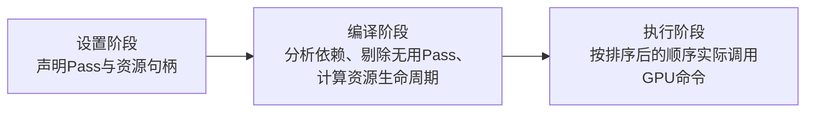

Render Graph（渲染图）是一种面向现代图形 API（如 Vulkan、DirectX 12）的渲染框架设计模式，它不是一张具体的“图片”，而是用于**管理整个渲染流程**的**有向无环依赖图**。

**核心思想**：不立即执行任何渲染指令，而是先完整地记录一帧内所有渲染任务及其资源依赖关系，形成一张图，然后再进行全局的编译优化与调度执行。

> [!tip] Render Graph 的产生与现代图形 API 的演进直接相关
> - 旧时代（OpenGL/DX11）：驱动负责资源追踪和指令重排，开发者只需“即时”下达命令，但驱动优化受限于局部信息，开销大。
> - 新时代（Vulkan/DX12）：驱动“甩手不管”，应用需亲自负责底层GPU调度。Render Graph正是利用全帧信息来实现高效调度的标准化解决方案。

Render Graph 是现代渲染引擎从“过程式”转向“声明式”的架构升级，它通过牺牲即时执行的自由度，换取全局最优的内存带宽利用率和 CPU 指令开销，已成为 Unity URP/HDRP、Unreal Engine 5 及各类自研高端引擎的标准底层架构。

> [!tip] 与 Render Pass 的关系
> Render Pass 是 Render Graph 中的最小执行单元，而 Render Graph 是包含多个 Render Pass 的宏观调度框架。

## 核心流程

Render Graph 的运作流程通常分为三个阶段（每帧重建）：

1. **核心价值：不只是调度，更是优化引擎**：与传统即时模式相比，Render Graph 带来的不仅是命令组织，更是全自动的渲染优化：
	- **自动资源内存回收与别名**：系统通过分析资源“最后读取时间”，可以在资源 B 不再使用后立即将它的内存空间分配给稍后才使用的资源 C。这实现了极致的显存复用，无需开发者手动管理临时 RT 的释放与创建。
	- **自动剔除（Culling）**：如果你在 Debug 模式下加了一个输出中间结果的 Pass，但最终画面并未使用该输出。编译阶段会自动删掉这个 Pass，零性能开销。
	- **自动屏障与布局转换**：根据读写依赖自动计算 Pipeline Barrier，确保数据准备就绪后再读取，避免 GPU 流水线停滞。    
	- **异步计算协同**：自动将可并行的计算任务调度到异步队列，与图形任务重叠执行。

2. **资源管理机制：句柄化与延迟实例化**：这是 Render Graph 最显著的特征：
	- **不直接操作资源**：开发者不再直接操作纹理或缓冲对象，而是操作一个句柄。
	- **按需实例化**：调用 API 创建资源时，内存并不会被立即分配。系统只在**第一个写入该资源的 Pass 执行前**才真正分配物理内存，并在**最后一个读取它的 Pass 结束后立即回收**。
	- **持久资源导入**：对于跨帧存在的交换链后台缓冲区或需复用的深度缓冲，可以通过“导入”机制纳入图管理，但生命周期由外部控制。

3. **两大主流流派**  
	- **游戏引擎流（Unity/Unreal）**：强调**易用性与自动化**。开发者只需声明Pass的读写对象，引擎自动完成剔除、合并（如移动 TBDR 架构下的 Pass 合并）和内存压缩。
	- **底层实现流（Blender/Vulkan）**：强调**多线程安全与命令重排**。负责在多线程环境中收集来自不同上下文的命令节点，通过调度器重新排序（如将数据传输提前），并生成最小化的 Barrier 指令集。