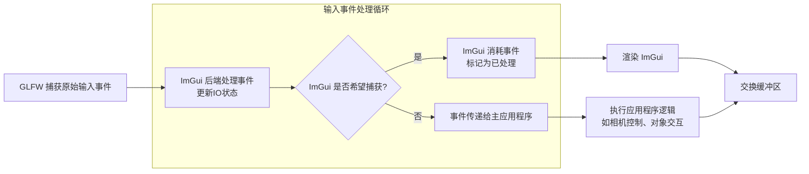

> [!info] Dear ImGui
> Dear ImGui is a **bloat-free graphical user interface library for C++**. It outputs optimized vertex buffers that you can render anytime in your 3D-pipeline-enabled application. It is fast, portable, renderer agnostic, and self-contained (no external dependencies).
> 
> Dear ImGui 是一个用于 C++ 的 bloat-free 图形用户界面库，可以在支持 3D pipeline 应用程序中进行渲染，快速、可移植、与渲染器无关并且独立（无外部依赖项）。
> 
> Anywhere where you can render textured triangles, you can render Dear ImGui.

Officially maintained backends/bindings (in repository):
- **Renderers**: DirectX9, DirectX10, DirectX11, DirectX12, Metal, OpenGL/ES/ES2, SDL_Renderer, Vulkan, WebGPU.
- **Platforms**: GLFW, SDL2/SDL3, Win32, Glut, OSX, Android.
- **Frameworks**: Allegro5, Emscripten.


## Getting Started

[Getting Started · ocornut/imgui Wiki (github.com)](https://github.com/ocornut/imgui/wiki/Getting-Started)


## 渲染流程

Dear ImGui 的渲染设计高效且解耦：核心库仅生成几何数据，渲染由用户选择的后端完成。这种设计使其易于集成到不同引擎/框架中，同时保持轻量（约 50k 行代码）。

性能关键点在于减少  GPU 状态切换和动态数据上传。

### 数据结构

1. **`ImDrawList`**：每个窗口对应一个绘制列表，存储所有控件的渲染数据
2. **`ImDrawCmd`**：绘制指令，包含纹理 ID 、顶点偏移、裁剪矩形等
3. **`ImDrawVert`**：顶点格式（pos, uv, color）

### 数据生成阶段

1. **立即模式**：每一帧，Dear ImGui **通过代码直接生成** GUI 控件（如按钮、窗口等）的几何数据（顶点、索引、UV坐标、颜色等），而非保留模式（不存储长期状态）。
2. **顶点数据**：**所有控件最终被转换为三角形列表**（例如，一个按钮可能是两个三角形组成的矩形），并填充到 `ImDrawList` 结构中，包含：
    - 顶点缓冲区（位置、UV、颜色）
    - 索引缓冲区（三角形连接顺序）
    - 纹理ID（用于字体或用户自定义纹理）。


### 渲染后端分离

Dear ImGui 本身不直接调用图形API，而是通过**平台无关的抽象接口**（`ImGuiRenderer`）将渲染数据传递给用户实现的后端。用户需根据使用的图形 API（如 OpenGL、DirectX、Vulkan 等）编写或使用现成的后端实现。

- **顶点/索引缓冲区的上传**：将 `ImDrawList` 中的顶点/索引数据上传到 GPU
- **纹理绑定**：绑定字体纹理或用户自定义纹理
- **着色器设置**：使用简单的着色器（通常是顶点着色器+片段着色器，支持 2D 变换和纹理采样）
- **绘制调用**：按 `ImDrawCmd` （每个绘制指令包含纹理 ID 、裁剪矩形等）执行绘制。


### 优化特性

- **合并绘制调用**：Dear ImGui 会尽量合并相同纹理的绘制指令，减少 GPU 状态切换
- **动态缓冲**：顶点/索引数据每帧动态更新，适合高频变化的 UI
- **裁剪**：通过 `glScissor` 或类似 API 实现控件裁剪，避免过度绘制

### 字体渲染

- ImGui 使用单通道（Alpha）或多通道字体纹理图集（通过 `stb_truetype` 库生成）。
- 字体纹理在初始化时预生成，并作为默认纹理绑定到绘制指令。


## 基本用法


### 核心库

Dear ImGui 的核心库本身不包含任何图形 API 的具体实现，专注于提供 UI 逻辑（窗口管理、布局、输入处理、状态等），并将实际的绘制操作抽象为一个渲染后端接口。

1. 核心库完全不依赖 OpenGL, DirectX, Vulkan, Metal 等图形 API
2. 提供 UI 状态管理、布局计算、输入处理、控件逻辑
3. 最终生成一个**顶点缓冲区**和一个**索引缓冲区**，以及一个描述如何绘制这些顶点的**绘制命令列表**，这些命令包含的信息通常是：
    - 使用的纹理 ID
    - 裁剪矩形
    - 顶点缓冲区的偏移量和大小
    - 索引缓冲区的偏移量和大小
    - 元素数量（三角形数量）


#### Menu

```c++
if (ImGui::BeginMenu("menu name")) {
    // 在这里添加菜单项（如 ImGui::MenuItem）
    ImGui::EndMenu();
}
```

##### 相关函数

1. **主菜单栏**
	- **`bool ImGui::BeginMainMenuBar()`**：开始一个主菜单栏（通常在窗口顶部），返回 `true` 表示可以添加菜单
		- **必须**与 `ImGui::EndMainMenuBar()` 配对使用
	- **`ImGui::EndMainMenuBar()`**：结束主菜单栏的声明

2. **下拉菜单（Dropdown Menu）**
	- **`bool ImGui::BeginMenu(const char* label, bool enabled = true)`**：用于开始一个下拉菜单，返回 `true` 表示菜单被创建，可以在其中添加菜单项
		- **参数**：
			- `label`：菜单名称
			- `enabled`：是否可交互，默认 `true`
		- **必须**在结束时调用 `ImGui::EndMenu()` 配对使用
	- **`ImGui::EndMenu()`**：结束下拉菜单的声明

3. **菜单项（Menu Item）**
	- **`bool ImGui::MenuItem(const char* label, const char* shortcut = nullptr, bool selected = false, bool enabled = true)`**：添加一个可点击的菜单项，返回 `true` 表示菜单项被**点击**
		- **参数**：
			- `label`：菜单项名称
			- `shortcut`：快捷键提示，如 `"Ctrl+S"`
			- `selected`：是否显示为选中状态，如复选框菜单
			- `enabled`：是否可交互。
	- **`bool ImGui::MenuItem(const char* label, const char* shortcut, bool* p_selected, bool enabled = true)`**：带状态控制的菜单项，如复选框菜单
		- **参数**：
			- `p_selected`：指向一个布尔值，控制选中状态并可被修改


#### Button

```c++
if (ImGui::Button("button name")) {
    // 在这里处理逻辑
}
```

##### 相关函数

1. **默认按钮**：
	- **`bool ImGui::Button(const char* label, const ImVec2& size = ImVec2(0,0))`**：创建一个带有指定标签的按钮，返回 `true` 表示按钮被**点击**
		- **参数**：
			- `label`: 按钮上显示的文本
			- `size`: 按钮大小，设置为 `0,0` 或 `ImVec2(0,0)` 使用自动大小

2. **小尺寸按钮**：
	- **`bool ImGui::SmallButton(const char* label)`**：创建一个小尺寸的按钮，适合内联使用

3. **不可见但可点击按钮**：
	- **`bool ImGui::InvisibleButton(const char* str_id, const ImVec2& size)`**：创建一个不可见但可点击的按钮区域，常用于实现自定义控件

4. **箭头按钮**：
	- **`bool ImGui::ArrowButton(const char* str_id, ImGuiDir dir)`**：创建一个带有箭头的按钮
		- **参数**：
			- `dir`： 指定箭头方向
				- `ImGuiDir_Left`
				- `ImGuiDir_Right`
				- `ImGuiDir_Up`
				- `ImGuiDir_Down`

5. **图像按钮**：
	- **`bool ImGui::ImageButton(ImTextureID user_texture_id, const ImVec2& size, ...)`**：创建一个显示图像的按钮

#### Image

`ImGui::Image` 是 Dear ImGui 中的一个函数，用于在 ImGui 的界面中显示一张图片，允许将纹理或图像渲染到 ImGui 的窗口或控件中。

```c++
void ImGui::Image(
    ImTextureID user_texture_id,      // 纹理 ID（通常是 OpenGL/DirectX 纹理句柄）
    const ImVec2& size,               // 图像显示大小
    const ImVec2& uv0 = ImVec2(0,0), // UV 坐标起点（默认左上角）
    const ImVec2& uv1 = ImVec2(1,1), // UV 坐标终点（默认右下角）
    const ImVec4& tint_col = ImVec4(1,1,1,1), // 颜色调色（默认白色，不修改颜色）
    const ImVec4& border_col = ImVec4(0,0,0,0) // 边框颜色（默认透明）
);
```

**参数**：
- `user_texture_id`：`ImTextureID` 类型，通常是图形 API（如 OpenGL、DirectX、Vulkan）的纹理句柄。
	- OpenGL：`(ImTextureID)(GLuint)your_texture`
	- DirectX11：`(ImTextureID)your_shader_resource_view`
- `size`：指定图像在 ImGui 中的显示尺寸 `ImVec2(width, height)`
- `uv0` 和 `uv1`：纹理坐标，默认 `(0,0)` 到 `(1,1)` 表示完整纹理
	- 可以用于显示部分纹理，例如 `uv0 = ImVec2(0,0)`, `uv1 = ImVec2(0.5,1)` 只显示左半边。
- `tint_col`：对图像进行颜色调制（RGBA），默认 `(1,1,1,1)` 表示不改变颜色。
- `border_col`：图像边框颜色，默认透明 `(0,0,0,0)`

##### 注意事项

1. **纹理管理**：
    - ImGui 本身不管理纹理，你需要自己处理加载、绑定和释放
    - 确保在调用 `ImGui::Image` 时，纹理仍然有效
2. **渲染后端**
    - 你需要正确设置 ImGui 的渲染后端（如 `imgui_impl_opengl3.cpp` 或 `imgui_impl_dx11.cpp`），否则图像可能无法显示。
3. **多引擎支持**
    - ImGui 支持多种图形 API（OpenGL、DirectX、Vulkan、Metal 等），但 `ImTextureID` 的转换方式可能不同。

#### Input

```c++
char text[256] = "Hello";
ImGui::InputText("single-line", text, IM_ARRAYSIZE(text));
```

##### 相关函数

1. **浮点数输入框**：
	- **`bool ImGui::InputFloat()`**

2. **整数输入框**：
	- **`bool ImGui::InputInt()`**

3. **单行文本输入框**：
	- **`bool ImGui::InputText(const char* label, char* buf, size_t buf_size, ImGuiInputTextFlags flags = 0, ImGuiInputTextCallback callback = nullptr, void* user_data = nullptr)`**：创建一个单行文本输入框，返回 `true` 表示文本被修改
		- **参数**：
			- `label`：输入框的标签（显示在左侧）
			- `buf`：存储文本的字符缓冲区（需预先分配大小）
			- `buf_size`：缓冲区大小（包括终止符 `\0`）
			- `flags`：控制行为的标志（如密码模式、只读等，见下文）
			- `callback`：回调函数（用于验证输入或动态调整）
			- `user_data`：传递给回调函数的自定义数据

4. **多行文本输入框**：
	- **`bool InputTextMultiline(const char* label, char* buf, size_t buf_size, const ImVec2& size = ImVec2(0,0), ImGuiInputTextFlags flags = 0, ImGuiInputTextCallback callback = nullptr, void* user_data = nullptr)`**：创建一个多行文本输入框，返回 `true` 表示文本被修改
		- **额外参数**：
			- `size`：文本框的尺寸，若为 `ImVec2(0,0)` 则自动扩展

5. **带提示文本输入框**：
	- **`bool InputTextWithHint(const char* label, const char* hint, char* buf, size_t buf_size, ImGuiInputTextFlags flags = 0, ImGuiInputTextCallback callback = nullptr, void* user_data = nullptr)`**：创建一个带提示文本（placeholder）的输入框，当输入为空时显示提示，返回 `true` 表示文本被修改
		- **额外参数**：
			- `hint`：提示文本


##### 常用标志

1. **基础行为**：
	- `ImGuiInputTextFlags_None`：默认行为
	- `ImGuiInputTextFlags_Password`：隐藏输入内容（显示为 `*`）
	- `ImGuiInputTextFlags_ReadOnly`：禁止编辑
	- `ImGuiInputTextFlags_EnterReturnsTrue`：按下回车键时返回 `true`（否则仅在失去焦点时返回）

2. **高级控制**：
	- `ImGuiInputTextFlags_CallbackCharFilter`：通过回调过滤输入的字符
	- `ImGuiInputTextFlags_CallbackResize`：动态调整缓冲区大小（需在回调中处理内存分配）
	- `ImGuiInputTextFlags_AutoSelectAll`：聚焦时自动全选文本

##### 回调函数

`ImGuiInputTextCallback` 用在输入过程中触发自定义逻辑（如验证、动态调整缓冲区等），
```c++
int Callback(ImGuiInputTextCallbackData* data);
```

`ImGuiInputTextCallbackData` 保存**回调数据**：
- `EventFlag`：触发回调的事件，如 `ImGuiInputTextFlags_CallbackResize`
- `Buf`/`BufSize`：文本缓冲区及其大小
- `CursorPos`：光标位置
- 其他编辑相关状态


#### UI Layout

1. **`ImGui::Separator()`**：添加一条分隔线
2. **`ImGui::Spacing()`**：添加垂直间距（相当于换行 + 自定义间距）
3. **`ImGui::SameLine()`**：将下一个控件放在同一行，而不是换行
4. **`ImGui::NewLine()`**：显式插入一个换行（如果需要在非控件位置换行）
5. **`ImGui::Dummy()`**：插入一个不可见的控件，占用指定大小的空间，可用于布局对齐或占位。
6. **`ImGui::BeginGroup()`** / **`ImGui::EndGroup()`**：将一组控件视为一个整体，自动布局（类似换行作用域）
7. **`ImGui::Columns()`**：创建多列布局，控件会自动按列排列（类似表格）
8. **`ImGui::SetNextItemWidth()`**

#### 设计

在 Dear ImGui 中，默认是从左到右依次排列的。

##### 实现居中、靠左、靠右布局

1. **方法一**：
```c++
if (ImGui::BeginMainMenuBar()) {
    // 1. 靠左的部分（默认行为）
    if (ImGui::BeginMenu("文件")) {
        ImGui::EndMenu();
    }

    // 2. 居中的部分
    ImGui::SameLine(ImGui::GetWindowWidth() * 0.5f - 50); // 手动调整偏移量
    if (ImGui::Button("居中按钮")) {
        // 按钮点击事件
    }

    // 3. 靠右的部分
    ImGui::SameLine(ImGui::GetWindowWidth() - 100); // 手动调整偏移量
    if (ImGui::Button("退出")) {
        // 退出逻辑
    }

    ImGui::EndMainMenuBar();
}
```

2. **方法二**：
```c++
if (ImGui::BeginMainMenuBar()) {
    // 1. 靠左的部分
    if (ImGui::BeginMenu("文件")) {
        ImGui::EndMenu();
    }

    // 2. 居中的部分
    ImGui::SetCursorPosX(ImGui::GetWindowWidth() * 0.5f - 50);
    if (ImGui::Button("居中按钮")) { /* ... */ }

    // 3. 靠右的部分
    ImGui::SetCursorPosX(ImGui::GetWindowWidth() - 100);
    if (ImGui::Button("退出")) { /* ... */ }

    ImGui::EndMainMenuBar();
}
```

##### 修改颜色
```c++
ImGui::PushStyleColor(ImGuiCol_Button, ImVec4(r,g,b,a));
ImGui::Button("Label");
ImGui::PopStyleColor();
```

##### 修改圆角
```c++
ImGui::PushStyleVar(ImGuiStyleVar_FrameRounding, 10.0f);
ImGui::Button("Rounded");
ImGui::PopStyleVar();
```


##### 分组布局

`ImGui::BeginGroup()` 和 `ImGui::EndGroup()` 的核心作用是将一系列控件逻辑上分组在一起，这个分组与水平排列和上下排列无关。
```cpp
ImGui::BeginGroup();

ImGui::Text("Hello, group!");
ImGui::Button("A Button");
ImGui::SliderFloat("Slider", &value, 0, 1);

ImGui::EndGroup();
```

1. **结合 `ImGui::SetCursorPos()` 实现整体偏移**：
```cpp
ImGui::SetCursorPos(ImVec2(50, 50)); // 先将光标偏移到目标位置

ImGui::BeginGroup(); // 记录当前光标位置 (50,50) 为组的起点

// 在组内添加一些控件

ImGui::EndGroup();

// 现在你可以获取整个组的大小了
ImVec2 group_size = ImGui::GetItemRectSize();
ImGui::Text("The group is %.1fx%.1f pixels", group_size.x, group_size.y);
```
需要在 `ImGui::BeginGroup()` 之前使用 `ImGui::SetCursorPos()` 或 `ImGui::SetCursorScreenPos()` 来设置光标的位置，但在 Group 内部尽量避免使用 `ImGui::SetCursorPos()`，因为会打乱流式布局。

2. **使用 `ImGui::SameLine()` 来调整组件内部排列**：
```cpp
// 首先，将整个 Group 偏移到 (50, 50) 的位置
ImGui::SetCursorPos(ImVec2(50, 50));

ImGui::BeginGroup();

ImGui::Text("Label:");
ImGui::SameLine(); // 让下一个控件与 "Label:" 在同一行
ImGui::InputText("##input", buf, IM_ARRAYSIZE(buf)); // 一个输入框

ImGui::Text("Options:");
ImGui::SameLine(); // 让接下来的按钮与 "Options:" 在同一行
ImGui::Button("A");
ImGui::SameLine(); // 继续在同一行排列
ImGui::Button("B");
ImGui::SameLine();
ImGui::Button("C");

ImGui::EndGroup();
```


#### 状态控制

1. **设置是否激活**
```c++
ImGui::BeginDisabled(true/false);
// 组件
ImGui::EndDisabled();
```

2. **检查是否被悬停**
```c++
if (ImGui::IsItemHovered()) {
    // 组件被鼠标悬停时的逻辑
}
```


### 输入处理

在使用 Dear ImGui 结合 GLFW 开发应用时，通常情况下，**Dear ImGui 的输入处理优先于 GLFW 捕捉的输入**。这意味着当 ImGui 窗口或控件获得焦点时，它会**消耗**掉输入事件，阻止这些事件继续传递到你的应用程序其他部分（比如场景导航或对象操作），主应用程序通常就不再处理它。



GLFW 通过回调函数（如 `glfwSetKeyCallback`, `glfwSetMouseButtonCallback`）首先捕获原始的输入事件。随后，ImGui 的 GLFW 后端（例如 `ImGui_ImplGlfw_InitForOpenGL` 初始化的部分）会将这些事件转换为 ImGui 内部的表示形式，并存储在 `ImGuiIO` 结构体中。

**ImGui 会根据鼠标的位置和UI的交互状态来决定是否消耗这个输入事件**，例如：
- 当鼠标悬停在一个 ImGui 窗口上，或是点击了一个 ImGui 按钮时，ImGui 会设置 `io.WantCaptureMouse` 为 `true`，表明它希望捕获鼠标事件。
- 类似地，当一个输入框（InputText）处于激活状态时，ImGui 会设置 `io.WantCaptureKeyboard` 为 `true`，表明它希望捕获键盘事件。

```cpp
// 主循环示例
while (!glfwWindowShouldClose(window))
{
    glfwPollEvents(); // GLFW 先捕获输入事件

    // ImGui 后端处理这些事件并更新 ImGuiIO
    ImGui_ImplOpenGL3_NewFrame();
    ImGui_ImplGlfw_NewFrame(); 
    ImGui::NewFrame();

    // 你的 ImGui 界面绘制代码
    // ...

    // 渲染
    ImGui::Render();
    ImGui_ImplOpenGL3_RenderDrawData(ImGui::GetDrawData());

    // 在适当的地方，根据 WantCapture 标志决定是否执行你自己的输入处理
    ImGuiIO& io = ImGui::GetIO();
    if (!io.WantCaptureMouse) {
        // 处理你的应用程序自身的鼠标逻辑（例如：3D场景中的相机控制）
        handleCameraMovement();
    }
    
    if (!io.WantCaptureKeyboard) {
        // 处理你的应用程序自身的键盘逻辑
        handleShortcuts();
    }

    glfwSwapBuffers(window);
}
```


### 渲染后端

渲染后端（Backend）是一个**独立的、特定于图形 API 的实现**，负责：
1. **初始化**：创建 ImGui 所需的 GPU 资源（顶点/索引缓冲区、字体纹理、着色器、管线状态对象等）
2. **渲染**：接收 ImGui 核心生成的顶点/索引数据和绘制命令列表，并使用目标图形 API 的调用将这些数据实际绘制到屏幕上
3. **资源管理**：在 ImGui 上下文被销毁或窗口大小改变时，销毁或重建必要的 GPU 资源
4. **与平台窗口集成**：通常也负责创建和管理 ImGui 使用的平台窗口（这部分有时会与平台后端结合）

**不同的图形 API 需要完全不同的后端实现**，
1. `imgui_impl_opengl3.cpp`： 用于 OpenGL 3.x / OpenGL ES 2.x/3.x
2. `imgui_impl_dx11.cpp`： 用于 DirectX 11
3. `imgui_impl_dx12.cpp`： 用于 DirectX 12
4. `imgui_impl_vulkan.cpp`： 用于 Vulkan
5. `imgui_impl_metal.mm`： 用于 Metal
6. `imgui_impl_webgpu.cpp`： 用于 WebGPU


#### OpenGL

1. 添加头文件
```cpp
#include "imgui.h"
#include "imgui_impl_glfw.h"
#include "imgui_impl_opengl3.h"
```

2. 初始化
```cpp
// Setup Dear ImGui context
IMGUI_CHECKVERSION();
ImGui::CreateContext();
ImGuiIO& io = ImGui::GetIO();
io.ConfigFlags |= ImGuiConfigFlags_NavEnableKeyboard;     // Enable Keyboard Controls
io.ConfigFlags |= ImGuiConfigFlags_NavEnableGamepad;      // Enable Gamepad Controls
io.ConfigFlags |= ImGuiConfigFlags_DockingEnable;         // IF using Docking Branch

// Setup Platform/Renderer backends
ImGui_ImplGlfw_InitForOpenGL(YOUR_WINDOW, true);          // Second param install_callback=true will install GLFW callbacks and chain to existing ones.
ImGui_ImplOpenGL3_Init();
```

3. 渲染循环
```cpp
while (true)
{
	// (Your code calls glfwPollEvents())
	// ...
	// Start the Dear ImGui frame
	ImGui_ImplOpenGL3_NewFrame();
	ImGui_ImplGlfw_NewFrame();
	ImGui::NewFrame();
	ImGui::ShowDemoWindow(); // Show demo window! :)


	// Rendering


	// (Your code clears your framebuffer, renders your other stuff etc.)
	ImGui::Render();
	ImGui_ImplOpenGL3_RenderDrawData(ImGui::GetDrawData());
	// (Your code calls glfwSwapBuffers() etc.)
}
```

4. 关闭
```cpp
ImGui_ImplOpenGL3_Shutdown();
ImGui_ImplGlfw_Shutdown();
ImGui::DestroyContext();
```

#### Vulkan

1. 添加头文件
```cpp
#include "imgui.h"
#include "imgui_impl_glfw.h"
#include "imgui_impl_opengl3.h"
```

2. 初始化
```cpp
// Setup Dear ImGui context
IMGUI_CHECKVERSION();
ImGui::CreateContext();
ImGuiIO& io = ImGui::GetIO();
io.ConfigFlags |= ImGuiConfigFlags_NavEnableKeyboard;     // Enable Keyboard Controls
io.ConfigFlags |= ImGuiConfigFlags_NavEnableGamepad;      // Enable Gamepad Controls
io.ConfigFlags |= ImGuiConfigFlags_DockingEnable;         // IF using Docking Branch

// Setup Platform/Renderer backends
ImGui_ImplGlfw_InitForVulkan(YOUR_WINDOW, true);          // Second param install_callback=true will install GLFW callbacks and chain to existing ones.
ImGui_ImplOpenGL3_Init();
```

3. 渲染循环
```cpp
while (true)
{
	// (Your code calls glfwPollEvents())
	// ...
	// Start the Dear ImGui frame
	ImGui_ImplVulkan_NewFrame();
	ImGui_ImplGlfw_NewFrame();
	ImGui::NewFrame();
	ImGui::ShowDemoWindow(); // Show demo window! :)


	// Rendering


	// (Your code clears your framebuffer, renders your other stuff etc.)
	ImGuiIO& io = ImGui::GetIO();
	ImGui::Render();
	if (io.ConfigFlags & ImGuiConfigFlags_ViewportsEnable){
		ImGui::UpdatePlatformWindows();
		ImGui::RenderPlatformWindowsDefault();
	}
	// (Your code calls glfwSwapBuffers() etc.)
}
```

4. 关闭
```cpp
ImGui_ImplVulkan_Shutdown()
ImGui_ImplGlfw_Shutdown();
ImGui::DestroyContext();
```


#### Metal

1. 添加头文件
```cpp
#include "imgui.h"
#include "imgui_impl_glfw.h"
#include "imgui_impl_metal.h"
```

2. 初始化
```cpp
// Setup Dear ImGui context
IMGUI_CHECKVERSION();
ImGui::CreateContext();
ImGuiIO& io = ImGui::GetIO();
io.ConfigFlags |= ImGuiConfigFlags_NavEnableKeyboard;     // Enable Keyboard Controls
io.ConfigFlags |= ImGuiConfigFlags_NavEnableGamepad;      // Enable Gamepad Controls
io.ConfigFlags |= ImGuiConfigFlags_DockingEnable;         // IF using Docking Branch

// Setup Platform/Renderer backends
ImGui_ImplGlfw_InitForOpenGL(YOUR_WINDOW, true);          // Second param install_callback=true will install GLFW callbacks and chain to existing ones.
ImGui_ImplMetal_Init(YOUR_METAL_DEVICE);
```

3. 渲染循环
```cpp
while (true)
{
	// (Your code calls glfwPollEvents())
	// ...
	// Start the Dear ImGui frame
	ImGui_ImplMetal_NewFrame(YOUR_RENDER_PASS_DESCRIPTOR);
	ImGui_ImplGlfw_NewFrame();
	ImGui::NewFrame();
	ImGui::ShowDemoWindow(); // Show demo window! :)


	// Rendering


	// (Your code clears your framebuffer, renders your other stuff etc.)
	ImGui::Render();
	ImGui_ImplMetal_RenderDrawData(ImGui::GetDrawData(), YOUR_METAL_COMMAND_BUFFER, YOUR_METAL_RENDER_ENCODER);
	// (Your code calls endEncoding, presentDrawable, commit etc.)
}
```

4. 关闭
```cpp
ImGui_ImplMetal_Shutdown();
ImGui_ImplGlfw_Shutdown();
ImGui::DestroyContext();
```


### 平台后端

平台后端（Platform Backend - Optional but Common），处理与特定操作系统窗口和输入系统的集成（如 Win32, GLFW, SDL, Cocoa, Android 等），负责：
1. 创建和管理应用程序窗口
2. 处理鼠标、键盘、触摸等输入事件，并将其转发给 ImGui
3. 设置剪贴板功能
4. 管理高 DPI / 视网膜显示


### `.ini` 文件

Dear ImGui 使用 [ini](../../Language/Data%20Format/ini.md) 文件来保存和加载其界面状态（如窗口位置、大小、折叠状态等），主要包括以下内容：
- 窗口的位置（`Pos`）、大小（`Size`）、是否折叠（`Collapsed`）。
- 控件的状态（如 `ImGuiTreeNode` 是否展开）。
- Docking 模式的布局（如果启用了 `ImGuiConfigFlags_DockingEnable`）
- 用户自定义的额外数据（通过 `ImGuiSettingsHandler`）

默认情况下，ImGui 会生成一个名为 `imgui.ini` 的文件（文件名和路径可配置），内容类似为：
```ini
[Window][Debug##Default]
Pos=60,20
Size=400,400
Collapsed=0

[Window][My Tool]
Pos=300,100
Size=200,300
Collapsed=0

[Docking][Data]
DockSpace ID=0x12345678
...
```
- **`[Window]` 部分**：记录每个窗口的状态。
- **`[Docking]` 部分**（如果启用）：保存停靠布局。
- **键值对**：如 `Pos=60,20` 表示窗口左上角坐标为 (60, 20)。


## Docking

Dear ImGui 的 Docking 模式是其分支版本中提供的一项功能，允许用户通过拖拽窗口来创建可停靠（dockable）的布局，类似于现代 IDE（如 Visual Studio）或图形软件中的多窗口管理方式。

### 核心功能

- **窗口停靠**：用户可以将多个窗口拖拽到主视图的边缘或中心区域，形成标签页或分割布局。
- **浮动窗口**：窗口可以脱离主视图成为独立浮动面板。
- **布局保存/加载**：支持将自定义布局保存到文件，下次启动时恢复。


### 示例用法

```cpp
// 在渲染循环中
ImGui::DockSpaceOverViewport(ImGui::GetMainViewport()); // 创建停靠空间
ImGui::Begin("Window 1");
ImGui::Text("可拖拽到其他区域");
ImGui::End();

ImGui::Begin("Window 2");
ImGui::Text("另一个窗口");
ImGui::End();
```


## 高级用法


### Rendering Scene into a Texture

[Rendering An OpenGL Framebuffer Into A Dear ImGui Window — Coding With Thomas](https://www.codingwiththomas.com/blog/rendering-an-opengl-framebuffer-into-a-dear-imgui-window)

#### docking 模式下场景渲染步骤

1. **创建 OpenGL 纹理**
2. **设置帧缓冲对象（FBO）**
```cpp
GLuint fbo, texture;
int texWidth = 1280, texHeight = 720; // 初始纹理尺寸

// 创建纹理
glGenTextures(1, &texture);
glBindTexture(GL_TEXTURE_2D, texture);
glTexImage2D(GL_TEXTURE_2D, 0, GL_RGB, texWidth, texHeight, 0, GL_RGB, GL_UNSIGNED_BYTE, nullptr);
glTexParameteri(GL_TEXTURE_2D, GL_TEXTURE_MIN_FILTER, GL_LINEAR);
glTexParameteri(GL_TEXTURE_2D, GL_TEXTURE_MAG_FILTER, GL_LINEAR);
glBindTexture(GL_TEXTURE_2D, 0);

// 创建帧缓冲
glGenFramebuffers(1, &fbo);
glBindFramebuffer(GL_FRAMEBUFFER, fbo);
glFramebufferTexture2D(GL_FRAMEBUFFER, GL_COLOR_ATTACHMENT0, GL_TEXTURE_2D, texture, 0);

// 检查完整性
if (glCheckFramebufferStatus(GL_FRAMEBUFFER) != GL_FRAMEBUFFER_COMPLETE) {
    // 错误处理
}

glBindFramebuffer(GL_FRAMEBUFFER, 0);
```

3. **渲染场景到纹理**
```cpp
void RenderSceneToTexture() {
    glBindFramebuffer(GL_FRAMEBUFFER, fbo);
    glViewport(0, 0, texWidth, texHeight);
    
    // 清除和渲染场景
    glClearColor(0.1f, 0.1f, 0.1f, 1.0f);
    glClear(GL_COLOR_BUFFER_BIT | GL_DEPTH_BUFFER_BIT);
    
    // ... 你的3D渲染代码 ...
    
    glBindFramebuffer(GL_FRAMEBUFFER, 0);
}
```

4. **纹理尺寸调整**
```cpp
void ResizeTexture(GLuint& texture, int width, int height) {
    glBindTexture(GL_TEXTURE_2D, texture);
    glTexImage2D(GL_TEXTURE_2D, 0, GL_RGB, width, height, 0, GL_RGB, GL_UNSIGNED_BYTE, nullptr);
    glBindTexture(GL_TEXTURE_2D, 0);
}
```

5. **在 ImGui 窗口中显示纹理**
```cpp
// 主循环中
while (!glfwWindowShouldClose(window)) {
    // 开始新帧
    ImGui_ImplOpenGL3_NewFrame();
    ImGui_ImplGlfw_NewFrame();
    ImGui::NewFrame();

    // 创建 docking 空间
    ImGui::DockSpaceOverViewport(ImGui::GetMainViewport());

    // 渲染场景到纹理
    RenderSceneToTexture();

    // 创建视图窗口
    ImGui::Begin("3D Viewport");
    {
        // 获取当前可用区域大小
        ImVec2 viewportSize = ImGui::GetContentRegionAvail();
        
        // 动态调整纹理尺寸（如果窗口大小改变）
        if (viewportSize.x != texWidth || viewportSize.y != texHeight) {
            texWidth = static_cast<int>(viewportSize.x);
            texHeight = static_cast<int>(viewportSize.y);
            ResizeTexture(texture, texWidth, texHeight);
        }

        // 显示纹理（注意UV翻转）
        ImGui::Image(
            (void*)(intptr_t)texture, 
            viewportSize,
            ImVec2(0, 1),   // UV起点（左下角）
            ImVec2(1, 0),   // UV终点（右上角）
            ImVec4(1,1,1,1), // 色调
            ImVec4(0,0,0,1)  // 边框颜色
        );
    }
    ImGui::End();

    // 其他 GUI 元素...
    ImGui::ShowDemoWindow();

    // 渲染 ImGui
    ImGui::Render();
    glViewport(0, 0, fb_width, fb_height);
    glClear(GL_COLOR_BUFFER_BIT);
    ImGui_ImplOpenGL3_RenderDrawData(ImGui::GetDrawData());
    
    glfwSwapBuffers(window);
}
```

5. **处理 Docking 布局**


##### 注意事项

1. **UV 坐标翻转**：
```cpp
ImGui::Image(texture, size, ImVec2(0,1), ImVec2(1,0));
```

2. **动态调整纹理尺寸**：
    - 检测 ImGui 窗口大小变化
    - 及时调整 FBO 纹理尺寸
    - 避免每帧都调整（只在尺寸变化时调整）


3. **深度缓冲处理**：
```cpp
// 创建时附加深度缓冲
GLuint rbo;
glGenRenderbuffers(1, &rbo);
glBindRenderbuffer(GL_RENDERBUFFER, rbo);
glRenderbufferStorage(GL_RENDERBUFFER, GL_DEPTH24_STENCIL8, width, height);
glFramebufferRenderbuffer(GL_FRAMEBUFFER, GL_DEPTH_STENCIL_ATTACHMENT, GL_RENDERBUFFER, rbo);
```

4. **多窗口支持**：
    - 为每个视图窗口创建单独的 FBO
    - 使用不同的相机视角渲染


##### 常见问题

1. **纹理显示为全黑**：
	- 检查 FBO 完整性状态
	- 确保正确绑定 FBO 后再渲染
	- 验证着色器是否正确输出颜色

2. **图像闪烁**：
	- 确保在渲染 ImGui 前解除 FBO 绑定
	- 使用三缓冲或垂直同步
```cpp
glfwSwapInterval(1); // 启用垂直同步
```


### Multi-thread Rendering

在 Dear ImGui 的 docking 模式下结合多线程渲染和场景显示是一个复杂但强大的模式。

#### 设计思路

主要挑战在于多线程渲染与 ImGui 单线程渲染的协调。

1. **多线程架构**：使用了三个线程：
    - 主线程：处理 UI 和 ImGui 渲染
    - 渲染线程：负责场景渲染到纹理
    - 资源加载线程：异步加载资源
2. **纹理共享**：
    - 使用双缓冲纹理避免读写冲突
    - 通过原子操作实现线程安全
3. **Docking 集成**：
    - 在 docking 窗口中显示渲染结果
    - 支持多个视图窗口


#### 完整实现

```cpp
#include <imgui.h>
#include <imgui_impl_glfw.h>
#include <imgui_impl_opengl3.h>
#include <GL/glew.h>
#include <GLFW/glfw3.h>
#include <thread>
#include <atomic>
#include <mutex>
#include <vector>
#include <condition_variable>

// 渲染场景数据结构
struct RenderScene {
    GLuint fbo;
    GLuint texture;
    int width = 800;
    int height = 600;
    std::atomic<bool> needsResize{false};
    std::atomic<bool> isRendering{false};
};

// 双缓冲纹理集
struct TextureBuffer {
    GLuint textures[2];
    std::atomic<int> readIndex{0};  // 主线程读取的纹理索引
    std::atomic<int> writeIndex{1}; // 渲染线程写入的纹理索引
    std::mutex mutex;
    std::condition_variable cv;
};

// 全局状态
struct AppState {
    GLFWwindow* window;
    TextureBuffer textureBuffer;
    RenderScene scene;
    std::atomic<bool> running{true};
    std::atomic<bool> sceneVisible{true};
    std::atomic<int> renderQuality{2}; // 0:低, 1:中, 2:高
};

// 初始化OpenGL纹理
void InitializeTexture(GLuint& texture, int width, int height) {
    glGenTextures(1, &texture);
    glBindTexture(GL_TEXTURE_2D, texture);
    glTexImage2D(GL_TEXTURE_2D, 0, GL_RGBA, width, height, 0, GL_RGBA, GL_UNSIGNED_BYTE, nullptr);
    glTexParameteri(GL_TEXTURE_2D, GL_TEXTURE_MIN_FILTER, GL_LINEAR);
    glTexParameteri(GL_TEXTURE_2D, GL_TEXTURE_MAG_FILTER, GL_LINEAR);
    glTexParameteri(GL_TEXTURE_2D, GL_TEXTURE_WRAP_S, GL_CLAMP_TO_EDGE);
    glTexParameteri(GL_TEXTURE_2D, GL_TEXTURE_WRAP_T, GL_CLAMP_TO_EDGE);
    glBindTexture(GL_TEXTURE_2D, 0);
}

// 调整纹理大小
void ResizeTexture(GLuint& texture, int width, int height) {
    glBindTexture(GL_TEXTURE_2D, texture);
    glTexImage2D(GL_TEXTURE_2D, 0, GL_RGBA, width, height, 0, GL_RGBA, GL_UNSIGNED_BYTE, nullptr);
    glBindTexture(GL_TEXTURE_2D, 0);
}

// 初始化帧缓冲
void InitializeFramebuffer(RenderScene& scene) {
    // 创建FBO
    glGenFramebuffers(1, &scene.fbo);
    glBindFramebuffer(GL_FRAMEBUFFER, scene.fbo);
    
    // 创建纹理
    InitializeTexture(scene.texture, scene.width, scene.height);
    glFramebufferTexture2D(GL_FRAMEBUFFER, GL_COLOR_ATTACHMENT0, GL_TEXTURE_2D, scene.texture, 0);
    
    // 创建渲染缓冲对象（用于深度和模板测试）
    GLuint rbo;
    glGenRenderbuffers(1, &rbo);
    glBindRenderbuffer(GL_RENDERBUFFER, rbo);
    glRenderbufferStorage(GL_RENDERBUFFER, GL_DEPTH24_STENCIL8, scene.width, scene.height);
    glFramebufferRenderbuffer(GL_FRAMEBUFFER, GL_DEPTH_STENCIL_ATTACHMENT, GL_RENDERBUFFER, rbo);
    
    // 检查完整性
    if (glCheckFramebufferStatus(GL_FRAMEBUFFER) != GL_FRAMEBUFFER_COMPLETE) {
        std::cerr << "Framebuffer is not complete!" << std::endl;
    }
    
    glBindFramebuffer(GL_FRAMEBUFFER, 0);
}

// 渲染线程函数
void RenderThreadFunction(AppState& state) {
    // 创建共享上下文
    glfwWindowHint(GLFW_VISIBLE, GLFW_FALSE);
    GLFWwindow* sharedContext = glfwCreateWindow(1, 1, "Render Context", nullptr, state.window);
    if (!sharedContext) {
        std::cerr << "Failed to create shared OpenGL context" << std::endl;
        return;
    }
    glfwMakeContextCurrent(sharedContext);
    glewInit();
    
    // 初始化渲染场景
    InitializeFramebuffer(state.scene);
    
    // 初始化双缓冲纹理
    InitializeTexture(state.textureBuffer.textures[0], state.scene.width, state.scene.height);
    InitializeTexture(state.textureBuffer.textures[1], state.scene.width, state.scene.height);
    
    // 渲染循环
    while (state.running) {
        // 检查场景是否可见
        if (!state.sceneVisible) {
            std::this_thread::sleep_for(std::chrono::milliseconds(100));
            continue;
        }
        
        // 检查是否需要调整大小
        if (state.scene.needsResize) {
            ResizeTexture(state.scene.texture, state.scene.width, state.scene.height);
            ResizeTexture(state.textureBuffer.textures[0], state.scene.width, state.scene.height);
            ResizeTexture(state.textureBuffer.textures[1], state.scene.width, state.scene.height);
            state.scene.needsResize = false;
        }
        
        // 设置渲染状态
        state.scene.isRendering = true;
        
        // 渲染到FBO
        glBindFramebuffer(GL_FRAMEBUFFER, state.scene.fbo);
        glViewport(0, 0, state.scene.width, state.scene.height);
        
        // 清除缓冲区
        glClearColor(0.1f, 0.1f, 0.1f, 1.0f);
        glClear(GL_COLOR_BUFFER_BIT | GL_DEPTH_BUFFER_BIT);
        
        // 根据质量设置渲染细节
        int quality = state.renderQuality;
        if (quality == 0) {
            // 低质量渲染
            // 简单场景渲染代码...
        }
        else if (quality == 1) {
            // 中等质量渲染
            // 中等细节场景...
        }
        else {
            // 高质量渲染
            // 完整细节场景渲染...
        }
        
        // 将渲染结果复制到双缓冲纹理
        int writeIndex = state.textureBuffer.writeIndex;
        glBindTexture(GL_TEXTURE_2D, state.textureBuffer.textures[writeIndex]);
        glCopyTexSubImage2D(GL_TEXTURE_2D, 0, 0, 0, 0, 0, state.scene.width, state.scene.height);
        
        // 交换缓冲区
        {
            std::lock_guard<std::mutex> lock(state.textureBuffer.mutex);
            state.textureBuffer.readIndex.store(writeIndex);
            state.textureBuffer.writeIndex.store(1 - writeIndex);
        }
        state.textureBuffer.cv.notify_one();
        
        // 解除绑定
        glBindFramebuffer(GL_FRAMEBUFFER, 0);
        state.scene.isRendering = false;
        
        // 控制帧率
        std::this_thread::sleep_for(std::chrono::milliseconds(16)); // ~60 FPS
    }
    
    // 清理资源
    glfwDestroyWindow(sharedContext);
}

// 资源加载线程
void ResourceLoadingThread(AppState& state) {
    while (state.running) {
        // 检查是否有需要加载的资源
        // 在实际应用中，这里会有资源队列处理
        
        std::this_thread::sleep_for(std::chrono::milliseconds(100));
    }
}

// 主UI线程
int main() {
    // 初始化GLFW
    if (!glfwInit()) return -1;
    
    // 创建主窗口
    GLFWwindow* window = glfwCreateWindow(1600, 900, "ImGui Docking + Multithreaded Rendering", nullptr, nullptr);
    if (!window) {
        glfwTerminate();
        return -1;
    }
    glfwMakeContextCurrent(window);
    glfwSwapInterval(1); // 启用垂直同步
    
    // 初始化GLEW
    if (glewInit() != GLEW_OK) {
        std::cerr << "Failed to initialize GLEW" << std::endl;
        return -1;
    }
    
    // 初始化ImGui
    IMGUI_CHECKVERSION();
    ImGui::CreateContext();
    ImGuiIO& io = ImGui::GetIO();
    io.ConfigFlags |= ImGuiConfigFlags_NavEnableKeyboard;
    io.ConfigFlags |= ImGuiConfigFlags_DockingEnable;
    io.ConfigFlags |= ImGuiConfigFlags_ViewportsEnable;
    
    ImGui::StyleColorsDark();
    
    // 初始化ImGui平台绑定
    ImGui_ImplGlfw_InitForOpenGL(window, true);
    ImGui_ImplOpenGL3_Init("#version 330");
    
    // 应用状态
    AppState state;
    state.window = window;
    
    // 启动渲染线程
    std::thread renderThread(RenderThreadFunction, std::ref(state));
    
    // 启动资源加载线程
    std::thread resourceThread(ResourceLoadingThread, std::ref(state));
    
    // 主循环
    while (!glfwWindowShouldClose(window)) {
        glfwPollEvents();
        
        // 开始ImGui帧
        ImGui_ImplOpenGL3_NewFrame();
        ImGui_ImplGlfw_NewFrame();
        ImGui::NewFrame();
        
        // 创建docking空间
        ImGui::DockSpaceOverViewport(ImGui::GetMainViewport(), ImGuiDockNodeFlags_PassthruCentralNode);
        
        // 主菜单栏
        if (ImGui::BeginMainMenuBar()) {
            if (ImGui::BeginMenu("File")) {
                if (ImGui::MenuItem("Exit")) glfwSetWindowShouldClose(window, true);
                ImGui::EndMenu();
            }
            if (ImGui::BeginMenu("View")) {
                ImGui::MenuItem("Scene View", nullptr, &state.sceneVisible);
                ImGui::EndMenu();
            }
            ImGui::EndMainMenuBar();
        }
        
        // 渲染控制面板
        ImGui::Begin("Render Settings");
        {
            // 渲染质量控制
            ImGui::Text("Render Quality:");
            ImGui::RadioButton("Low", &state.renderQuality, 0); ImGui::SameLine();
            ImGui::RadioButton("Medium", &state.renderQuality, 1); ImGui::SameLine();
            ImGui::RadioButton("High", &state.renderQuality, 2);
            
            // 性能信息
            ImGui::Separator();
            ImGui::Text("Performance:");
            ImGui::Text("Rendering: %s", state.scene.isRendering ? "Active" : "Idle");
            ImGui::Text("Resolution: %dx%d", state.scene.width, state.scene.height);
            static float fps = 0.0f;
            fps = 0.9f * fps + 0.1f * io.Framerate;
            ImGui::Text("FPS: %.1f", fps);
        }
        ImGui::End();
        
        // 场景视图
        if (state.sceneVisible) {
            ImGui::Begin("3D Scene View", &state.sceneVisible, ImGuiWindowFlags_NoScrollbar);
            
            // 获取当前可用区域大小
            ImVec2 viewportSize = ImGui::GetContentRegionAvail();
            
            // 检查是否需要调整纹理大小
            if (static_cast<int>(viewportSize.x) != state.scene.width || 
                static_cast<int>(viewportSize.y) != state.scene.height) {
                state.scene.width = static_cast<int>(viewportSize.x);
                state.scene.height = static_cast<int>(viewportSize.y);
                state.scene.needsResize = true;
            }
            
            // 等待渲染线程完成当前帧
            std::unique_lock<std::mutex> lock(state.textureBuffer.mutex);
            if (state.textureBuffer.cv.wait_for(lock, std::chrono::milliseconds(50), 
                [&]{ return state.textureBuffer.readIndex.load() != -1; })) {
                
                // 显示纹理
                int readIndex = state.textureBuffer.readIndex.load();
                ImGui::Image(
                    (void*)(intptr_t)state.textureBuffer.textures[readIndex], 
                    viewportSize,
                    ImVec2(0, 1),   // UV起点（左下角）
                    ImVec2(1, 0),   // UV终点（右上角）
                    ImVec4(1,1,1,1), // 色调
                    ImVec4(1,1,1,0.5f)  // 边框颜色
                );
            }
            else {
                ImGui::TextColored(ImVec4(1,0,0,1), "Waiting for render...");
            }
            
            ImGui::End();
        }
        
        // 其他窗口
        ImGui::Begin("Additional Info");
        ImGui::Text("Docking and multithreading demo");
        ImGui::Text("Threads: Main + Render + Resource Loading");
        ImGui::End();
        
        // 渲染ImGui
        ImGui::Render();
        int display_w, display_h;
        glfwGetFramebufferSize(window, &display_w, &display_h);
        glViewport(0, 0, display_w, display_h);
        glClearColor(0.45f, 0.55f, 0.60f, 1.00f);
        glClear(GL_COLOR_BUFFER_BIT);
        ImGui_ImplOpenGL3_RenderDrawData(ImGui::GetDrawData());
        
        // 多视口支持
        if (io.ConfigFlags & ImGuiConfigFlags_ViewportsEnable) {
            GLFWwindow* backup_current_context = glfwGetCurrentContext();
            ImGui::UpdatePlatformWindows();
            ImGui::RenderPlatformWindowsDefault();
            glfwMakeContextCurrent(backup_current_context);
        }
        
        glfwSwapBuffers(window);
    }
    
    // 清理
    state.running = false;
    renderThread.join();
    resourceThread.join();
    
    ImGui_ImplOpenGL3_Shutdown();
    ImGui_ImplGlfw_Shutdown();
    ImGui::DestroyContext();
    
    glfwDestroyWindow(window);
    glfwTerminate();
    
    return 0;
}
```


#### 实现细节

1. **双缓冲纹理系统**：为避免主线程和渲染线程同时访问同一纹理，实现双缓冲纹理系统
2. **动态分辨率调整**：当用户调整 docking 窗口大小时，系统会自动更新渲染分辨率
```cpp
// 检查是否需要调整纹理大小
if (static_cast<int>(viewportSize.x) != state.scene.width || 
    static_cast<int>(viewportSize.y) != state.scene.height) {
    state.scene.width = static_cast<int>(viewportSize.x);
    state.scene.height = static_cast<int>(viewportSize.y);
    state.scene.needsResize = true;
}
```

3. **性能优化**
	- **按需渲染**：当场景窗口不可见时暂停渲染
	- **质量设置**：提供低、中、高三种渲染质量选项
	- **帧率控制**：渲染线程通过sleep控制帧率

4. **线程同步**：使用条件变量确保主线程等待渲染完成
```cpp
// 等待渲染线程完成当前帧
std::unique_lock<std::mutex> lock(state.textureBuffer.mutex);
if (state.textureBuffer.cv.wait_for(lock, std::chrono::milliseconds(50), 
    [&]{ return state.textureBuffer.readIndex.load() != -1; })) {
    // 显示纹理...
}
```


#### 性能优化建议

1. **多级纹理缓冲**：对于复杂的 UI，可以使用三缓冲系统
2. **LOD系统**：根据窗口大小自动调整模型细节
3. **异步资源加载**：在资源加载线程中预加载资源
4. **部分更新**：只渲染场景中变化的部分
5. **后台降质**：当窗口不在焦点时降低渲染质量