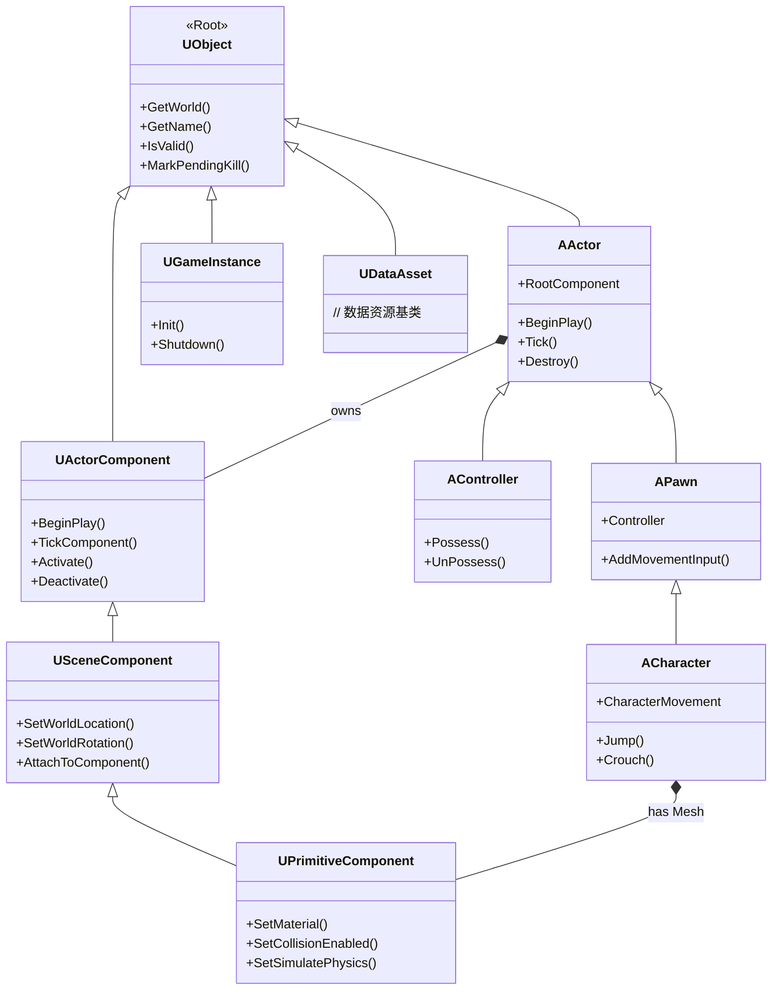

Unreal Engine 中 Actor-Component 模式通过组合而非继承来构建复杂的游戏对象。

1. **Actor**： 可以把它想象成一个空的容器，其本身几乎没有功能，但它拥有位置、旋转、缩放等基本属性，可以存在于游戏世界中。几乎所有能放入关卡的东西都是 Actor，比如一个宝箱、一扇门、一个触发器、一个玩家出生点。
2. **Component**：可以把它想象成能够添加到 Actor 这个容器里的一个个独立的功能模块。每个 Component 负责一项特定的任务。例如：
    - `StaticMeshComponent`：让 Actor 拥有一个3D模型。
    - `LightComponent`：让 Actor 成为一个光源。
    - `AudioComponent`：让 Actor 可以播放声音。
    - `BoxComponent`：给 Actor 添加一个碰撞体，用于物理检测。
    - `PlayerInputComponent`：让 Actor 可以接收玩家输入。

## 核心设计

1. **核心类关系**
	- **`UObject`**：所有 Unreal 对象的基类，提供了垃圾回收、反射、序列化等基础服务，`AActor` 和 `UActorComponent` 都继承自它。
		- **`AActor`**：游戏世界中所有对象的基类，它的核心职责是容纳和管理一组组件，它包含一个 `RootComponent` 和一个 `TArray<UActorComponent*>` 来存储所有组件。
			- **`APawn`**：可被玩家或 AI 控制的实体，是世界中具有物理表现的"肉体"
				- **`ACharacter`**：继承自 `APawn`，专为人形角色设计，内置了移动组件，处理行走、奔跑、跳跃等
			- **`AController`**：负责操控 `Pawn` 的灵魂，如玩家输入（`PlayerController`）或 AI 逻辑（`AIController`）
		- **`UActorComponent`**：所有组件的基类，它定义了一套生命周期钩子函数（如 `BeginPlay`, `TickComponent`, `EndPlay`），并持有对其所属 `AActor` 的引用，但没有变换（位置、旋转、缩放）信息。
			- **`USceneComponent`**：继承自 `UActorComponent`，拥有**变换信息**，可以形成层级结构，是许多其他组件的基础
				- **`UPrimitiveComponent`**：继承自 `USceneComponent`，是**所有可渲染物体**的基类，具备图形和碰撞属性

2. **关键设计理念**
	- **组合优于继承**：传统继承方式非常僵化，容易导致菱形继承等问题，且功能难以复用。而通过组件，你可以像搭乐高一样自由组合功能。
	- **场景组件与层级变换**：`USceneComponent` 继承自 `UActorComponent`，它引入了变换（位置、旋转、缩放） 的概念，并可以形成父子层级关系。
		- **Root Component**： 每个 Actor 都有一个 `RootComponent`，它定义了 Actor 在世界的基本变换。如果一个 Actor 没有任何 `SceneComponent`，它将无法被正确放置。
		- **父子附着**：一个 `SceneComponent` 可以附着到另一个 `SceneComponent`（通常是 Root Component）上，子组件的变换是相对于父组件的。
		    - **例**：一个角色（Actor）的 `CapsuleComponent`（胶囊体碰撞）是 Root Component，它的 `SkeletalMeshComponent`（骨骼模型）附着在胶囊体上。然后，一把枪的 `StaticMeshComponent` 又附着在角色手掌的骨骼上（该骨骼是 `SkeletalMeshComponent` 的一部分）。当角色移动时，所有的子组件都会跟着移动。
	- **组件间通信**：组件不能孤立工作，它们需要相互协作。
		- **通过 Owner Actor**：组件可以通过 `GetOwner()` 获取其所属的 Actor，然后通过类型转换获取 Actor 上的其他组件。
		- **直接引用**：在编辑器里，可以将一个组件的属性暴露出来，并直接拖拽赋值给另一个组件，建立直接的引用。
		- **委托和事件**：这是更解耦的方式，一个组件可以声明一个多播委托，其他组件（无论是在同一个 Actor 上还是其他 Actor 上）都可以订阅它，当特定事件发生时（如血量耗尽、弹药用完）自动触发。

3. **生命周期管理**：Actor 和 Component 有一套协同工作的生命周期：
	- **生成 / 注册**：
		- Actor 被 `UWorld::SpawnActor()` 创建。
		- Actor 调用其所有组件的 `RegisterComponent()` 方法，将组件注册到游戏系统中（如物理、渲染）。
		- 调用 `BeginPlay()`，先 Actor 后 Component。
	- **运行中**：
		- 每帧调用 `Tick()`，先 Actor 后 Component
	- **销毁 / 反注册**：
		- 调用 `EndPlay()`，先 Component 后 Actor。
		- 组件被反注册，Actor 被标记为待垃圾回收。