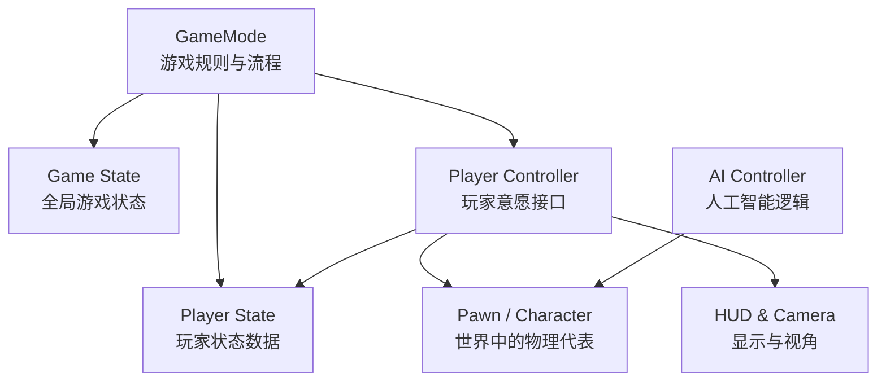

Unreal Engine 的 GamePlay 框架是一套预先构建的**类集合**和**系统架构**，用于规范化和加速游戏开发，定义了**游戏中的核心对象**、它们之间的**关系**以及**控制游戏规则的逻辑**。

## 核心构成

### 实体

1. **Pawn**：可以理解为在世界场景中的“代理”或“棋子”。
	- 被控制器（Controller）所拥有并可在世界中移动的实体。
	- 不假定具有“人”的特性，可以是一辆车、一个球，或者任何需要被控制的物体。
2. **Character**：类人式的 Pawn，是角色扮演等游戏中玩家或 AI 控制实体的基础。
	- 默认带有一个用于碰撞的胶囊组件（Capsule Component）和一个专门处理类人移动的角色移动组件（Character Movement Component），可以执行类似人类的基本动作，并流畅地复制网络上的动作。

### 控制

Controller 是负责指挥 Pawn 的 Actor，Controller 是 Pawn 的意愿或灵魂，分为两种：
1. **Player Controller**：代表人类玩家的意愿，是玩家与 Pawn 之间的接口。
	- 处理玩家输入，并通常拥有一个 Pawn 来控制它。
2. **AI Controller**：顾名思义，是控制 Pawn 的模拟人工智能意愿。

### 信息呈现

1. **HUD（抬头显示器）**：负责绘制二维屏幕显示信息，如血条、弹药量、得分等。
	- 每个 Player Controller 通常都有自己的 HUD 实例
2. **Camera（摄像机）**：玩家的眼睛，负责管理视图的行为，包括视角、镜头效果等。
	- 每个 Player Controller 也通常有一个玩家摄像机管理器（Player Camera Manager）

### 游戏状态

1. **Game Mode（游戏模式）**：定义了游戏的核心规则和获胜条件。
	- 如：是死亡竞赛还是团队协作，游戏如何开始和结束。
	- **仅存在于服务器上**，是游戏的宪法。
2. **Game State（游戏状态）**：包含了游戏的动态状态数据。
	- 如：当前游戏进行了多久、团队得分、在开放世界中已完成的任务列表等。
	- **存在于服务器和所有客户端上**，确保所有机器对游戏状态保持一致认知。
3. **Player State（玩家状态）**：是单个玩家（人类或机器人）的状态数据。
	- 如：玩家的名字、个人得分、击杀/死亡数等。
	- **存在于服务器和所有客户端上**，以便于 UI 显示和同步。

## 核心类设计

### 实体类设计

> [!tip]
> 绝大部分游戏引擎都得解决一个基本问题：**如何抽象模拟一个游戏世界**。

> [!tip]
> Unreal Engine 中，**万物皆 [UObject](UE%20UObject.md)** 。

Unreal Engine 使用 [Actor-Component](UE%20Actor-Component.md) 范式进行表达游戏世界，Actor 是整个游戏世界的基石和万物之源，游戏世界中所有对象的基类是 `AActor`。

