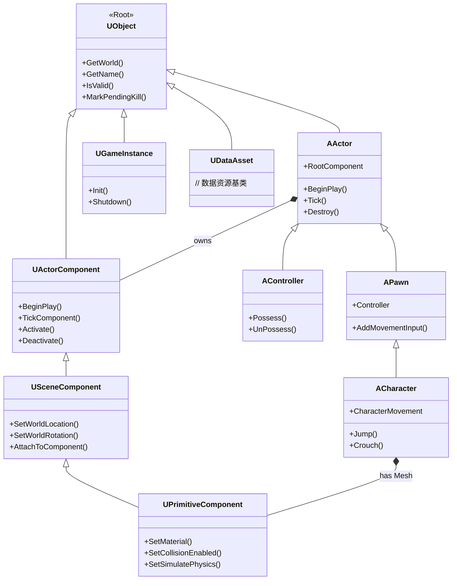

为了解决 C++ 作为一种静态语言缺乏反射、GC 等动态语言特性的问题，Unreal Engine 引入了一套 UObject 系统，实现了反射、GC、序列化、C++ 蓝图通信等重要功能，对于整个业界也都是有非常大的启发。

UObject 是 Unreal Engine 中几乎所有游戏对象类的基类，可以视作 Unreal 版本的 `Object`（如同 Java 或 C# 中的万物之祖），但它被极大地增强了，专门为游戏开发的需求而设计。

## 设计目的

UObject 系统的设计旨在解决大型、复杂游戏开发中的一系列核心挑战，其核心目标是：提供一套自动化的、数据驱动的对象生命周期管理和内省机制。

1. **垃圾回收（Garbage Collection）**：自动管理游戏对象的生命周期，防止内存泄漏和野指针。开发者无需手动 `delete` 每一个对象，引擎会自动追踪对象引用并在适当时机清理不再使用的对象。
2. **反射（Reflection）**：在运行时提供关于类本身的信息（元数据），例如类有哪些属性、方法、它们的名字、类型等。
	- 这是许多高级功能的基础。
3. **序列化（Serialization）**：能够轻松地将对象的状态（属性值）保存到磁盘（如存入游戏存档）或通过网络发送（网络复制）。
	- 这是实现存档/读档和多人游戏同步的基础。
4. **网络复制（Replication）**：在多人游戏中，自动将服务器上对象的状态和变化同步到各个客户端。开发者只需通过宏标记需要复制的属性，引擎就会处理复杂的网络同步逻辑。
5. **与编辑器集成（Editor Integration）**：Unreal Editor 能够识别并可视化基于 `UObject` 的类。属性可以显示在细节（Details）面板中供设计者调整，类可以在内容浏览器中创建蓝图（Blueprints）并进行编辑。
6. **CDO（Class Default Object）**：每个 `UObject` 类都有一个默认对象（CDO），它存储了该类属性的默认值。这确保了在创建新对象实例时，总能从一个已知的、可在编辑器中配置的基准状态开始。


## 核心机制

`UObject` 系统的实现是一个复杂的底层架构，

1. **宏驱动的代码生成**：
	- **编译前**：利用 [Unreal Header Tool](UE%20Unreal%20Header%20Tool.md) 扫描代码，解析并自动生成大量的附加 C++ 代码到中间目录，生成的代码包含：
		- **反射数据**：一个结构体，包含了类名、所有属性和方法的信息、它们的偏移量、类型等。
		- **包装代码**：用于实现序列化、网络复制、垃圾回收跟踪等功能的胶水代码。
	- **编译时**：生成的代码和你的原始代码一起被编译，从而将所有这些高级功能**注入**到你的类中。
```cpp
// 示例：一个简单的 UObject 类
UCLASS(Blueprintable) // UCLASS 宏声明这是一个可由编辑器识别并可用于创建蓝图的类
class MYGAME_API UMyClass : public UObject
{
    GENERATED_BODY() // GENERATED_BODY 宏至关重要，UHT 会将替换为生成的代码

public:
    UMyClass();

    UPROPERTY(EditAnywhere, BlueprintReadWrite, Category = "Stats") // UPROPERTY 宏暴露变量到编辑器和蓝图
    float Health;

    UFUNCTION(BlueprintCallable, Category = "Actions") // UFUNCTION 宏暴露函数到蓝图
    void Heal(float Amount);
};
```


2. **对象管理系统**
	- **GUObjectArray**：引擎维护着一个名为 `GUObjectArray` 的全局数组，所有 `UObject` 的实例都会被注册到这里。这是垃圾回收器遍历所有对象的核心数据结构。
	- **根集（Root Set）**：垃圾回收器从一组“根”对象开始（例如持久性的游戏实例对象、被特定标记保持活跃的对象等），遍历所有被根集引用的对象。任何无法从根集访问到的对象都会被标记为可回收的。
	- **UPROPERTY() 和智能引用**：当你使用 `UPROPERTY()` 宏声明一个指向其他 `UObject` 的指针时，生成的代码会确保这个引用被垃圾回收器识别。这意味着，如果 `A` 对象有一个 `UPROPERTY()` 指针指向 `B` 对象，那么垃圾回收器就知道 `B` 被 `A` 引用，从而不会错误地回收 `B`。


3. **序列化**与**网络复制**
	- 生成的代码中包含了类的序列化函数（`Serialize` 函数）。当引擎需要保存或传输对象时，它会调用这个函数。
	- `UPROPERTY` 宏中的元数据（如 `EditAnywhere`, `BlueprintReadWrite`）和专门用于复制的元数据（如 `Replicated`）会告诉生成的代码如何处理这些属性。
	- 例如，一个标记了 `Replicated` 的属性，其值在服务器上改变时，生成的代码会自动包含将变化发送给客户端的逻辑。


## 派生对象




1. **Actor 及其派生类**：
	- `AActor`：所有可放置在关卡中的对象的基类，是场景中的实体，可以拥有组件
		- `APawn`：可被玩家或 AI 控制的实体，是世界中具有物理表现的"肉体"
			- `ACharacter`：继承自 `APawn`，专为人形角色设计，内置了移动组件，处理行走、奔跑、跳跃等
		- `AController`：负责操控 `Pawn` 的灵魂，如玩家输入（`PlayerController`）或 AI 逻辑（`AIController`）
2. **Component 及其派生类**：
	- `UActorComponent`：组件的基础类，用于为Actor添加功能，但没有变换（位置、旋转、缩放）信息
		- `USceneComponent`：继承自 `UActorComponent`，拥有**变换信息**，可以形成层级结构，是许多其他组件的基础
			- `UPrimitiveComponent`：继承自 `USceneComponent`，是**所有可渲染物体**的基类，具备图形和碰撞属性
3. **其他重要派生类**
	- `UUserWidget`：UI 界面的基类，用于创建 HUD、菜单等用户界面元素
	- `UGameInstance`：管理游戏全局状态的对象，生命周期贯穿整个游戏会话
	- `UDataAsset`：用于存储配置数据的资源类，可以在编辑器中方便地配置
	- `UAnimInstance`：控制动画蓝图的逻辑
4. **非对象结构体**
	- `UStruct`：**`UStruct` 不是 `UObject` 的派生类**，它是一个**纯数据结构**，用于组织数据，不享受垃圾回收等 `UObject` 服务，需要用 `USTRUCT()` 宏标记

