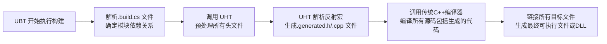

Unreal Engine 的反射系统是其架构的核心支柱之一，由于标准 C++ 本身不支持反射，Unreal Engine 自行开发了一套强大的元数据处理和代码生成系统来实现这一功能。

> [!info]
> 大部分的游戏引擎底层都是 C++，而 C++ 作为一个下接操作系统硬件底层，上接用户逻辑的编程语言，为了适应各种环境，不得不为你不需要的东西付代价。

Unreal Engine 的反射系统是其架构的核心，它通过在 C++ 基础上构建一套强大的元数据系统和代码生成工具，实现了运行时类型信息查询、序列化、垃圾回收、蓝图交互、网络复制等关键功能。这套系统主要由 Unreal Header Tool（UHT）和 Unreal Build Tool（UBT）协同工作实现。

Unreal Engine 的反射系统主要用于解决以下问题：
1. **C++ 语言限制**：标准 C++ 缺乏运行时类型信息（RTTI）和反射能力，无法满足大型游戏引擎的需求。
2. **编辑器集成**：需要让属性暴露给编辑器，支持可视化编辑和细节查看。  
3. **蓝图通信**：实现 C++ 函数和变量与蓝图系统的双向调用和交互。
4. **序列化**：支持对象状态的保存和加载，用于游戏存档、场景序列化等。
5. **垃圾回收**：自动管理 UObject 的生命周期，防止内存泄漏。
6. **网络复制**：支持属性同步和远程过程调用（RPC），用于多人游戏开发。


## 技术实现

### 元数据标注与宏系统

Unreal Engine 使用一套特殊的宏来标记需要参与反射的类、结构体、函数和属性，这些宏**在开发阶段**为 UHT 提供元数据用于解析生成相应的反射代码，**在编译阶段**这些宏要么展开为空，要么展开为一些编译器可接受的、无实际影响或必要执行的代码。

```C++
// 在类似于 "ObjectMacros.h" 的文件中

#ifdef __UNREAL_HEADER_TOOL__  // 专门为 UHT 定义的条件编译
    // 当 UHT 运行时，它会定义这个宏，以便捕获完整的元数据
    #define UCLASS(...) CLASS_METADATA(__VA_ARGS__)
#else
    // 对于普通的 C++ 编译器（如MSVC、Clang、GCC），这个宏可能展开为空，或者仅包含一些必要的属性（如dllimport/dllexport）
    #define UCLASS(...) /* 可能为空，或者例如 */ CLASS_EXPORT
#endif
```


#### 常见反射宏

1. `UCLASS()`: 用于标记类，可以指定蓝图类型、是否可蓝图化等。
2. `GENERATED_BODY()`：注入 `UObject` 所需的声明和定义（如构造函数、`StaticClass`方法）。
3. `USTRUCT()`: 用于标记结构体。
4. `UPROPERTY()`: 用于标记属性变量，可以指定编辑权限、复制条件、序列化等。
5. `UFUNCTION()`: 用于标记函数，可以指定蓝图调用类型、RPC 条件等。

```cpp
// 示例：使用反射宏标记类和属性
UCLASS(Blueprintable)
class AMyActor : public AActor
{
    GENERATED_BODY()

public:
    UPROPERTY(EditAnywhere, BlueprintReadWrite, Category = "Test")
    float Health;

    UFUNCTION(BlueprintCallable, Category = "Test")
    void MyFunction();
};
```

#### 确保不影响正常编译

Unreal Engine 通过以下几种方式确保反射宏不影响正常的 C++ 编译：
1. 条件编译与空展开：如上所述，反射宏对于 C++ 编译器通常定义为空，或者展开为一些编译器相关的属性（如 `__declspec(dllexport)` ），这些属性是编译过程本身的一部分，不会引入额外的运行时负担或冲突。
2. 生成的代码是标准的 C++：UHT 生成的 `.generated.h` 和 `.generated.cpp` 文件包含的是完全有效的 C++ 代码，通常包括：
	- 静态反射数据结构的定义（如 `UClass*` 静态变量）。
	- 这些结构的初始化代码（通常在生成的 `.cpp` 文件中）。
	- 这些生成的代码和你的原生 C++ 代码一起编译，共同构成最终的程序。
3. `GENERATED_BODY()` 宏：这是反射类中非常关键的一个宏。它会被展开为一些必要的函数声明和定义（如构造函数、`StaticClass()` 函数等），这些函数是 UE 对象系统运作所必需的，但它们本身也是有效的 C++。


### 类型系统与核心类结构

Unreal Engine 构建了一套完整的类型系统来描述反射信息，所有这些类型都继承自 `UField`，而 `UField` 本身又继承自 [`UObject`](UE%20UObject.md)，因此类型系统本身也享受垃圾回收和序列化等好处。

#### 核心类

| **类名**              | **职责描述**                                                                           |
| ------------------- | ---------------------------------------------------------------------------------- |
| **`UField`**        | 反射类型系统的基类，继承自 `UObject`。                                                           |
| **`UProperty`**     | 表示 C++ 中的成员变量（属性），处理属性的类型、偏移量、序列化、网络复制等。在 UE4 中称为 `UProperty`，UE5 中改为 `FProperty`。 |
| **`UFunction`**     | 表示 C++ 中的成员函数，存储函数指针、参数信息，并支持通过反射调用函数（如蓝图调用）。                                      |
| **`UStruct`**       | 表示复杂的聚合类型（**不仅仅是 C++ 中的 `struct`**，也包括类的一部分信息），包含属性列表和函数列表。                        |
| **`UClass`**        | 表示 C++ 类，继承自 `UStruct`，存储类的所有元信息，包括属性、函数、父类、构造函数等。是反射的核心。                          |
| **`UScriptStruct`** | 表示 C++ 结构体。                                                                        |
| **`UEnum`**         | 表示 C++ 枚举类型。                                                                       |

#### 优势

- **自描述性**：每个 `UObject` 都可以通过 `GetClass()` 获取其 `UClass`，进而查询所有类型信息。
- **动态操作**：可以在运行时遍历属性、调用函数，无需在编译时确定。
- **自动处理**：序列化、网络复制等功能可以利用这些元数据自动完成。


### 代码生成

UHT 是一个预编译器，它在常规 C++ 编译器之前运行，解析头文件中的元数据宏，并生成额外的反射代码（主要是 `*.generated.h` 和 `*.gen.cpp` 文件）。

#### 工作流程

1. **扫描项目源代码**：UHT 会解析所有头文件（`.h`），查找包含 `GENERATED_BODY()` 宏以及 `UCLASS()`, `UPROPERTY()` 等反射宏的类。
2. **解析宏与提取元数据**：UHT 并非真正的 C++ 语法分析器，但它理解 Unreal 的反射宏语法。它会提取出类名、父类、属性类型、函数签名、元数据说明符（如 `EditAnywhere`, `BlueprintCallable`）等信息。
3. **生成反射代码**：根据提取的信息，UHT 会为每个标记的类生成大量的模板代码，这些代码主要包括：
    - **`GetPrivateStaticClass()` 函数**：用于获取该类的 `UClass*` 静态实例5。
    - **静态类注册函数**：例如 `StaticClass()`，用于在引擎启动时向核心 `UObject` 系统注册这个类。
    - **属性元数据表**：一个存储该类所有属性（`UProperty`）元数据的结构体，包括属性名称、偏移量、 flags 等。
    - **函数元数据表**：存储该类所有函数（`UFunction`）的元数据，包括函数名称、参数列表、 flags 等。
    - **实现 `UObject` 接口**：生成序列化（`Serialize`）、垃圾回收标记（`AddReferencedObjects`）、网络复制（`ReplicatedNotify`）等函数的默认实现或辅助代码。
4. （**后续**）**真正的 C++ 编译阶段**：
	- 只有在 UHT 成功完成其工作后，真正的 C++ 编译器才会被调用。
	- 此时，编译器看到的代码中，`UPROPERTY()` 等宏已经被替换成空（因为 `#define UPROPERTY(...)`），所以它们不会产生任何运行时开销或编译错误。


#### 代码示例

假设你有一个 `AMyActor` 类，UHT 可能会在其生成的 `.generated.h` 文件中包含类似以下的代码：
```cpp
// AMyActor.generated.h

// ... 其他生成的内容 ...
template<> MYGAME_API UClass* StaticClass<AMyActor>()
{
    return AMyActor::StaticClass();
}

UClass* AMyActor::StaticClass()
{
    static UClass* Outer = nullptr;
    if (!Outer)
    {
        // 调用内部函数向UObject系统注册并获取UClass*
        Outer = UObject::GetPrivateStaticClass(/* ... 生成的参数 ... */);
    }
    return Outer;
}
```

在 `.gen.cpp` 文件中，则会生成具体的注册数据和实现：
```cpp
// AMyActor.gen.cpp

// 静态注册数据
static const FClassRegisterCompiledInInfo Z_CompiledInDeferFile_FID_MyGame_Source_MyGame_MyActor_h_Statics::ClassInfo[] = {
    { AMyActor::StaticClass, AMyActor::StaticClass, /* ... 属性、函数、结构体元数据 ... */ },
};

// 执行注册的函数
static void Z_CompiledInDeferFile_FID_MyGame_Source_MyGame_MyActor_h_Statics::RegisterAll() { /* ... 注册逻辑 ... */ }
```

编译器开始编译 `.cpp` 文件，它包含 `MyClass.h`，C++ 编译器的预处理器处理 `#include` 和 `#define`，编译器会将 `UCLASS(Blueprintable)` 替换为 `(Blueprintable)`（因为 `UCLASS` 是空宏），但 `(Blueprintable)` 本身在 C++ 中不是一个合法的表达式，这本来会导致编译错误，**但是！** 注意头文件中包含了 `#include "MyClass.generated.h"`，这个由 UHT 生成的文件里，包含了类似下面的代码：
```cpp
// MyClass.generated.h (UHT 生成)
// ... 很多生成的代码 ...
#define MYPROJECT_API
#define UCLASS(...) \
public: \
    /* 一些复杂的编译时标记和静态元数据对象声明 */ \
private:
// ... 更多生成的代码 ...
```

在编译阶段，`UCLASS` 宏已经被 UHT 重新定义了，它不再是一个空宏，而是一个会展开成一系列静态代码和声明的复杂宏。这就是为什么最终编译不会出错的原因。`GENERATED_BODY()` 宏同样会被替换成 UHT 生成的一大段代码，这些代码组成了类的核心反射结构。


### 运行时反射

运行时，反射系统通过以下方式工作：

- **全局表**：引擎维护着全局对象表 `FUObjectArray` 和哈希表 `FUObjectHashTables`，用于跟踪所有 `UObject` 实例及其关系。
- **类注册**：启动时，所有生成的静态注册函数会被调用，将类的 `UClass` 信息注册到引擎的类型系统中。
- **实例查询**：任何 `UObject` 实例都可以通过 `GetClass()` 方法获取其 `UClass`，然后就可以：
    - 使用 `FindProperty`, `FindFunction` 等方法按名称查找成员。
    - 使用 `UProperty` 的接口读写属性值（给定实例地址和属性偏移量）。
    - 使用 `UFunction` 的 `Invoke` 方法调用函数。


### 构建流程协同

Unreal Build Tool（UBT）是驱动整个 Unreal 项目构建过程的协调者，它与 UHT 和传统 C++ 编译器（如 MSVC）的协同工作流程如下：




## 应用场景

Unreal Engine 的反射系统不仅仅是技术展示，它直接赋能了引擎的核心功能和开发者体验：

1. **编辑器细节面板**：当你在编辑器中选择一个 Actor 时，细节面板中所有可编辑的属性都是通过反射系统发现并显示的。`UPROPERTY(EditAnywhere)` 等元数据直接控制了其在编辑器中的行为。
2. **蓝图可视化脚本**：你可以在蓝图中调用 C++ 标记为 `UFUNCTION(BlueprintCallable)` 的函数，访问标记为 `UPROPERTY(BlueprintReadWrite)` 的变量。蓝图节点本质上是通过反射系统调用底层的 C++ 功能。
3. **序列化与存档**：`UObject` 的 `Serialize` 函数利用 `UProperty` 系统自动遍历对象的属性并将其写入存档。这使得保存游戏和加载场景变得非常高效和简单。
4. **垃圾回收（GC）**：引擎的 GC 系统通过遍历所有从根对象可达的 `UObject` 来工作。它利用 `UProperty` 系统来追踪对象之间的引用关系，例如一个 `UPROPERTY()` 指针引用了另一个 `UObject`。
5. **网络复制**：在多玩家游戏中，标记为 `Replicated` 的属性会自动同步到所有客户端。标记为 `UFUNCTION(Server, Client, NetMulticast)` 的 RPC 函数使得远程调用变得简单。这一切都依赖于反射系统提供的元数据和序列化能力。


## 参考

1. [UE反射（1）反射数据生成](https://zhuanlan.zhihu.com/p/1887881254340391978)

