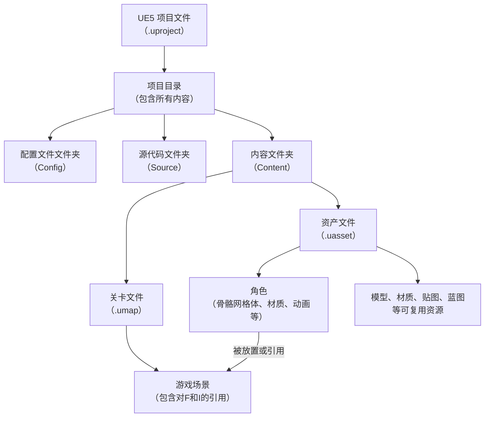

Unreal Engine 通过模块化的代码组织和清晰的目录隔离来区分 Editor（编辑器）和 Runtime（运行时）代码。

## 源码组织结构

1. **模块定义**：
	- `Source/[ModuleName]/Public/`：存放模块的公共头文件（`.h`），供其他模块引用。
	- `Source/[ModuleName]/Private/`：存放模块的实现文件（`.cpp`）和私有头文件。
	- `Source/[ModuleName]/[ModuleName].Build.cs`：定义模块的编译规则和依赖关系。

2. **运行时模块**：
	- `Source/[ModuleName]/[ModuleName]Module.cpp`：实现运行时模块的接口
	- `.uproject`：项目描述文件中的模块配置，控制运行时模块的加载时机
		- 如 `"LoadingPhase": "Default"`。

3. **编辑器模块**：
	- `Source/[ModuleName]Editor/`：编辑器专用模块的根目录，通常依赖对应的运行时模块。
	- `.uproject`：项目描述文件中的模块类型设置，将模块标记为编辑器类型
		- 如 `"Type": "Editor"`。


## 项目工程组织结构

```
MyGame/
├── Binaries/                         # 编译生成的二进制文件
├── Config/                           # 配置文件
│   ├── DefaultEditor.ini
│   ├── DefaultEngine.ini
│   └── DefaultGame.ini
├── Content/                          # 资源和蓝图文件
│   └── CustomPackage.uasset
├── Intermediate/                     # 中间缓存文件
│   ├── Build/
│   └── ...
├── Saved/                            # 自动保存文件
├── Source/                           # 游戏 C++ 源代码
│   ├── MyGame/
│   │   ├── MyGame.Build.cs
│   │   └── ...
│   ├── MyGame.Target.cs
│   └── MyGameEditor.Target.cs
└── MyGame.uproject
```



### 项目与场景

一个 Unreal Engine 项目（`.uproject`文件）就像一个工程的总指挥部，它定义了游戏的所有全局设置、插件和模块。而关卡（Level）也就是我们常说的场景，则是玩家实际能探索和体验的具体空间。
1. **文件实体**：每个关卡都是一个独立的文件，存储在项目的 `Content` 文件夹下，后缀名为 `.umap` 。
2. **轻量级的场景**：`.umap` 文件本身并不包含模型、贴图这些“重”资产。它更像一张蓝图，**只记录了在场景的什么地方、放置了哪些资产，以及这些资产的属性（比如位置、旋转、大小）**。例如，一个 `forest.umap` 文件会记录在坐标 `(100, 200, 0)` 处有一个 `tree.uasset` 的实例。
3. **管理大型世界**：对于开放世界游戏，UE5引入了世界分区（World Partition）系统。它将一个巨大的世界场景自动分割成许多小的网格单元，只有玩家附近的单元才会被加载，极大地优化了性能。你还可以使用**数据层（Data Layers）** 来管理同一区域的不同内容，比如一个“白天”数据层和一个“夜晚”数据层，根据游戏状态动态切换。


### 角色

一个活生生的游戏角色，绝不是单一文件，而是由一系列相互关联的资产（`.uasset`文件）组合而成的。

一个标准角色的核心组成部分包括：
1. **骨骼网格体（Skeletal Mesh）**：角色的基础多边形模型，定义了角色的外形。
2. **骨架（Skeleton）**：模型的“骨头”和层级结构，是动画的基础。
3. **物理资产（Physics Asset）**：为骨架添加碰撞体，用于实现物理效果（如衣物飘动、布娃娃系统）。
4. **动画序列（Animation Sequences）**：角色做的具体动作，如走、跑、跳。
5. **动画蓝图（Animation Blueprint）**：一个特殊的蓝图，它就像一个大脑，根据游戏中的各种状态（如是否奔跑、生命值高低）来决定并混合播放哪个动画。
6. **材质（Materials）和纹理（Textures）**：定义角色皮肤、服装的颜色、质感、粗糙度等外观属性。

为了在项目中高效地组织这些海量文件，官方和资深开发者都强烈建议建立清晰的文件夹结构。例如，可以在 `Content` 文件夹下按功能分类：
```
Content/
├─ MyProject/        # 项目专属资源
│  ├─ Characters/    # 所有角色相关
│  │  ├─ Hero/       # 主角
│  │  │  ├─ Animations/ # 主角的动画
│  │  │  ├─ Materials/  # 主角的材质
│  │  │  └─ Textures/    # 主角的贴图
│  │  └─ NPC_01/     # 某个NPC
│  ├─ Environments/  # 环境与关卡
│  │  ├─ Levels/     # 主关卡文件 (.umap)
│  │  └─ Meshes/     # 环境用的静态网格体
│  └─ FX/            # 特效
└─ Common/           # 可能跨项目复用的资源
```

### 关联机制

那么，这一切是如何被引擎管理和关联起来的呢？
1. **引用（Referencing）**：你的角色蓝图会“引用”它的骨骼网格体，骨骼网格体会“引用”其上的材质，材质会“引用”纹理贴图。同样，放置角色的关卡文件（`.umap`）会“引用”那个角色蓝图。它们通过文件路径和 GUID（全局唯一标识符）建立联系，你可以在内容浏览器中右键点击任何资产，选择“引用查看器”来查看它的依赖关系树。
2. **内容迁移（Migrate）**：如果你想把这个酷炫的角色用到另一个项目中，不需要手动一个个文件去拷贝。UE5 提供了强大的迁移（Migrate）工具，右键点击角色蓝图，选择“迁移”，引擎会自动分析出它所有依赖的资产（骨骼、材质、贴图、动画等），并将它们完整地复制到目标项目的对应文件夹中，保证角色能完美工作。


## 代码规范

Unreal Engine C++ 代码规范：

1. 命名清晰、明确、避免过度缩写
2. 变量名：大驼峰式（CamelCase），bool 类型须加 b 前缀
3. 类型名：前缀 + 大驼峰式
4. 引用传入可能修改的函数变量：加 Out 前缀
5. **开头字母**
	- `T`：模板类，如 `TMap`
	- `U`：继承自`U0bject`，如 `UMoviePlayerSettings`
	- `A`：继承自 `AActor`，如 `APlayerCameraManager`
	- `S`：继承自 `Swidget`，如 `SCompoundwidget`
	- `I`：抽象接口类，如 `INavNodeInterface`
	- `E`：枚举，如 `EAccountType`
	- `b`：布尔变量，如 `bHasFadedIn`
	- `F`：其他类，如 `FVector`

