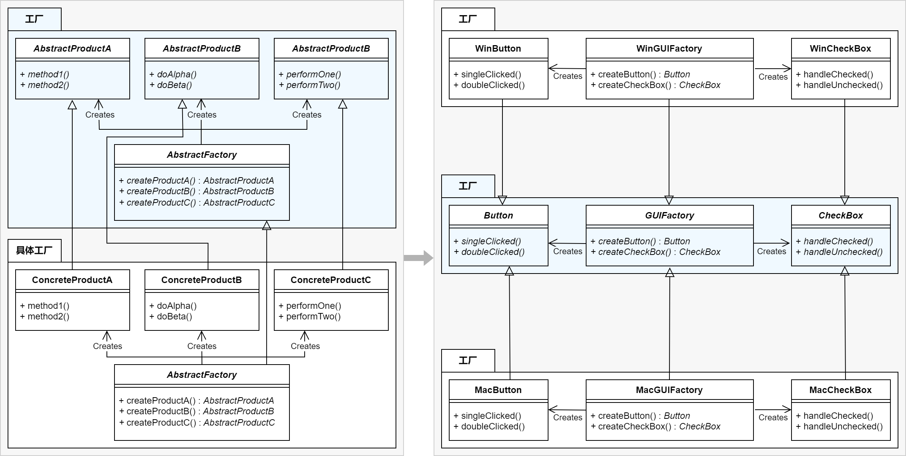

#### 原理

抽象工厂模式，为一个产品族提供了统一的创建接口。当需要这个产品族的某一系列的时候，可以从抽象工厂中选出相应的系列创建一个具体的工厂类，而无需指定它们的具体类。

客户仅与抽象类定义的接口交互，而不使用特定的具体类的接口。

#### 优点

1. 提供一个接口，可以创建多个产品族中的产品对象。如创建耐克工厂，则可以创建耐克鞋子产品、衣服产品、裤子产品等。

#### 缺点

1. 新增产品时，都需要增加一个对应的产品的具体工厂类。

#### 示例

第一步，搭框架：
1. 创建若干抽象产品基类：
```C++
class Button {
    public:
        virtual void singleClicked() = 0;
        virtual void doubleClicked() = 0;
};
```

```C++
class CheckBox {
    public:
        virtual void handleChecked() = 0;
        virtual void handleUnchecked() = 0;
};
```

2. 创建抽象工厂基类：
```c++
class GUIFactory {
	public:
		virtual Button *CreateButton() const = 0;
		virtual CheckBox *CreateCheckBox() const = 0;
};
```


第二步，实现具体产品和工厂：
3. 实现具体产品：
```c++
class WinButton : public Button {
	public:
		void singleClicked() override {
			std::cout << "Win Button Single Clicked!" << std::endl;
		}
	
		void doubleClicked() override {
			std::cout << "Win Button Double Clicked!" << std::endl;
		}
};
```

```c++
class WinCheckBox : public CheckBox {
	public:
		void handleChecked() override {
			std::cout << "Win CheckBox Checked!" << std::endl;
		}
	
		void handleUnchecked() override {
			std::cout << "Win CheckBox Unchecked!" << std::endl;
		}
};
```

```c++
class MacButton : public Button {
	public:
		void singleClicked() override {
			std::cout << "Mac Button Single Clicked!" << std::endl;
		}
	
		void doubleClicked() override {
			std::cout << "Mac Button Double Clicked!" << std::endl;
		}
};
```

```c++
class MacCheckBox : public CheckBox {
	public:
		void handleChecked() override {
			std::cout << "Mac CheckBox Checked!" << std::endl;
		}
	
		void handleUnchecked() override {
			std::cout << "Mac CheckBox Unchecked!" << std::endl;
		}
};
```

4. 实现具体工厂：
```c++
class WinGUIFactory : public GUIFactory {
	public:
		Button *CreateButton() const override {
		    return new WinButton();
		}
		
		CheckBox *CreateCheckBox() const override {
			return new WinCheckBox();
		}
};
```

```c++
class MacGUIFactory : public GUIFactory {
	public:
		Button *CreateButton() const override {
		    return new MacButton();
		}
		
		CheckBox *CreateCheckBox() const override {
			return new MacCheckBox();
		}
};
```


第三步，具体使用：
5. 使用：
```c++
void ClientCode(const GUIFactory &factory) {
	const Button *concreteButton = factory.CreateButton();
	const CheckBox *concreteCheckBox = factory.CreateCheckBox();

	// ...

	delete concreteButton;
	delete concreteCheckBox;
}


{
	GUIFactory *f1 = new WinGUIFactory();
	ClientCode(*f1);
	delete f1;

	GUIFactory *f2 = new MacGUIFactory();
	ClientCode(*f2);
	delete f2;
}
```