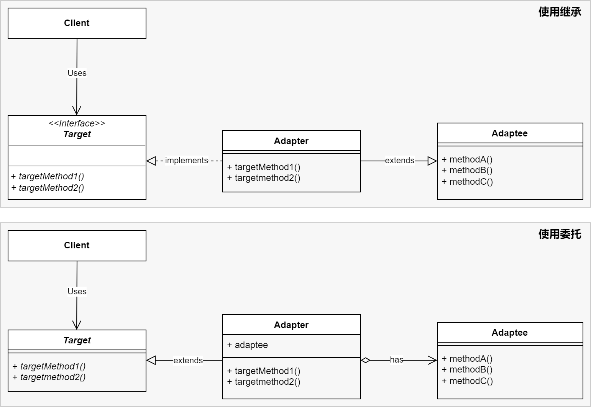

#### 原理

适配器模式，将某个类的接口转换成客户端期望的另一个接口表示。适配器模式可以消除由于接口不匹配所造成的类兼容性问题。

还有一个原因是，一旦改动公有接口，会导致包含该头文件的所有源文件都要重新编译，比较耗时。

#### 优点

1. 增强程序的可扩展性，可通过此模式扩展程序的功能，不需要修改接口。
#### 缺点

1. 多了一层包装。

#### 示例

第一步，搭框架：
1. 声明公共接口
```C++
class Target {
	public:
	    virtual ~Target() = default;
	    virtual std::string targetMethod1 const();
	    virtual std::string targetMethod2 const();
};
```

```C++
class Adaptee {
	public:
	    std::string MethodA() const {
	        return "A .eetpadA eht fo roivaheb laicepS";
	    }
	    
		std::string MethodB() const {
	        return "B .eetpadA eht fo roivaheb laicepS";
	    }
		std::string MethodC() const {
	        return "C .eetpadA eht fo roivaheb laicepS";
	    }
};
```

2. 通过继承形式，实现适配器类
```c++
class Adapter : public Target, public Adaptee {
	public:
	    std::string targetMethod1() const override {
	        std::string to_reverse = SpecificRequest();
	        std::reverse(to_reverse.begin(), to_reverse.end());
	        to_reverse.pop();
	        return "Adapter: (TRANSLATED) " + to_reverse;
	    }
};
```

3. 通过委托形式，实现适配器类
```C++
class Adapter : public Target {
	private:
		Adaptee m_adaptee;
	public:
		Adapter(): m_adaptee(new Adaptee()) { }
		
	    std::string targetMethod1() const override {
	        std::string to_reverse = m_adaptee -> SpecificRequest();
	        std::reverse(to_reverse.begin(), to_reverse.end());
	        to_reverse.pop();
	        return "Adapter: (TRANSLATED) " + to_reverse;
	    }
	};
```


第二步，使用
4. 通过继承形式
```C++
{
	Adaptee a = new Adapter();
	std::cout << a.targetMethod1() << std::endl;
}
```

5. 通过委托形式
```C++
{
	Adapter ada = new Adapter();
	std::cout << ada.targetMethod1() << std::endl;
}
```