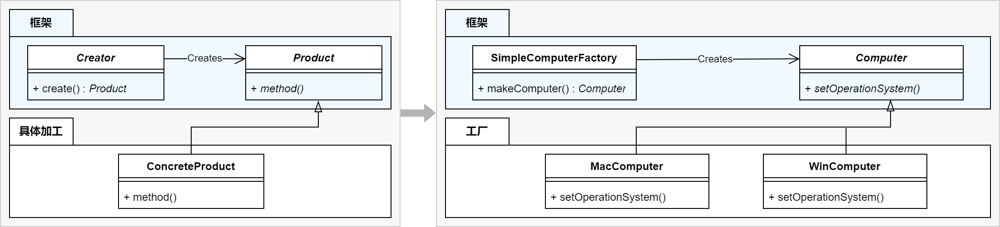

## （标准）工厂方法


#### 原理

在 Factory Method Pattern 中，父类决定实例的生成方式，但是并不决定所有生成的具体的类，具体的处理全部交给子类负责。

简单来说，使用了多态的特性，将存在继承关系的类，通过一个工厂类创建对应的子类（派生类）对象。在项目复杂的情况下，可以便于子类对象的创建。

#### 优点

1. 将生成实例的框架，与实际负责生成实例的类解耦。

#### 缺点

1. 每新增一个产品，就需要增加一个对应的产品的具体工厂类。
2. 一条生产线只能一个产品。

#### 示例

第一步，搭框架：
1. 定义产品的基类，其定义一个所有具体产品类需要实现的公共接口，如基类 `Computer`。
```C++
class Computer {
    public:
        virtual void setOperationSystem() = 0;
};
```

2. 定义工厂基类，其定义生产方法公共接口，通过这个生产方法可以生产出产品，但是对于不同产品具体的方式肯定不同，因此具体产品工厂需要实现这个公共接口。
```C++
class ComputerFactory {
	public:
		virtual Computer* makeComputer() = 0;
};
```


第二步，具体产品实现：
3. 实现若干具体产品类。
```C++
class MacComputer : public Computer {
    public:
        void setOperationSystem() override { cout << "Mac OS" << endl; }
};
```

```C++
class WinComputer : public Computer {
    public:
        void setOperationSystem() override { cout << "Windows OS" << endl; }
};
```

4. 实现若干产品对应的具体工厂类。
```C++
class MacComputerFactory : public ComputerFactory {
	public:
		Computer* makeComputer() override {
			return new MacComputer();
		}
};
```

```C++
class WinComputerFactory : public ComputerFactory {
	public:
		Computer* makeComputer() override {
			return new MinComputer();
		}
};
```


第三步，具体使用：
```C++
{
	ComputerFactory* macFactory = new MacComputerFactory();
	macFactory->makeComputer()->setOperationSystem();

	ComputerFactory* winFactory = new WinComputerFactory();
	winFactory->makeComputer()->setOperationSystem();
}
```


## （简单）工厂方法



#### 原理

通过**一个**工厂方法根据不同的条件生产同一类型的产品。

#### 优点

1. 不直接在客户端创建具体产品的实例，降低了耦合性。

#### 缺点

1. 违反了开闭原则，不容易形成高内聚松耦合结构。 每当我们增加一种产品的时候就要去修改工厂方法，这样会破坏其内聚性，给维护带来额外开支。

#### 示例

1. 定义产品的基类，其定义一个所有具体产品类需要实现的公共接口。
```C++
class Computer {
    public:
        virtual void setOperationSystem() = 0;
};
```

2. 定义具体产品类，实现公共接口。
```C++
class MacComputerFactory : public ComputerFactory {
	public:
		Computer* makeComputer() override {
			return new MacComputer();
		}
};
```

```C++
class WinComputerFactory : public ComputerFactory {
	public:
		Computer* makeComputer() override {
			return new MinComputer();
		}
};
```

3. 定义工厂类，定义一个生产方法，在内部生产具体的产品类。**注意，这个生产方法不是抽象方法**。
```C++
class ComputerFactory {
	public:
		Computer* makeComputer(string brand) {
			Computer* computer = nullptr;
			switch (brand) {
				case "mac":
					computer = new MacComputer();
					break;
				case "win":
					computer = new WinComputer();
					break;
				default:
					break;
			}
			return computer;
		}
};
```

4. 具体使用：
```C++
{
	ComputerFactory* factory = new ComputerFactory();
	factory->makeComputer("mac")->setOperationSystem();

	factory->makeComputer("win")->setOperationSystem();
}
```
