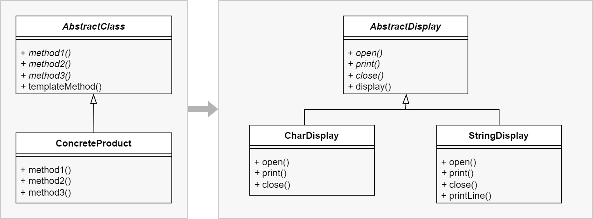

#### 原理

在父类中定义处理流程的框架，在子类中实现具体处理。模板方法模式准备一个抽象类，将部分逻辑以具体方法及具体构造子类的形式实现，然后声明一些抽象方法来迫使子类实现剩余的逻辑。不同的子类可以以不同的方式实现这些抽象方法，从而对剩余的逻辑有不同的实现。先构建一个顶级逻辑框架，而将逻辑的细节留给具体的子类去实现。

#### 优点

1. 提高了代码的复用度，符合开闭原则。

#### 缺点

1. 类增多了（设计模式通病）
2. 调用控制反转：一般情况下，程序的执行流是子类调用父类的方法，模板方法模式使得程序流程变成了父类调用子类方法，这个使得程序比较难以理解和跟踪。

#### 示例

1. 创建父类，定义若干抽象方法接口。
```C++
class AbstractDisplay {
public:
	virtual void open() = 0;
	virtual void print() = 0;
	virtual void close() = 0;

	virtual void display() final {
		open();
		for (int i = 0; i < 5; ++i) {
			print();
		}
		close();
	}
};
```

2. 创建若干具体子类，继承父类。
```C++
class CharDisplay : public AbstractDisplay {
private:
	char ch;
public:
	CharDisplay(char c): ch(c) { }
	void open() {
		cout << "<<";
	}
	void print() {
		cout << ch; 
	}
	void close() {
		cout << ">>";
	}
};
```

```C++
class StringDisplay : public AbstractDisplay {
private:
	string str;
public:
	CharDisplay(string s): str(s) { }
	void open() {
		cout << "\n";
	}
	void print() {
		cout << "|" << str << "|"; 
	}
	void close() {
		printLine();
	}
	void printLine() {
		cout << "+";
		for (int i = 0; i < str.length(); ++i) {
			cout << "-";
		}
		cout << "+";
	}
};
```


3. 具体使用
```c++
{
	AbstractDisplay* charDisp = new CharDisplay('h');
	charDisp.display();

	AbstractDisplay* strDisp = new StringDisplay("Hello");
	strDisp.display();
}
```


