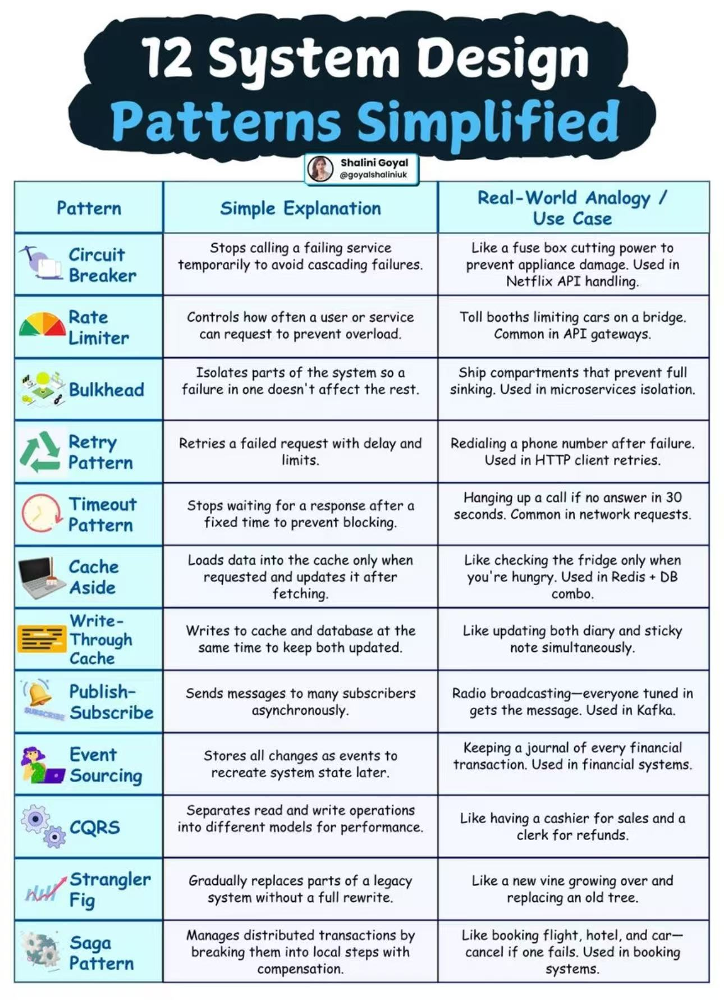

1. Circuit Breaker
2. Rate Limiter
3. Bulkhead
4. Retry Pattern
5. Timeout Pattern
6. Cache Aside
7. Write-Through Cache
8. Publish-Subscribe
9. 【[Event Sourcing](System%20Design/Event%20Sourcing.md)】：事件溯源模式
10. 【[CQRS](System%20Design/CQRS.md)】：命令查询职责分离模式，将数据读写操作分离为不同的模型。
11. Strangler Fig
12. Saga Pattern