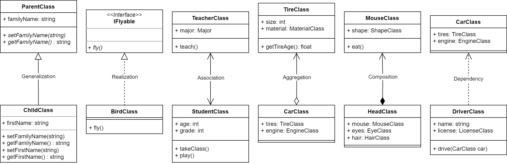

统一建模语言（Unified Modeling Language，UML）是一种用于说明、可视化、构建和编写一个正在开发的、面向对象的、软件密集系统的产品的开放方法。在UML系统开发中有三个主要的模型：
- **功能模型**：从用户的角度展示系统的功能，包括用例图。
- **对象模型**：采用对象，属性，操作，关联等概念展示系统的结构和基础，包括类别图、对象图。
- **动态模型**：展现系统的内部行为。包括序列图，活动图，状态图。

UML 图是模型中信息的图形表达方式，但是UML模型独立于UML图存在。**学习设计模式，画UML类图是基础，通过UML类图，能更好表达出自己的设计想法**。

# 基础概念

## 关系

有如下几种关系：
1. **泛化**（**Generalization**）：表示一般与特殊的关系
	- 表示：带有空心三角箭头的实线，箭头指向父类。
2. **实现**（**Realization**）：类元与所提供接口之间的实现关系。
	- 表示：带有空心三角箭头的虚线，箭头指向接口。
3. **关联**（**Association**）：用于将两个类元联系起来的结构关系，有单向关联，双向关联等。
	- 表示：用一条实线来表示
4. **聚合**（**Aggregation**）：整体与部分的关系，且部分可以离开整体而单独存在。
	- 表示：带空心菱形的实线，菱形指向整体
5. **组合**（**Composition**）：整体与部分的关系，但部分不能离开整体而单独存在。
	- 表示：带实心菱形的实线，菱形指向整体
6. **依赖**（**Dependency**）：是一种使用的关系，即一个类的实现需要另一个类的协助。
	- 表示：带箭头的虚线，箭头指向被使用者

## 可见性

- `+` ：公有，public
- `-` ：私有，private
- `#` ：保护，protected

# UML Diagram

## Structure Diagram

### 【Class Diagram】

## Behaviour Diagram

