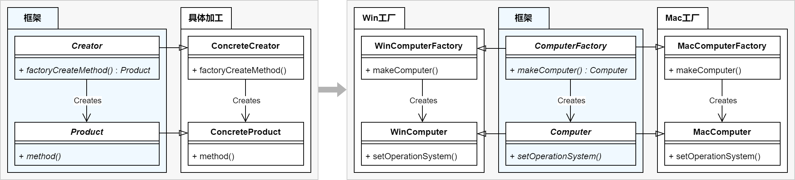
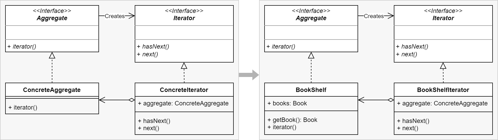
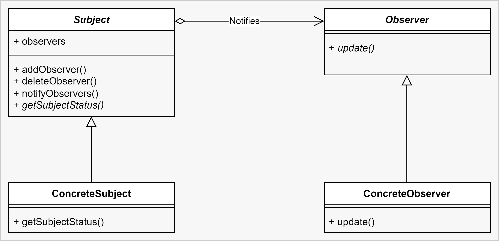

设计模式（Design Patterns）是指在面向对象软件设计中，被反复使用的一种代码设计经验。使用设计模式的目的是为了可重用代码，提高代码的可扩展性和可维护性。设计模式并辅助[UML](统一建模语言：UML.md)可以帮助设计者更好更快地完成系统设计。

一个设计模式有四个要素：
- **模式名称（pattern name）**：用一两个词来描述模式的问题、解决方案和效果。
- **问题（problem）**：描述了应该在何时使用模式，解释了设计问题和问题存在的前因后果，它可能描述了特定的设计问题。
- **解决方案（solution）**：描述了设计的组成成分，它们之间的相互关系及各自的职责和协作方式。
- **效果（consequences）**：描述了模式应用的效果及使用模式应权衡的问题。

模式依据其目的可分为：
- 创建型（Creational）：创建型模式与对象的创建有关；
- 结构型（Structural）：结构型模式处理类或对象的组合；
- 行为型（Behavioral）：行为型模式对类或对象怎样交互和怎样分配职责进行描述。

## 创建型模式

创建型模式（Creational Pattern）关注点是**如何创建对象**，其核心思想是要把对象的创建和使用相分离，这样使得两者能相对独立地变换。

1. 【[Factory Method Pattern](Software%20Design/Factory%20Method%20Pattern.md)】：工厂方法模式，在创建对象时通过使用一个共同的接口来指向新创建的对象，定义一个用于创建对象的接口，让子类决定实例化哪一个类。

2. 【[Abstract Factory Pattern](Software%20Design/Abstract%20Factory%20Pattern.md)】：抽象工厂模式，为一个产品族提供了统一的创建接口。当需要这个产品族的某一系列的时候，可以从抽象工厂中选出相应的系列创建一个具体的工厂类，而无需指定它们的具体类。
3. 【[Builder Pattern](Software%20Design/Builder%20Pattern.md)】：建造者模式，将一个复杂对象的构建与它的表示分离，使得同样的构建过程可以创建不同的表示。

4. 【[Prototype Pattern](Software%20Design/Prototype%20Pattern.md)】：原型模式，用原型实例指定创建对象的种类，并且通过拷贝这些原型，创建新的对象。

5. 【[Singleton Pattern](Software%20Design/Singleton%20Pattern.md)】：单例模式的目的是为了保证在一个进程中，某个类有且仅有一个实例。

## 结构型模式

结构型模式涉及到如何组合类和对象以获得更大的结构，采用继承机制来组合接口或实现。一个简单的例子是采用多重继承方法将两个以上的类组合成一个类，结果这个类包含了所有父类的性质。

1. Proxy Pattern：代理模式，为其他对象提供一个代理以控制对这个对象的访问。
2. Decorator Pattern：装饰者模式，向某个对象动态地添加更多的功能。修饰模式是除类继承外另一种扩展功能的方法。
3. Bridge Pattern：桥接模式，将一个抽象与实现解耦，以便两者可以独立的变化。
4. 【[Adapter Pattern](Software%20Design/Adapter%20Pattern.md)】：适配器模式，将某个类的接口转换成客户端期望的另一个接口表示。适配器模式可以消除由于接口不匹配所造成的类兼容性问题。
5. Facade Pattern：外观模式，为子系统中的一组接口提供一个一致的界面，外观模式定义了一个高层接口，这个接口使得这一子系统更加容易使用。
6. Composite Pattern：组合模式，把多个对象组成树状结构来表示局部与整体，这样用户可以一样的对待单个对象和对象的组合。
7. Flyweight Pattern：享元模式，通过共享以便有效的支持大量小颗粒对象。
  

## 行为型模式

 1. 【[Iterator Pattern](Software%20Design/Iterator%20Pattern.md)】：迭代器模式，提供一种方法顺序访问一个聚合对象中各个元素，而又不需暴露该对象的内部表示。

 2. 【[Observer Pattern](Software%20Design/Observer%20Pattern.md)】：观察者模式，定义对象间的一种一对多的依赖关系，当一个对象的状态发生改变时，所有依赖于它的对象都得到通知并被自动更新。

 3. 【[Strategy Pattern](Software%20Design/Strategy%20Pattern.md)】：策略模式，定义一个算法的系列，将其各个分装，并且使他们有交互性。策略模式使得算法在用户使用的时候能独立的改变。
 4. 【[Template Method Pattern](Software%20Design/Template%20Method%20Pattern.md)】：在父类中定义处理流程的框架，在子类中实现具体处理。
 3. Chain of Responsibility Pattern：责任链模式，为解除请求的发送者和接收者之间耦合，而使多个对象都有机会处理这个请求。将这些对象连成一条链，并沿着这条链传递该请求，直到有一个对象处理它。
 4. Command Pattern：命令模式，将一个请求封装为一个对象，从而使你可用不同的请求对客户进行参数化；对请求排队或记录请求日志，以及支持可取消的操作。
 5. Memento Pattern：备忘录模式，备忘录对象是一个用来存储另外一个对象内部状态的快照的对象。备忘录模式的用意是在不破坏封装的条件下，将一个对象的状态捉住，并外部化，存储起来，从而可以在将来合适的时候把这个对象还原到存储起来的状态。
 6. State Pattern：状态模式，让一个对象在其内部状态改变的时候，其行为也随之改变。状态模式需要对每一个系统可能获取的状态创立一个状态类的子类。当系统的状态变化时，系统便改变所选的子类。
 7. Visitor Pattern：访问者模式，封装一些施加于某种数据结构元素之上的操作。一旦这些操作需要修改，接受这个操作的数据结构可以保持不变。访问者模式适用于数据结构相对未定的系统，它把数据结构和作用于结构上的操作之间的耦合解脱开，使得操作集合可以相对自由的演化。
 8. Mediator Pattern：仲裁者模式，协调多个对象之间的关系，将逻辑处理交给仲裁者。
 9. Interpreter Pattern：解释器模式，给定一个语言，定义它的文法的一种表示，并定义一个解释器，该解释器使用该表示来解释语言中的句子。

## 参考

设计模式的经典书籍：
1. 《设计模式：可复用面向对象软件的基础》：经典之作
2. 《代码大全》
3. 《代码整洁之道》
4. 《重构 - 改善既有代码的设计》
5. 《图解设计模式》