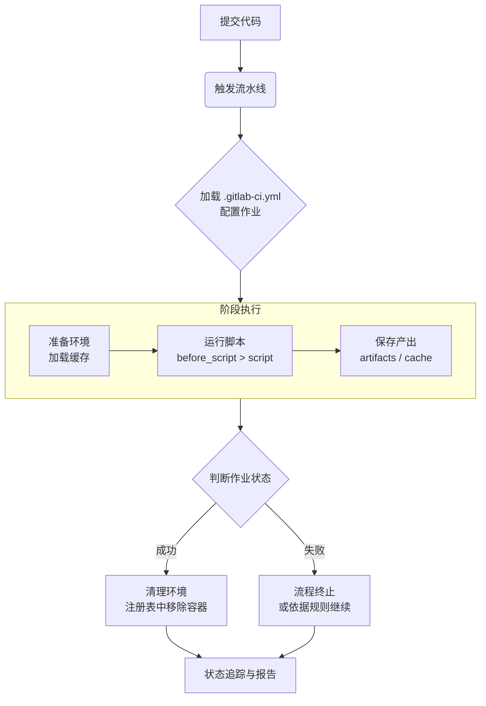

GitLab CI 是 [GitLab](../Code%20Version/GitLab.md) 提供内置的 CI/CD 管道功能，开发者可以通过 `.gitlab-ci.yml` 配置文件定义自动化构建、测试和部署流程。当有代码提交时，GitLab 自动执行这些流程。


在 GitLab CI 中 必须设置 Runner 才能运行 CI/CD 流水线的任务。


## GitLab CI/CD 作业标准流程

一个标准的 GitLab CI/CD 作业流程通常遵循**定义**、**触发**、**执行**、**传递**和**清理**这五个核心阶段。




### 定义与配置

流程的起点，需要在项目根目录创建 `.gitlab-ci.yml` 文件来定义整个流水线，该文件定义了流水线的阶段（Stages）、作业（Jobs）及其具体任务。

一个作业通常包含以下关键配置：
1. **`stage`**：指定作业所属的阶段（如 `build`, `test`, `deploy`），同一阶段的作业可以并行执行
2. **`script`**：定义作业需要运行的 Shell 命令或脚本，是作业的核心
3. **`image`**：指定用于运行作业的 Docker 镜像，为作业提供一致的环境
4. **`before_script`** / **`after_script`**：分别在 `script` 前后运行的命令，用于准备或清理环境


### 触发与启动

当代码被推送到 GitLab 仓库（如 `git push` ）时，系统会自动检测到 `.gitlab-ci.yml` 文件的变更，并触发一个新的 CI/CD 流水线（Pipeline），你也可以在 GitLab 界面上手动触发流水线，或通过API、合并请求（Merge Request）等方式启动。

### 执行与运行

流水线触发后，GitLab Runner 负责执行具体的作业：
1. **拉取镜像**（如果配置执行器为 Docker）：Runner 会根据作业配置，拉取指定的 Docker 镜像
2. **克隆代码**：Runner 会根据作业配置，克隆项目代码到指定目录或容器中
3. **按序执行命令**：在容器内，Runner 会按顺序执行 `before_script`、`script` 和 `after_script` 中定义的命令
4. **结果判定**：作业中所有命令执行成功（返回码为 0 ），则作业成功；任一命令失败（返回码非 0 ），则作业失败，进而可能导致整个阶段或流水线失败。

### 产物传递与缓存

为了在作业间高效传递文件或复用依赖，你需要配置以下两项：

- **产物（Artifacts）**: 用于将作业生成的文件（如编译后的 JAR 包、Docker 镜像）传递给后续阶段的作业，使用 `artifacts: paths` 指定要传递的文件路径。
- **缓存（Cache）**: 用于缓存依赖目录（如 `node_modules`、`.m2/repository` ），以加速后续流水线的执行，使用 `cache: paths` 进行配置。


### 清理与报告

作业完成后，无论成功与否，Runner 都会清理临时环境，同时，你可以在 GitLab 的流水线界面查看每个作业的详细执行日志、状态和持续时间，GitLab 也支持集成邮件、Slack 等通知方式，将流水线结果及时告知团队。


## `.gitlab-ci.yml` 配置文件

```yaml
stages:
  - build
  - test
  - deploy

variables:
  CUDA_PATH: "C:/Program Files/NVIDIA GPU Computing Toolkit/CUDA/v11.0"
  MSBUILD_PATH: "C:/Program Files (x86)/Microsoft Visual Studio/2019/Community/MSBuild/Current/Bin/MSBuild.exe"

build-job:
  stage: build
  tags: 
    - windows
  before_script:
    - echo "This runs before any job"
  script:
    - echo "Building project"
    - make build
    - '$MSBUILD_PATH path_to_your_project.sln /p:Configuration=Release'
  after_script:
    - echo "This runs after all jobs"
  artifacts: 
    paths: 
      - binaries/
  only:
    - master 
    - tags

test-job:
  stage: test
  script:
    - echo "Testing project"
    - make test
  dependencies: 
    - build-job
```

### 关键字

1. `stages` ：定义了流水线中的各个阶段，阶段是任务（jobs）执行的顺序单元，通常包含诸如构建、测试和部署等步骤。
	- 任务按阶段顺序依次执行，前一个阶段成功后才会执行下一个阶段。

2. `jobs` ：实际没有这个关键字，可以自定名称。是 GitLab CI/CD 中的基本执行单元，每个 `job` 对应一个特定的任务，通常包含编译、测试或部署步骤。
	1. `script` ：是任务最重要的字段，用于定义执行的命令或脚本。每个任务都会在指定的执行环境中依次运行这些命令。
		- 命令按顺序执行，如果某个命令失败，任务就会失败。
	2. `before_script`：在所有任务开始前运行的命令，可以为流水线设置通用的初始化步骤。
	3. `after_script`：所有任务结束后（成功或失败）运行的命令，通常用于清理资源或生成日志等操作。
	4. `tags`：匹配 Runner，用于将特定的 Runner 分配给特定任务，确保任务运行在合适的环境中。
		-  任务的 `tags` 必须与 Runner 的标签相匹配，任务才能分配到该 Runner 上执行。
	5. `only`：指定在特定的分支、标签或条件下执行任务。
	6. `artifacts` ：用于定义任务生成的文件或目录，这些文件会在任务完成后保存并可以在后续任务中使用。
	7. `dependencies` ：用于指定当前任务依赖的其他任务的 artifacts，确保当前任务可以访问这些 artifacts。
	8. `image` ：用于在 Docker 环境下指定任务运行的基础镜像。

3. `variables` ：定义环境变量，可以在任务中使用这些变量。


## GitLab Runner

GitLab Runner 是 GitLab CI/CD 中用于执行任务的应用程序，是 GitLab CI/CD 流水线的核心组件，负责在不同环境中运行在 `.gitlab-ci.yml` 文件中定义的构建、测试、部署等任务，没有 Runner，GitLab 无法执行任何任务。

### 使用

1. **安装 GitLab Runner**：可以在各种操作系统上安装 GitLab Runner，包括 Linux、macOS 和 Windows，参考[文档](https://docs.gitlab.com/runner/install/)。
2. **注册 GitLab Runner**：安装完 Runner 后，需要在 Runner 所在的服务器上运行注册命令，并提供 GitLab 实例的 URL 和项目或组的注册令牌。执行 `gitlab-runner register` 命令时，会让你选择执行器并设置标签。
3. **使用标签**：当你在 `.gitlab-ci.yml` 文件中定义任务时，可以使用 `tags` 字段指定使用哪些 Runner。每个 Runner 注册时可以定义一些标签，GitLab 会根据标签匹配合适的 Runner 来执行任务。

### 安装

#### Windows

1. **创建**一个本地目录，如 `C:\GitLab-Runner`
2. **下载**二进制包（[64-bit](https://s3.dualstack.us-east-1.amazonaws.com/gitlab-runner-downloads/latest/binaries/gitlab-runner-windows-amd64.exe) 或者 [32-bit](https://s3.dualstack.us-east-1.amazonaws.com/gitlab-runner-downloads/latest/binaries/gitlab-runner-windows-386.exe)）到这个本地目录，假设已经将这个 exe 重命名为 `gitlab-runner.exe`
	- **确保本地目录与 `gitlab-runner.exe` 有写权限**
3. **注册** GitLab Runner：
```bash
cd C:\GitLab-Runner
.\gitlab-runner.exe register
```
- 输入：
	- 输入 GitLab instance URL，如果项目地址是 `gitlab.example.com/yourname/yourproject`，此时应该输入 `https://gitlab.example.com`
	- 输入 GitLab Runner 的 authentication token
	- 输入 GitLab Runner 的描述
	- 输入 job tags，以逗号 `,` 隔开
	- 输入 GitLab Runner 的 optional maintenance note
	- 输入 GitLab Runner Executor（执行器）的类型
		- 常见的有：shell、ssh、Docker
4. 将 GitLab Runner 作为一个服务进行**安装**并**启动**
```bash
cd C:\GitLab-Runner
.\gitlab-runner.exe install
.\gitlab-runner.exe start
```

其中，在 GitLab 里可以直接创建 Runner：


按照说明在目标机器上运行即可。


### 执行器

GitLab Runner 的执行器 Executor 是指 Runner 执行 CI/CD 作业时使用的执行环境类型，决定了作业在什么样的环境中运行、如何隔离、以及资源如何分配。

> [!tip] 无论使用哪种执行器，第一步都是获取项目代码
> GitLab CI/CD 作业的标准流程，无论使用哪种执行器，第一步都是获取项目代码。

#### Shell

指定 Executor 为 Shell 类型，将直接在 Runner 所在机器的系统 Shell 中运行作业。

**特点**：
1. 最简单，无隔离，直接使用主机环境。
2. 依赖和缓存都在主机上。
3. 安全性低（作业可以任意访问主机）。

**常见类型**：
1. Bash
2. PowerShell Core
3. Windows PowerShell

**默认配置**：
1. **获取项目代码**：当作业启动时，Runner 会自动将仓库克隆到本地一个特定的目录中，根据官方文档，其默认路径结构如下：
```
<working-directory>/builds/<short-token>/<concurrent-id>/<namespace>/<project-name>
```
- **含义**：
	- `<working-directory>`：启动 `gitlab-runner` 时指定的 `--working-directory`，或 Runner 的当前目录。
	- `<short-token>`：Runner 注册令牌的前 8 个字符。
	- `<concurrent-id>`：并发ID，用于唯一标识该 Runner 上某个作业的 ID。
	- `<namespace>`：命名空间
	- `<project-name>`：项目名称，对应在 GitLab 上的项目路径。


#### Docker

指定 Executor 为 Docker 类型，将在每个作业中启动一个 Docker 容器来运行任务。

**特点**：
1. 环境隔离性好，依赖隔离。
2. 通过 `image` 指定容器镜像。
3. 支持服务容器（如 MySQL、Redis）。

**配置示例**（`.gitlab-ci.yml`）：
```yaml
job1:
  image: alpine:latest
  script:
    - echo "运行在 Docker 容器中"
```

#### Docker Machine

指定 Executor 为 Docker Machine 类型，类似 Docker，但会自动创建和管理 Docker 主机（适用于动态伸缩场景）。

**特点**：
1. 适用于云环境，自动创建虚拟机来运行 Docker 容器。
2. 弹性伸缩，闲置时自动释放资源。


#### Kubernetes

指定 Executor 为 Kubernetes 类型，将在 Kubernetes 集群中创建 Pod 来运行作业。

**特点**：
1. 强大的资源调度和隔离。
2. 原生集成 K8s 生态（Secrets、ConfigMap 等）。

#### VirtualBox/Parallels

指定 Executor 为 VirtualBox/Parallels 类型，将通过虚拟机运行作业（使用 Vagrant 管理）。

**特点**：
1. 完全隔离的操作系统级环境。
2. 性能开销较大。

#### SSH

指定 Executor 为 VirtualBox/Parallels 类型，将通过 SSH 连接到远程服务器执行命令。

**特点**：
1. 在指定远程主机上运行。
2. 需提前配置好环境。

#### Custom

指定 Executor 为 VirtualBox/Parallels 类型，将用户自定义执行方式（需自己实现执行逻辑）。

**特点**：
1. 高度灵活，可对接任意系统。


