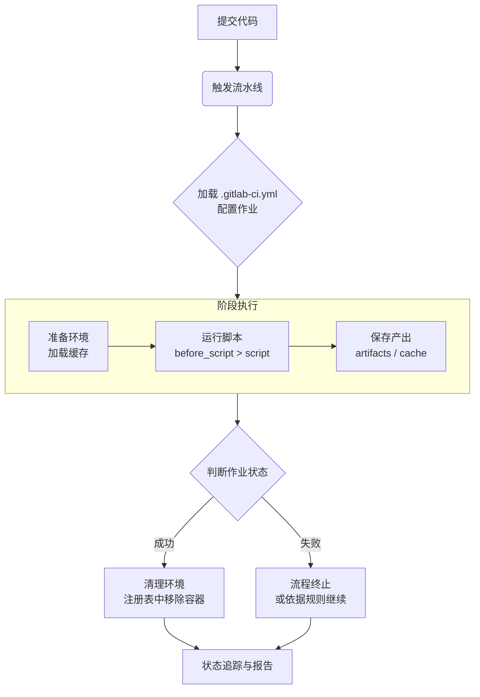

GitLab CI 是 [GitLab](../Code%20Version/GitLab.md) 提供内置的 CI/CD 管道功能，开发者可以通过 `.gitlab-ci.yml` 配置文件定义自动化构建、测试和部署流程。当有代码提交时，GitLab 自动执行这些流程。

在 GitLab CI 中 必须设置 Runner 才能运行 CI/CD 流水线的任务。

## GitLab CI/CD 作业标准流程

一个标准的 GitLab CI/CD 作业流程通常遵循**定义**、**触发**、**执行**、**传递**和**清理**这五个核心阶段。

### 定义与配置

流程的起点，需要在项目根目录创建 `.gitlab-ci.yml` 文件来定义整个流水线，该文件定义了流水线的阶段（Stages）、作业（Jobs）及其具体任务。

一个作业通常包含以下关键配置：
1. **`stage`**：指定作业所属的阶段（如 `build`, `test`, `deploy`），同一阶段的作业可以并行执行
2. **`script`**：定义作业需要运行的 Shell 命令或脚本，是作业的核心
3. **`image`**：指定用于运行作业的 Docker 镜像，为作业提供一致的环境
4. **`before_script`** / **`after_script`**：分别在 `script` 前后运行的命令，用于准备或清理环境

### 触发与启动

当代码被推送到 GitLab 仓库（如 `git push` ）时，系统会自动检测到 `.gitlab-ci.yml` 文件的变更，并触发一个新的 CI/CD 流水线（Pipeline），你也可以在 GitLab 界面上手动触发流水线，或通过API、合并请求（Merge Request）等方式启动。

### 执行与运行

流水线触发后，GitLab Runner 负责执行具体的作业：
1. **拉取镜像**（如果配置执行器为 Docker）：Runner 会根据作业配置，拉取指定的 Docker 镜像
2. **克隆代码**：Runner 会根据作业配置，克隆项目代码到指定目录或容器中
3. **按序执行命令**：在容器内，Runner 会按顺序执行 `before_script`、`script` 和 `after_script` 中定义的命令
4. **结果判定**：作业中所有命令执行成功（返回码为 0 ），则作业成功；任一命令失败（返回码非 0 ），则作业失败，进而可能导致整个阶段或流水线失败。

### 产物传递与缓存

为了在作业间高效传递文件或复用依赖，你需要配置以下两项：

- **产物（Artifacts）**: 用于将作业生成的文件（如编译后的 JAR 包、Docker 镜像）传递给后续阶段的作业，使用 `artifacts: paths` 指定要传递的文件路径。
- **缓存（Cache）**: 用于缓存依赖目录（如 `node_modules`、`.m2/repository` ），以加速后续流水线的执行，使用 `cache: paths` 进行配置。

### 清理与报告

作业完成后，无论成功与否，Runner 都会清理临时环境，同时，你可以在 GitLab 的流水线界面查看每个作业的详细执行日志、状态和持续时间，GitLab 也支持集成邮件、Slack 等通知方式，将流水线结果及时告知团队。

