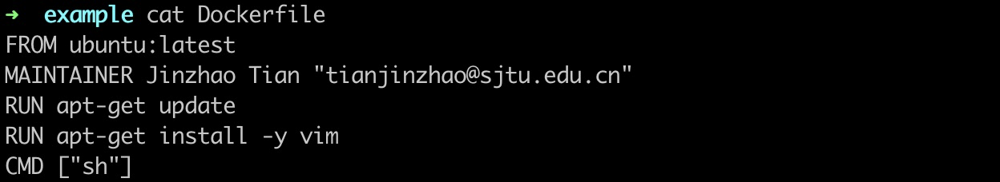

## 构建镜像

### 方法一



使用 [Dockerfile](Dockerfile.md)，Dockerfile相当于一个脚本，有确定的格式要求，FROM，MAINTAINER，RUN，CMD，ADD都是指令，分别完成不同的任务，Docker 镜像的结构就像是积木一样，一层一层往上面搭建，最底层是一个基础镜像，然后在上面运行命令搭建层。镜像是不可更改的，但是生成的 container 最上面有一层可写层，可以更改自己的东西。


```
docker build -t myimage:latest .
```

### 方法二

使用 Docker commit 命令。首先启动一个基础镜像：

```bash
docker run -i -t ubuntu /bin/bash
```

-i 交互式

-t 启用终端

然后做自己的操作，操作完成之后，就退出容器，然后commit：

```bash
docker commit [container id] [image name]
```

这样就生成了一个镜像。


## 导出镜像

```
docker save [image name]:[image version] -o [filename].tar
```

```
docker load -i [filename].tar
```

