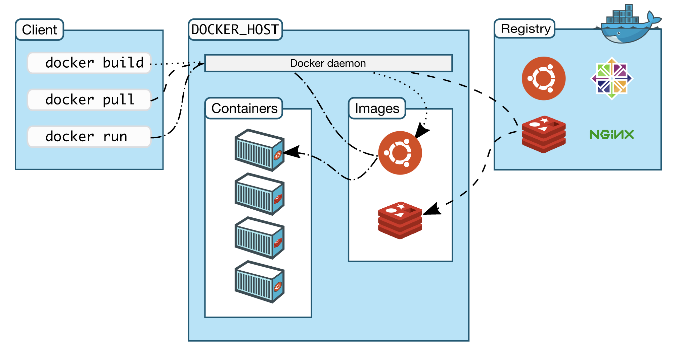

## 技术原理

提起容器就不得不说 chroot，因为 chroot 是最早的容器雏形。chroot 意味着切换根目录，有了 chroot 就意味着我们可以把任何目录更改为当前进程的根目录，这与容器非常相似，下面我们通过一个实例了解下 chroot。

#### chroot

什么是 chroot 呢？下面是 chroot 维基百科定义：

> chroot 是在 Unix 和 Linux 系统的一个操作，针对正在运作的软件行程和它的子进程，改变它外显的根目录。一个运行在这个环境下，经由 chroot 设置根目录的程序，它不能够对这个指定根目录之外的文件进行访问动作，不能读取，也不能更改它的内容。

通俗地说 ，chroot 就是可以改变某进程的根目录，使这个程序不能访问目录之外的其他目录，这个跟我们在一个容器中是很相似的。下面我们通过一个实例来演示下 chroot。

首先我们在当前目录下创建一个 rootfs 目录：

```shell
$ mkdir rootfs
```

这里为了方便演示，我使用现成的 busybox 镜像来创建一个系统，镜像的概念和组成后面我会详细讲解，如果你没有 Docker 基础可以把下面的操作命令理解成在 rootfs 下创建了一些目录和放置了一些二进制文件。

```shell
$ cd rootfs 
$ docker export $(docker create busybox) -o busybox.tar
$ tar -xf busybox.tar
```

执行完上面的命令后，在 rootfs 目录下，我们会得到一些目录和文件。下面我们使用 ls 命令查看一下 rootfs 目录下的内容。

```bash
$ ls
bin  busybox.tar  dev  etc  home  proc  root  sys  tmp  usr  var
```

可以看到我们在 rootfs 目录下初始化了一些目录，下面让我们通过一条命令来见证 chroot 的神奇之处。使用以下命令，可以启动一个 sh 进程，并且把 /home/centos/rootfs 作为 sh 进程的根目录。

```shell
$ chroot /home/centos/rootfs /bin/sh
```

此时，我们的命令行窗口已经处于上述命令启动的 sh 进程中。在当前 sh 命令行窗口下，我们使用 ls 命令查看一下当前进程，看是否真的与主机上的其他目录隔离开了。

```bash
/ # /bin/ls /
bin  busybox.tar  dev  etc  home  proc  root  sys  tmp  usr  var
```

这里可以看到当前进程的根目录已经变成了主机上的 /home/centos/rootfs 目录。这样就实现了当前进程与主机的隔离。到此为止，一个目录隔离的容器就完成了。 但是，此时还不能称之为一个容器，为什么呢？你可以在上一步（使用 chroot 启动命令行窗口）执行以下命令，查看如下路由信息：

```bash
/etc # /bin/ip route
default via 172.20.1.1 dev eth0
172.17.0.0/16 dev docker0 scope link  src 172.17.0.1
172.20.1.0/24 dev eth0 scope link  src 172.20.1.3
```

执行 ip route 命令后，你可以看到网络信息并没有隔离，实际上进程等信息此时也并未隔离。要想实现一个完整的容器，我们还需要 Linux 的其他三项技术： Namespace、Cgroups 和联合文件系统。

Docker 是利用 Linux 的 Namespace 、Cgroups 和联合文件系统三大机制来保证实现的， 所以它的原理是使用 Namespace 做主机名、网络、PID 等资源的隔离，使用 Cgroups 对进程或者进程组做资源（例如：CPU、内存等）的限制，联合文件系统用于镜像构建和容器运行环境。

后面我会对这些技术进行详细讲解，这里我就简单解释下它们的作用。

#### [Namespace](../../Operation%20System/Linux/Linux%20内核.md#Namespace)

Namespace 是 Linux 内核的一项功能，该功能对内核资源进行隔离，使得容器中的进程都可以在单独的命名空间中运行，并且只可以访问当前容器命名空间的资源。Namespace 可以隔离进程 ID、主机名、用户 ID、文件名、网络访问和进程间通信等相关资源。

Docker 主要用到以下五种命名空间。

- pid namespace：用于隔离进程 ID。
- net namespace：隔离网络接口，在虚拟的 net namespace 内用户可以拥有自己独立的 IP、路由、端口等。
- mnt namespace：文件系统挂载点隔离。
- ipc namespace：信号量,消息队列和共享内存的隔离。
- uts namespace：主机名和域名的隔离。

#### [cgroups](../../Operation%20System/Linux/Linux%20内核.md#cgroups)

Cgroups 是一种 Linux 内核功能，可以限制和隔离进程的资源使用情况（CPU、内存、磁盘 I/O、网络等）。在容器的实现中，Cgroups 通常用来限制容器的 CPU 和内存等资源的使用。


#### 联合文件系统

联合文件系统，又叫 UnionFS，是一种通过创建文件层进程操作的文件系统，因此，联合文件系统非常轻快。Docker 使用联合文件系统为容器提供构建层，使得容器可以实现写时复制以及镜像的分层构建和存储。常用的联合文件系统有 AUFS、Overlay 和 Devicemapper 等。


## Docker 组件

> 参考：[官方文档](https://docs.docker.com/get-started/overview/)

Docker 使用客户端服务器架构。



### Docker daemon

Docker守护程序，在使用Docker之前要先启动它。

### Docker client

客户端，用来和daemon交互。这个客户端可以连接不同的daemon。

### Docker registry

仓库，公有远程仓库是Docker Hub，私有的仓库可以安装registry来设置。

