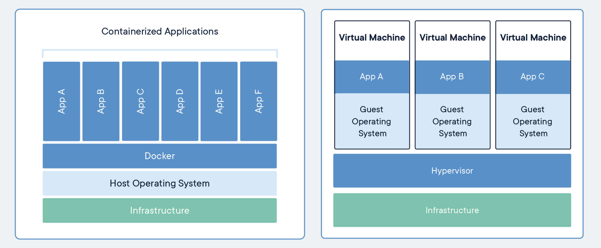

Docker 是一种容器虚拟化技术，与 VMWare 等的主机级虚拟化不同，Docker 是一种操作系统虚拟化技术 ，~~只能运行在Linux上~~（现在可以运行在很多平台上了，Linux，Windows，Cloud）。

- **主机级虚拟化**：想办法去模拟出硬件环境，模拟出虚拟的cpu、内存、硬盘、网卡等资源，然后在这些虚拟资源之上安装合适的操作系统来控制这些资源。
- **操作系统虚拟化**：把操作系统进行虚拟化，把物理的操作系统模拟为逻辑上的多个操作系统，不同的操作系统有自己的用户空间，实现了应用程序间的隔离。

Docker 推荐单个容器只运行一个应用程序/进程，这样就形成了一个分布式的应用程序模型，避免服务之间的互相影响，实现高内聚，低耦合。

## Overview

1. [Docker 架构](Docker%20架构.md)
2. [Docker 安装](Docker%20安装.md)
3. [Docker 使用](Docker%20使用.md)
	- [Dockerfile](Dockerfile.md)
	- [Docker Compose](Docker%20Compose.md)
4. [Docker 命令](Docker%20命令.md)

