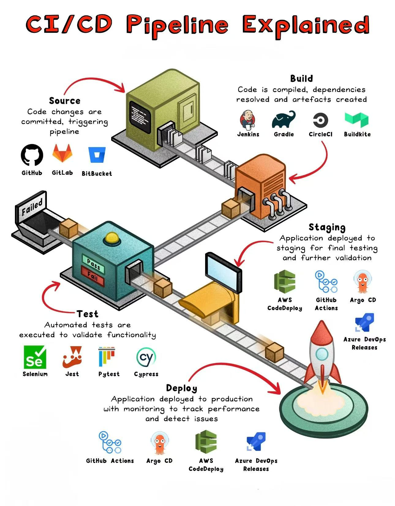

DevOps 是 Development（开发）和 Operations（运维）的组合，指的是一套实践、方法和工具，旨在通过促进开发团队和运维团队的协作来加速软件的交付流程，同时确保软件质量和系统稳定性。

## 核心理念

1. **文化变革**：DevOps 鼓励开发团队和运维团队之间的紧密合作，打破传统的“开发完成后交给运维部署”的分隔。开发人员负责编写代码，同时考虑系统部署和运行的需求，而运维人员则参与到开发过程，提供架构支持、监控和优化建议。
2. **自动化流程**：通过自动化构建、测试、部署、监控等流程，减少人为干预，提升软件交付的速度和稳定性。常用的自动化工具有 Jenkins、Ansible、Docker、Kubernetes 等。
3. **持续集成与持续交付（CI/CD）**：这是一种 DevOps 实践，确保代码在提交时自动构建、测试和发布。持续集成帮助早期发现代码问题，持续交付则将软件自动发布到测试环境，甚至直接部署到生产环境。
4. **监控与反馈**：DevOps 强调对软件运行情况进行持续监控，并基于监控数据做出优化和改进。这可以通过 APM（应用性能管理）工具来实现，如 Prometheus、Grafana、New Relic 等。

## 核心工具

DevOps 涉及到不同阶段的工具，常见的包括：
- **代码管理**：[Git](Code%20Version/Git.md)、[GitHub](Code%20Version/GitHub.md)、[GitLab](Code%20Version/GitLab.md)
- **持续集成/交付**：[Jenkins](CICD/Jenkins.md)、CircleCI、[GitLab CI](CICD/GitLab%20CI.md)、[GitHub Actions](CICD/GitHub%20Actions.md) 
- **容器化**：[Docker](Container/Docker.md)、Podman
- **容器编排**：[Kubernetes](Container/Kubernetes.md)、Docker Swarm
- **配置管理和 IaC**：Ansible、Terraform、Puppet
- **监控和日志管理**：[Prometheus](Monitoring/Prometheus.md) + [Grafana](Monitoring/Grafana.md)、[ELK](Logging/ELK.md)

## CICD

CI/CD（Continuous Integration and Continuous Delivery/Deployment，持续集成与持续交付/部署），旨在通过自动化来加速软件交付的流程，提升代码的质量，并减少软件发布的风险。它是作为一个面向开发和运营团队的解决方案，主要针对在集成新代码时所引发的问题。

CI/CD 主要包括以下两个部分：
1. **持续集成（Continuous Integration，CI）**：
    - 持续集成是指开发人员将代码频繁地集成到共享的代码库中，每次集成都通过自动化构建和测试来验证代码的正确性。
    - 在CI过程中，每当有新的代码提交时，自动化工具会执行构建（编译、打包等）、单元测试、静态代码分析等，确保代码在合并到主代码库之前能够通过所有的质量检查。
    - 目标是早期发现问题并解决，避免集成时出现大量冲突或错误。
2. **持续交付/部署（Continuous Delivery/Deployment，CD）**：
    - **持续交付**：在持续交付中，代码在经过持续集成的测试和验证后，可以随时手动发布到生产环境。整个过程确保代码在任何时候都可以发布，但发布操作通常是手动执行的。
    - **持续部署**：在持续部署中，代码通过自动化测试后，自动部署到生产环境中，不需要手动干预。每当有新的代码合并并通过测试后，系统会自动将其发布到生产环境。

CI/CD 通常与 Docker 一起使用，但它并不仅限于容器化应用，也可以应用于各种类型的项目。

CI/CD 可让持续自动化和持续监控贯穿于应用的整个生命周期（从集成和测试阶段，到交付和部署）。这些关联的事务通常被统称为 CI/CD Pipline，由开发和运维团队以敏捷方式协同支持。

  

DevOps 是一个非常棒的指导思想，而 CI/CD 是整个 DevOps 流程中最重要的部分。Docker 的出现解决了 CI/CD 流程中的各种问题，Docker 交付的镜像不仅包含应用程序，也包含了应用程序的运行环境，这很好地解决了开发和线上环境不一致问题。同时 Docker 的出现也极大地提升了 CI/CD 的构建效率，我们仅仅需要编写一个 Dockerfile 并将 Dockerfile 提交到我们的代码仓库即可快速构建出我们的应用，最后，当我们构建好 Docker 镜像后 Docker 可以帮助我们快速发布及更新应用。

**技术栈**：Docker，GitHub，Jenkins，K8s
