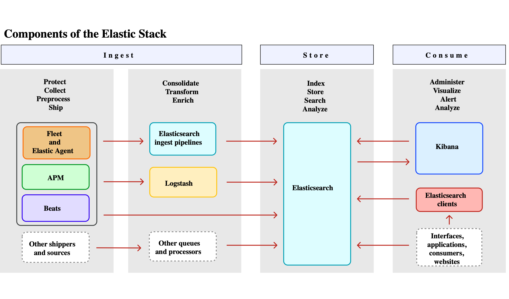

ELK 是一个流行的开源日志管理解决方案，由三个核心组件组成：
1. [**Elasticsearch**](Elasticsearch.md) - 分布式搜索和分析引擎
    - 负责存储和索引日志数据
    - 提供强大的全文搜索能力
    - 支持复杂的查询和聚合操作
2. [**Logstash**](Logstash.md) - 数据处理管道
    - 收集、解析和转换日志数据
    - 支持多种输入源和输出目标
    - 提供丰富的过滤器插件
3. [**Kibana**](Kibana.md) - 数据可视化平台
    - 创建交互式仪表板和图表
    - 提供直观的日志浏览界面
    - 支持高级数据分析功能

现在常被称为 **Elastic Stack**，因为新增：
- **Beats**：轻量级数据采集器（如 [Filebeat](Filebeat.md)、Metricbeat）
- **X-Pack**：商业插件（安全、监控、警报等）




## 使用示例

### Java 集成


### Go 集成


### .NET 集成

1. **安装必要的 NuGet 包**
```bash
dotnet add package Serilog.AspNetCore
dotnet add package Serilog.Sinks.Elasticsearch
```

2. **环境变量配置**
```json
// appsettings.json
{
  "ElasticConfiguration": {
    "Uri": "http://localhost:9200",
    "Username": "username",
    "Password": "password"
  }
}
```

3. **配置 Serilog**：直接写入 Elasticsearch
```cs
using Serilog;
using Serilog.Sinks.Elasticsearch;

var builder = WebApplication.CreateBuilder(args);

// 配置Serilog
Log.Logger = new LoggerConfiguration()
    .Enrich.FromLogContext()
    .Enrich.WithMachineName()
    .WriteTo.Console()
    .WriteTo.Elasticsearch(new ElasticsearchSinkOptions(new Uri(builder.Configuration["ElasticConfiguration:Uri"]))
    {
        AutoRegisterTemplate = true,
        IndexFormat = "myapp-logs-{0:yyyy.MM.dd}",
        ModifyConnectionSettings = x => x.BasicAuthentication(
		        builder.Configuration["ElasticConfiguration:Username"], 
		        builder.Configuration["ElasticConfiguration:Password"]) // 如果需要认证
    })
    .CreateLogger();

builder.Host.UseSerilog();

var app = builder.Build();

// 其他中间件配置...

app.Run();
```

4. **记录日志**
```cs
public class HomeController : Controller
{
    private readonly ILogger<HomeController> _logger;

    public HomeController(ILogger<HomeController> logger)
    {
        _logger = logger;
    }

    public IActionResult Index()
    {
        _logger.LogInformation("Home page visited at {Time}", DateTime.UtcNow);
        
        try
        {
            // 业务逻辑
        }
        catch (Exception ex)
        {
            _logger.LogError(ex, "An error occurred in Index method");
        }
        
        return View();
    }
}
```

5. **异常处理中间件**
```cs
app.UseExceptionHandler(errorApp =>
{
    errorApp.Run(async context =>
    {
        var exceptionHandlerPathFeature = context.Features.Get<IExceptionHandlerPathFeature>();
        var exception = exceptionHandlerPathFeature?.Error;
        
        Log.Error(exception, "Unhandled exception occurred");
        
        context.Response.StatusCode = 500;
        await context.Response.WriteAsync("An unexpected error occurred.");
    });
});
```


### C++ 集成

1. 直接输出：使用日志库输出到 `Logstash`
	- **spdlog**（推荐）：高性能 C++ 日志库，支持多种后端
	- **g3log**：异步日志库，适合生产环境
	- **Boost.Log**：Boost 库中的日志组件
```c++
#include "spdlog/spdlog.h"
#include "spdlog/sinks/tcp_sink.h"

int main() {
    // 创建TCP sink连接到Logstash
    auto tcp_sink = std::make_shared<spdlog::sinks::tcp_sink_mt>("localhost", 5000);
    
    // 创建logger
    auto logger = std::make_shared<spdlog::logger>("elk_logger", tcp_sink);
    spdlog::register_logger(logger);
    
    // 设置日志格式(JSON格式便于ELK解析)
    logger->set_pattern("{\"timestamp\": \"%Y-%m-%d %H:%M:%S.%e\", \"level\": \"%l\", \"message\": \"%v\", \"app\": \"my_cpp_app\"}");
    
    // 使用示例
    logger->info("Application started");
    logger->error("Something went wrong: {}", 42);
    
    spdlog::drop_all(); // 清理
    return 0;
}
```


2. 通过文件输出 + Filebeat 采集
```c++
#include "spdlog/spdlog.h"
#include "spdlog/sinks/rotating_file_sink.h"

int main() {
    // 创建滚动文件日志
    auto file_logger = spdlog::rotating_logger_mt("file_logger", "/var/log/myapp.log", 1024*1024*10, 3);
    
    // 设置JSON格式
    file_logger->set_pattern("{\"time\":\"%Y-%m-%d %H:%M:%S.%f\",\"level\":\"%l\",\"message\":\"%v\"}");
    
    file_logger->info("This will be written to file and collected by Filebeat");
}
```

```yaml
# 配置Filebeat(filebeat.yml)
filebeat.inputs:
- type: log
  enabled: true
  paths:
    - /var/log/myapp.log
  json.keys_under_root: true
  json.add_error_key: true

output.logstash:
  hosts: ["localhost:5044"]
```


### Node 集成

1. 直接集成：使用 Winston 日志库（推荐）
```bash
npm install winston winston-logstash
```

```javascript
const winston = require('winston');
const winstonLogstash = require('winston-logstash');

// 创建 logger 实例
const logger = winston.createLogger({
  level: 'info',
  format: winston.format.combine(
    winston.format.timestamp(),
    winston.format.json()
  ),
  transports: [
    // 控制台输出（开发环境）
    new winston.transports.Console(),
    // Logstash 传输
    new winston.transports.Logstash({
      port: 5000,
      host: 'localhost',
      ssl_enable: false,
      max_connect_retries: -1, // 无限重试
    })
  ]
});

// 使用示例
logger.info('User logged in', { userId: 123, ip: '192.168.1.1' });
logger.error('Database connection failed', { error: err.stack });
```


2. 通过文件输出 + Filebeat 采集
```js
const logger = winston.createLogger({
  format: winston.format.combine(
    winston.format.timestamp(),
    winston.format.json()
  ),
  transports: [
    new winston.transports.File({ 
      filename: '/var/log/node-app/app.log',
      maxsize: 10 * 1024 * 1024, // 10MB
      maxFiles: 5
    })
  ]
});
```

```yaml
# 配置Filebeat(filebeat.yml)
filebeat.inputs:
- type: log
  enabled: true
  paths:
    - /var/log/node-app/*.log
  json.keys_under_root: true
  json.overwrite_keys: true

output.logstash:
  hosts: ["localhost:5044"]
```


3. 使用 ELK 专用 Node.js 客户端
```bash
npm install elastic-apm-node --save
```

```js
// 必须在其他 require 之前初始化
const apm = require('elastic-apm-node').start({
  serviceName: 'my-node-app',
  serverUrl: 'http://localhost:8200',
  captureExceptions: true,
  logLevel: 'info'
});

// 自动捕获未处理异常
process.on('unhandledRejection', apm.captureError);
```


## 安装配置

1. Elasticsearch 安装
```bash
# 下载并安装(以Linux为例)
wget https://artifacts.elastic.co/downloads/elasticsearch/elasticsearch-7.x.x-linux-x86_64.tar.gz
tar -xzf elasticsearch-7.x.x-linux-x86_64.tar.gz
cd elasticsearch-7.x.x/
./bin/elasticsearch
```

2. Elasticsearch 配置：修改 `config/elasticsearch.yml`
```yaml
cluster.name: my-application
node.name: node-1
network.host: 0.0.0.0
http.port: 9200
discovery.seed_hosts: ["127.0.0.1"]
```


3. Logstash 安装
```bash
wget https://artifacts.elastic.co/downloads/logstash/logstash-7.x.x.tar.gz
tar -xzf logstash-7.x.x.tar.gz
cd logstash-7.x.x/
```

4. Logstash 配置：创建 `logstash.conf`
```yaml
input {
  file {
    path => "/var/log/*.log"
    start_position => "beginning"
  }
}

filter {
  grok {
    match => { "message" => "%{TIMESTAMP_ISO8601:timestamp} %{LOGLEVEL:loglevel} %{GREEDYDATA:message}" }
  }
}

output {
  elasticsearch {
    hosts => ["http://localhost:9200"]
    index => "logs-%{+YYYY.MM.dd}"
  }
}
```


5. Kibana 安装
```bash
wget https://artifacts.elastic.co/downloads/kibana/kibana-7.x.x-linux-x86_64.tar.gz
tar -xzf kibana-7.x.x-linux-x86_64.tar.gz
cd kibana-7.x.x-linux-x86_64/
./bin/kibana
```

6. Kibana 配置：修改 `config/kibana.yml`
```yaml
server.port: 5601
server.host: "0.0.0.0"
elasticsearch.hosts: ["http://localhost:9200"]
```


7. **验证集成**
	- 启动所有组件（按顺序: Elasticsearch -> Logstash -> Kibana）
	- 访问 [Kibana](http://localhost:5601) 
	- 在 Kibana 中创建索引模式
	- 在 "Discover" 页面查看日志数据


8.  **高级集成**
	- **Kafka集成**：在高流量场景下使用 Kafka 作为缓冲
	- **Docker集成**：使用 Filebeat 收集容器日志
	- **Kubernetes集成**：使用 Fluentd 或 Filebeat 作为 DaemonSet
	- **云服务集成**：AWS/Azure/GCP的特定配置


## 数据采集

#### 方法一：使用 Filebeat（推荐）

```bash
# 安装Filebeat
wget https://artifacts.elastic.co/downloads/beats/filebeat/filebeat-7.x.x-linux-x86_64.tar.gz
tar -xzf filebeat-7.x.x-linux-x86_64.tar.gz

# 配置Filebeat(filebeat.yml)
filebeat.inputs:
- type: log
  enabled: true
  paths:
    - /var/log/*.log

output.logstash:
  hosts: ["localhost:5044"]
```

#### 方法二：直接应用集成

对于应用程序，可以使用 `Log4j`、`Logback` 等日志框架直接输出到 `Logstash`：
```xml
<!-- Logback配置示例 -->
<appender name="logstash" class="net.logstash.logback.appender.LogstashTcpSocketAppender">
    <destination>localhost:5000</destination>
    <encoder class="net.logstash.logback.encoder.LogstashEncoder" />
</appender>
```

