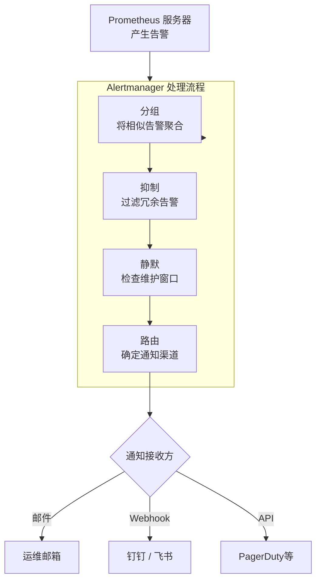

Alertmanager 是 Prometheus 生态系统中负责处理告警的核心组件，主要职责是接收由 Prometheus 服务器等客户端发来的告警，然后通过去重、分组和路由等机制，将它们精准地发送到正确的通知渠道（如邮件、钉钉、Slack等）。

## 核心功能

Alertmanager 通过以下四大核心功能来管理告警：
1. **分组（Grouping）**：将性质相似的告警合并成一个通知发送。例如，当网络出现故障导致10台数据库实例同时宕机时，它会把这10条告警合并成一条发给你，避免刷屏。
2. **抑制（Inhibition）**：当某些更严重的告警已经发生时，自动屏蔽其他相关的次要告警。比如，当“整个数据中心不可达”的告警触发后，它就会自动抑制“某台服务器 CPU 过高”这类衍生告警，让你能专注处理根源问题。
3. **静默（Silences）**：可以设置一个时间窗口，在这段时间内屏蔽特定的告警。这主要用在已知的计划维护窗口期，避免收到大量无关告警的骚扰。
4. **路由（Routing）**：通过配置灵活的“路由树”，你可以为不同级别的告警设置不同的接收人和通知渠道。例如，把“紧急”告警通过短信发给值班工程师，把“警告”告警通过邮件发给团队负责人。

## 工作流程

一个典型的告警处理流程如下：



## 使用

### 安装与运行

你可以根据自己的环境，通过二进制文件或Docker快速部署。

**方式一：二进制文件 (推荐)**

1. **下载**: 从 [Prometheus 官网下载页](https://prometheus.io/download/) 获取适用于你操作系统的最新版 Alertmanager。
2. **解压与运行**:
```bash
# 解压下载的文件
tar -vxzf alertmanager-<version>.linux-amd64.tar.gz
cd alertmanager-<version>.linux-amd64
# 运行Alertmanager，指定配置文件（默认配置文件名为 alertmanager.yml）
./alertmanager --config.file=alertmanager.yml
```
3. **验证**: 启动成功后，访问 `http://<你的IP>:9093` 就能看到 Web UI。


**方式二：使用 Docker**

如果你想快速试用，可以用Docker运行：
```bash
docker run --name alertmanager -d -p 127.0.0.1:9093:9093 quay.io/prometheus/alertmanager
```

为了便于管理，建议将 Alertmanager 配置为系统服务。


### 配置

Alertmanager 的所有配置都写在一个 YAML 格式的文件里（通常是 `alertmanager.yml`）。最基本的配置包含以下三个部分：
```yaml
# 1. 全局配置：设置通用的发件邮箱、SMTP服务器等信息
global:
  resolve_timeout: 5m          # 告警状态从“触发”变为“已解决”的确认时间
  smtp_smarthost: 'smtp.qq.com:465'  # 以QQ邮箱为例的SMTP服务器
  smtp_from: 'your-email@qq.com'
  smtp_auth_username: 'your-email@qq.com'
  smtp_auth_password: '你的邮箱授权码' # 注意：此处应为授权码，非邮箱密码
  smtp_require_tls: false
# 2. 路由规则：定义告警的流动路径
route:
  group_by: ['alertname']       # 按告警名称分组，将相似告警聚合
  group_wait: 10s               # 分组后，等待10秒再发送，以便聚合更多同组告警
  group_interval: 10s           # 发送完一组告警后，下次再发新告警的间隔
  repeat_interval: 1h           # 同一个告警重复发送的间隔
  receiver: 'default-email'     # 默认的接收器，所有告警的最终去向
# 3. 接收器：定义具体的通知渠道和接收人
receivers:
- name: 'default-email'
  email_configs:
  - to: 'receiver@example.com'  # 收件人地址
    send_resolved: true         # 是否发送告警恢复的通知
```

**常用配置参数详解**：

| 配置块           | 参数                | 说明                                                                                        | 生产环境建议值/说明                                            |
| ------------- | ----------------- | ----------------------------------------------------------------------------------------- | ----------------------------------------------------- |
| **Global**    | `resolve_timeout` | 告警解除后，等待多久才发送“已恢复”的通知                                                                     | `5m`                                                  |
|               | `smtp_*`          | 邮件服务器相关配置，是发送邮件的基础                                                                        | 需根据你的邮箱服务商填写，如QQ邮箱需使用`授权码`                            |
| **Route**     | `group_by`        | 将含有相同标签的告警合并为一条通知，避免告警轰炸[](https://pkg.go.dev/github.com/prometheus/alertmanager@v0.30.0) | 常用`['alertname', 'cluster']`等。设置为`['...']`会完全禁用分组，需谨慎 |
|               | `group_wait`      | 刚收到一个组的第一条告警时，等待多久再发送，可以聚合同时到达的同组告警                                                       | `30s`                                                 |
|               | `group_interval`  | 发送完一个组的通知后，对于该组新产生的告警，需要等待多久才能再次发送                                                        | `5m`                                                  |
|               | `repeat_interval` | 如果同一个告警持续触发，再次发送通知的最小间隔                                                                   | `3h` 或更长                                              |
| **Receivers** | `email_configs`   | 邮件接收器的具体配置，如收件人、标题、内容模板                                                                   | 支持通过Go模板自定义邮件内容                                       |
|               | `webhook_configs` | Webhook配置，可对接钉钉、飞书、自定义脚本等几乎所有第三方系统                                                        | 通用的集成方式                                               |

**高级配置**：

- **告警抑制 (Inhibit)**：可以设置在某个"根因"告警发生时，抑制其他相关的"噪音"告警。例如，当 `severity="critical"` 的告警触发时，自动静默同个实例上 `severity="warning"` 的告警。
```yaml
inhibit_rules:
- source_matchers: ['severity="critical"']
  target_matchers: ['severity="warning"']
  equal: ['instance', 'alertname']
```

- **静默 (Silence)**：可以在告警的 Web UI 界面直接创建，设置在特定时间段内屏蔽指定的告警，常用于计划内的系统维护。


### 接入

Alertmanager 本身不产生告警，它等待接收来自 Prometheus 的告警。因此，你需要在 Prometheus 的配置文件 (`prometheus.yml`) 中告诉它 Alertmanager 在哪里：
```yaml
# prometheus.yml
# 告警规则文件，里面定义了触发告警的条件
rule_files:
  - "rules.yml"
# 指定Alertmanager服务的地址
alerting:
  alertmanagers:
    - static_configs:
        - targets:
          - 'localhost:9093'   # 这里填你的Alertmanager地址和端口
```

同时，在 `rules.yml` 文件中，你需要定义具体的告警规则。例如，监控一个服务是否挂掉：
```yaml
groups:
- name: example
  rules:
  - alert: InstanceDown
    expr: up == 0          # 当up指标的值为0时，触发告警
    for: 1m                # 该状态持续1分钟才触发，避免瞬时报错
    labels:
      severity: critical   # 为告警添加一个标签，可用于路由匹配
    annotations:
      summary: "实例 {{ $labels.instance }} 已停止工作"
      description: "实例 {{ $labels.instance }} 已经宕机超过1分钟。"
```

配置完成后，重启 Prometheus 服务。之后，你便可以在 Prometheus 的 UI (`/alerts` 路径) 和 Alertmanager 的 UI (`/alerts` 路径) 中看到所有告警的状态变化和发送历史了。

