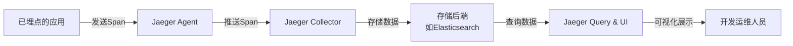

Jaeger 是一个由 Uber 开源并捐赠给 CNCF 的**分布式追踪平台**，专门用于监控和诊断基于微服务等复杂分布式系统的性能问题。

## 工作原理

Jaeger 基于两个核心概念来还原调用链路：
1. **Trace（追踪）**：代表一个完整的请求链路。例如，一次用户下单操作会生成一个 Trace。
2. **Span（跨度）**：代表一个 Trace 中的具体工作单元，比如一次服务调用、一次数据库查询。一个 Trace 由多个有父子或先后关系的 Span 组成。

Jaeger 会为每个请求分配一个唯一的 `Trace ID`，并在服务间传递。每个服务在处理时生成自己的 `Span` 并记录耗时、状态等信息，最终所有 `Span` 通过 `Trace ID` 聚合，就能还原出完整的调用链路图。

## 主要特性

Jaeger 在设计上非常适合现代云原生环境，具有以下特点：

1. **高可扩展性与云原生**：设计上无单点故障，可随业务扩展。例如，Uber 的生产环境每天用它处理数十亿个 Span。它提供 Docker 镜像，并支持通过 Kubernetes Operator 和 Helm Chart 便捷部署。
2. **支持开放标准**：原生支持 OpenTracing 标准，并从 v1.35 开始支持 [OpenTelemetry](OpenTelemetry.md) 协议，这意味着你可以用统一的 API 来集成追踪，避免厂商锁定。
3. **与 Zipkin 兼容**：如果你的系统已使用 Zipkin 进行埋点，可以无缝将数据切换到 Jaeger 后端，无需重写代码。
4. **多种存储后端**：支持将追踪数据存入 Elasticsearch、Cassandra、OpenSearch 等主流数据库，方便集成。
5. **强大的可视化与分析**：
    - **搜索与查看追踪**：通过 Web UI 可以清晰看到每个请求跨服务的调用层次和耗时。
    - **拓扑图生成**：自动生成**服务依赖关系图**，直观展示服务间的调用关系。
    - **服务性能监控（SPM）**：基于追踪数据，聚合生成请求数（Rate）、错误数（Errors）、持续时间（Duration）等 RED 指标，用于监控性能趋势。

## 架构

其架构主要包含以下组件：
1. **Client SDK**：集成在应用程序中，负责生成追踪数据。
2. **Agent**：通常以守护进程或 Sidecar 形式部署，收集 Client 的数据并转发给 Collector。
3. **Collector**：接收 Agent 的数据，进行验证和处理，然后写入存储后端。
4. **Query & UI**：提供图形界面（默认端口16686），用于检索和可视化追踪数据。
5. **Storage**：可插拔的存储层。