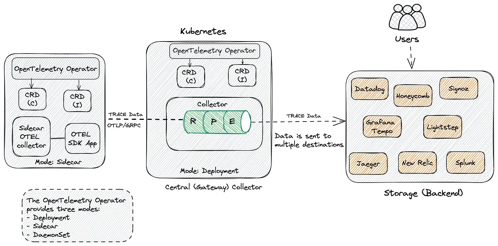

OpenTelemetry（OTel）是一个开源的、厂商中立的可观测性框架，用于生成、收集和管理遥测数据（指标、日志和追踪）。


## 核心概念

1. **统一标准**：合并了 OpenTracing 和 OpenCensus 项目，成为云原生计算基金会（CNCF）项目
2. **多语言支持**：提供多种编程语言实现（Go，Java，JavaScript，Python等）
3. **三大支柱**：
    - **Traces**（分布式追踪）：记录请求在分布式系统中的流转
    - **Metrics**（指标）：记录系统性能数据
    - **Logs**（日志）：记录系统事件

## 主要组件

1. **API**：定义遥测数据的生成方式
2. **SDK**：实现 API，处理数据采样、处理和导出
3. **收集器（Collector）**：接收、处理和导出遥测数据

## 优势

- **标准化**：统一了不同语言的观测数据格式
- **灵活性**：支持多种后端系统（如 Prometheus，Jaeger，Zipkin 等）
- **自动检测**：许多库和框架已有现成的检测支持
- **生产就绪**：被众多大型企业采用


## 使用示例




### 安装 OpenTelemetry SDK

OpenTelemetry 支持多种编程语言，包括 Java、Go、Python、.NET 等
#### Java

```xml
<dependencies>
    <dependency>
        <groupId>io.opentelemetry</groupId>
        <artifactId>opentelemetry-api</artifactId>
        <version>1.25.0</version>
    </dependency>
    <dependency>
        <groupId>io.opentelemetry</groupId>
        <artifactId>opentelemetry-sdk</artifactId>
        <version>1.25.0</version>
    </dependency>
    <dependency>
        <groupId>io.opentelemetry</groupId>
        <artifactId>opentelemetry-exporter-otlp</artifactId>
        <version>1.25.0</version>
    </dependency>
</dependencies>
```

#### Go

```bash
go get go.opentelemetry.io/otel \
	   go.opentelemetry.io/otel/trace \
	   go.opentelemetry.io/otel/sdk \
	   go.opentelemetry.io/otel/exporters/otlp/otlptrace \
	   go.opentelemetry.io/otel/exporters/otlp/otlptrace/otlptracegrpc
```


#### .NET

```bash
dotnet add package OpenTelemetry
dotnet add package OpenTelemetry.Exporter.OpenTelemetryProtocol
```

### 配置 OpenTelemetry

配置 OpenTelemetry 以收集和导出遥测数据。通常需要设置：

- **服务名称**（`service.name`）
- **导出方式**（如 OTLP、Jaeger、Zipkin）
- **采样率**（决定收集多少数据）

#### Java 自动埋点

```bash
java -javaagent:/path/to/opentelemetry-javaagent.jar \
     -Dotel.resource.attributes=service.name=my-service \
     -Dotel.exporter.otlp.endpoint=http://your-collector-endpoint \
     -jar your-app.jar
```


#### Go 手动埋点

```go
func initTracer() func(context.Context) error {
    exporter, err := otlptrace.New(
        context.Background(),
        otlptracegrpc.NewClient(
            otlptracegrpc.WithEndpoint("your-collector-endpoint"),
        ),
    )
    resources, _ := resource.New(
        context.Background(),
        resource.WithAttributes(attribute.String("service.name", "go-service")),
    )
    otel.SetTracerProvider(
        sdktrace.NewTracerProvider(
            sdktrace.WithResource(resources),
            sdktrace.WithSpanProcessor(sdktrace.NewBatchSpanProcessor(exporter)),
        ),
    )
    return exporter.Shutdown
}
```

#### .NET 自动埋点

```cs
using OpenTelemetry;
using OpenTelemetry.Resources;
using OpenTelemetry.Trace;

var builder = WebApplication.CreateBuilder(args);

// 配置 OpenTelemetry
builder.Services.AddOpenTelemetry()
    .ConfigureResource(resource => resource
        .AddService(serviceName: "my-service",
                    serviceVersion: "1.0.0"))
    .WithTracing(tracing => tracing
        // 自动检测 ASP.NET Core 请求
        .AddAspNetCoreInstrumentation(options =>
        {
            options.Filter = (httpContext) => 
                !httpContext.Request.Path.StartsWithSegments("/health");
            options.RecordException = true;
        })
        // 自动检测 HttpClient 调用
        .AddHttpClientInstrumentation()
        // 自动检测 Entity Framework Core
        .AddEntityFrameworkCoreInstrumentation()
        // 导出到 Jaeger
        .AddJaegerExporter());

var app = builder.Build();
```


### 上报数据到后端

OpenTelemetry 支持多种后端，如：

- **阿里云可观测链路 OpenTelemetry 版**
- **SigNoz**（开源可观测性平台）
- **Jaeger** / [**Prometheus**](Prometheus.md) / **Zipkin** 

#### 上报到阿里云

```bash
-Dotel.exporter.otlp.endpoint=http://tracing-analysis-dc-hz.aliyuncs.com:8090 \
-Dotel.exporter.otlp.headers="Authentication=your-token"
```

#### 上报到 SigNoz

```bash
export OTEL_EXPORTER_OTLP_ENDPOINT="http://localhost:4317"
export OTEL_SERVICE_NAME="go-service"
```


### 查看监控数据

- **阿里云控制台**：登录后查看应用拓扑、调用链路等。
- **SigNoz**：访问 `http://localhost:3301` 查看仪表盘。
- **Jaeger UI**：通常在 `http://localhost:16686`

