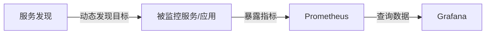

Prometheus 和 Grafana 是两个流行的开源监控工具，通常一起使用来构建强大的监控和可视化系统：
1. **数据收集层**：[Prometheus](Prometheus.md) 负责从各种目标收集指标数据
2. **存储层**：Prometheus 内置的时间序列数据库存储收集的数据
3. **可视化层**：[Grafana](Grafana.md) 连接到 Prometheus 数据源，提供丰富的可视化功能

## 典型架构

## 使用场景

- 基础设施监控（服务器、容器、Kubernetes 等）
- 应用程序性能监控
- 业务指标监控
- 网络监控
- 日志监控（结合 Loki 等工具）

## 优势

- 开源且社区活跃
- 高度可扩展
- 灵活的查询和可视化能力
- 适合云原生环境
- 可以与其他工具（如Alertmanager）集成实现完整的监控告警系统

这套组合在现代 DevOps 和云原生环境中非常流行，特别适合需要强大监控和可视化能力的场景。