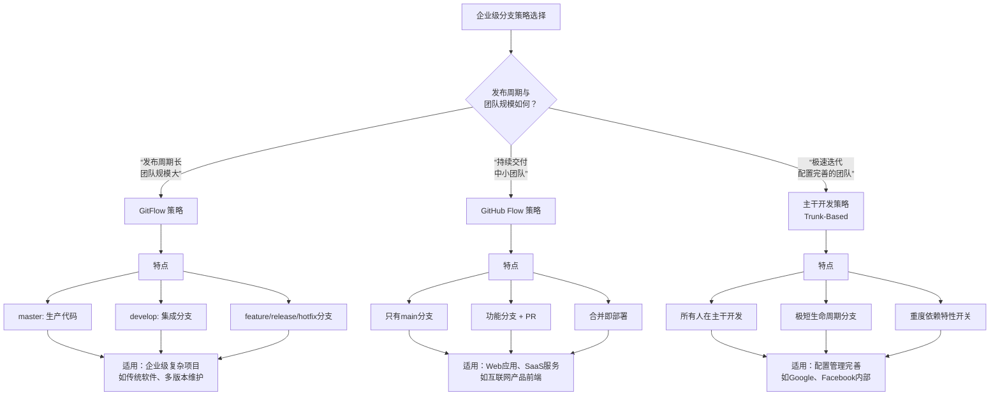

企业级平台流程开发的分支管理，核心在于平衡**开发效率**与**生产稳定性**。没有一种策略是万能的，关键在于根据团队规模、发布频率和项目复杂度，选择最适合的模型并严格落地执行。

## 主流分支策略




### 策略一：GitFlow

如果你的项目有固定的发布周期（如季度发版）、需要同时维护多个版本，并且团队协作规模较大，GitFlow 是一个经过时间考验的选择。

#### 核心思想

通过严格的隔离来保证各阶段代码的纯净。`master` 分支只接受从 `release` 或 `hotfix` 分支来的合并，确保其永远代表生产就绪状态。`develop` 是日常开发集散地。

#### 工作流程

 GitFlow 整个工作过程分解为三个核心角色（分支类型）和一个标准的工作流程循环。

##### 核心分支

在 GitFlow 中，分支有明确的角色分工，主要分为两类：

1. **常驻分支（永远存在）**
    - **`master`（或 `main`）**：**绝对稳定**，这个分支上的每一次提交，都对应一个生产环境的发布版本。所有发布历史在这里都通过标签（tag）清晰标记。
    - **`develop`**：**主要开发分支**，包含下一个发布周期的最新、完整的代码。所有功能开发完成后的代码都在这里集成。
2. **临时辅助分支（按需创建，用完即删）**
    - **`feature/*` (功能分支)**：用于开发一个特定的新功能。
	    - 基于 `develop` 分支创建。
    - **`release/*` (发布分支)**：用于准备一个新的生产版本。
	    - 基于 `develop` 分支创建。
    - **`hotfix/*` (热修复分支)**：用于紧急修复生产环境的严重 Bug。
	    - 基于 `master` 分支创建。

##### 完整周期

用一个新功能从开发到上线的完整周期，来走一遍 GitFlow 的流程。

###### 第一步：开发新功能（Feature Branches）

假设产品经理提出了一个新功能 "登录优化"。

1. **创建分支**：开发人员从最新的 `develop` 分支上，创建一个功能分支。
```bash
git checkout -b feature/login-optimization develop`
```

2. **进行开发**：在这个分支上提交代码。此时，这个分支的变动完全独立，不影响主线的稳定性。可以多人协作，甚至可以在功能分支上再开子分支。

3. **完成并合并**：功能开发完成，并通过了本地测试。开发人员创建一个 Pull Request （PR） 或 Merge Request（MR），请求将 `feature/login-optimization` 合并回 `develop` 分支。经过代码审查和 CI 自动化测试后，执行合并。
```bash
git checkout develop
git merge --no-ff feature/login-optimization  # --no-ff 确保保留历史分支信息
git branch -d feature/login-optimization      # 删除本地分支
git push origin --delete feature/login-optimization # 删除远程分支
```

> [!tip] `--no-ff` 的作用
> `--no-ff` 强制创建一个新的合并提交节点，而不是直接移动指针，这能清晰地保留“存在过这样一个功能分支”的历史信息，方便后期追溯和回滚。


###### 第二步：准备发布（Release Branches）

当 `develop` 分支上已经积累了足够本次发布的功能，决定发布版本 `1.2.0`。

> [!warning] 版本标签的重要性
> 在 `master` 分支上，每一个生产版本都必须有对应的 Tag。这就像给历史书加上了目录，让你能瞬间定位到任何一个发布版本。

1. **创建发布分支**：从 `develop` 分支创建一个发布分支。**此时，`develop` 分支可以继续接收下一个版本的功能开发，与本版本的准备工作完全隔离。**
```bash
git checkout -b release/1.2.0 develop
```

2. **测试与修复**：在 `release/1.2.0` 分支上进行系统测试、Bug 修复、更新版本号、编写文档等。**注意：这个分支上只做 Bug 修复和发布相关事务，绝对不允许添加新功能。**

测试通过，一切就绪后，**需要将这个发布分支合并到两个重要分支：`master` 和 `develop`**。

1. **合并回 `master`（上线）**：这代表一个新的生产版本诞生。
```bash
git checkout master
git merge --no-ff release/1.2.0
git tag -a 1.2.0 -m "Release version 1.2.0"  # 在master上打上版本标签
git push origin master --tags
```

2. **合并回 `develop`（同步修复）**: 确保 `develop` 分支也包含了在发布分支上所做的任何 Bug 修复。
```bash
git checkout develop
git merge --no-ff release/1.2.0
git push origin develop
```

3. **删除发布分支**：清理临时分支。
```bash
git branch -d release/1.2.0
git push origin --delete release/1.2.0
```


###### 第四步：紧急修复生产问题（Hotfix Branches）

网站上线后发现一个严重的支付 Bug，需要立即修复。

1. **创建热修复分支**：直接从 `master` 分支上（对应当前生产环境的代码）创建 `hotfix` 分支。
```bash
git checkout -b hotfix/1.2.1 master
```

2. **修复与测试**：在 `hotfix/1.2.1` 上修复 Bug，并进行测试。同样，这里只做必要的修复。

修复完成后，**需要将这个分支合并到 `master` 和 `develop`**（以及当前的 `release` 分支，如果有的话）：

1. **合并回 `master` (紧急上线)**
```bash
git checkout master
git merge --no-ff hotfix/1.2.1
git tag -a 1.2.1 -m "Hotfix version 1.2.1"
git push origin master --tags
```

2. **合并回 `develop` (防止遗漏)**: **这一步至关重要！** 确保未来的版本也包含这个修复。
```bash
git checkout develop
git merge --no-ff hotfix/1.2.1
git push origin develop
```

3. **删除热修复分支**：
```bash
git branch -d hotfix/1.2.1
git push origin --delete hotfix/1.2.1
```


#### 最佳实践

1. **严守纪律**：严禁直接向 `master` 或 `develop` 提交代码，所有变更必须通过 `feature` 分支。
2. **`release` 分支的“冻结”期**：一旦创建 `release` 分支，该周期内只允许进行 Bug 修复、文档生成等发布相关工作，新功能开发必须继续在 `develop` 分支上进行。
3. **`hotfix` 的快速通道**：从 `master` 拉出 `hotfix` 分支修复生产问题后，务必记得同时合并回 `master` **和** `develop`（或当前的 `release` 分支），防止遗漏。


#### 自动化集成

在企业级平台中，你通常不需要手动执行所有命令，可以在 Git 管理界面（如 GitLab，Gitee 企业版，CodeArts）上设置：
- 创建 `release/*` 或 `hotfix/*` 分支时，自动触发构建和部署到测试环境。
- 当这些分支向 `master` 或 `develop` 发起合并请求（MR/PR）时，自动运行单元测试和代码扫描，通过后才能被允许合并。


### 策略二：GitHub Flow

对于追求快速迭代、实践持续交付的团队，尤其是 SaaS 服务和 Web 应用开发，GitHub Flow 的简洁性是无价的。

#### 核心思想

只有一个长期分支 `main`，且始终是可部署状态。所有改动通过 Pull Request（PR）进行。

#### 最佳实践

1. **PR 是协作核心**：PR 不仅是代码合并的工具，更是**代码审查、持续集成、团队讨论**的中心，在 PR 中通过自动化测试后，才能合并。
2. **保持分支短生命周期**：功能分支应尽量在一天内合并回 `main`，避免长期分支带来的合并冲突。
3. **合并即部署**：代码合并到 `main` 后，应自动触发构建、测试和部署流水线，将变更快速推向生产。


### 策略三：主干开发（Trunk-Based Development）

主干开发是配合 CI/CD 的终极形态，被 Google、Facebook 等顶级科技公司采用，要求极高的工程素养和自动化水平。

#### 核心思想

所有开发人员每天（甚至更频繁）向主干（`main` 或 `trunk`）提交小规模代码变更。任何未完成的功能都不能成为不提交的借口。

#### 最佳实践

1. **特性开关（Feature Toggles）是必需品**：未完成的功能通过特性开关隐藏，合并到主干后，在预发环境开启测试，在正式环境关闭，实现“持续提交，按需发布”。
2. **极致的自动化测试**：没有强大且快速的自动化测试套件，主干开发就是一场灾难。每次提交都必须触发全量自动化测试，保证主干时刻可用。
3. **分支生存期按小时计**：如果必须使用分支，其生存期不应超过几小时，确保与主干的差异最小化。


## 权限保障

选定策略后，还需要配套的机制来保障其顺利运行。

1. **基于角色的权限模型**：分支权限应与团队角色深度绑定。例如，华为云 CodeArts 推荐的模型中，开发人员通常只拥有“新建分支”和“创建合并请求”的权限，而研发 Leader 或代码库负责人才拥有“审核代码”和“管理分支”的权限。这样可以有效防止误操作，确保代码合入门禁。
2. **流程自动化与可视化**：将分支管理与 CI/CD 流水线深度集成。
    - **自动化**：当代码推送到特定分支（如 `release` 或 `main`）时，自动触发构建、部署流程。 Gitee 企业版支持在 PR 层面直接发起 Cherry-Pick 操作，简化了修复多版本 Bug 的流程。
    - **可视化**：利用平台的可视化功能，让每个分支的状态、每个 PR 的进展一目了然，减少沟通成本。


