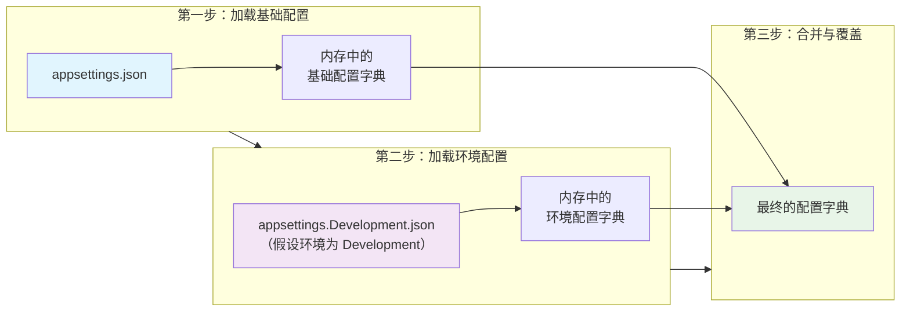

`appSettings.json` 是一个用于存储应用程序配置设置的 JSON 格式配置文件，是现代 .NET 应用（如 ASP.NET Core、.NET 5/6/7+ 等）中替代传统 `web.config` 或 `app.config` 的主要配置方式。

```json
{
  "Logging": {
    "LogLevel": {
      "Default": "Information",
      "Microsoft.AspNetCore": "Warning"
    }
  },
  "ConnectionStrings": {
    "DefaultConnection": "Server=localhost;Database=MyDb;Trusted_Connection=True;"
  },
  "ApiSettings": {
    "BaseUrl": "https://api.example.com",
    "Timeout": 30
  }
}
```

## 主要作用

1. **存储配置数据**：
	- 数据库连接字符串
	- API 密钥
	- 日志级别
	- 服务端点
	- 等等...
2. **环境分离**：可通过不同文件（如 `appSettings.Development.json`）为不同环境（开发、生产）配置不同值。
3. **灵活绑定**：配置值可直接绑定到 C# 类的属性，便于强类型访问。

## 环境分离

`appsettings.json` 是无论什么环境都会加载的**基础配置文件**，ASP.NET Core 应用根据 `ASPNETCORE_ENVIRONMENT` 环境变量的值决定加载哪个 `appSettings.{Environment}.json` 。


> [!tip] “增强补丁”
> `appsettings.json` 和 `appsettings.{Environment}.json` **会被同时加载，但环境特定文件的配置项会覆盖基础文件中的同名项**。
> 
> 如在开发环境下，程序会先读取 `appsettings.json`，然后用 `appsettings.Development.json` 中相同的配置项去覆盖它，未覆盖的配置则保持不变。




> [!caution] 不应当将 `appsettings.json` 加入 `.gitignore`
> 只有包含敏感信息或本地特殊配置的环境配置文件（如 `appsettings.Development.json`）才需被忽略。


### `.gitignore` 设置

| 配置文件类型                               | 是否提交到 Git | 说明与建议                                                                                                                                            |
| ------------------------------------ | --------- | ------------------------------------------------------------------------------------------------------------------------------------------------ |
| **`appsettings.json`**               | **✅ 提交**  | 这是**基础配置文件**，应包含所有环境的**非敏感通用设置**和**占位符**，为项目运行提供结构基础。                                                                                            |
| **`appsettings.{Environment}.json`** | **❌ 忽略**  | 通常包含环境特定的**敏感信息**（如数据库密码、API密钥），应通过 `.gitignore` 避免泄露[](http://t.zoukankan.com/OFSHK-p-14739071.html)[](https://dev59.com/w1cP5IYBdhLWcg3wiqZr)。 |
| **`appsettings.local.json`**         | **❌ 忽略**  | 开发者**个人本地**的覆盖设置，**必须**加入 `.gitignore`[](https://dev59.com/w1cP5IYBdhLWcg3wiqZr)。                                                                |
| **`launchSettings.json`**            | **✅ 提交**  | 包含项目的启动配置，如端口号。它是团队成员共享的开发配置，但不影响生产环境[](https://cloud.tencent.com/developer/ask/sof/108148883?from=16139)。                                       |
