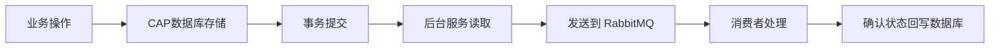

CAP 是一个基于 .NET 的分布式事务解决方案和事件总线库，采用最终一致性和事件驱动的架构模式，来确保分布式系统中数据的一致性。

主要优势在于将本地数据库事务和消息发送绑定在一起，确保了业务操作成功，消息一定发送的语义。

1. **源码**：[dotnetcore/CAP](https://github.com/dotnetcore/CAP)
2. **安装**：
```bash
dotnet add package DotNetCore.CAP --version 8.4.0
```


## 核心设计

CAP **结合了数据库和消息队列**，其关键点在于：
1. **消息持久化**：当你在业务代码中发布一个消息时，CAP 会**先将消息作为事务的一部分持久化到你指定的数据库中**（写入 `Cap.Published` 表），确保消息不会因服务重启或宕机而丢失。
2. **保证最终一致性**：CAP 采用本地消息表（Local Message Table）的方案来确保最终一致性，这使得 CAP 具有高可用性和可靠性。
3. **集成事务**：CAP 强调将消息发布和业务操作放在同一个数据库事务中，这是保证数据一致性的关键。


## 架构


## 核心特性

1. **分布式事务支持**
	- 提供**最终一致性**模式
	- 集成本地数据库事务和消息发送
	- 确保业务操作和消息发送的原子性
2. **多消息队列支持**
	- RabbitMQ
	- Kafka
	- Azure Service Bus
	- Redis Streams
	- NATS
	- Amazon SQS/SNS
3. **多存储支持**
	- SQL Server
	- MySQL
	- PostgreSQL
	- MongoDB
	- Redis
4. **开箱即用的功能**
	- 消息重试机制
	- 失败消息监控和重放
	- 内置仪表盘
	- 服务发现集成


### 生命周期




## 核心组件

```cs
// CAP 的核心接口
public interface ICapPublisher
{
    Task PublishAsync<T>(string name, T content, 
        IDbTransaction transaction = null);
}
```

```cs
public interface ICapSubscriber
{
    void Subscribe<T>(string name, Func<T, Task> subscriber);
}
```

### CapSubscribe

`CapSubscribe` 是 CAP 框架中用于**标记消息订阅方法**的特性（Attribute），定义了该方法如何订阅和消费特定的消息。

```csharp
[CapSubscribe("topic", Group = "group", GroupConcurrent = 4)]
```

**核心参数**：
1. **`Name`**：主题（Topic）名称，`string`，**必须项**，指定了当前方法要订阅哪个主题的消息。
	 - **底层映射**：这个主题名称在不同的消息队列（Broker）中有不同的对应物[](https://cap.dotnetcore.xyz/user-guide/zh/cap/configuration/)：
	    - **RabbitMQ**: 对应 **Routing Key**。
	    - **Kafka**: 对应 **Topic**。
	    - **Azure Service Bus**: 对应 **Subject**。
	    - **NATS**: 对应 **Subject**。
	    - **Redis Streams**: 对应 **Stream**。

2. **`Group`**：分组参数，`string`，可选项，指定了当前订阅者所属的消费者组（Consumer Group）名称，决定了当多个服务实例订阅了相同主题时，消息如何被分发。
	- **作用**：
		- **相同组（竞争消费者模式）**：如果多个订阅者拥有**相同的 `Group`**，那么一条消息只会被其中一个订阅者消费。这实现了**负载均衡**，适用于提升处理能力。
		- **不同组（广播模式）**：如果多个订阅者拥有**不同的 `Group`**，那么一条消息会被**所有**组各自消费一次。这实现了**广播**，适用于需要多个独立服务同时响应同一事件的场景。
	- **底层映射**：`Group` 在消息队列底层也有对应概念：
	    - **RabbitMQ**: 对应 **Queue**。
	    - **Kafka**: 对应 **Consumer Group**。
	    - **Azure Service Bus**: 对应 **Subscription Name**。
	    - **NATS**: 对应 **Queue Group**。
	    - **Redis Streams**: 对应 **Consumer Group**。

3. **`GroupConcurrent`**：并发控制参数，`string`，可选项，用于控制当前消费者组内，可以同时并行处理的消息数量。
	- **作用**：设置为 `4`，意味着对于这个特定的 `Group`，CAP 框架最多会启动 **4 个线程**来并发地处理到达的消息，从而提升消费吞吐量。
	- **注意事项**：
		- 如果在同一个 `Group` 内的多个订阅方法上都设置了 `GroupConcurrent`，那么该组的实际并行度是这些设置值的**总和**。
		- 该设置**仅对新消息生效**，失败后重试的消息不受此并发度限制。


### ISerializer

`ISerializer` 是 CAP（一个处理分布式事务和事件总线的 .NET 库）中的一个核心接口，是在 CAP 3.0 版本中引入的，主要目的是为发往消息队列（MQ）的消息体提供可自定义的序列化机制。

`ISerializer` 接口定义了两个核心的异步方法：

1. **`SerializeAsync` 方法**：用于**序列化**。
    - **输入**：一个 `Message` 对象，它封装了你的业务数据。
    - **输出**：一个 `Task<TransportMessage>`，即一个专用于在消息队列中传输的二进制消息对象。
    - **作用**：将业务对象转换为可传输的格式。
2. **`DeserializeAsync` 方法**：用于**反序列化**。
    - **输入**：一个 `TransportMessage` 对象（从消息队列接收到的）和期望的目标类型 `Type`。
    - **输出**：一个 `Task<Message>`，即还原后的业务消息对象。
    - **作用**：将传输格式的数据恢复为业务对象。

**使用**：

1. **创建一个类，实现 `ISerializer` 接口**。例如，创建一个 `MyCustomSerializer` 类：
```csharp
public class MyCustomSerializer : ISerializer
{
	public Task<TransportMessage> SerializeAsync(Message message)
	{
		// 在这里实现你的序列化逻辑，将 message 转换为 TransportMessage
	}
	public Task<Message> DeserializeAsync(TransportMessage transportMessage, Type valueType)
	{
		// 在这里实现你的反序列化逻辑，将 TransportMessage 转换为 Message
	}
}
```

2. **将你的自定义实现注册到依赖注入（DI）容器中**。这通常在 `Startup.cs` 或 `Program.cs` 中完成：
```csharp
// 注册自定义序列化器
services.AddSingleton<ISerializer, MyCustomSerializer>();
// 然后正常添加 CAP 服务
services.AddCap(x => { ... });
```

通过这种方式，CAP 在需要序列化或反序列化消息时，就会自动使用你注册的实现。


## 基本用法

1. **安装和配置**：
```cs
// Program.cs
builder.Services.AddCap(capOptions =>
{
    // 配置存储（使用 PostgreSQL）
    capOptions.UsePostgreSql("Host=localhost;Database=cap;Username=postgres;Password=password");
    
    // 配置消息队列（使用 RabbitMQ）
    capOptions.UseRabbitMQ(options =>
    {
        options.HostName = "localhost";
        options.UserName = "guest";
        options.Password = "guest";
    });
    
    // 配置 Redis Stream 作为消息传输器
    // capOptions.UseRedis(redisOptions =>
    // {
        // 配置 Redis 连接，以下是示例，请替换为你的 Redis 服务器信息
    //     redisOptions.Configuration = new StackExchange.Redis.ConfigurationOptions
    //     {
    //         EndPoints = { { "localhost", 6379 } },
    //         // Password = "your_redis_password", // 如果 Redis 设置了密码
    //         // AbortOnConnectFail = false
    //     };
        // 可选：配置从 Stream 读取的条目数
        // redisOptions.StreamEntriesCount = 10;
        // 可选：配置连接池大小
        // redisOptions.ConnectionPoolSize = 10;
    // });
    
    // 配置数据库持久化
    capOptions.UseSqlServer("Your_SQLServer_Connection_String");
    // 如果你使用其他数据库，请对应配置，例如：
    // capOptions.UsePostgreSql("Your_PostgreSQL_Connection_String");
    
    // 启用仪表盘
    capOptions.UseDashboard();
    
    // 失败重试配置
    capOptions.FailedRetryCount = 3;
    capOptions.FailedRetryInterval = 60;
});
```

> [!attention] CAP 必须配置数据库持久化！
> CAP 的设计核心是**确保业务操作和消息发送的原子性**，采用**存储后转发**模式，因此需要配置数据库持久化存储消息的状态（如已发送、已接收、已成功处理等）以实现消息的可靠性传输和分布式事务的一致性，**无论使用 RabbitMQ 还是 Redis Stream** 。
> ```cs
> // CAP 的工作流程示意
> using (var transaction = dbContext.Database.BeginTransaction())
> {
>    // 1. 执行业务操作
>    order.Status = "Completed";
>    dbContext.Orders.Update(order);
>    
>    // 2. 在同一个数据库事务中，将消息写入本地存储
>    // CAP 内部执行：INSERT INTO cap.published (MessageId, Content, Status) VALUES (...)
>    
>    // 3. 提交事务
>    transaction.Commit(); // 业务操作和消息存储同时提交或回滚
> }
> 
> // 4. 后台进程从数据库读取待发送消息，转发到消息队列
> ```

> [!tip]- 放弃数据库持久化
> 如果觉得数据库持久化太重，可以考虑其他的替代技术方案：
> 1. **方案1**：**直接使用 `RabbitMQ.Client`（放弃事务保证）**
> ```cs
> using var connection = factory.CreateConnection();
> using var channel = connection.CreateModel();
> // 简单发布，没有事务保证
> channel.BasicPublish(exchange: "orders",
>                      routingKey: "order.completed",
>                      body: messageBytes);
> ```
> 2. **方案2**：**使用 `System.Threading.Channels`（进程内队列）**
> ```cs
> var channel = Channel.CreateUnbounded<OrderEvent>();
> var writer = channel.Writer;
> await writer.WriteAsync(new OrderCompletedEvent { OrderId = orderId });
> ```


2. **发布消息**
```cs
public class OrderService
{
    private readonly ICapPublisher _capPublisher;
    private readonly ApplicationDbContext _dbContext;
    
    public OrderService(ICapPublisher capPublisher, ApplicationDbContext dbContext)
    {
        _capPublisher = capPublisher;
        _dbContext = dbContext;
    }
    
    public async Task CompleteOrderAsync(int orderId)
    {
        using var transaction = await _dbContext.Database.BeginTransactionAsync();
        
        try
        {
            // 业务逻辑
            var order = await _dbContext.Orders.FindAsync(orderId);
            order.Status = "Completed";
            
            // 发布订单完成事件
            await _capPublisher.PublishAsync(
                "order.completed", 
                new { OrderId = orderId, CompletedAt = DateTime.UtcNow },
                _dbContext.Database.CurrentTransaction?.GetDbTransaction());
                
            await _dbContext.SaveChangesAsync();
            await transaction.CommitAsync();
        }
        catch
        {
            await transaction.RollbackAsync();
            throw;
        }
    }
}
```

3. **订阅和处理消息**
```cs
public class OrderEventHandler
{
    private readonly IEmailService _emailService;
    private readonly IInventoryService _inventoryService;
    
    public OrderEventHandler(IEmailService emailService, IInventoryService inventoryService)
    {
        _emailService = emailService;
        _inventoryService = inventoryService;
    }
    
    // 订阅订单完成事件
    [CapSubscribe("order.completed")]
    public async Task HandleOrderCompleted(OrderCompletedEvent @event)
    {
        // 发送确认邮件（耗时任务）
        await _emailService.SendOrderConfirmationAsync(@event.OrderId);
        
        // 更新库存（耗时任务）
        await _inventoryService.UpdateStockAsync(@event.OrderId);
        
        // 记录审计日志（耗时任务）
        await _auditService.LogOrderCompletionAsync(@event.OrderId);
    }
    
    // 支持多个订阅者
    [CapSubscribe("order.completed")]
    public async Task UpdateAnalytics(OrderCompletedEvent @event)
    {
        await _analyticsService.RecordOrderCompletionAsync(@event.OrderId);
    }
}
```


## 高级特性

1. **消息过滤和路由**
```cs
// 使用 Group 进行消息分组
[CapSubscribe("order.completed", Group = "email-service")]
public async Task SendOrderEmail(OrderCompletedEvent @event)
{
    // 专门处理邮件发送
}

[CapSubscribe("order.completed", Group = "inventory-service")]
public async Task UpdateInventory(OrderCompletedEvent @event)
{
    // 专门处理库存更新
}
```

2. **消息重试和死信队列**
```cs
[CapSubscribe("order.completed")]
public async Task HandleWithRetry(OrderCompletedEvent @event, [FromCap] CapHeader headers)
{
    try
    {
        // 业务处理
        await ProcessOrder(@event);
    }
    catch (Exception ex)
    {
        // 根据重试次数决定是否继续重试
        var retryCount = headers[DotNetCore.CAP.Messages.Headers.Retries];
        if (int.TryParse(retryCount, out var count) && count >= 3)
        {
            // 超过重试次数，记录到死信队列
            await _deadLetterService.StoreFailedMessage(headers, @event, ex);
            return;
        }
        throw; // 继续重试
    }
}
```

3. **仪表盘监控**
```cs
// 启用仪表盘
builder.Services.AddCap(cap =>
{
    cap.UseDashboard();
});

// 访问 http://localhost:xxx/cap 查看消息状态
```


## 最佳实践

1. **消息设计**
```cs
// 好的消息设计 - 包含足够的信息
public record OrderCompletedEvent
{
    public int OrderId { get; init; }
    public string CustomerEmail { get; init; }
    public DateTime CompletedAt { get; init; }
    public List<OrderItem> Items { get; init; }
}

// 避免的消息设计 - 信息不足
public record BadOrderEvent
{
    public int OrderId { get; init; }
    // 缺少必要信息，处理者需要查询数据库
}
```

2. **错误处理策略**
```cs
public class ResilientMessageHandler
{
    private readonly ILogger<ResilientMessageHandler> _logger;
    
    [CapSubscribe("critical.task")]
    public async Task HandleCriticalTask(CriticalTaskEvent @event)
    {
        try
        {
            // 使用重试策略
            await Policy
                .Handle<TimeoutException>()
                .WaitAndRetryAsync(3, retryAttempt => 
                    TimeSpan.FromSeconds(Math.Pow(2, retryAttempt)))
                .ExecuteAsync(() => ProcessCriticalTask(@event));
        }
        catch (Exception ex)
        {
            _logger.LogError(ex, "处理关键任务失败: {Event}", @event);
            throw; // CAP 会进行重试
        }
    }
}
```