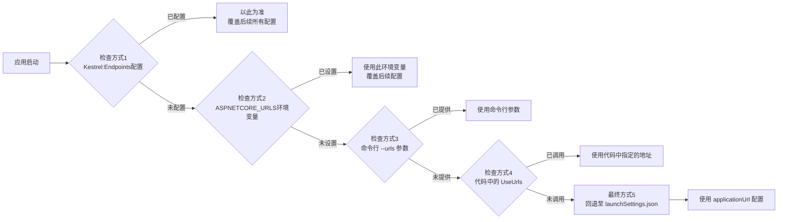

## 服务监听地址设置方式

1. **开发配置文件**：`launchSettings.json` 的 `applicationUrl`
	- 仅限本地开发
2. **代码硬编码**：`UseUrls()` 方法
3. **命令行参数**：`dotnet run --urls="http://*:8080"`
	- 临时测试、命令行快速指定
 4. **环境变量**：`ASPNETCORE_URLS`
	- 容器、PaaS 平台（如 Azure App Service）、服务器环境
 5. **Kestrel 终结点配置**：`appsettings.json` 的 `Kestrel:Endpoints` 节
	- 生产、Docker、需要精细控制（证书、协议）
 6. **IIS 托管**：端口和地址的配置控制权发生了根本性转移，.NET Core 应用（Kestrel 服务器）并不直接对外服务。

**服务监听地址设置方式的优先级如下**：**`Kestrel:Endpoints` 配置** > **环境变量** > **命令行** > **代码** > **开发配置**。

其中，配置逐级覆盖的链条如下：

> [!caution] 服务托管到 IIS 时配置逻辑完全不同
> 在 IIS 托管下，`applicationUrl` 和 `Kestrel:Endpoints` 的设置通常会被完全忽略，实际的 URL 和端口由 IIS 站点绑定决定。
> 
> 这是由于在 IIS 托管模式下，.NET Core 应用（Kestrel 服务器）并不直接对外服务，而是作为一个后台进程运行，只与 IIS 工作进程（`w3wp.exe`）通信。IIS 充当了一个反向代理，接收外部请求并转发给内部的 Kestrel 进程，这个内部转发地址通常由 ASP.NET Core 模块（负责桥接 IIS 和 Kestrel 的模块）**自动处理**。

