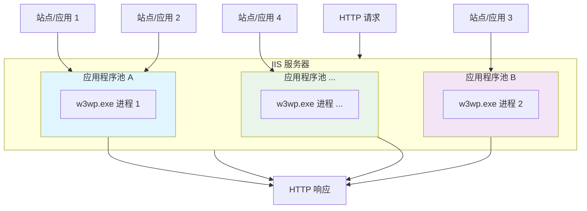

IIS（Internet Information Services，互联网信息服务）是微软公司开发的 Web 服务器软件，运行在 Windows 操作系统上，用于托管网站、Web 应用程序和 Web 服务。

## 主要特点

1. **集成于 Windows 系统**
    - IIS 是 Windows Server 的核心组件（也包含在 Windows 专业版/企业版中），与 Windows 生态系统（如 Active Directory、.NET Framework）深度集成。
2. **支持多种 Web 技术**
    - **ASP.NET**：微软的 Web 开发框架，与 IIS 高度协同。
    - **PHP**、**Python**等：通过扩展模块支持。
    - **静态文件**（HTML、CSS、JS）和动态内容处理。
3. **管理工具**
    - **IIS 管理器**：图形化界面，便于配置网站、虚拟目录、SSL 证书等。
    - **PowerShell 命令**：支持自动化管理。
4. **安全性功能**
    - 集成 Windows 身份验证（如 Kerberos）。
    - 支持 HTTPS/SSL、请求过滤、IP 限制等。
5. **可扩展性**
    - 可通过模块（如 URL 重写、负载均衡）增强功能。
    - 与 Azure 云服务无缝集成。


## 应用程序池

应用程序池（Application Pool）是 IIS 的核心隔离和管理单元，可以将它理解为一个独立的“容器”，这个容器为运行在其中的一个或多个 Web 应用程序提供独立的执行环境和资源边界。

IIS 通过创建独立的 `w3wp.exe` 工作进程来实际执行网站代码，应用程序池就是这个工作进程及其配置的“外壳”。



### 关键特性

1. **隔离性**：这是最重要的优势，不同池中的应用程序**完全独立**。
    - **故障隔离**：池 A 中的应用崩溃，只会导致该池的工作进程重启，池 B 中的应用**不受影响**，继续正常服务。
    - **资源隔离**：可以为不同池配置 CPU、内存限制，防止一个“贪婪”的应用拖垮整个服务器。
2. **稳定性与安全性**：每个池运行在独立的进程和身份下，降低了安全风险，并通过自动回收机制保持长期运行稳定。
3. **灵活性与可管理性**：可以单独为每个池配置 .NET 版本、管道模式、回收策略等，而无需重启整个 IIS 或服务器。


### 使用建议

1. **一个站点对应一个池**：对于关键或资源需求特殊的网站，这是最佳实践，能实现**最佳隔离**。
2. **多个站点共享一个池**：对于小型、同质、低风险的网站组，可以共享池以减少资源开销。但需注意，一个站点出错会影响同池所有站点。
3. **特别针对 ASP.NET Core**：务必确保其应用程序池的 `.NET CLR 版本` 为 “无托管代码”，这是最常见的配置错误之一。


## 应用场景

1. **企业内网网站**：托管公司内部门户或应用。
2. **公共网站**：运行 ASP.NET 等微软技术栈的网站。
3. **Web API 服务**：作为后端服务的宿主。
4. **文件传输**：支持 FTP 服务（通过 IIS 的 FTP 模块）。


## 托管 Web API 服务

以 .NET 8 的 ASP.NET Core 服务托管为例，核心是配置 IIS 作为反向代理，将请求转发给应用程序内部的 Kestrel 服务器。

**托管步骤**：

1. **环境准备**
	- 安装 IIS 与 .NET Hosting Bundle，如确保服务器安装 .NET 8 Runtime 或 .NET 8 Hosting Bundle。
2. **发布应用程序**
	- 使用 `dotnet publish` 发布，发布方式选择依赖框架或独立部署会直接影响 `web.config` 的配置
3. **配置 IIS 站点**
	- 创建网站，指向发布文件夹，应用程序池需设为 “无托管代码” 和 “集成管道模式”
4. **配置 `web.config`**
	- 设置处理程序与模块，核心配置是指定由 **`AspNetCoreModuleV2`** 处理请求
5. **解决文件锁定**：避免 IIS 进程锁定应用文件

### 核心原理

IIS 通过 ASP.NET Core 模块（ANCM）与你的应用程序通信，支持两种运行方式：
1. **进程内托管**：应用直接在 IIS 工作进程（`w3wp.exe`）中运行，性能更好，是 .NET Core 3.0 及更高版本的**默认方式**
2. **进程外托管**：IIS 作为反向代理，将请求转发给后端独立的 Kestrel 服务器进程

对于 .NET 8，通常推荐使用默认的**进程内托管**以获得最佳性能。


### 关键配置

IIS 都需要正确的 `web.config` 文件来识别和处理 ASP.NET Core 应用，这个文件通常会在发布时自动生成。

#### 依赖框架的部署

如果**服务器上已安装 .NET 8 运行时**，可采用此方式：

```xml
<?xml version="1.0" encoding="utf-8"?>
<configuration>
  <location path="." inheritInChildApplications="false">
    <system.webServer>
      <handlers>
        <!-- 关键：指定由 ANCM V2 处理所有请求 -->
        <add name="aspNetCore" path="*" verb="*" modules="AspNetCoreModuleV2" resourceType="Unspecified" />
      </handlers>
      <aspNetCore processPath="dotnet"
                  arguments=".\YourAppName.dll"
                  stdoutLogEnabled="true"
                  stdoutLogFile=".\logs\stdout"
                  hostingModel="inprocess" />
    </system.webServer>
  </location>
</configuration>
```

- **配置**：
	- `processPath="dotnet"`：指示 IIS 使用 `dotnet` 命令启动。
	- `arguments=".\YourAppName.dll"`：指定你的应用 `*.dll` 地址。
	- `hostingModel="inprocess"`：指定为进程内托管（可改为 `outofprocess` 以使用进程外托管）
	- `stdoutLogEnabled="true"`：启用标准输出日志，对排查启动错误**极其有用**，日志将生成在 `stdoutLogFile` 指定路径

#### 独立部署

如果将应用发布为包含运行时的独立可执行文件，配置会有所不同：
```xml
<aspNetCore processPath=".\YourAppName.exe"
            stdoutLogEnabled="false"
            stdoutLogFile=".\logs\stdout"
            hostingModel="inprocess" />
```

这里 `processPath` 直接指向可执行文件，不再需要 `arguments` 属性。


### 异常处理

在 IIS 中托管 ASP.NET Core 应用时，IIS 的 ASP.NET Core 模块（ANCM）会监控应用的运行，当程序异常退出时，处理机制可分为 IIS 层面的自动恢复和 ASP.NET Core 应用层面的异常处理两部分。

1. **IIS / ANCM 监控与恢复**
	- **自动重启工作进程**：发生未捕获的致命异常导致进程崩溃后，ANCM 会尝试自动重启进程
		- **快速失败保护**：超过阈值（如 5 分钟内 5 次崩溃）会停止自动重启
		- 用户可能短暂遇到 503 服务不可用错误，但通常会自动恢复
	- **应用程序池回收**：定期或在特定条件下（如内存超限）回收进程，实现平滑重启。
		- 回收条件、时间间隔、**启动模式（AlwaysRunning）**
		- 用户会话或内存数据可能丢失，需要应用设计支持。
2. **ASP.NET Core 应用**
	- **全局异常处理**：捕获请求处理中的异常，返回友好错误页，避免进程崩溃。
		- 异常中间件、异常过滤器、`IExceptionHandler`。
		- 用户收到统一错误提示（如 500 状态码），应用进程保持运行


#### 核心配置

为了增强应用的健壮性，你可以进行以下配置：

1. **调整 IIS 应用程序池设置**
    - **启动模式**：建议设置为 **`AlwaysRunning`** 以确保应用池在失败后能自动启动，你可以在应用程序池的“高级设置”中找到此选项。
    - **快速失败保护**：建议根据实际情况调整。在开发或排查故障期间，可以**暂时禁用**该功能以防止 IIS 停止应用池；在生产环境中，则需启用并配合健康检查，找出频繁崩溃的根本原因。
2. **在 ASP.NET Core 应用中实现全局异常处理**：这能防止大多数请求中的异常演变为进程崩溃，主要方法有： 
    - **使用异常处理中间件**：这是最常用、全局性的方法，在 `Program.cs` 中，通过 `app.UseExceptionHandler("/Error")` 来配置。
    - **使用异常过滤器**：更适合在 MVC 控制器或动作级别进行特定的异常处理。
    - **实现 `IExceptionHandler` 接口**（.NET 8+）：这是更新、更模块化的方式，允许定义多个按顺序执行的处理程序。
3. **持久化数据保护密钥**：为了避免应用重启后用户登录状态（Cookie）全部失效，务必在 `Program.cs` 中将密钥持久化到文件系统、数据库或 Redis 中。
```csharp
builder.Services.AddDataProtection()
				.PersistKeysToFileSystem(new DirectoryInfo(@"D:\AppData\DataProtection-Keys\")); 
// 示例：保存到文件
```

4. **严格处理后台线程异常**：任何通过 `Task.Run`、`ThreadPool.QueueUserWorkItem` 或自定义 `Thread` 创建的后台任务，都必须有完善的 `try-catch` 块来捕获和处理异常，决不能让其“未处理”。


#### 问题排查

当应用异常退出时，可按以下步骤排查：
1. **检查 Windows 事件查看器**：查看 **“Windows 日志 -> 应用程序”** 中是否有来自 `IIS-APPNODE`、`.NET Runtime` 或应用程序本身的错误事件，这里常有崩溃堆栈信息。
2. **启用并检查 stdout 日志**：在 `web.config` 的 `<aspNetCore>` 节点中设置 `stdoutLogEnabled="true"`，IIS 模块和应用输出的所有日志都会保存到指定目录。
3. **检查 IIS 日志**：在 `C:\inetpub\logs\LogFiles` 下对应的站点目录中，查看是否有大量 `503` 状态码的请求。
4. **审视快速失败保护**：如果应用池无故停止且无法启动，检查应用池的“快速失败保护”设置是否已触发并锁定


## 安装与启用

1. 打开“程序和功能”，在左侧点“启用或关闭 Windows 功能”
2. **勾选 IIS 组件**：在弹出的窗口中找到 **Internet Information Services** 勾选，并展开，确保勾选所需的子组件（如 Web 管理工具、万维网服务等）。


## 配置


1. **启动 IIS 管理器**：搜索 **Internet 信息服务 (IIS) 管理器** 打开。
	- 或者**按 Win + R，输入 inetmgr，然后回车**

2. **准备网站文件**：在服务器上创建一个文件夹，用于存放网站文件，将网站程序（如 ASP.NET Core 发布后的文件）拷贝到这个文件夹中。
3. **添加网站目录**：在 IIS 管理器左侧选择本机名称，右键点击“添加网站”。
4. 设置网站名称、物理路径（网站文件夹位置）和端口号。
- **配置核心参数**：
	- **网站名称**：为你站点起一个易于识别的名字
	- **物理路径**：点击 **“...”** 按钮，选择你刚才准备好的网站文件夹
	- **绑定**：这是访问网站的入口设置
		- **类型**：通常选择 `http` 或 `https`
		- **IP地址**：一般保持默认的 “全部未分配”，或从下拉列表中选择服务器的一个特定 IP
		- **端口**：`http` 协议常用 80 端口，如果填了其他未被占用的端口（如 `8080`），访问时需要带上端口号。
		- **主机名**：如果站点有域名，在此填写（如 `www.yoursite.com`）。
			- **注意**：如果你在同一台服务器通过相同端口配置多个站点，则必须通过主机名（不同域名）来区分
		- **启动网站**：确保勾选 “立即启动网站”（默认通常是勾选的）

5. **配置应用程序池**：在 IIS 管理器的左侧，点击 “应用程序池”，找到网站对应的程序池（创建站点时默认会新建一个同名池），右键选择“高级设置”进行修改。
	- **托管 ASP.NET Core 应用额外配置**：
		- **.NET CLR 版本**：（必需）设置 “无托管代码”，因为 ASP.NET Core 应用运行在独立的 Kestrel 进程中。
		- **托管管道模式**：（推荐）设置 “集成”，允许 IIS 管道与 ASP.NET Core 管道更高效地集成。
		- **启动模式**：（可选）设置 “AlwaysRunning”，可减少应用首次访问的启动延迟，避免应用池回收后空闲超时。
		- **身份标识**：设置高权限账户


6. **启动与访问测试**：
    - 创建完成后，新站点会出现在网站列表中。右键点击它，选择 “管理网站” -> “启动”（如果未自动启动）。
    - 打开浏览器，根据你的绑定设置进行访问测试：
        - 如果端口为 80：`http://服务器IP/`
        - 如果为其他端口（如 8080）：`http://服务器IP:8080/`
        - 如果配置了主机名（且 DNS 已解析或已在本地 Hosts 文件配置）：`http://你设置的主机名/`