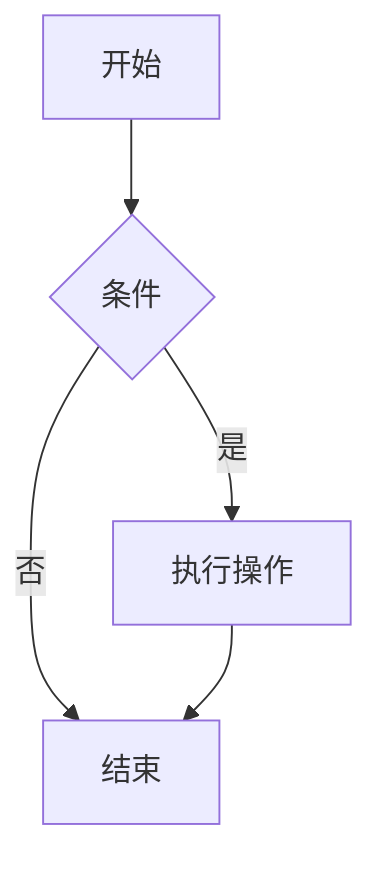
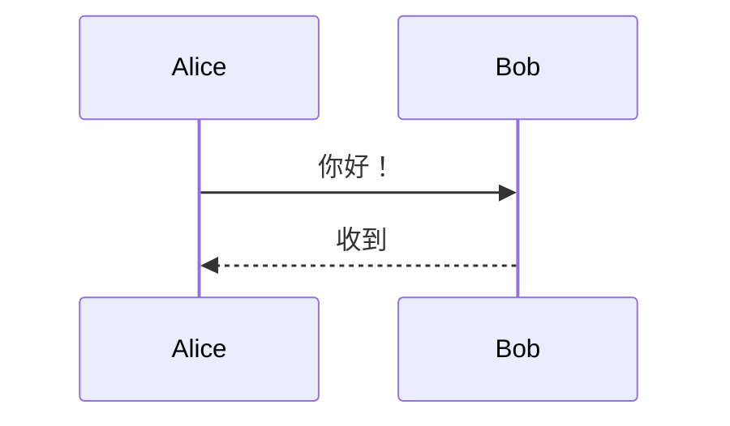
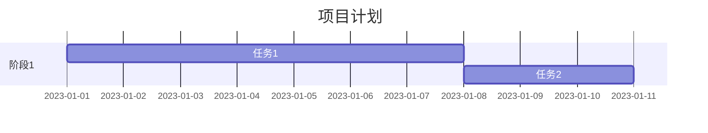
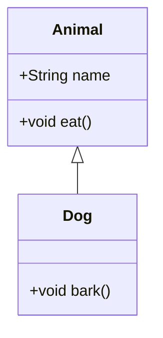

Mermaid Markdown 是一种基于文本的图表描述语言，它允许你使用简单的 Markdown 风格的语法来绘制各种图表（如流程图、时序图、甘特图等），并可以在支持 Mermaid 的 Markdown 编辑器或工具中实时渲染成可视化图表。

## 核心特点

1. **纯文本编写**：用代码方式定义图表，易于版本控制（如 Git）和协作。
2. **语法简洁**：类似 Markdown 的轻量级语法，无需图形化操作。
3. **广泛支持**：兼容多数 Markdown 工具（如 VS Code、GitHub、Obsidian 等），需插件或原生支持。


## 常用图表示例

#### 流程图（Flowchart）



#### 时序图（Sequence Diagram）



#### 甘特图（Gantt Chart）



#### 类图（Class Diagram）




## 如何使用

1. **VS Code**：安装插件（如 "Mermaid Preview" 或 "Markdown Preview Enhanced"）。
2. **GitHub**：直接在 Markdown 文件中使用代码块标记为 ` ```mermaid `。
3. **Obsidian**：启用内置的 Mermaid 插件。


## 优势

- **可维护性**：文本格式比图形文件更易修改和复用。
- **自动化友好**：可结合脚本生成动态图表。
- **跨平台**：不受绘图工具限制。