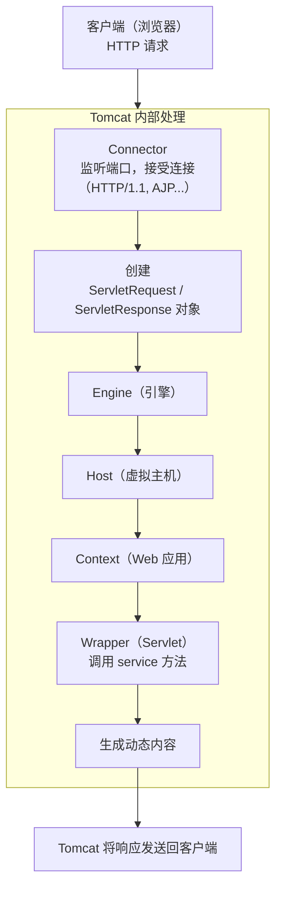

Apache Tomcat（Tomcat）是一个开源的、轻量级的 Web 应用服务器和 Servlet 容器，是 Java 生态系统中最著名、使用最广泛的应用服务器之一。

简单来说，你可以把它理解为一个**能运行 Java Web 程序的特殊网站服务器**。

## 核心概念

1. **Servlet 和 JSP**：这是 Java 用来开发动态网页的核心技术。`Servlet` 是运行在服务器端的 Java 小程序，用于处理客户端（如浏览器）的请求并生成响应。`JSP` 是一种将 Java 代码嵌入 HTML 的技术，最终也会被转换成 Servlet 来执行。
2. **Servlet 容器**：这是 Tomcat 的**最核心身份**。容器负责管理 Servlet 的整个生命周期（加载、初始化、执行、销毁），并处理网络通信（将 HTTP 请求转换成 `ServletRequest` 对象，将 `ServletResponse` 对象转换成 HTTP 响应）。
3. **Web 应用服务器**：它不仅仅是一个容器，还提供了 HTTP 服务（所以你可以直接把它当 Web 服务器用，处理静态页面），以及运行 Web 应用所需的环境。

## 主要功能

1. **核心功能**：执行用 Servlet 和 JSP 编写的 Java Web 应用程序。
2. **轻量级**：与 IBM WebSphere、Oracle WebLogic 等重量级全功能应用服务器相比，Tomcat 更小巧、启动更快、资源消耗更少。它主要专注于 Servlet/JSP 容器，不包含完整的 Java EE 套件（如 EJB 容器），但可以通过插件扩展。
3. **开源免费**：由 Apache 软件基金会开发和维护，拥有庞大的社区和丰富的文档。
4. **跨平台**：由于基于 Java，可以运行在任何安装了 Java 虚拟机（JVM）的操作系统上（Windows, Linux, macOS 等）。
5. **高可靠性和稳定性**：经过多年发展和企业级应用的广泛检验，非常成熟可靠。

## 工作流程

**关键组件**：
1. **Connector（连接器）**：负责对外通信，监听特定端口（默认 8080），支持 HTTP、AJP 等协议。
2. **Engine（引擎）**：请求处理流水线的核心。
3. **Host（虚拟主机）**：代表一个虚拟主机，用于支持基于域名的部署。
4. **Context（上下文）**：对应一个独立的 **Web 应用程序**（通常是一个 `.war` 文件或解压后的目录）。这是开发者最常打交道的概念。
5. **Wrapper（包装器）**：代表一个具体的 **Servlet**，负责调用其生命周期方法。

## 应用场景

1. **传统 Java Web 项目部署**：部署基于 Spring MVC、Struts2 等框架开发的 Web 应用。
2. **Spring Boot 应用的内置服务器**：Spring Boot 默认使用嵌入式的 Tomcat 作为其 Web 服务器，这简化了部署，让你可以打包成一个可执行的 JAR 文件。
3. **开发和测试环境**：由于其轻量和易配置的特性，是开发阶段的首选服务器。
4. **中小型生产环境**：很多中小型互联网公司或企业内部系统使用 Tomcat 作为生产环境的服务器。
5. **与其他服务器集成**：有时会作为 Servlet 容器，放在 Apache HTTPD 或 Nginx 这类更专业的 HTTP 服务器后面，由它们处理静态文件、负载均衡和反向代理，将动态请求转发给后端的 Tomcat 集群（通常通过 AJP 协议）。

## 相关目录

安装 Tomcat 后，你会看到以下重要目录：

- **`bin/`**： 存放启动和关闭 Tomcat 的脚本（如 `startup.sh`/`startup.bat`, `shutdown.sh`/`shutdown.bat`）。
- **`conf/`**： 存放配置文件，最重要的是 `server.xml`（主配置文件）、`web.xml`（所有应用的默认配置）。
- **`logs/`**： 存放 Catalina 引擎、应用程序、访问日志等运行日志文件，**排查问题时首先查看的地方**。
- **`webapps/`**： **默认的 Web 应用部署目录**。将你的 `.war` 文件放在这里，Tomcat 启动时会自动解压并部署。
- **`work/`**： Tomcat 的工作目录，存放 JSP 文件编译后生成的 Servlet 源文件和 Class 文件。
- **`lib/`**： 存放 Tomcat 运行和所有 Web 应用共享的 Java 库文件（JAR 文件）。

