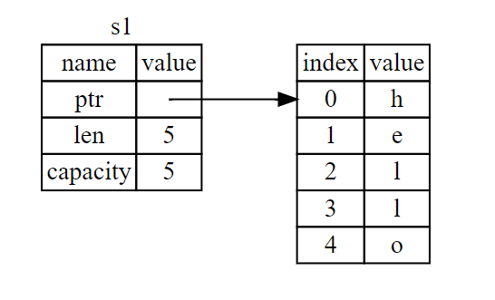
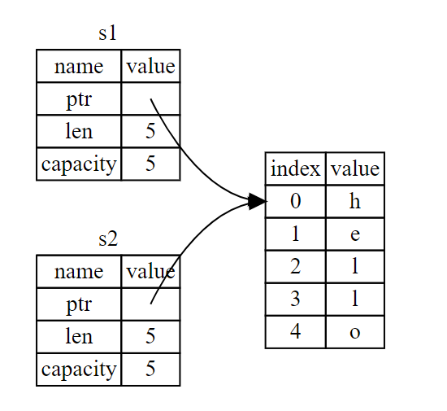
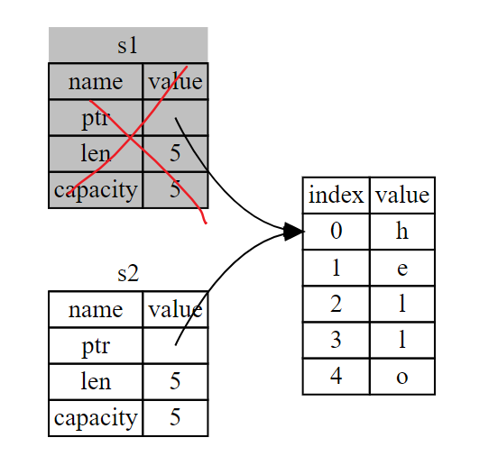
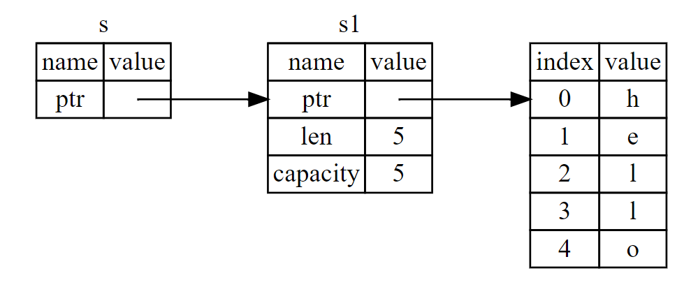
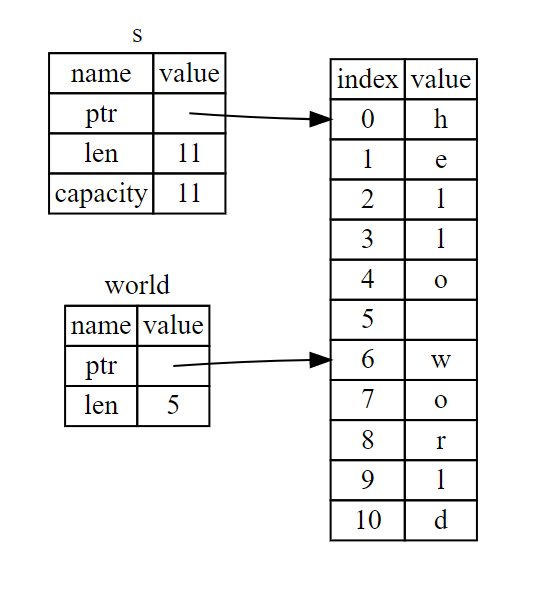

### 1. 所有权

Rust 的核心功能（之一）是 所有权（ownership）。虽然该功能很容易解释，但它对语言的其他部分有着深刻的影响。所有权（系统）是 Rust 最为与众不同的特性，它让 Rust 无需垃圾回收（garbage collector）即可保障内存安全。

#### 1\). 栈和堆

1. **栈**中的所有数据都必须占用已知且固定的大小。栈上的数据会自动的移入移出。
2. 在编译时大小未知或大小可能变化的数据，要改为存储在**堆**上。堆是缺乏组织的：当向堆放入数据时，你要请求一定大小的空间。操作系统在堆的某处找到一块足够大的空位，把它标记为已使用，并返回一个表示该位置地址的 指针（pointer）。这个过程称作 在堆上分配内存（allocating on the heap），有时简称为 “分配”（allocating）。将数据推入栈中并不被认为是分配。因为指针的大小是已知并且固定的，你可以将指针存储在栈上，不过当需要实际数据时，必须访问指针。
3. 访问堆上的数据比访问栈上的数据慢，因为必须通过指针来访问。现代处理器在内存中跳转越少就越快（缓存）。
4. 跟踪哪部分代码正在使用堆上的哪些数据，最大限度的减少堆上的重复数据的数量，以及清理堆上不再使用的数据确保不会耗尽空间，这些问题正是所有权系统要处理的。

#### 2\). 所有权规则

所有权有以下三条规则：

* Rust 中的每个值都有一个变量，称为其所有者。
* 一次只能有一个所有者。
* 当所有者不在程序运行范围时，该值将被删除。

#### 3\). 变量作用域：

与C语言类似，用一个例子表示

```rust
{
    // 在声明以前，变量 s 无效
    let s = "Hello";
    // 这里是变量 s 的可用范围
}
// 变量范围已经结束，变量 s 无效
```

#### 4\). `String`类型

String类型比前面介绍的基本数据类型要更复杂，有助于帮我们理解所有权机制。**String是存储在堆中的**。我们已经见过字符串字面值，字符串值被硬编码进程序里。字符串字面值是很方便的，不过他们并不适合使用文本的每一种场景。原因之一就是他们是不可变的。另一个原因是并不是所有字符串的值都能在编写代码时就知道：例如，要是想获取用户输入并存储该怎么办呢？为此，Rust 有第二个字符串类型，String。这个类型被分配到堆上，所以能够存储在编译时未知大小的文本。可以使用 from 函数基于字符串字面值来创建 String，如下：

```rust
let s1 = String::from("Hello");
let mut s2 = String::from("hello");

s2.push_str(", world!");     // 其后追加

println!("{}", s2);
```

为什么 `String` 可变而字面值却不行呢？区别在于两个类型对内存的处理上。

#### 5\). 内存和分配:

就字符串字面值来说，我们在编译时就知道其内容，所以文本被直接硬编码进最终的可执行文件中。这使得字符串字面值快速且高效。不过这些特性都只得益于字符串字面值的不可变性。不幸的是，我们不能为了每一个在编译时大小未知的文本而将一块内存放入二进制文件中，并且它的大小还可能随着程序运行而改变。

对于 `String` 类型，为了支持一个可变，可增长的文本片段，需要在堆上分配一块在编译时未知大小的内存来存放内容。这意味着：

* 必须在运行时向操作系统请求内存。
* 需要一个当我们处理完 `String` 时将内存返回给操作系统的方法。

第一部分由我们完成：当调用 `String::from` 时，它的实现 \(implementation\) 请求其所需的内存。这在编程语言中是非常通用的。

然而，第二部分实现起来就各有区别了。在有**垃圾回收**（garbage collector，GC）的语言中， GC 记录并清除不再使用的内存，而我们并不需要关心它。没有 GC 的话，识别出不再使用的内存并调用代码显式释放就是我们的责任了，跟请求内存的时候一样。从历史的角度上说正确处理内存回收曾经是一个困难的编程问题。如果忘记回收了会浪费内存。如果过早回收了，将会出现无效变量。如果重复回收，这也是个 bug。我们需要精确的为一个 `allocate` 配对一个 `free`。

Rust 采取了一个不同的策略：内存在拥有它的变量离开作用域后就被自动释放。下面是使用 `String` 的版本：

```rust
{
    let s = String::from("hello"); // 从此处起，s 是有效的

    // 使用 s
}                                  // 此作用域已结束，
                                   // s 不再有效
```

这是一个将 `String` 需要的内存返回给操作系统的很自然的位置：当 `s` 离开作用域的时候。

当变量离开作用域，Rust 为我们调用一个特殊的函数。这个函数叫做 `drop`，在这里 `String` 的作者可以放置释放内存的代码。Rust 在结尾的 `}` 处自动调用 `drop`。

#### 4\). 变量与数据交互的方式（一）：移动

Rust 中的多个变量可以采用一种独特的方式与同一数据交互。

```rust
let x = 5;
let y = x;
```

我们大致可以猜到这在干什么：“将 5 绑定到 x；接着生成一个值 x 的拷贝并绑定到 y”。现在有了两个变量，x 和 y，都等于 5。这也正是事实上发生了的，因为整数是有已知固定大小的简单值，所以这两个 5 被放入了栈中。

下面看看 `String` 版本：

```rust
let s1 = String::from("hello");
let s2 = s1;
```

这看起来与上面的代码非常类似，所以我们可能会假设他们的运行方式也是类似的：也就是说，第二行可能会生成一个 s1 的拷贝并绑定到 s2 上。不过，事实上并不完全是这样。

`String` 由三部分组成，如图左侧所示：一个指向存放字符串内容内存的指针，一个长度，和一个容量。这一组数据存储在栈上。右侧则是堆上存放内容的内存部分。



长度表示 `String` 的内容当前使用了多少字节的内存。容量是 `String` 从操作系统总共获取了多少字节的内存。长度与容量的区别是很重要的，不过在当前上下文中并不重要，所以现在可以忽略容量。

当我们将 `s1` 赋值给 `s2`，`String` 的数据被复制了，这意味着我们从栈上拷贝了它的指针、长度和容量。我们并没有复制指针指向的堆上数据。换句话说，内存中数据的表现如下图所示。



之前我们提到过当变量离开作用域后，Rust 自动调用 `drop` 函数并清理变量的堆内存。不过第二张图展示了两个数据指针指向了同一位置。这就有了一个问题：当 `s2` 和 `s1` 离开作用域，他们都会尝试释放相同的内存。这是一个叫做二次释放（double free）的错误，也是之前提到过的内存安全性 bug 之一。两次释放（相同）内存会导致内存污染，它可能会导致潜在的安全漏洞。

为了确保内存安全，这种场景下 Rust 的处理有另一个细节值得注意。与其尝试拷贝被分配的内存，Rust 则认为 `s1` 不再有效，因此 Rust 不需要在 `s1` 离开作用域后清理任何东西。

```rust
let s1 = String::from("hello");
let s2 = s1; 
println!("{}, world!", s1); // 错误！s1 已经失效
```

如果你在其他语言中听说过术语**浅拷贝**（shallow copy）和**深拷贝**（deep copy），那么拷贝指针、长度和容量而不拷贝数据可能听起来像浅拷贝。不过因为 Rust 同时使第一个变量无效了，这个操作被称为 **移动**（move），而不是浅拷贝。上面的例子可以解读为 `s1` 被**移动**到了 `s2` 中。那么具体发生了什么，如下图所示。



另外，这里还隐含了一个设计选择：Rust 永远也不会自动创建数据的 “深拷贝”。因此，任何 **自动** 的复制可以被认为对运行时性能影响较小。

#### 5\). 变量与数据交互的方式（二）：克隆

如果我们 确实 需要深度复制 String 中堆上的数据，而不仅仅是栈上的数据，可以使用一个叫做 `clone` 的通用函数。

```rust
let s1 = String::from("hello");
let s2 = s1.clone();

println!("s1 = {}, s2 = {}", s1, s2);
```

#### 6\). 只在栈上的数据：拷贝

```rust
let x = 5;
let y = x;

println!("x = {}, y = {}", x, y);
```

像整型这样的在编译时已知大小的类型被整个存储在栈上，所以拷贝其实际的值是快速的。这意味着没有理由在创建变量 `y` 后使 `x` 无效。换句话说，这里没有深浅拷贝的区别，所以这里调用 `clone` 并不会与通常的浅拷贝有什么不同，我们可以不用管它。

Rust 有一个叫做 `Copy` trait 的特殊注解，可以用在类似整型这样的存储在栈上的类型上（第十章详细讲解 trait）。如果一个类型拥有 `Copy` trait，一个旧的变量在将其赋值给其他变量后仍然可用。Rust 不允许自身或其任何部分实现了 `Drop` trait 的类型使用 `Copy` trait。如果我们对其值离开作用域时需要特殊处理的类型使用 `Copy` 注解，将会出现一个编译时错误。（**这里我的理解是：存储在堆上的数据类型才有`Drop`，实现了 `Drop` 的肯定是堆上的数据**）

那么什么类型是 `Copy` 的呢？可以查看给定类型的文档来确认，不过作为一个通用的规则，任何简单标量值的组合可以是 `Copy` 的，不需要分配内存或某种形式资源的类型是 `Copy` 的。如下是一些 `Copy` 的类型：

* 所有整数类型，例如 `i32` 、 `u32` 、 `i64` 等。
* 布尔类型 `bool`，值为 `true` 或 `false` 。
* 所有浮点类型，`f32` 和 `f64`。
* 字符类型 `char`。
* 仅包含以上类型数据的元组（`Tuples`）。

#### 5\). 函数的所有权机制

将值传递给函数在语义上与给变量赋值相似。向函数传递值可能会移动或者复制，就像赋值语句一样。

```rust
fn main() {
    let s = String::from("hello");  // s 进入作用域

    takes_ownership(s);             // s 的值移动到函数里 ...
                                    // ... 所以到这里不再有效

    let x = 5;                      // x 进入作用域

    makes_copy(x);                  // x 应该移动函数里，
                                    // 但 i32 是 Copy 的，所以在后面可继续使用 x

} // 这里, x 先移出了作用域，然后是 s。但因为 s 的值已被移走，
  // 所以不会有特殊操作

fn takes_ownership(some_string: String) { // some_string 进入作用域
    println!("{}", some_string);
} // 这里，some_string 移出作用域并调用 `drop` 方法。占用的内存被释放

fn makes_copy(some_integer: i32) { // some_integer 进入作用域
    println!("{}", some_integer);
} // 这里，some_integer 移出作用域。不会有特殊操作
```

如果将变量当作参数传入函数，那么它和移动的效果是一样的。

#### 6\). 返回值与函数

返回值也可以转移所有权。

```rust
fn main() {
    let s1 = gives_ownership();         // gives_ownership 将返回值移给 s1

    let s2 = String::from("hello");     // s2 进入作用域

    let s3 = takes_and_gives_back(s2);  // s2 被移动到takes_and_gives_back 中, 它也将返回值移给 s3

} // 这里, s3 移出作用域并被丢弃。s2 也移出作用域，但已被移走，
  // 所以什么也不会发生。s1 移出作用域并被丢弃

fn gives_ownership() -> String {             // gives_ownership 将返回值移动给调用它的函数

    let some_string = String::from("hello"); // some_string 进入作用域.

    some_string                              // 返回 some_string 并移出给调用的函数
}

// takes_and_gives_back 将传入字符串并返回该值
fn takes_and_gives_back(a_string: String) -> String { // a_string 进入作用域

    a_string  // 返回 a_string 并移出给调用的函数
}
```

变量的所有权总是遵循相同的模式：将值赋给另一个变量时移动它。当持有堆中数据值的变量离开作用域时，其值将通过 drop 被清理掉，除非数据被移动为另一个变量所有。

### 2. 引用\(References\)与租借\(Borrowing\)

举例：我们想写一个计算`String`长度的函数，我们不能这么写，因为我们还想继续使用 `s1` ：

```rust
fn main() {
    let s1 = String::from("hello");

    let len = calculate_length(s1);

    println!("The length of '{}' is {}.", s1, len);  // s1失效了
}

fn calculate_length(s: String) -> usize {
    s.len()
}
```

下面是如何定义并使用一个（新的）`calculate_length` 函数，它以一个对象的引用作为参数而不是获取值的所有权：

```rust
fn main() {
    let s1 = String::from("hello");

    let len = calculate_length(&s1);

    println!("The length of '{}' is {}.", s1, len);
}

fn calculate_length(s: &String) -> usize {
    s.len()
}
```

这些 `&` 符号就是**引用**，它们允许你使用值但不获取其所有权。下图展示了一张示意图。



`&s1` 语法让我们创建一个**指向**值 `s1` 的引用，但是并不拥有它。因为并不拥有这个值，当引用离开作用域时其指向的值也不会被丢弃。

变量 `s` 有效的作用域与函数参数的作用域一样，不过当引用离开作用域后并不丢弃它指向的数据，因为我们没有所有权。当函数使用引用而不是实际值作为参数，无需返回值来交还所有权，因为就不曾拥有所有权。

我们将获取引用作为函数参数称为 **借用**（borrowing）。正如变量默认是不可变的，引用也一样。（默认）不允许修改引用的值。

在需要的时候可以使用可变引用：

```rust
fn main() {
    let mut s = String::from("hello");

    change(&mut s);
}

fn change(some_string: &mut String) {
    some_string.push_str(", world");
}
```

不过可变引用有一个很大的限制：在特定作用域中的特定数据有且只有一个可变引用。可以允许同时存在多个不可变引用，但是一次只能拥有一个可变引用。同样的，可变引用和不可变引用不可以同时存在。

注意一个引用的作用域从声明的地方开始一直持续到最后一次使用为止。例如，因为最后一次使用不可变引用在声明可变引用之前，所以如下代码是可以编译的：

```rust
let mut s = String::from("hello");

let r1 = &s; // 没问题
let r2 = &s; // 没问题
println!("{} and {}", r1, r2);
// 此位置之后 r1 和 r2 不再使用

let r3 = &mut s; // 没问题
println!("{}", r3);
```

#### 垂悬引用

在具有指针的语言中，很容易通过释放内存时保留指向它的指针而错误地生成一个 **悬垂指针**（dangling pointer），所谓悬垂指针是其指向的内存可能已经被分配给其它持有者。相比之下，在 Rust 中编译器确保引用**永远也不会**变成悬垂状态：当你拥有一些数据的引用，编译器确保数据不会在其引用之前离开作用域。

```rust
fn main() {
    let reference_to_nothing = dangle();
}

fn dangle() -> &String {
    let s = String::from("hello");

    &s  // 错误
}
```

因为 `s` 是在 `dangle` 函数内创建的，当 `dangle` 的代码执行完毕后，`s` 将被释放。不过我们尝试返回它的引用。这意味着这个引用会指向一个无效的 `String`，这可不对！Rust 不会允许我们这么做。

### 3. 切片类型

另一个没有所有权的数据类型是 `slice`（第一种是引用）。`slice` 允许你引用集合中一段连续的元素序列，而不用引用整个集合。

#### 1\). 字符串slice

字符串 slice（string slice）是 String 中一部分值的引用，它看起来像这样：

```rust
let s = String::from("hello world");

let hello = &s[0..5];
let world = &s[6..11];
```

`x..y` 表示 `[x, y)` 的数学含义， `..` 两边可以没有运算数。

实际使用如图：



一个字符串被引用之后是不能再改变了的，回忆一下借用规则，当拥有某值的不可变引用时，就不能再获取一个可变引用。

#### 2\). 字符串字面值就是 slice

还记得我们讲到过字符串字面值被储存在二进制文件中吗。现在知道 slice 了，我们就可以正确的理解字符串字面值了：

```rust
let s = "Hello, world!";
```

这里 `s` 的类型是 `&str`：它是一个指向二进制程序特定位置的 `slice`。这也就是为什么字符串字面值是不可变的；`&str` 是一个不可变引用。

#### 3\). 其他类型的 slice

字符串 `slice`，正如你想象的那样，是针对字符串的。不过也有更通用的 `slice` 类型。

```rust
let a = [1, 2, 3, 4, 5];

let slice = &a[1..3];
```

#### 4\). 总结：

所有权、借用和 slice 这些概念让 Rust 程序在编译时确保内存安全。Rust 语言提供了跟其他系统编程语言相同的方式来控制你使用的内存，但拥有数据所有者在离开作用域后自动清除其数据的功能意味着你无须额外编写和调试相关的控制代码。
